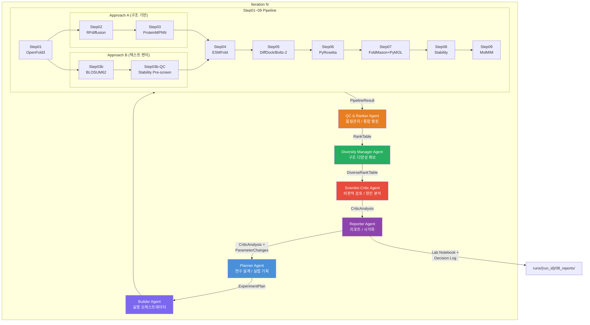

# SSTR2 Peptide Binder Co-Scientist Agentic Flow

**SSTR2 (Somatostatin Receptor Type 2) 펩타이드 바인더 자동 설계를 위한 Co-Scientist 에이전틱 AI 시스템**

> OpenFold3 - RFdiffusion - ProteinMPNN - ESMFold - DiffDock/Boltz-2 - PyRosetta - PyMOL+FoldMason
> End-to-End 자동화 파이프라인 + 자기 설계 루프 (Self-Design Loop)

---

## 목차

1. [프로젝트 개요](#1-프로젝트-개요)
2. [에이전트 아키텍처](#2-에이전트-아키텍처)
3. [Step01~07 상세 스펙](#3-step0107-상세-스펙)
4. [도구 분류: MCP vs API vs Library](#4-도구-분류-mcp-vs-api-vs-library)
5. [랭킹 스코어 정의](#5-랭킹-스코어-정의)
6. [Iteration 운영 파라미터 기본값](#6-iteration-운영-파라미터-기본값)
7. [자기 설계 루프 (Self-Design Loop)](#7-자기-설계-루프-self-design-loop)
8. [실험 노트 템플릿](#8-실험-노트-템플릿)
9. [원본 설계 대비 개선점](#9-원본-설계-대비-개선점)
10. [폴더/파일 규칙](#10-폴더파일-규칙)
11. [AG_SRC 디렉토리 구조](#11-ag_src-디렉토리-구조)
12. [첫 번째 run을 위한 체크리스트](#12-첫-번째-run을-위한-체크리스트)
13. [참고](#13-참고)
14. [Changelog](#14-changelog)

---

## 1. 프로젝트 개요

### 배경

SSTR2 (Somatostatin Receptor Type 2)는 신경내분비 종양의 핵심 치료 타겟이다. 기존 리간드(Somatostatin-14)보다 결합 친화도가 높고 선택성이 우수한 펩타이드 바인더를 설계하기 위해, AI 기반 구조 예측과 분자 설계 도구를 통합한 **에이전틱 (Agentic) AI 시스템**을 구축한다.

### 핵심 구성

- **Co-Scientist 에이전틱 시스템**: 6개의 전문 에이전트(Planner, Builder, QC & Ranker, Diversity Manager, Scientist Critic, Reporter)가 협업하여 펩타이드 바인더 설계 루프를 자율적으로 운영한다.
- **End-to-End 파이프라인**: OpenFold3 구조 예측부터 PyMOL 시각화까지 7단계(Step01~07)를 자동으로 실행한다.
- **자기 설계 루프**: Scientist Critic 에이전트가 매 iteration 결과를 분석하고, 다음 iteration의 파라미터를 자동 조정하여 지속적으로 설계를 개선한다.

> **듀얼 파이프라인 아키텍처**: 이 시스템은 Silo A (3-ARM full NIM pipeline, `AG_src/pipeline/`)와
> Silo B (SST-14 mutation simulation, `pyrosetta_flow/`)로 구성된다.
> 전체 설계는 [ARCHITECTURE.md](../ARCHITECTURE.md) 참조.

### 설계 원본 및 참조

- **`prompt/001_ag_set`**: Co-Scientist 에이전트 구성 원본 프롬프트. 5개 에이전트 역할, 게이트 기반 QC 루프, 도구 호출 인터페이스 등을 정의한 마스터 설계서이다.
- **`PRST_N_FM/`**: 기존 도구 참조 구현 (수정하지 않음).
  - `PRST_N_FM/bionemo/`: NVIDIA NIM API 클라이언트 (MolMIM, DiffDock, RFdiffusion, ProteinMPNN, ESMFold). `api_base.py`의 인증/재시도 패턴을 AG_SRC의 `tools/api/base_tool.py`에서 독립적으로 재구현하였다.
  - `PRST_N_FM/` 레포지토리의 PyRosetta, FoldMason, PyMOL 워크플로우를 MCP 서버 형태로 래핑한다.

### 파이프라인 흐름 요약

파이프라인은 `pipeline_config.yaml::approach_b.enabled` 설정에 따라 두 가지 경로(Approach A / B)로 분기한다.

```
SSTR2 수용체 PDB  ──→  Step01 (OpenFold3)     : 수용체 구조 예측/준비
                       │
                       ├─ [Approach A] ────────────────────────────────────────
                       │   Step02 (RFdiffusion)    : de novo 백본 N개 생성
                       │   Step03 (ProteinMPNN)    : 백본당 서열 K개 역폴딩
                       │
                       ├─ [Approach B] ────────────────────────────────────────
                       │   Step03b (BLOSUM62)      : 텍스트 레벨 시퀀스 변이 생성
                       │   Step03b-QC (Stability)  : 안정성 사전 스크리닝 (반감기 기반)
                       │
                       ▼ (합류)
                  ──→  Step04 (ESMFold)        : 빠른 구조 QC + pLDDT 게이트
                  ──→  Step05 (DiffDock/Boltz-2): 도킹 + 친화도 게이트
                  ──→  Step05b (Selectivity)   : Off-target 선택성 스크리닝
                  ──→  Step06 (PyRosetta)      : FlexPepDock 정제 + ddG 게이트
                  ──→  Step07 (FoldMason+PyMOL): 구조 정렬/분석/렌더링
                  ──→  Step08 (Stability)      : GLP-1 기반 안정성 예측
                  ──→  Step09 (MolMIM)         : 소분자 생성 (LIVE API)
                  ──→  랭킹 → Critic 분석 → 다음 iteration 피드백
```

---

## 2. 에이전트 아키텍처

### 2.1 텍스트 다이어그램

```
┌─────────────────────────────────────────────────────────────┐
│                      PLANNER AGENT                          │
│  연구 설계 / 실험 기획 / 파라미터 결정                          │
│  - ExperimentPlan 생성 (run_id, hypothesis, parameters)     │
│  - Critic 피드백 반영 → 계획 갱신 (최대 1~2개 변경)            │
│  - 구현: agents/planner.py::PlannerAgent                     │
└──────────────────────────┬──────────────────────────────────┘
                           │ ExperimentPlan
                           ▼
┌─────────────────────────────────────────────────────────────┐
│                      BUILDER AGENT                          │
│  실행 오케스트레이터 / Step01~07 순차+병렬 관리                 │
│  - 도구 호출 디스패치 (API/MCP/Library)                       │
│  - 실패 시 재시도/대체 경로 수행                                │
│  - 모든 실행을 재현 가능하게 로그/설정 저장                      │
│                                                             │
│  Step01 ──→ Step02 ──→ Step03 ──→ Step04 ──→ Step05 ──→ ...│
│  (OF3)     (RFdiff)   (MPNN)    (ESMFold)  (DiffDock/      │
│                                             Boltz-2)        │
│  ... ──→ Step06 ──→ Step07                                  │
│         (PyRosetta) (FoldMason+PyMOL)                       │
│                                                             │
│  구현: pipeline/orchestrator.py::PipelineOrchestrator        │
└──────────────────────────┬──────────────────────────────────┘
                           │ PipelineResult
                           ▼
┌─────────────────────────────────────────────────────────────┐
│                  QC & RANKER AGENT                          │
│  품질관리 / 게이트 적용 / 통합 랭킹                             │
│  pLDDT gate → Docking gate → Rosetta gate → Final Score    │
│  - min-max 정규화 후 가중합 계산                               │
│  - AND 로직: 모든 게이트 통과해야 PASS                         │
│  구현: schemas/rank_table.py::build_rank_table, filter_by_gates│
└──────────────────────────┬──────────────────────────────────┘
                           │ RankTable
                           ▼
┌─────────────────────────────────────────────────────────────┐
│              DIVERSITY MANAGER AGENT (신규)                  │
│  구조 다양성 확보 / FoldMason 클러스터링 / 대표 선별             │
│  - FoldMason lDDT 기반 구조 유사도 행렬 생성                    │
│  - 계층적 클러스터링으로 구조 군집화                              │
│  - 각 클러스터에서 대표 후보 선별 → DiverseRankTable             │
└──────────────────────────┬──────────────────────────────────┘
                           │ DiverseRankTable
                           ▼
┌─────────────────────────────────────────────────────────────┐
│              SCIENTIST CRITIC AGENT                         │
│  비판적 검토 / 실패 원인 분석 / 다음 iteration 전략 제안         │
│  - 실패유형→액션 매핑 테이블 기반 규칙적 대응                     │
│  - 변경점 1~2개 제한 (원인-결과 추적 가능성 확보)                │
│  - CriticAnalysis + ParameterChanges 산출                    │
└──────────────────────────┬──────────────────────────────────┘
                           │ CriticAnalysis + ParameterChanges
                           ▼
┌─────────────────────────────────────────────────────────────┐
│                    REPORTER AGENT                           │
│  PyMOL 자동 렌더링 / 랭킹 테이블 / 실험 노트 / 리포트           │
│  - 출판 품질 4컷: overview, closeup, interface, electrostatics│
│  - Lab Notebook + Decision Log 자동 생성                     │
│  구현: schemas/lab_notebook.py::generate_notebook             │
└─────────────────────────────────────────────────────────────┘
                           │
                           ▼ (다음 iteration으로 피드백)
                    Planner에게 CriticAnalysis 전달
```

### 2.2 Mermaid 다이어그램



### 2.3 에이전트 간 메시지 통신

모든 에이전트는 `agents/base_agent.py::BaseAgent`를 상속하며, `AgentMessage` 데이터 클래스를 통해 통신한다.

| 메시지 유형 | 용도 | 예시 |
|------------|------|------|
| `INFO` | 단순 정보 전달 | Step02 완료 알림 |
| `REQUEST` | 작업 요청 | Builder -> RFdiffusion 실행 요청 |
| `DECISION` | 의사 결정 전달 | Critic -> Planner 파라미터 변경 제안 |
| `ALERT` | 긴급 알림 / 오류 | API 타임아웃, 전체 게이트 실패 |

---

## 3. Step01~07 상세 스펙

### 3.1 전체 요약 테이블

| Step | 도구 | 유형 | 입력 | 출력 | 게이트 | 재시도 정책 | 예상 시간 |
|------|------|------|------|------|--------|-----------|----------|
| **Step01** | OpenFold3 | API | SSTR2 서열(FASTA), 리간드 정보 | `{receptor}_clean.pdb`, `pocket_residues.json` | N/A (준비 단계) | 최대 3회 재시도, 600s timeout | ~5-10분 |
| **Step02** | RFdiffusion | API | `receptor.pdb`, `pocket_definition.json`, contigs | `backbone_{i:02d}.pdb` (N개) | 생성 실패 시 seed 변경 재시도 | 개별 실패 허용, 최소 N/2 성공 필요 | ~2-5분/개 |
| **Step03** | ProteinMPNN | API | `backbone_{i:02d}.pdb` (복수) | `backbone_{i:02d}_seq_{j:02d}.fasta` (N*K개) | 서열 중복 제거 | 최대 3회 재시도, 120s timeout | ~1분/백본 |
| **Step03b** | BLOSUM62 Mutation | Library | seed_sequence, fixed_positions | `variants.json` (최대 200개) | **안정성 사전 스크리닝** (base half-life >= 0.6h) | N/A (로컬 계산) | ~1초 |
| **Step04** | ESMFold | API | `*.fasta` (N*K개) | `{seq_id}_esmfold.pdb`, `qc_summary.json` | **pLDDT >= 75** (전체), **interface pLDDT >= 70** | 최대 3회 재시도 | ~30초/서열 |
| **Step05** | DiffDock / Boltz-2 | API | `{seq_id}_esmfold.pdb`, `receptor.pdb` | `{seq_id}_pose_{rank}.pdb`, `docking_scores.json` | **상위 20%만 통과** | DiffDock 실패 시 Boltz-2 대체 | ~2-5분/후보 |
| **Step06** | PyRosetta | MCP | 도킹 포즈 PDB (상위 M개) | `{seq_id}_refined.pdb`, `rosetta_scores.json` | **ddG <= -5.0**, **clash == 0**, **constraint 위반 == 0** | relax 프로토콜 변경 후 재시도 | ~10-30분/후보 |
| **Step07** | FoldMason + PyMOL | MCP | 정제된 PDB, `receptor.pdb` | `rank_table.csv`, `foldmason_lddt.json`, `renders/` | **lDDT >= 0.6** | 재시도 불필요 (분석 단계) | ~5-10분 |

### 3.2 각 Step 상세

#### Step01: 수용체 구조 준비 (OpenFold3)

```
입력:
  - receptor_id: SSTR2 UniProt ID 또는 기존 PDB 파일 경로
  - receptor_params: {chain: "B", ligand_info: {...}}

출력:
  - runs/{run_id}/01_receptor/{receptor}_clean.pdb
  - runs/{run_id}/01_receptor/pocket_residues.json

스키마: schemas/io_schemas.py::Step01Output
  - receptor_pdb_path: str
  - pocket_residues: List[int]
  - chain_id: str
  - pocket_json_path: str

도구: tools/api/openfold3_tool.py::OpenFold3Tool
  - endpoint: health.api.nvidia.com/v1/biology/openfold/openfold3
  - action: predict_complex(sequences, msa, templates)

QC 게이트: 없음 (준비 단계)

실패 시:
  - API 429/500/502/503/504: 지수 백오프 재시도 (최대 3회)
  - 기존 PDB가 있으면 OpenFold3 건너뛰고 직접 로드
  - data/fold_test1/ 의 AlphaFold3 예측 결과 대체 사용 가능
```

#### Step02: 백본 설계 (RFdiffusion)

```
입력:
  - receptor_pdb: Step01 출력 PDB 파일
  - pocket_definition: 포켓 잔기 정의 JSON
  - contigs: "B1-369/0 10-30" (수용체 고정, 펩타이드 10~30 aa)
  - hotspot_res: ["B122", "B127", "B184", "B197", "B205", "B272", "B294"]
  - diffusion_steps: 50 (기본값)
  - n_designs: 10 (기본값)

출력:
  - runs/{run_id}/02_backbones/backbone_{i:02d}.pdb (i = 0..N-1)

스키마: schemas/io_schemas.py::Step02Output
  - backbone_pdbs: List[str]
  - design_params: Dict[str, Any]
  - n_generated: int

도구: tools/api/rfdiffusion_tool.py::RFdiffusionTool
  - endpoint: health.api.nvidia.com/v1/biology/ipd/rfdiffusion/generate
  - action: design_multiple(receptor_pdb, contigs, hotspot_res, n_designs)
  - 참조: PRST_N_FM/bionemo/rfdiffusion_client.py

QC 게이트: 생성 성공률 >= 50% (N/2개 이상 성공 필요)

실패 시:
  - 개별 설계 실패 시 seed 변경 후 재시도
  - 전체 실패 시 diffusion_steps 증가 (50 -> 100) 후 재시도
  - 이벤트 기반 병렬 실행으로 throughput 극대화
```

#### Step03: 서열 설계 (ProteinMPNN)

```
입력:
  - backbone_pdbs: Step02 출력 PDB 목록
  - k_per_backbone: 8 (기본값)
  - sampling_temp: 0.2 (기본값)

출력:
  - runs/{run_id}/03_sequences/backbone_{i:02d}_seq_{j:02d}.fasta

스키마: schemas/io_schemas.py::Step03Output
  - sequences: List[SequenceEntry]
    - SequenceEntry: backbone_idx, seq_idx, sequence, fasta_path, seq_id

도구: NVIDIA NIM ProteinMPNN API
  - endpoint: health.api.nvidia.com/v1/biology/ipd/proteinmpnn/predict
  - 참조: PRST_N_FM/bionemo/proteinmpnn_client.py

QC 게이트: 서열 중복 제거 (동일 서열 제거)

실패 시:
  - API 재시도 (최대 3회, 지수 백오프)
  - 특정 백본에서 반복 실패 시 해당 백본 건너뛰기
```

#### Step03b: BLOSUM62 텍스트 레벨 변이 생성 (Approach B)

```
조건: pipeline_config.yaml::approach_b.enabled == true

입력:
  - seed_sequence: "AGCKNFFWKTFTCA" (14-aa, Cys3-Cys13 이황화결합)
  - fixed_positions: {3: "C", 7: "F", 8: "W", 9: "K", 10: "T", 13: "C"}
  - mutable_positions: [1, 2, 4, 5, 6, 11, 12, 14] (8개)
  - max_mutations_per_variant: 3
  - max_variants: 200
  - min_blosum_score: 0

출력:
  - runs/{run_id}/03b_blosum/variants.json
  - List[VariantEntry] (variant_id, sequence, mutations, blosum_total_score)

스키마: schemas/io_schemas.py::Step03bOutput
  - variants: List[VariantEntry]
  - seed_sequence: str
  - fixed_positions: Dict[int, str]
  - total_generated: int
  - strategy: str  # "approach_b"

핵심 로직:
  1. 단일 변이체: 8개 가변 위치 × BLOSUM62 점수 >= 0인 치환 → ~40개
  2. 조합 변이체: 2~3개 위치 동시 변이, 무작위 샘플링 → ~160개 (max_variants까지)
  3. 제약 조건 검증: 고정 위치 확인 + Kyte-Doolittle 소수성 변화 <= 2.0

도구: AG_src/pipeline/step03b_blosum_mutation.py (Python Library, 외부 API 불필요)
  - load_blosum62(): 내장 20x20 치환 점수 행렬
  - generate_single_mutants(): 단일 위치 변이체 생성
  - generate_combinatorial_variants(): 다중 위치 조합 변이체 생성
  - validate_constraints(): 고정 위치 제약 검증
  - hydrophobicity_check(): Kyte-Doolittle 소수성 제한

QC 게이트 (Step03b-QC):
  - predict_half_life()로 빠른 반감기 추정
  - 기준: base half-life >= 0.6h (수식 없이 원래 펩타이드 반감기 기준)
  - 미통과 변이체 탈락 → 통과한 변이체만 Step04로 전달

실패 시:
  - 전체 변이체가 안정성 사전 스크리닝 탈락 시 min_blosum_score 완화
  - 고정 위치 위반 변이체는 생성 단계에서 자동 제거됨
```

#### Step04: 구조 QC (ESMFold)

```
입력:
  - seqs_or_fastas: Step03 출력 FASTA 파일 목록

출력:
  - runs/{run_id}/04_esmfold_qc/{seq_id}_esmfold.pdb
  - runs/{run_id}/04_esmfold_qc/qc_summary.json

스키마: schemas/io_schemas.py::Step04Output
  - qc_results: List[QCResult]
    - QCResult: seq_id, plddt_mean, plddt_interface, pdb_path, passed_gate

도구: NVIDIA NIM ESMFold API
  - endpoint: health.api.nvidia.com/v1/biology/nvidia/esmfold
  - 참조: PRST_N_FM/bionemo/esmfold_client.py

QC 게이트:
  - 전체 평균 pLDDT >= 75 (gate_thresholds.yaml::esmfold_plddt_min)
  - 계면 잔기 평균 pLDDT >= 70 (gate_thresholds.yaml::esmfold_interface_plddt_min)
  - 미통과 후보는 즉시 폐기 (fail_fast: false → 실패 이유 전체 기록)

실패 시:
  - API 재시도 (최대 3회)
  - 전체 통과 후보 0개일 경우 ALERT → Critic에게 즉시 보고
```

#### Step05: 분자 도킹 (DiffDock / Boltz-2)

```
입력:
  - models: Step04 게이트 통과 PDB 파일 목록
  - receptor_pdb: Step01 출력 수용체 PDB
  - engine: "diffdock" (기본), "boltz2" (대체)

출력:
  - runs/{run_id}/05_docking/{seq_id}_pose_{rank}.pdb
  - runs/{run_id}/05_docking/docking_scores.json

스키마: schemas/io_schemas.py::Step05Output
  - docking_results: List[DockingResult]
    - DockingResult: seq_id, engine, score, confidence, pose_pdb, rank

도구:
  - DiffDock API: health.api.nvidia.com/v1/biology/mit/diffdock
    - 참조: PRST_N_FM/bionemo/diffdock_client.py
  - Boltz-2 API: health.api.nvidia.com/v1/biology/mit/boltz2/predict (신규)

QC 게이트:
  - 상위 20% 후보만 통과 (gate_thresholds.yaml::docking_top_pct)
  - DiffDock confidence < -1.0 (gate_thresholds.yaml::diffdock_confidence_max)
  - Boltz-2 affinity < -8.0 kcal/mol (gate_thresholds.yaml::boltz2_affinity_threshold)

실패 시:
  - DiffDock 실패 → Boltz-2로 자동 전환
  - 두 엔진 모두 실패 시 해당 후보 폐기 + 로그 기록
```

#### Step06: Rosetta 정제 (PyRosetta)

```
입력:
  - models_with_poses: Step05 게이트 통과 상위 M개 (기본 M=10)
  - relax_cycles: 5 (기본값)

출력:
  - runs/{run_id}/06_rosetta/{seq_id}_refined.pdb
  - runs/{run_id}/06_rosetta/rosetta_scores.json

스키마: schemas/io_schemas.py::Step06Output
  - rosetta_results: List[RosettaResult]
    - RosettaResult: seq_id, ddg, total_score, clash_score, constraint_violations, refined_pdb

도구: PyRosetta MCP 서버 (로컬 실행)
  - FlexPepDock refinement
  - FastDesign (선택)
  - ddG calculation
  - 참조: PRST_N_FM/bionemo/06_sstr2_flexpep_dock.py

QC 게이트:
  - ddG <= -5.0 kcal/mol (gate_thresholds.yaml::rosetta_ddg_max)
  - clash score == 0 (gate_thresholds.yaml::rosetta_clash_max)
  - constraint 위반 == 0 (gate_thresholds.yaml::rosetta_constraint_violations_max)

실패 시:
  - relax 프로토콜 변경 후 재시도 (cycle 수 증가)
  - hotspot residue constraint 완화 후 재시도
  - sidechain repack 조건 수정
```

#### Step07: 분석 및 보고 (FoldMason + PyMOL)

```
입력:
  - refined models: Step06 출력 PDB 파일 목록
  - receptor_pdb: Step01 출력 수용체 PDB
  - ref_model: 참조 구조 (최적 후보 또는 네이티브 구조)

출력:
  - runs/{run_id}/07_analysis/rank_table.csv
  - runs/{run_id}/07_analysis/foldmason_lddt.json
  - runs/{run_id}/07_analysis/renders/ (overview.png, closeup.png, interface_contacts.png, electrostatics.png)
  - runs/{run_id}/07_analysis/summary.md

스키마: schemas/io_schemas.py::Step07Output
  - lddt_table_path: str
  - pymol_renders: Dict[str, str]
  - rank_table_csv: str
  - summary_md: str

도구:
  - FoldMason MCP 서버: 구조 기반 MSA + lDDT 점수 계산
    - 참조: PRST_N_FM/results/foldmason/
  - PyMOL MCP 서버: 헤드리스 렌더링 (pymol -c)
    - 출판 품질 4컷: overview / closeup / interface contacts / electrostatics
    - 참조: PRST_N_FM/scripts/run_pymol_pdb.sh

QC 게이트:
  - FoldMason lDDT >= 0.6 (gate_thresholds.yaml::foldmason_lddt_min)

실패 시:
  - 분석 단계이므로 재시도 불필요
  - 렌더링 실패 시 기본 시각화로 대체
```

---

## 4. 도구 분류: MCP vs API vs Library

파이프라인의 모든 도구는 실행 특성에 따라 세 가지 유형으로 분류된다. 분류 기준은 **계산 위치** (로컬/클라우드), **실행 시간**, **라이선스 요구**, **I/O 패턴**이다.

### 4.1 NVIDIA NIM API (REST API) - 클라우드 추론

| 도구 | Step | Endpoint | 분류 이유 |
|------|------|----------|----------|
| **OpenFold3** | Step01 | `health.api.nvidia.com/.../openfold3` | GPU 불필요, 클라우드에서 복합체 구조 예측. AlphaFold3 Server 대비 프로그래밍 가능한 REST API 제공 |
| **RFdiffusion** | Step02 | `health.api.nvidia.com/.../rfdiffusion/generate` | 대규모 diffusion 모델은 클라우드 GPU에서 실행. PRST_N_FM/bionemo/rfdiffusion_client.py 패턴 활용 |
| **ProteinMPNN** | Step03 | `health.api.nvidia.com/.../proteinmpnn/predict` | 역폴딩 추론은 경량 GPU 작업이나, 일괄 처리 시 클라우드가 효율적. PRST_N_FM 기존 클라이언트 패턴 활용 |
| **ESMFold** | Step04 | `health.api.nvidia.com/.../esmfold` | 구조 예측 모델 가중치 로딩 없이 HTTP 요청만으로 사용. PRST_N_FM/bionemo/esmfold_client.py 패턴 활용 |
| **DiffDock** | Step05 | `health.api.nvidia.com/.../diffdock` | 도킹 포즈 생성은 GPU 집약적. PRST_N_FM/bionemo/diffdock_client.py 패턴 활용 |
| **Boltz-2** | Step05 | `health.api.nvidia.com/.../boltz2/predict` | 복합체 예측 + 결합 친화도를 한 번에 계산. 신규 API로 DiffDock 대체/보완용 |
| **MolMIM** | 보조 | `health.api.nvidia.com/.../molmim/generate` | 소분자 생성 보조 도구. PRST_N_FM/bionemo/molmim_client.py 패턴 활용 |
| **ESM2** | 보조 | `health.api.nvidia.com/.../esm2-650m` | 단백질 임베딩으로 zero-shot mutation effect 분석. 신규 API |

**API 선택 이유:**
- 로컬 GPU 설치/관리 불필요 (비용 및 환경 복잡도 절감)
- NVIDIA NIM은 모델 서빙 최적화 (TensorRT, Triton) 적용 완료
- HTTP 요청 기반이므로 에이전트의 도구 호출 (tool call) 패턴에 자연스럽게 통합
- `PRST_N_FM/bionemo/api_base.py`에서 검증된 인증/재시도 로직을 `AG_SRC/tools/api/base_tool.py`에서 독립 재구현

**공통 재시도 정책:**
- 재시도 대상: HTTP 429, 500, 502, 503, 504
- 최대 재시도: 3회
- 백오프: 지수 (2, 4, 8초)
- 429 응답 시 `Retry-After` 헤더 준수
- API 키 탐색 순서: 환경변수 (`NGC_CLI_API_KEY`, `NVIDIA_API_KEY`) -> `.env` 파일 -> 키 파일 (`ngc.key`, `molmim.key`)

### 4.2 MCP 서버 (로컬 실행)

| 도구 | Step | 유형 | 분류 이유 |
|------|------|------|----------|
| **PyRosetta** | Step06 | `python_process` | (1) 복잡한 분자 모델링: FlexPepDock, FastDesign, ddG 계산은 수십 분 소요 가능 (2) 라이선스 필요: RosettaCommons 학술 라이선스가 로컬 환경에 바인딩됨 (3) 로컬 계산 필수: 에너지 함수 평가가 CPU 집약적이며 중간 상태 파일 I/O 빈번 (4) Conda `bio-tools` 환경 의존 |
| **FoldMason** | Step07 | `cli_wrapper` | (1) CLI 바이너리 래핑: `foldmason` 바이너리를 subprocess로 호출 (2) 구조 DB 생성 필요: 다중 PDB를 로컬 디렉토리에 모아 정렬 수행 (3) 로컬 파일 I/O 집중: MSA 결과, 가이드 트리, lDDT 점수를 로컬 파일로 생성 (4) PRST_N_FM/results/foldmason/ 에서 검증된 워크플로우 |
| **PyMOL** | Step07 | `cli_wrapper` | (1) 헤드리스 렌더링: `pymol -c` 모드로 GUI 없이 PML 스크립트 실행 (2) 로컬 GPU/CPU 렌더링: ray-tracing 기반 고품질 이미지 생성 (3) PML 스크립트로 재현 가능한 시각화 자동화 (4) 세션 파일(.pse) 저장으로 사후 검토 가능 |

**MCP 선택 이유:**
- 장시간 실행 (분~시간) 프로세스를 비동기로 관리
- 로컬 파일시스템과의 밀접한 I/O 상호작용
- 라이선스 제약으로 클라우드 API화 불가능한 도구
- CLI 바이너리를 표준화된 MCP 인터페이스로 래핑하여 에이전트가 균일하게 호출

### 4.3 직접 임포트 (Python Library)

| 도구 | 패키지 | 용도 | 분류 이유 |
|------|--------|------|----------|
| **Biopython** | `Bio` | PDB 파싱, 구조 파일 조작, 서열 처리 | 경량 파싱 작업으로 MCP 서버 오버헤드가 불필요. `import Bio`로 즉시 사용. 밀리초 단위 실행 |
| **RDKit** | `rdkit` | SMILES 변환, 분자 속성 계산 | 단순 화학정보학 유틸리티. 소분자 관련 전처리에만 사용. 함수 호출 수준의 경량 작업 |

**Library 선택 이유:**
- 실행 시간이 매우 짧아 (밀리초) 서버 프로세스 관리가 비효율적
- 상태(state) 관리가 불필요한 순수 유틸리티 함수
- Python 프로세스 내에서 직접 호출하는 것이 가장 효율적

---

## 5. 랭킹 스코어 정의

### 5.1 최종 점수 수식

```
final_score = w_plddt * norm(pLDDT)
            + w_dock  * norm(-dock_score)
            + w_ddg   * norm(-ddG)
            + w_lddt  * norm(lDDT)
```

**방향 처리 (Direction Handling):**

| 메트릭 | 방향 | 처리 |
|--------|------|------|
| pLDDT (0~100) | higher is better | `pLDDT / 100`으로 0~1 스케일 후 그대로 사용 |
| dock_score | lower is better (더 음수 = 더 좋음) | 부호 반전 후 정규화 |
| ddG (kcal/mol) | lower is better (더 음수 = 더 강한 결합) | 부호 반전 후 정규화 |
| lDDT (0~1) | higher is better | 그대로 사용 |

### 5.2 정규화 방법

**Min-Max Normalization** (기본):

```python
norm(x) = (x - x_min) / (x_max - x_min)
```

- 각 메트릭에 대해 현재 iteration의 전체 후보를 기준으로 정규화
- 모든 값이 동일한 경우 0.5 반환
- 구현: `schemas/rank_table.py::normalize_scores(scores, method="min_max")`

Z-Score Normalization (대체):

```python
norm(x) = (x - mean) / std
```

- 표준편차가 0인 경우 모두 0.0 반환
- 구현: `schemas/rank_table.py::normalize_scores(scores, method="z_score")`

### 5.3 기본 가중치

| 메트릭 | 가중치 | 설명 |
|--------|--------|------|
| `pLDDT` | **0.2** | ESMFold 구조 신뢰도 (설계된 펩타이드 자체의 구조적 안정성) |
| `dock_score` | **0.3** | 도킹 점수 (수용체-펩타이드 결합 포즈 품질) |
| `ddG` | **0.3** | Rosetta 결합 자유 에너지 변화 (열역학적 결합 안정성) |
| `lDDT` | **0.2** | FoldMason 구조 보존성 (정제 후 구조 유지 정도) |

가중치 합: `0.2 + 0.3 + 0.3 + 0.2 = 1.0`

설정 파일: `config/gate_thresholds.yaml::final_score_weights`

### 5.4 게이트 조건 (AND 로직)

모든 게이트를 통과해야 최종 PASS 판정:

| 게이트 | 조건 | 설정 키 |
|--------|------|---------|
| pLDDT 전체 | >= 75 | `esmfold_plddt_min` |
| pLDDT 계면 | >= 70 | `esmfold_interface_plddt_min` |
| 도킹 통과율 | 상위 20% | `docking_top_pct` |
| ddG | <= -5.0 kcal/mol | `rosetta_ddg_max` |
| Clash | == 0 | `rosetta_clash_max` |
| Constraint 위반 | == 0 | `rosetta_constraint_violations_max` |
| lDDT | >= 0.6 | `foldmason_lddt_min` |

`fail_fast: false` -- 모든 게이트를 평가한 후 실패 이유를 전체 기록한다 (부분 실패 원인 분석에 필수).

### 5.5 랭킹 테이블 CSV 컬럼

```
backbone_id, seq_id, sequence, plddt_mean, plddt_interface,
dock_score, dock_engine, ddg, lddt, final_score, rank, pass_fail, fail_reason
```

구현: `schemas/rank_table.py::export_csv(rank_table, output_path)`

---

## 6. Iteration 운영 파라미터 기본값

| 파라미터 | 기본값 | 범위 | 설명 |
|---------|--------|------|------|
| `N_backbone` | 10 | 5-50 | RFdiffusion이 생성할 백본 수. 초기 탐색 시 10, 정밀 탐색 시 30-50 |
| `K_seq_per_backbone` | 8 | 4-16 | ProteinMPNN이 백본당 생성할 서열 수. 다양성 vs 계산 비용 트레이드오프 |
| `diffusion_steps` | 50 | 25-100 | RFdiffusion denoising 스텝 수. 높을수록 품질 향상, 시간 증가 |
| `sampling_temp` | 0.2 | 0.1-1.0 | ProteinMPNN 샘플링 온도. 낮을수록 보수적(높은 신뢰), 높을수록 다양 |
| `pLDDT_gate` | 75 | 60-85 | ESMFold QC 임계값. 낮추면 후보 수 증가, 품질 저하 가능 |
| `dock_top_pct` | 20 | 10-30 | 도킹 상위 통과 비율(%). 낮추면 더 엄격한 선별 |
| `ddG_gate` | -5.0 | -3 ~ -10 | Rosetta ddG 임계값 (kcal/mol). 더 음수 = 더 엄격 |
| `Top_M_rosetta` | 10 | 5-20 | Rosetta 정제에 넘길 후보 수. 계산 비용과 직결 |
| `max_iterations` | 5 | 3-10 | 전체 자동 반복 횟수 상한 |
| `contigs` | `"B1-369/0 10-30"` | - | RFdiffusion contigs 문자열. 수용체 체인 B 전체 고정, 펩타이드 10~30 aa |
| `hotspot_res` | `["B122","B127","B184","B197","B205","B272","B294"]` | - | 바인더가 반드시 접촉해야 할 수용체 핫스팟 잔기 |
| `peptide_length_min` | 10 | 5-15 | 펩타이드 최소 길이 (aa) |
| `peptide_length_max` | 30 | 20-50 | 펩타이드 최대 길이 (aa) |
| `docking_engine` | `"diffdock"` | diffdock/boltz2 | 기본 도킹 엔진 선택 |
| `rosetta_relax_cycles` | 5 | 3-15 | Rosetta relax 반복 횟수 |
| `seed` | 42 | - | 재현성을 위한 랜덤 시드 |

설정 파일: `config/pipeline_config.yaml`

---

## 7. 자기 설계 루프 (Self-Design Loop)

### 7.1 개요

Scientist Critic 에이전트는 단순한 감상문이 아닌 **규칙 기반 액션 매핑**을 통해 다음 iteration의 파라미터 조정을 제안한다. 핵심 원칙은 매 iteration에서 **변경점을 1~2개로 제한**하여 **원인-결과 추적 가능성**을 확보하는 것이다.

### 7.2 실패-액션 매핑 테이블

| 실패 유형 | 진단 기준 | 대응 액션 | 변경 파라미터 |
|----------|----------|----------|-------------|
| **pLDDT 낮음** | 평균 pLDDT < 75인 후보가 80% 이상 | MPNN sampling 파라미터 조정 / backbone 길이 제한 / helix bias 추가 | `sampling_temp` 감소 (0.2->0.1), `peptide_length_max` 축소, `secondary_structure_bias: helix` 추가 |
| **docking 좋은데 ddG 나쁨** | dock_score 상위 20%이나 ddG > -5.0 | FlexPepDock constraint 강화 / hotspot residue 지정 / sidechain repack 수정 | `rosetta_relax_cycles` 증가, `constraint_weight` 조정, `hotspot_res` 추가/변경 |
| **특정 포켓에서만 실패** | 특정 pocket_residues 주변에서만 결합 실패 | pocket 정의 재설정 / receptor 상태 변경 / Step01 재시작 | `pocket_residues` 재정의, `receptor_state: active/inactive` 변경 |
| **서열 다양성 부족** | 생성 서열의 유사도 > 90% | MPNN temperature 증가 / backbone 수 증가 | `sampling_temp` 증가 (0.2->0.5), `n_backbone` 증가 |
| **clash score 높음** | clash_score > 0인 후보 다수 | Rosetta relax 프로토콜 변경 / relax cycle 증가 | `rosetta_relax_cycles` 증가 (5->10), `relax_protocol: fast_relax` 변경 |
| **전체 후보 부족** | 최종 PASS 후보 < 3개 | 게이트 임계값 완화 / 후보 수 증가 | `pLDDT_gate` 완화 (75->70), `n_backbone` 증가, `k_seq` 증가 |
| **lDDT 저하** | 정제 후 lDDT < 0.6 비율 높음 | 정제 프로토콜 조정 / constraint 추가 | `rosetta_relax_cycles` 조정, backbone constraint 강화 |

### 7.3 변경 제한 규칙

```
핵심 규칙: 매 iteration 변경점은 최대 1~2개만 허용한다.

이유:
  1. 원인-결과 추적 가능성: 여러 변수를 동시에 바꾸면 어떤 변경이 개선/악화를 초래했는지 판별 불가
  2. 연구 자동화의 핵심: 과학적 방법론의 통제 변인 원칙 준수
  3. 수렴 가속: 탐색 공간을 체계적으로 좁혀감
```

구현: `agents/planner.py::PlannerAgent.update_plan()` -- `proposed[:2]`로 최대 2개 변경 제한

### 7.4 Critic 분석 출력 구조

```python
CriticAnalysis = {
    "failures": [
        {
            "type": "pLDDT_low",         # 실패 유형
            "count": 45,                  # 해당 유형 후보 수
            "root_cause": "backbone 길이가 과도하게 길어 구조 불안정",
            "action": "peptide_length_max 축소 (30 -> 20)"
        },
        ...
    ],
    "proposed_changes": [
        {
            "parameter_name": "peptide_length_max",
            "old_value": 30,
            "new_value": 20,
            "rationale": "pLDDT 저하 원인이 과도한 펩타이드 길이로 판단"
        }
    ],
    "hypothesis": "펩타이드 길이를 20 aa 이하로 제한하면 구조 안정성(pLDDT)이 개선될 것이다",
    "iteration_summary": "..."
}
```

구현: `schemas/lab_notebook.py::generate_decision_log()`

---

## 8. 실험 노트 템플릿

### 8.1 Lab Notebook 템플릿

각 iteration 실행 후 자동으로 생성되는 실험 노트 형식이다. 원본 템플릿은 `templates/lab_notebook.md`에 정의되어 있으며, `schemas/lab_notebook.py::generate_notebook()`이 런타임 데이터를 주입한다.

```markdown
# Lab Notebook - {run_id}
## Iteration {iteration}
### Date: {date}

---

### Hypothesis
{hypothesis}

---

### Parameter Changes from Previous Iteration

| Parameter | Previous | New | Rationale |
|-----------|----------|-----|-----------|
| `sampling_temp` | 0.2 | 0.1 | pLDDT 개선을 위해 보수적 샘플링 |

---

### Pipeline Configuration

- **n_backbone**: 10
- **k_seq_per_backbone**: 8
- **top_m_rosetta**: 10
- **receptor**: SSTR2 chain B
- **contigs**: `B1-369/0 10-30`
- **hotspot_res**: ["B122", "B127", "B184", "B197", "B205", "B272", "B294"]

---

### Results Summary

#### Step 04 - ESMFold QC
- Total candidates: **80**
- Passed pLDDT gate (>=75): **52**

#### Step 05 - Docking
- Engine: **diffdock**
- Top 20% candidates: **10**

#### Step 06 - Rosetta Refinement
- Candidates refined: **10**
- Passed ddG gate (<=-5.0): **7**

#### Step 07 - Analysis
- FoldMason lDDT range: **0.62** - **0.89**

---

### Top Candidates

| Rank | seq_id | sequence | pLDDT | dock_score | ddG | lDDT | final_score | PASS/FAIL |
|------|--------|----------|-------|------------|-----|------|-------------|-----------|
| 1 | bb03_seq05 | `ACKWLHDFNKRTGEP...` | 87.3 | -4.2 | -8.7 | 0.82 | 0.847 | PASS |
| ... | ... | ... | ... | ... | ... | ... | ... | ... |

---

### Critic Analysis
{critic_notes}

---

### Next Iteration Plan
{next_plan}
```

### 8.2 Decision Log 템플릿

iteration 간 전환 시 자동 생성되는 결정 로그이다.

```markdown
# Decision Log - {run_id}
## Iteration {N} -> {N+1}

---

### Failure Analysis

| Failure Type | Count | Root Cause | Action |
|---|---|---|---|
| pLDDT_low | 28 | 백본 길이 과다 | peptide_length_max 축소 |
| dock_fail | 5 | 포켓 방향 불일치 | hotspot_res 변경 |

---

### Parameter Adjustments

| Parameter | Previous | New | Rationale |
|---|---|---|---|
| `peptide_length_max` | 30 | 20 | 구조 안정성 개선 |

---

### Hypothesis for Next Iteration

펩타이드 길이를 20 aa 이하로 제한하면 pLDDT가 개선되고 도킹 성공률이 높아질 것이다.
```

구현: `schemas/lab_notebook.py::generate_decision_log()`

---

## 9. 원본 설계 대비 개선점

`prompt/001_ag_set` 원본 프롬프트 대비 AG_SRC 구현에서 추가/개선된 사항:

### 9.1 Boltz-2 통합

- **원본**: DiffDock만 사용
- **개선**: DiffDock 외에 Boltz-2를 Step05에 추가. 복합체 구조 예측과 결합 친화도를 동시에 계산하여 도킹 정확도 향상. DiffDock 실패 시 자동 전환 경로 제공.
- **설정**: `config/tool_registry.yaml`에 Boltz-2 엔드포인트 등록

### 9.2 ESM2 임베딩

- **원본**: ESMFold만 사용 (구조 예측 QC)
- **개선**: ESM2-650M 모델을 보조 도구로 추가. 단백질 임베딩을 통한 zero-shot mutation effect 분석이 가능하여, 서열 변이체의 기능 변화를 사전 예측할 수 있다.
- **설정**: `config/tool_registry.yaml`에 ESM2 엔드포인트 등록

### 9.3 Diversity Manager 에이전트

- **원본**: QC & Ranker만으로 후보 선별 (점수 기반)
- **개선**: FoldMason 클러스터링 기반 **구조 다양성 확보** 에이전트 신규 추가. 상위 후보가 구조적으로 유사한 경우, 클러스터별 대표를 선별하여 다양한 결합 모드를 탐색한다.
- **효과**: 점수만으로는 구별되지 않는 구조적 다양성을 체계적으로 확보

### 9.4 이벤트 기반 병렬 실행

- **원본**: Step01~07 순차 실행만 언급
- **개선**: Step02의 백본 설계를 **병렬로 실행**. `RFdiffusionTool.design_multiple()`이 개별 설계의 성공/실패를 독립적으로 관리하여, 하나의 실패가 전체를 중단시키지 않는다.
- **구현**: `tools/api/rfdiffusion_tool.py::design_multiple()` -- 개별 실패 허용, 최소 N/2 성공 보장

### 9.5 구조화된 실패-액션 매핑

- **원본**: Critic이 "바꿀 파라미터 후보를 제안"하는 수준의 자유 텍스트 지시
- **개선**: **규칙 기반 실패유형-대응액션 매핑 테이블**을 명시적으로 정의. Critic이 감상문이 아닌 구조화된 분석을 출력하고, Planner가 이를 기계적으로 반영할 수 있다.
- **효과**: 재현 가능하고 추적 가능한 자기 설계 루프

### 9.6 상태 지속성 (State Persistence)

- **원본**: 폴더/파일 규칙만 정의
- **개선**: 각 스텝의 입출력을 **Pydantic-style dataclass**로 구조화 (`schemas/io_schemas.py`). `to_dict()`/`from_dict()`/`to_json()` 메서드로 JSON 직렬화를 지원하여, 중간 단계에서 중단 후 재시작이 가능하다.
- **구현**: `Step01Output` ~ `Step07Output`, `RankTableRow`, `IterationRecord`

### 9.7 Approach B: BLOSUM62 텍스트 레벨 변이 (v0.2)

- **원본**: 구조 기반 시퀀스 생성만 지원 (RFdiffusion → ProteinMPNN)
- **개선**: BLOSUM62 치환 행렬 기반 **텍스트 레벨 시퀀스 변이** 경로를 추가. 구조 생성 없이 seed 시퀀스에서 직접 진화적으로 타당한 변이체를 생성하고, 안정성 사전 스크리닝으로 비용이 큰 도킹/Rosetta 단계 전에 부적합 후보를 조기 제거한다.
- **효과**: (1) 외부 API 불필요 (순수 Python, ~1초) (2) 안정성 사전 스크리닝으로 하위 단계 비용 절감 (3) `approach_b.enabled` 토글로 A/B 전환 가능, 기존 파이프라인 100% 호환
- **구현**: `pipeline/step03b_blosum_mutation.py`, `schemas/io_schemas.py::VariantEntry/Step03bOutput`

### 9.8 OpenFold3 API 활용

- **원본**: "AlphaFold3 Server" 언급 (웹 기반, 프로그래밍 불가)
- **개선**: NVIDIA NIM **OpenFold3 API**를 사용하여 프로그래밍 가능한 REST API로 복합체 구조 예측을 자동화. AlphaFold3 Server의 수동 제출/다운로드 과정을 완전히 제거하였다.
- **구현**: `tools/api/openfold3_tool.py::OpenFold3Tool` -- PRST_N_FM에 없는 신규 도구

---

## 10. 폴더/파일 규칙

### 10.1 실행 결과 디렉토리 구조

각 iteration의 결과는 `run_id` 기준으로 독립된 폴더에 저장되며, **완전한 재현 가능성**을 보장한다.

```
runs/{run_id}/
│
├── 00_config/                  # 모든 설정 yaml/json, seed, 커맨드 기록
│   ├── pipeline_config.yaml    # 파이프라인 설정 사본
│   ├── gate_thresholds.yaml    # 게이트 임계값 사본
│   └── tool_registry.yaml      # 도구 레지스트리 사본
│
├── 01_receptor/                # SSTR2 수용체 구조, 포켓 정의
│   ├── {receptor_name}_clean.pdb
│   └── pocket_residues.json
│
├── 02_backbones/               # RFdiffusion 생성 백본 PDB 파일들
│   ├── backbone_00.pdb
│   ├── backbone_01.pdb
│   └── ...                     # backbone_{i:02d}.pdb (i = 0 .. N-1)
│
├── 03_sequences/               # ProteinMPNN 생성 서열 FASTA 파일들 (Approach A)
│   ├── backbone_00_seq_00.fasta
│   ├── backbone_00_seq_01.fasta
│   └── ...                     # backbone_{i:02d}_seq_{j:02d}.fasta
│
├── 03b_blosum/                 # BLOSUM62 변이체 (Approach B)
│   └── variants.json           # 변이체 목록 (VariantEntry[])
│
├── 04_esmfold_qc/              # ESMFold 구조 예측 결과 및 QC 리포트
│   ├── bb00_seq00_esmfold.pdb
│   ├── bb00_seq01_esmfold.pdb
│   ├── ...                     # {seq_id}_esmfold.pdb
│   └── qc_summary.json        # 전체 QC 결과 요약
│
├── 05_docking/                 # DiffDock / Boltz-2 도킹 결과
│   ├── bb00_seq00_pose_1.pdb
│   ├── bb00_seq00_pose_2.pdb
│   ├── ...                     # {seq_id}_pose_{rank}.pdb
│   └── docking_scores.json     # 전체 도킹 점수
│
├── 06_rosetta/                 # PyRosetta FlexPepDock 정제 결과
│   ├── bb03_seq05_refined.pdb
│   ├── ...                     # {seq_id}_refined.pdb
│   └── rosetta_scores.json     # ddG, clash, constraint 결과
│
├── 07_analysis/                # FoldMason 구조 비교, PyMOL 렌더링
│   ├── rank_table.csv          # 최종 순위 테이블
│   ├── foldmason_lddt.json     # lDDT 점수 상세
│   ├── renders/                # PyMOL 렌더링 결과
│   │   ├── overview.png
│   │   ├── closeup.png
│   │   ├── interface_contacts.png
│   │   └── electrostatics.png
│   └── summary.md              # 실험 요약
│
└── 08_reports/                 # 실험 노트, 결정 로그, 다음 계획
    ├── lab_notebook_iter01.md  # 실험 노트북
    ├── decision_log_iter01.md  # 결정 로그 (다음 iteration 전이용)
    └── next_iteration_plan.yaml # 다음 반복 계획
```

### 10.2 run_id 형식

```
YYYYMMDD_HHMM_iterXX_XXXX

예시: 20260217_1430_iter01_a3f2
  - 2026년 02월 17일 14:30
  - iteration 01
  - UUID 앞 4자리: a3f2 (고유성 보장)
```

구현: `agents/planner.py::PlannerAgent._make_run_id(iteration)`

### 10.3 파일명 규칙

| 패턴 | 설명 | 예시 |
|------|------|------|
| `backbone_{i:02d}.pdb` | 백본 PDB (0-indexed) | `backbone_00.pdb`, `backbone_09.pdb` |
| `backbone_{i:02d}_seq_{j:02d}.fasta` | 서열 FASTA | `backbone_03_seq_07.fasta` |
| `{seq_id}_esmfold.pdb` | ESMFold 예측 PDB | `bb03_seq07_esmfold.pdb` |
| `{seq_id}_pose_{rank}.pdb` | 도킹 포즈 PDB (1-indexed) | `bb03_seq07_pose_1.pdb` |
| `{seq_id}_refined.pdb` | Rosetta 정제 PDB | `bb03_seq07_refined.pdb` |
| `lab_notebook_iter{XX}.md` | 실험 노트북 | `lab_notebook_iter01.md` |
| `decision_log_iter{XX}.md` | 결정 로그 | `decision_log_iter01.md` |

---

## 11. AG_SRC 디렉토리 구조

```
AG_SRC/
│
├── README.md                           # 이 파일 (프로젝트 전체 문서)
│
├── agents/                             # 에이전트 모듈
│   ├── base_agent.py                   # BaseAgent 추상 클래스, AgentMessage, MessageType
│   │                                   # 모든 에이전트의 공통 인터페이스 정의
│   │                                   # - execute(context) -> dict 추상 메서드
│   │                                   # - send_message/receive_message 통신
│   │                                   # - 에이전트별 로깅
│   └── planner.py                      # PlannerAgent: 연구 설계/실험 기획
│                                       # - ExperimentPlan 생성/갱신
│                                       # - StepConfig 7개 스텝 정의
│                                       # - validate_plan() 유효성 검사
│                                       # - Critic 피드백 -> 파라미터 조정 (최대 2개)
│
├── config/                             # 파이프라인 설정 파일
│   ├── pipeline_config.yaml            # 주요 파이프라인 설정
│   │                                   # - run_id 형식, iteration 파라미터
│   │                                   # - SSTR2 수용체 설정 (chain, pocket, hotspot)
│   │                                   # - RFdiffusion contigs
│   │                                   # - 출력 폴더 구조 정의
│   ├── gate_thresholds.yaml            # QC 게이트 임계값
│   │                                   # - ESMFold pLDDT, 도킹, Rosetta ddG, FoldMason lDDT
│   │                                   # - 최종 점수 가중치 (plddt=0.2, dock=0.3, ddg=0.3, lddt=0.2)
│   │                                   # - 게이트 로직 (AND, fail_fast=false)
│   └── tool_registry.yaml             # 도구 레지스트리 (API/MCP/Library 분류)
│                                       # - 8개 NVIDIA NIM API 엔드포인트
│                                       # - 3개 MCP 서버 (PyRosetta, FoldMason, PyMOL)
│                                       # - 2개 Python 라이브러리 (Biopython, RDKit)
│
├── pipeline/                           # 파이프라인 실행 모듈
│   ├── __init__.py                     # 패키지 초기화
│   │                                   # PipelineOrchestrator, step01~07 모듈 export
│   ├── step01_receptor.py              # Step01: OpenFold3 수용체 구조 준비
│   ├── step02_backbone.py              # Step02: RFdiffusion 백본 설계
│   ├── step03_sequence.py              # Step03: ProteinMPNN 역폴딩
│   ├── step03b_blosum_mutation.py      # Step03b: BLOSUM62 텍스트 레벨 변이 생성 (Approach B)
│   │                                   # - BLOSUM62 행렬 내장, Kyte-Doolittle 소수성 스케일
│   │                                   # - generate_single_mutants(), generate_combinatorial_variants()
│   │                                   # - validate_constraints(), hydrophobicity_check()
│   │                                   # - run_approach_b(config) 파이프라인 진입점
│   ├── step04_qc.py                    # Step04: ESMFold 구조 QC
│   ├── step05_docking.py               # Step05: DiffDock/Boltz-2 도킹
│   ├── step06_rosetta.py               # Step06: PyRosetta 정제
│   ├── step07_analysis.py              # Step07: FoldMason+PyMOL 분석
│   └── orchestrator.py                 # PipelineOrchestrator: 전체 파이프라인 실행 관리
│
├── schemas/                            # 데이터 스키마 정의
│   ├── __init__.py                     # 패키지 초기화
│   ├── io_schemas.py                   # 각 Step 입출력 스키마
│   │                                   # Step01Output ~ Step07Output dataclass
│   │                                   # RankTableRow, IterationRecord
│   │                                   # SequenceEntry, QCResult, DockingResult, RosettaResult
│   │                                   # VariantEntry, Step03bOutput (Approach B)
│   ├── rank_table.py                   # 순위 테이블 구축 및 유틸리티
│   │                                   # normalize_scores(), compute_final_score()
│   │                                   # build_rank_table(), filter_by_gates()
│   │                                   # export_csv()
│   └── lab_notebook.py                 # 실험 노트북 마크다운 생성기
│                                       # generate_notebook(), generate_decision_log()
│
├── templates/                          # 템플릿 파일
│   ├── lab_notebook.md                 # 실험 노트북 마크다운 템플릿
│   └── pymol_scripts/                  # PyMOL PML 스크립트 템플릿 (렌더링 자동화)
│
└── tools/                              # 도구 래퍼 모듈
    ├── api/                            # NVIDIA NIM REST API 래퍼
    │   ├── base_tool.py                # BaseTool 추상 클래스
    │   │                               # - API 키 자동 탐색 (env -> .env -> key file)
    │   │                               # - HTTP 재시도 (429/500/502/503/504, 지수 백오프)
    │   │                               # - ToolResult 통일 반환 타입
    │   ├── openfold3_tool.py           # OpenFold3Tool (Step01)
    │   │                               # - predict_complex(sequences, msa, templates)
    │   │                               # - 신규 도구 (PRST_N_FM에 없음)
    │   └── rfdiffusion_tool.py         # RFdiffusionTool (Step02)
    │                                   # - design_binder(), design_multiple()
    │                                   # - 참조: PRST_N_FM/bionemo/rfdiffusion_client.py
    └── mcp/                            # MCP 서버 래퍼 (로컬 실행)
                                        # PyRosetta, FoldMason, PyMOL MCP 서버 구현 예정
```

---

## 12. 첫 번째 run을 위한 체크리스트

첫 번째 iteration을 실행하기 전에 아래 항목을 순서대로 확인한다.

- [ ] **1. NVIDIA API 키 설정 확인**
  - 환경변수 `NGC_CLI_API_KEY` 또는 `NVIDIA_API_KEY` 설정, 또는 프로젝트 루트에 `ngc.key` 파일 생성
  - `nvapi-` 접두사가 포함된 유효한 키인지 확인
  - [build.nvidia.com](https://build.nvidia.com)에서 발급 가능

- [ ] **2. Conda `bio-tools` 환경 활성화**
  - `conda activate bio-tools`
  - `PRST_N_FM/environment-bio-tools.yml` 기반 환경 생성이 선행되어야 함
  - `python -c "import pyrosetta; import Bio; print('OK')"` 으로 검증

- [ ] **3. PyRosetta 라이선스 확인**
  - RosettaCommons 학술 라이선스가 로컬 환경에 설치되어 있는지 확인
  - `python -c "import pyrosetta; pyrosetta.init()"` 으로 초기화 테스트

- [ ] **4. SSTR2 수용체 PDB 파일 준비**
  - `data/fold_test1/` 의 AlphaFold3 예측 결과 PDB 파일 확인, 또는
  - Step01 (OpenFold3)로 새로 예측
  - 포켓 잔기 목록이 `config/pipeline_config.yaml::pocket_residues`와 일치하는지 검토

- [ ] **5. `config/pipeline_config.yaml` 파라미터 검토**
  - `n_backbone`, `k_seq_per_backbone`, `contigs`, `hotspot_res` 등 핵심 파라미터 확인
  - `receptor.chain`, `receptor.pocket_residues` 가 실제 PDB와 일치하는지 확인

- [ ] **6. `config/gate_thresholds.yaml` 임계값 검토**
  - 초기 run에서는 기본값 사용 권장
  - `esmfold_plddt_min: 75`, `rosetta_ddg_max: -5.0` 등이 적절한지 판단

- [ ] **7. 출력 디렉토리 `runs/` 생성**
  - `mkdir -p runs/`
  - 디스크 공간 확인 (PDB 파일 다수 생성: ~1-10 GB/iteration)

- [ ] **8. MCP 서버 (PyRosetta, FoldMason, PyMOL) 동작 확인**
  - PyRosetta: `python -c "import pyrosetta; pyrosetta.init(); print('PyRosetta OK')"`
  - FoldMason: `foldmason --help` 또는 `which foldmason`
  - PyMOL: `pymol -c -Q` (헤드리스 모드 테스트)

- [ ] **9. API 엔드포인트 연결 테스트 (각 NIM API health check)**
  - 각 API에 대해 간단한 health check 또는 소규모 테스트 요청 수행
  - `curl -H "Authorization: Bearer $NGC_CLI_API_KEY" https://health.api.nvidia.com/v1/biology/nvidia/esmfold -X POST -d '{"sequence":"ACDEFGH"}'`

- [ ] **10. 첫 iteration 가설 기록**
  - 실험 노트에 첫 번째 가설을 명시적으로 기록
  - 예시: "SSTR2 포켓에 대해 10~30 aa 길이의 다양한 펩타이드 백본을 생성하고, 표준 파라미터로 기준선(baseline)을 확립한다."
  - PlannerAgent가 자동 생성하지만, 연구자의 검토와 수정을 권장

---

## 13. 참고

### 참조 레포지토리

- **`PRST_N_FM/`** -- PyRosetta + FoldMason + BioNeMo 기반 단백질 구조 분석 파이프라인 (수정하지 않음)
  - `bionemo/api_base.py`: API 인증/재시도 패턴 참조
  - `bionemo/rfdiffusion_client.py`: RFdiffusion API 호출 패턴 참조
  - `bionemo/proteinmpnn_client.py`: ProteinMPNN API 호출 패턴 참조
  - `bionemo/esmfold_client.py`: ESMFold API 호출 패턴 참조
  - `bionemo/diffdock_client.py`: DiffDock API 호출 패턴 참조
  - `bionemo/07_sstr2_denovo_binder.py`: De Novo 바인더 설계 전체 파이프라인 참조
  - `data/fold_test1/`: AlphaFold3 예측 구조 데이터
  - `results/sstr2_docking/`: 기존 도킹 결과 (binding_pocket.json 등)

### 원본 프롬프트

- **`prompt/001_ag_set`** -- Co-Scientist 에이전트 구성 마스터 프롬프트
  - 5개 에이전트 역할 정의 (Planner, Builder, QC & Ranker, Scientist Critic, Reporter)
  - End-to-End 루프 설계 (Step01~07)
  - 게이트 기반 QC 체계
  - 자기 설계 루프 규칙
  - 도구 호출 인터페이스 명세

### NVIDIA NIM API 참조

| 모델 | 문서 |
|------|------|
| OpenFold3 | [NVIDIA NIM - OpenFold3](https://build.nvidia.com/openfold/openfold3) |
| RFdiffusion | [NVIDIA NIM - RFdiffusion](https://build.nvidia.com/ipd/rfdiffusion) |
| ProteinMPNN | [NVIDIA NIM - ProteinMPNN](https://build.nvidia.com/ipd/proteinmpnn) |
| ESMFold | [NVIDIA NIM - ESMFold](https://build.nvidia.com/nvidia/esmfold) |
| DiffDock | [NVIDIA NIM - DiffDock](https://build.nvidia.com/mit/diffdock) |
| Boltz-2 | [NVIDIA NIM - Boltz-2](https://build.nvidia.com/mit/boltz2) |
| MolMIM | [NVIDIA NIM - MolMIM](https://build.nvidia.com/nvidia/molmim) |
| ESM2 | [NVIDIA NIM - ESM2](https://build.nvidia.com/meta/esm2) |

### 도구 레퍼런스

- [PyRosetta Reference](https://www.pyrosetta.org/)
- [FoldMason (steineggerlab/foldmason)](https://github.com/steineggerlab/foldmason)
- [PyMOL Open-Source](https://github.com/schrodinger/pymol-open-source)
- [Biopython](https://biopython.org/)
- [RDKit](https://www.rdkit.org/)

### 라이선스

- **PyRosetta**: 학술 라이선스 필요 ([RosettaCommons](https://www.rosettacommons.org/software/license-and-download))
- **FoldMason**: GPL-3.0
- **PyMOL Open-Source**: BSD-like
- **NVIDIA NIM API**: [NVIDIA AI Enterprise EULA](https://www.nvidia.com/en-us/data-center/products/nvidia-ai-enterprise/eula/)

---

## 14. Changelog

### v0.3.0 - Refactoring Complete & Dual Pipeline Architecture (2026-03-04)

**개요**: 22개 리팩토링 항목 전체 완료. 보안 수정, 코드 품질 개선, 테스트 커버리지 확보.

#### 주요 변경사항
- **보안**: C1-C5 전체 수정 (path traversal, deepcopy, timeout, JSON guard, fcntl)
- **프론트엔드**: CandidateTable 분리 (useCandidateSort, useAdmetBatch 훅 추출), 접근성 보완, Context 도입
- **백엔드**: FastAPI 라우터 모듈화, validation facade 통합, 에러 응답 표준화
- **파이프라인**: 118 tests (93% coverage), 수렴 감지 로직, 매직 넘버 ConfigClass 추출
- **아키텍처**: [ARCHITECTURE.md](../ARCHITECTURE.md) — 듀얼 파이프라인 설계 문서 (Silo A vs Silo B)
- **프론트엔드 테스트**: 32 Vitest + RTL tests (hooks + CandidateTable)

> 상세: [REFACTORING_PLAN.md](../REFACTORING_PLAN.md)

---

### v0.2.0 - Approach B: BLOSUM62 Text-Level Mutation Pipeline (2026-02-20)

**개요**: 기존 파이프라인(Approach A: RFdiffusion → ProteinMPNN)에 **텍스트 레벨 시퀀스 변이** 경로(Approach B)를 추가. BLOSUM62 치환 행렬 기반으로 진화적으로 타당한 변이체를 생성하고, 안정성 사전 스크리닝으로 비용이 큰 도킹/Rosetta 단계 전에 부적합 후보를 제거하는 "mutate-first, evaluate-later" 전략.

#### 신규 파일

| 파일 | 설명 |
|------|------|
| `pipeline/step03b_blosum_mutation.py` | BLOSUM62 기반 시퀀스 변이 생성 모듈 (~350 LOC). 내장 BLOSUM62 행렬(20x20), Kyte-Doolittle 소수성 스케일 포함. `run_approach_b(config)` 진입점 |

#### 변경 파일

| 파일 | 변경 내용 |
|------|----------|
| `schemas/io_schemas.py` | `VariantEntry`, `Step03bOutput` dataclass 2개 추가 |
| `config/pipeline_config.yaml` | `approach_b` 섹션 추가 (seed, fixed/mutable positions, BLOSUM 파라미터, 안정성 사전 스크리닝 설정) |
| `config/gate_thresholds.yaml` | `stability_prescreen` 게이트 토글 및 임계값 추가 |
| `pipeline/orchestrator.py` | Approach A/B 조건 분기 로직, `03b_blosum` 출력 디렉토리, 변이체→시퀀스 형식 변환 |
| `run_pipeline_live.py` | Approach A/B 분기 실행, Step03b + Step03b-QC 단계 추가, QC 게이트 리포팅 업데이트 |
| `../backend/status_emitter.py` | 대시보드 단계 라벨 2개 추가 (`Step03b: BLOSUM Mutation`, `Step03b-QC: Stability Pre-screen`) |

#### 주요 변경사항 상세

**1. Approach A/B 토글 (config-driven)**

| 항목 | 기존 (v0.1) | 변경 (v0.2) |
|------|-------------|-------------|
| 시퀀스 생성 | RFdiffusion → ProteinMPNN 고정 | `approach_b.enabled` 설정으로 A/B 선택 |
| 설정 키 | 없음 | `pipeline_config.yaml::approach_b.enabled: true/false` |
| 하위 호환성 | - | `enabled: false`이면 기존 Approach A 동작 100% 유지 |

**2. Step03b: BLOSUM62 변이체 생성**

| 항목 | 기존 (v0.1) | 변경 (v0.2) |
|------|-------------|-------------|
| 시퀀스 생성 방법 | 구조 기반 (RFdiffusion 백본 → ProteinMPNN 역폴딩) | 텍스트 기반 (BLOSUM62 치환 행렬으로 seed 직접 변이) |
| 시드 시퀀스 | 없음 (de novo) | `AGCKNFFWKTFTCA` (14-aa DOTATATE 유도체) |
| 고정 잔기 | 없음 | Pos 3,13=C (이황화 결합), Pos 7-10=FWKT (결합 핫스팟) |
| 변이 생성 | N/A | 단일 변이 (~40개) + 조합 변이 (~160개) = 최대 200개 |
| 소수성 제약 | 없음 | Kyte-Doolittle delta <= 2.0 |
| 외부 API 의존 | RFdiffusion + ProteinMPNN API 필수 | **API 불필요** (순수 Python 계산, ~1초) |

**3. Step03b-QC: 안정성 사전 스크리닝**

| 항목 | 기존 (v0.1) | 변경 (v0.2) |
|------|-------------|-------------|
| 안정성 스크리닝 시점 | Step08 (파이프라인 후반) | Step03b-QC (파이프라인 전반, 도킹 이전) |
| 스크리닝 기준 | GLP-1 기반 반감기 >= 144h (수식 포함) | base half-life >= 0.6h (수식 미적용 원시 반감기) |
| 효과 | 후반부에서 탈락 → 자원 낭비 | **조기 탈락** → ESMFold/도킹/Rosetta 비용 절감 |

**4. 스키마 확장**

```python
# 신규 dataclass (schemas/io_schemas.py)
@dataclass
class VariantEntry:
    variant_id: str           # "var_001", "var_002", ...
    sequence: str             # 변이 시퀀스 (14-aa)
    parent_sequence: str      # 원본(seed) 시퀀스
    mutations: List[str]      # ["A1G", "K4R", ...]
    n_mutations: int          # 변이 수
    blosum_total_score: int   # BLOSUM62 점수 합
    source: str               # "single_mutant" | "combinatorial"

@dataclass
class Step03bOutput:
    variants: List[VariantEntry]
    seed_sequence: str
    fixed_positions: Dict[int, str]
    total_generated: int
    strategy: str             # "approach_b"
```

**5. 대시보드 통합**

| 항목 | 기존 (v0.1) | 변경 (v0.2) |
|------|-------------|-------------|
| 대시보드 스텝 | Step01~Step09 (10개) | Step01~Step09 + **Step03b + Step03b-QC** (12개) |
| QC 게이트 표시 | Gate 1~4 | **Gate 0 (Stability Pre-screen)** + Gate 1~4 |

#### 첫 실행 결과 (Approach B)

```
Seed: AGCKNFFWKTFTCA (14-aa)
고정: pos3,13=C (disulfide), pos7-10=FWKT (hotspot)
가변: pos1,2,4,5,6,11,12,14 (8개)

Step03b  → 125 BLOSUM 변이체 생성 (41 단일 + 84 조합)
Step03b-QC → 5/125 안정성 사전 스크리닝 통과 (>= 0.6h)
Step04   → 4/6 ESMFold QC 통과 (pLDDT >= 60.0) [LIVE API]
Step05   → 4/4 DiffDock 도킹 완료
Step06   → 2/4 Rosetta ddG 게이트 통과 (ddG <= -5.0)
Step08   → 4/4 GLP-1 안정성 게이트 통과 (>= 144h with modifications)
Step09   → MolMIM 소분자 생성 [LIVE API]

Best: var_090 | AGCRNFFWKTYTCC | pLDDT=67.3, dock=-6.45, ddG=-7.4
```

#### 설정 변경 요약

```yaml
# pipeline_config.yaml - 추가된 섹션
approach_b:
  enabled: true                        # true = Approach B, false = Approach A
  seed_sequence: "AGCKNFFWKTFTCA"      # Cys3-Cys13 이황화결합용 시드
  fixed_positions: {3: C, 7: F, 8: W, 9: K, 10: T, 13: C}
  mutable_positions: [1, 2, 4, 5, 6, 11, 12, 14]
  min_blosum_score: 0
  max_mutations_per_variant: 3
  max_variants: 200
  strategy: "random"
  hydrophobicity_max_delta: 2.0
  stability_prescreen: true
  stability_prescreen_min_hours: 0.6   # base half-life (수식 미적용)

# gate_thresholds.yaml - 추가된 항목
gates_enabled:
  stability_prescreen: true
stability_prescreen_min_hours: 50.0    # 사전 스크리닝 최소 반감기
stability_prescreen_target_hours: 144.0
```

---

### v0.1.0 - Initial Pipeline (2026-02-17)

- SSTR2 펩타이드 바인더 설계 파이프라인 초기 구현
- Step01~Step07 파이프라인 (OpenFold3 → RFdiffusion → ProteinMPNN → ESMFold → DiffDock → PyRosetta → FoldMason+PyMOL)
- 6개 에이전트 아키텍처 (Planner, Builder, QC & Ranker, Diversity Manager, Critic, Reporter)
- 게이트 기반 QC 체계 (pLDDT, docking, ddG, lDDT)
- 자기 설계 루프 (Self-Design Loop): 실패-액션 매핑 테이블 기반 자동 파라미터 조정
- 구조화된 I/O 스키마 (`Step01Output` ~ `Step07Output` dataclass)
- 실험 노트북 + 결정 로그 자동 생성
- NVIDIA NIM API 통합 (8개 엔드포인트)
- MCP 서버 래핑 (PyRosetta, FoldMason, PyMOL)

---

> 이 문서는 AG_SRC 프로젝트의 전체 아키텍처, 설계 원칙, 실행 절차를 포괄적으로 기술한다.
> 문의 및 기여: 이 레포지토리의 Issue 또는 PR을 통해 참여할 수 있다.
