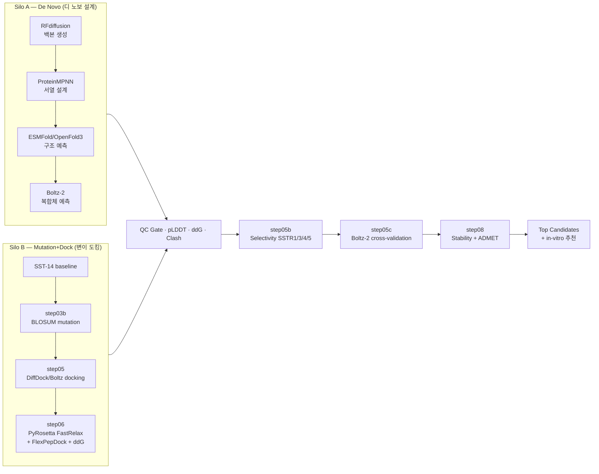
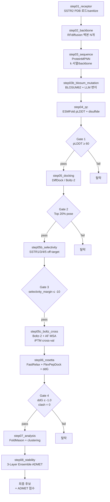
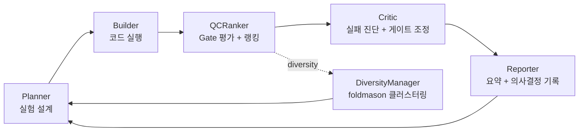
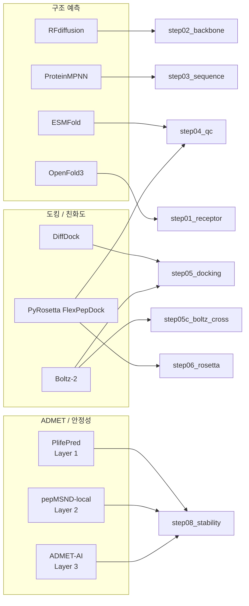

# SSTR2 AI Co-Scientist — 방사성의약품 펩타이드 스크리닝 시스템

> SSTR2 (Somatostatin Receptor Type 2) 선택적 펩타이드 바인더를 자동 탐색하는 듀얼-실로 AI 파이프라인
> SST-14 (`AGCKNFFWKTFTSC`) 를 출발점으로 디자인 → 도킹 → 정제 → 선택성 → 안정성 평가 자율 반복


---

## 목차

- [프로젝트 개요](#프로젝트-개요)
- [시스템 아키텍처](#시스템-아키텍처)
- [Pipeline 단계 (Step 01–08)](#pipeline-단계-step-0108)
- [스코어링 레이어 (3-Layer Ensemble)](#스코어링-레이어-3-layer-ensemble)
- [5-Agent 시스템](#5-agent-시스템)
- [핵심 도구/엔진 매트릭스](#핵심-도구엔진-매트릭스)
- [디렉토리 구조](#디렉토리-구조)
- [환경 셋업](#환경-셋업)
- [설정 파일](#설정-파일)
- [실행 가이드](#실행-가이드)
- [데이터 흐름 + 출력](#데이터-흐름--출력)
- [UI / API](#ui--api)
- [검증 마일스톤](#검증-마일스톤)
- [알려진 제약](#알려진-제약)
- [참고 문서](#참고-문서)

---

## 프로젝트 개요

### 타겟 & 응용
- **타겟**: SSTR2 (G-protein-coupled receptor, UniProt **P30874**, 7XNA holo)
- **off-target**: SSTR1 (P30872), SSTR3 (P32745), SSTR4 (P31391), SSTR5 (P35346)
- **출발점**: SST-14 `AGCKNFFWKTFTSC` (14 aa, Cys3–Cys14 이황화결합, FWKT pharmacophore)
- **응용**:
  - SSTR2 발현 신경내분비종양(NET) 진단/치료용 방사성의약품
  - ⁶⁸Ga (PET 진단), ¹⁷⁷Lu / ²²⁵Ac (β/α-emitting 치료), ¹²⁵I (라벨링)
  - DOTA-펩타이드 컨주게이션 후 chelator-기반 표지

### 핵심 가치
- **자율 탐색**: 5-Agent LLM 시스템이 디자인 → 평가 → 개선을 반복
- **듀얼 검증**: PyRosetta 물리 시뮬레이션 + Boltz-2 deep learning 다중 시퀀스 모델
- **3-Layer Ensemble 스코어링**: PlifePred (Layer 1) + pepMSND-local (Layer 2) + ADMET-AI (Layer 3)
- **재현 가능성**: 결정 구조 + AlphaFoldDB MSA + conda 환경 일체 잠금
- **확장성**: H100 NVL ×4 병렬 + GPU/CPU 작업 자동 분산

---

## 시스템 아키텍처

### Dual Silo 개요



> **상세 도식 5종**: [`docs/diagrams/architecture-2026-05-12.md`](docs/diagrams/architecture-2026-05-12.md)
> Silo A 3-ARM (small mol / peptide / hybrid), Silo B BO+Bandit+Pareto, Gate 분기 흐름, 5-Agent 사이클, 본 프로젝트 실제 진행 사이클 포함

### 듀얼 검증 메커니즘

| 측면 | Silo A | Silo B |
|------|--------|--------|
| **전략** | 백본부터 새로 디자인 | 알려진 SST-14에서 변이 |
| **백본 생성** | RFdiffusion (확산) | 고정 (SST-14 PDB) |
| **서열 디자인** | ProteinMPNN | BLOSUM62 + LLM-direct |
| **구조 예측** | ESMFold / OpenFold3 | 결정 구조 사용 |
| **도킹** | Boltz-2 | DiffDock + PyRosetta FlexPepDock |
| **장점** | 다양성 ↑, novel scaffold | 안정성 ↑, 합성 가능성 ↑ |
| **단점** | 합성 어려움 가능 | 다양성 제한 |

---

## Pipeline 단계 (Step 01–08)

### Step별 상세 흐름



### Step 모듈 인벤토리 (`pipeline_local/steps/`)

| Step | 파일 | 도구 | conda env | 산출물 |
|------|------|------|-----------|--------|
| 01 receptor | `step01_receptor.py` | PyRosetta + OpenFold3 | bio-tools | `01_receptor/sstr2_receptor.pdb` |
| 02 backbone | `step02_backbone.py` | RFdiffusion | rfdiffusion | `02_backbone/bb{NN}.pdb` (N=10) |
| 03 sequence | `step03_sequence.py` | ProteinMPNN | proteinmpnn | `03_sequence/bb{NN}_sequences.fasta` |
| 03b mutation | `step03b_blosum_mutation.py` | BLOSUM62 + LLM | (LLM 의존) | `03b_blosum/mutants.json` |
| 04 QC | `step04_qc.py` | ESMFold + custom | esmfold | `04_qc/qc_table.json` |
| 05 docking | `step05_docking.py` | DiffDock / Boltz-2 | boltz | `05_docking/pose_a_*.pdb` |
| **05b** selectivity | `step05b_selectivity.py` | off-target dock | boltz | `05b_selectivity/selectivity_scores.json` |
| **05c** boltz-cross | `step05c_boltz_cross.py` | **Boltz-2 + AF MSA** | boltz | `05c_boltz_cross/iptm_matrix.json` |
| 06 rosetta | `step06_rosetta.py` | **PyRosetta** (FastRelax+FlexPepDock+ddG) | bio-tools | `06_rosetta/refined_*.pdb` + `energy_table.json` |
| 07 analysis | `step07_analysis.py` | FoldMason + clustering | bio-tools | `07_viz/cluster_report.html` |
| 08 stability | `step08_stability.py` | 3-Layer Ensemble ADMET | bio-tools | `08_reports/stability_report.json` |

### Gate 임계값 (`pipeline_local/config/gate_thresholds.yaml`)

| Gate | 임계값 | 적용 단계 |
|------|--------|----------|
| pLDDT (mean) | ≥ 60 | step04 |
| pLDDT (interface) | ≥ 45 | step04 |
| Disulfide SG-SG | ≤ 2.5 Å | step04, step06 |
| Docking top% | 상위 20% | step05 |
| DiffDock confidence | ≤ -1.0 | step05 |
| Boltz-2 affinity | ≤ -8.0 kcal/mol | step05 |
| Rosetta ddG | ≤ -1.0 kcal/mol | step06 |
| Rosetta clash | ≤ 10 | step06 |
| Selectivity margin | ≤ -10.0 kcal/mol | step05b |
| Off-target max | ≤ -15.0 kcal/mol | step05b |
| Boltz iPTM margin (신규) | ≥ 0.0 (T2 이상) | step05c [⚠️](#-boltz-ipm-cross-validation-한계) |
| Stability prescreen | t½ ≥ 50 h | step08 |
| FoldMason lDDT | ≥ 0.6 | step07 |

### ⚠️ Boltz iPTM cross-validation 한계

step05c의 iPTM은 **구조 geometry 신뢰도**이지 **결합 친화도(Ki/Kd) 또는 selectivity 순위의 proxy 아님**.

**SST-14 vs SSTR1~5 실측 검증 (2026-05-12)**:

| 수용체 | 실측 Ki (nM) | Boltz iPTM | Ki 순위 | iPTM 순위 |
|--------|-------------|-----------|---------|-----------|
| SSTR1 | 0.4 | 0.975 | 3 | **1** |
| **SSTR2** (목표) | **0.2 (최강)** | 0.946 | **1** | 4 |
| SSTR3 | 0.8 | 0.958 | 4 | 2 |
| SSTR4 | 1.6 (최약) | 0.956 | 5 | 3 |
| SSTR5 | 0.3 | 0.913 | 2 | 5 |

- **순위 일치 0/5** (Spearman ρ ≈ -0.3)
- iPTM 분산 0.062는 Ki 8배 차이를 구분하기에 부족
- **결론**: step05c selectivity_margin tier (T0~T3)는 *geometry 기반 1차 스크리닝 필터*. 정량 선택성 평가는 별도 도구 의무.

현재 step05c의 tier는 iPTM 절대값이 아니라 `Δ = iPTM(SSTR2) - max(iPTM(off-target))` 기준으로 해석한다. `T3`는 `Δ ≥ 0.03`, `T2`는 `0.00 ≤ Δ < 0.03`, `T1`은 `-0.03 ≤ Δ < 0.00`, `T0`는 `Δ < -0.03`이며 (코드 `classify_tier`와 동일), 이 분류 역시 HEURISTIC disclaimer 하의 geometry-only triage 용도다.

**정량 선택성 평가에 사용해야 할 방법**:
1. FEP (Free Energy Perturbation)
2. MM-GBSA / MM-PBSA
3. 실측 Ki radioligand binding assay (`docs/wetlab/cand03_binding_assay_design.md`)

**근거**: `_workspace/release/msa-routing-crosscheck-synthesis-2026-05-12.md`

---

## 스코어링 레이어 (3-Layer Ensemble)

2026-05-20 이후 step08 및 PyRosetta flow 후처리에 3-Layer Ensemble 스코어링이 통합되어 있다.

```
pipeline_local/scoring/
├── composite_scorer.py     # 3-Layer 통합 스코어러 (OOD 가드 포함)
├── ensemble_router.py      # Layer 1/2/3 라우팅
├── layer1_ensemble.py      # Layer 1 — PlifePred (혈청 반감기)
├── layer2_ensemble.py      # Layer 2 — pepMSND-local (안정성)
└── radiolysis_scorer.py    # 방사선 분해 스코어 (방사성의약품 전용)
```

| Layer | 도구 | 예측 대상 | 로컬 모델 |
|-------|------|----------|-----------|
| **Layer 1** | PlifePred | 혈청 반감기 (t½) | `_workspace/plifepred_local/` |
| **Layer 2** | pepMSND-local | 안정성 (재훈련 완료) | `_workspace/pepmsnd_local/` |
| **Layer 3** | ADMET-AI | ADMET 종합 프로파일 | `_workspace/admet_ai_local/` |

- **OOD 검출**: `pipeline_local/pepadmet_ood/ood_detection.py` — 학습 도메인 밖 예측 시 경고 발행
- **pepADMET 재훈련**: PRST OOD 아티팩트 완화 (2026-05-21, `feat(pepadmet)` 커밋)
- cyclic SS-bond OOD 가드 + composite_scorer fallback WARN 정책 적용

---

## 5-Agent 시스템

LLM 기반 자율 의사결정. 위치: `AgenticAI4SCIENCE_pyrosetta_track/repos/ai4sci-kaeri/AG_src/agents/`



### Agent 책임

| Agent | 역할 | 핵심 파일 |
|-------|------|----------|
| **Planner** | 다음 iteration 변이 전략 결정 | `agents/planner.py` |
| **Builder** | Step 01–08 subprocess 호출 | `agents/builder.py` |
| **QCRanker** | Gate 평가 + Top-K 랭킹 | `agents/qc_ranker.py` |
| **DiversityManager** | foldmason 클러스터링 + 중복 제거 | `agents/diversity_manager.py` |
| **Critic** | 게이트 실패 분석 + adaptive 조정 | `agents/critic.py` |
| **Reporter** | iteration 요약 + 결정 기록 | `agents/reporter.py` |

### Flow 패턴 3종 (벤치마크 완료)

| Flow | 특징 | 사용 사례 |
|------|------|----------|
| **Sequential** | 단방향 (P→B→Q→C→R) | 안정적, 디버깅 용이 |
| **Collaborative** | DebatingPlanner (다중 후보 합의) | 다양성 ↑ |
| **Hierarchical** | Orchestrator (직접/승인/통합) | 복잡한 의사결정 |

상세: `docs/experiment_final_report.md`

---

## 핵심 도구/엔진 매트릭스

### 외부 도구 ↔ Step 매핑



### 외부 도구 가용성 (`pipeline_local/wrapper_scripts/`)

| 도구 | wrapper 스크립트 | conda env | 모델 위치 | GPU |
|------|------------------|-----------|----------|-----|
| RFdiffusion | `run_rfdiffusion.py` | rfdiffusion | `local_models/RFdiffusion/` | ✓ |
| ProteinMPNN | `run_proteinmpnn.py` | proteinmpnn | (env 내장) | ✓ |
| ESMFold | `run_esmfold.py` | esmfold | HF cache | ✓ |
| ESM-2 | `run_esm2.py` | esmfold | HF cache | ✓ |
| OpenFold3 | `run_openfold3.py` | openfold3 | `local_models/`/HF | ✓ |
| DiffPepBuilder | `run_diffpepbuilder.py` | diffpepbuilder | `local_models/DiffPepBuilder/` | ✓ |
| GenMol | `run_genmol.py` | genmol | `local_models/genmol/` | ✓ |
| **Boltz-2** | `run_boltz.py` | boltz | `~/.boltz/*.ckpt` (4.4 GB) | ✓ |
| PyRosetta | (FlexPepDock worker pool) | bio-tools | env 내장 | CPU |
| PlifePred | `predict_halflife_pepmsnd.py` | bio-tools | `_workspace/plifepred_local/` | CPU |
| ADMET-AI | `predict_admet_ai_wrapper.py` | bio-tools | `_workspace/admet_ai_local/` | CPU |
| FoldMason | (CLI) | bio-tools | env 내장 | CPU |

### FlexPepDock Worker Pool

step06 PyRosetta FlexPepDock는 **워커 풀 방식**으로 동시 실행된다:

```bash
# 워커 기동 (기본 4개)
bash pipeline_local/scripts/start_flexpepdock_workers.sh

# 상태 모니터링
python pipeline_local/scripts/status_updater.py
```

- 기본 워커 수: 4 (동시 잡 처리)
- per-receptor 타임아웃: 6시간
- orphan worker 자동 정리: startup hook + PID file GC

### Boltz-2 오프라인 우회 (KAERI 내부망)

`api.colabfold.com` HTTPS 차단 환경에서 **AlphaFoldDB MSA** + 3-옵션 조합으로 가동 가능:

```bash
# 1. AlphaFoldDB MSA 사전 다운로드 (1회만)
curl -L "https://alphafold.ebi.ac.uk/files/msa/AF-P30874-F1-msa_v6.a3m" \
     -o ~/.cache/boltz_msa/P30874.a3m

# 2. Boltz 실행 (MSA path 명시 + libnvrtc 우회)
boltz predict input.yaml \
    --num_workers 0 \
    --no_kernels
```

**검증**: SST-14 × SSTR2 iPTM = **0.946** (실측 Ki 0.2 nM과 일치) · 페어당 30초.
상세: [`docs/boltz2_offline_workaround.md`](docs/boltz2_offline_workaround.md)

---

## 디렉토리 구조

```
SST14-M_scr/
├── README.md                                  # 본 문서
├── CLAUDE.md                                  # AI 협업 규칙 (위임 트리, 키워드)
├── ENVIRONMENT.md                             # 환경 셋업 상세
├── environment-bio-tools.yml                  # PyRosetta + FoldMason conda env 정의
├── pyproject.toml                             # pytest marker 등록
│
├── pipeline_local/                            # LOCAL MODE 메인 파이프라인
│   ├── run_pipeline_local.py                  # CLI 진입점
│   ├── orchestrator.py                        # 8 step 조정 + Gate 평가
│   ├── __main__.py                            # `python -m pipeline_local` 진입점
│   ├── steps/                                 # step01–08 구현
│   │   ├── step01_receptor.py
│   │   ├── step02_backbone.py
│   │   ├── step03_sequence.py
│   │   ├── step03b_blosum_mutation.py
│   │   ├── step04_qc.py
│   │   ├── step05_docking.py
│   │   ├── step05b_selectivity.py
│   │   ├── step05c_boltz_cross.py             # Boltz-2 + AF MSA cross-val
│   │   ├── step06_rosetta.py                  # PyRosetta FlexPepDock+ddG
│   │   ├── step07_analysis.py
│   │   └── step08_stability.py               # 3-Layer Ensemble ADMET
│   ├── scoring/                               # 3-Layer Ensemble 스코어링 모듈 (신규)
│   │   ├── composite_scorer.py               # 통합 스코어러 (OOD 가드)
│   │   ├── ensemble_router.py
│   │   ├── layer1_ensemble.py                # PlifePred
│   │   ├── layer2_ensemble.py                # pepMSND-local
│   │   └── radiolysis_scorer.py              # 방사선 분해 (방사성의약품 전용)
│   ├── scripts/
│   │   ├── offtarget_dock.py                  # Boltz-2 기반 selectivity docking
│   │   ├── offtarget_dock_pyrosetta_legacy.py # PyRosetta 레거시 백업
│   │   ├── pharmacology_guards.py             # 약리학 lookup table 환각 가드
│   │   ├── modification_conflict.py           # peptide modification 충돌 검사
│   │   ├── flexpep_dock.py                    # FlexPepDock 단독 실행
│   │   ├── flexpepdock_worker.py              # 워커 프로세스
│   │   ├── start_flexpepdock_workers.sh       # 워커 풀 기동 (기본 4개)
│   │   ├── status_updater.py                  # 잡 상태 모니터
│   │   ├── predict_admet_ai_wrapper.py        # ADMET-AI 로컬 래퍼 (신규)
│   │   ├── predict_admet_pepadmet.py          # pepADMET 로컬 래퍼 (신규)
│   │   ├── predict_halflife_pepmsnd.py        # pepMSND 반감기 예측 (신규)
│   │   ├── sequence_to_smiles.py              # SMILES 변환
│   │   ├── sequence_to_smiles_daa.py          # D-AA SMILES 변환 (신규)
│   │   ├── extract_binding_pocket.py          # 결합 포켓 추출
│   │   ├── generate_sstr2_sst14_complex.py   # 복합체 생성
│   │   └── stability_predictor/               # 안정성 예측 서브모듈
│   ├── pepadmet_ood/                          # OOD 검출 모듈 (신규)
│   │   └── ood_detection.py
│   ├── strategies/                            # 변이 전략 모듈 (신규)
│   │   ├── blosum.py
│   │   ├── dual_b1_b2.py
│   │   ├── esm_scan.py
│   │   ├── proteinmpnn.py
│   │   └── registry.py
│   ├── wrapper_scripts/                       # 외부 도구 subprocess wrapper
│   │   ├── run_rfdiffusion.py
│   │   ├── run_proteinmpnn.py
│   │   ├── run_esmfold.py
│   │   ├── run_boltz.py
│   │   ├── run_openfold3.py
│   │   ├── run_diffpepbuilder.py
│   │   ├── run_esm2.py
│   │   └── run_genmol.py
│   ├── core/                                  # 공통 로직
│   │   ├── local_runner.py
│   │   ├── selectivity_runner.py
│   │   ├── config_loader.py
│   │   └── structure_io.py
│   ├── schemas/
│   │   ├── io_schemas.py
│   │   └── rank_table.py
│   ├── backend/                               # FastAPI 라우터 (pipeline_local 내)
│   │   ├── main.py
│   │   ├── state.py
│   │   └── routers/selectivity.py
│   ├── config/
│   │   ├── pipeline_config_local.yaml
│   │   ├── gate_thresholds.yaml
│   │   ├── model_paths.yaml
│   │   └── pipeline_config_local_dogfood.yaml
│   └── tests/                                 # 단위 + 통합 테스트 (781 PASS 기준)
│       ├── test_pharmacology_guards.py        # 76 테스트 (약리학 가드)
│       ├── test_step05c_boltz_cross.py
│       ├── test_offtarget_dock_boltz.py
│       ├── test_layer1_ensemble.py
│       ├── test_layer3_admet_ai.py
│       ├── test_composite_scorer.py
│       ├── test_ood_detection.py
│       ├── test_modification_conflict.py
│       ├── test_flexpepdock_worker_pool.py
│       └── … (38개 파일 총 781 테스트)
│
├── AgenticAI4SCIENCE_pyrosetta_track/         # Agentic AI 본 엔진 (854 MB)
│   └── repos/ai4sci-kaeri/
│       ├── AG_src/                            # 5-Agent 시스템
│       │   ├── agents/                        # planner/builder/qc_ranker/critic/reporter/diversity_manager
│       │   ├── clients/                       # NIM API 클라이언트 (nim_client.py)
│       │   ├── llm/                           # LLM provider 추상화 (provider.py)
│       │   ├── pipeline/                      # CoScientist Pipeline + orchestrator
│       │   ├── reports/                       # 보고서 템플릿
│       │   └── tools/                         # 외부 도구 호출
│       ├── backend/                           # FastAPI :8787
│       │   ├── main.py                        # 라우터 마운트
│       │   └── routers/                       # status/analysis/validation/experiment/admet/
│       │                                      # selectivity/cluster/rcsb/settings/static/
│       │                                      # silo_a/flexpepdock/strategies/pipelines/
│       │                                      # binding_pocket/stability/wetlab/runs/benchmark/
│       ├── frontend/                          # React 19 + Vite 7 + TS :5173
│       │   ├── src/pages/                     # SiloA/SiloB/Selectivity/Validation/
│       │   │                                  # ManualSelectivity/RunLauncher/RunConsole/
│       │   │                                  # CandidatePage/BindingPocket/WetlabOrder/
│       │   │                                  # Benchmark/StrategyRunner/…
│       │   ├── src/hooks/
│       │   └── package.json
│       ├── pyrosetta_flow/                    # 본격 SAR 실험 runner
│       │   ├── runner.py                      # BO + bandit + clustering
│       │   ├── bayesian_optimizer.py
│       │   ├── bandit.py
│       │   ├── pareto_ranking.py
│       │   ├── gnina_rescoring.py
│       │   ├── pdb_store.py
│       │   └── pepadmet_*.py
│       └── runs/pyrosetta_flow/archives/      # 35개 dashboard.json (실험 결과)
│
├── pipelines/                                 # Silo 분리 패키지 (실험)
│   ├── silo_a/ {configs, src, tests}
│   ├── silo_b/ {configs, src, tests}
│   ├── orchestration/
│   └── shared/
│
├── data/                                      # 입력 데이터 (52 MB)
│   ├── somatostatin_receptor/                 # SSTR1-5 결정 구조 (CIF + PDB)
│   │   ├── SSTR1_9IK8.cif/pdb
│   │   ├── SSTR2_7XNA.cif                     # 메인 target (holo, peptide-bound)
│   │   ├── SSTR3_8XIR.cif/pdb
│   │   ├── SSTR4_7XMT.cif/pdb
│   │   └── SSTR5_8ZBJ.cif/pdb
│   └── fold_test1/msas/                       # 검증용 MSA (a3m × 4)
│
├── llm_benchmark/                             # 5 sLLM × 3 flow 비교실험 (Phase 1–3 + V2)
│   ├── configs/v2_phase2_matrix.yaml
│   ├── runners/                               # sequential/collaborative/hierarchical
│   ├── harness/parallel_launcher.py           # 2-GPU 모델 핫스왑
│   └── ui/results_dashboard.html
│
├── local_models/                              # 외부 모델 가중치 캐시
│   ├── RFdiffusion/                           # ~6 GB 체크포인트
│   ├── DiffPepBuilder/
│   ├── genmol/, genmol-repo/
│   ├── pepadmet/
│   ├── llm/                                   # vLLM 모델 캐시
│   └── msa_db/                                # ColabFoldDB 사본 (있다면)
│
├── docs/                                      # 기술 문서 (한국어 우선)
│   ├── boltz2_offline_workaround.md
│   ├── GIT_TRACKING.md                        # Git 추적 정책 (최대 보존)
│   ├── selectivity_demo_20260511/             # 6-Round 도킹 보고서 + 데이터
│   ├── design-handoff-2026-05-14/             # FE/BE API 계약 + 프로토타입
│   ├── presentation/                          # 발표자료 (v_a/b/c/d/e + 부록)
│   ├── wetlab/cand03_binding_assay_design.md
│   ├── experiment_final_report.md
│   ├── v2_pipeline_design.md
│   └── …
│
├── tools/                                     # harness adaptation (CLI 비종속 메타)
│   └── harness-adaptation/
│       ├── PROMPT_TEMPLATE.md
│       ├── ANALYSIS.md (위임 패턴 6종)
│       └── reference/harness/                 # revfactory/harness submodule
│
├── runs/                                      # 영구 실험 결과
│   └── pyrosetta_flow/archives/               # dashboard.json (누적)
│
├── runs_local/                                # 로컬 실행 결과 (gitignored, ~1 GB)
│   ├── local_<날짜>_iter<N>/                  # iteration 별 8 step 산출물
│   └── selectivity_demo_20260511/             # 6-Round 도킹 + Boltz batch
│
├── scripts/                                   # 운영 스크립트
│   ├── launch_agent_team.sh                   # tmux team-mate 모드
│   ├── auto_dispatch.sh                       # Codex/Cursor 자동 라우팅
│   └── agent-wrapper.sh
│
└── _workspace/                                # 작업 중간 산출물 (NN_agent_artifact)
    ├── release/                               # SOD/EOD/회고 보고서
    ├── admet_ai_local/                        # ADMET-AI 로컬 모델
    ├── plifepred_local/                       # PlifePred 로컬 모델
    ├── pepmsnd_local/                         # pepMSND 로컬 모델
    └── pptx/                                  # 발표자료 빌드 산출물
```

---

## 환경 셋업

### 하드웨어 요구사항

| 자원 | 권장 | 최소 |
|------|------|------|
| GPU | NVIDIA H100 NVL ×4 (96 GB ea) | A100 80GB ×1 |
| CPU | 64 core | 16 core |
| RAM | 256 GB | 64 GB |
| 디스크 | NVMe 2 TB (모델 + 캐시) | 500 GB |
| 네트워크 | 외부 망 (github/huggingface/ebi.ac.uk) 접근 | (오프라인 가능, 본 가이드 참조) |

> **CUDA 할당**: H100 NVL ×4 환경에서 GPU 2,3 사용 (GPU 0/1은 타인 idle 점유).
> `export CUDA_VISIBLE_DEVICES=2,3`

### conda 환경 (11종)

```bash
# 1. bio-tools (PyRosetta + FoldMason) — Silo B 핵심
conda env create -f environment-bio-tools.yml

# 2. 도구별 환경 (각각 README 참조)
conda create -n boltz python=3.11 -y && conda activate boltz && pip install boltz
conda create -n esmfold python=3.10 -y && conda activate esmfold && pip install fair-esm omegaconf openfold
conda create -n rfdiffusion ...   # local_models/RFdiffusion/setup.sh
conda create -n proteinmpnn ...
conda create -n openfold3 ...
conda create -n diffpepbuilder ...
conda create -n genmol ...
conda create -n pepadmet ...
conda create -n vllm-server ...   # LLM serving (vLLM 가동 확인됨)
```

| env | Python | 주 의존성 | 크기 |
|-----|--------|---------|------|
| bio-tools | 3.10–3.12 | pyrosetta, foldmason, pymol-open-source, meeko, biopython | ~3 GB |
| boltz | 3.11 | boltz 2.2.1, torch, pytorch-lightning, gemmi | ~12 GB (모델 포함) |
| esmfold | 3.10 | fair-esm, omegaconf, openfold, torch | ~8 GB |
| rfdiffusion | 3.9 | torch, hydra, e3nn, dgl | ~10 GB |
| proteinmpnn | 3.10 | torch | ~4 GB |
| openfold3 | 3.11 | jax, openfold | ~10 GB |
| pepadmet | 3.10 | torch, scikit-learn | ~2 GB |
| genmol | 3.10 | torch, rdkit, transformers | ~5 GB |
| diffpepbuilder | 3.10 | torch, diffusers | ~6 GB |
| vllm-server | 3.11 | vllm, qwen tokenizer | ~30 GB (모델 포함) |

### GPU 설정

```bash
# CUDA_VISIBLE_DEVICES 매핑 (~/.zshrc)
export CUDA_VISIBLE_DEVICES=2,3   # H100 ×2 (GPU 0/1 타인 점유)
# 또는 step별 자동 분산 (pipeline_local/config/model_paths.yaml gpu_device 필드)
```

### 네트워크 차단 환경 대응 (KAERI 내부망)

차단된 도메인: `api.colabfold.com`, `mmseqs.com`, `search.foldseek.com`
**우회**: AlphaFoldDB MSA 사전 다운로드 + Boltz `--no_kernels --num_workers 0`
상세: [`docs/boltz2_offline_workaround.md`](docs/boltz2_offline_workaround.md)

---

## 설정 파일

| 파일 | 역할 | 키 설정 |
|------|------|---------|
| `pipeline_local/config/pipeline_config_local.yaml` | 메인 (8 step + iteration) | `iteration.n_backbone`, `off_target_receptors[]`, `mode: local` |
| `pipeline_local/config/gate_thresholds.yaml` | Gate 임계값 | `rosetta_ddg_max`, `selectivity_margin_min`, `boltz_cross.enabled` |
| `pipeline_local/config/model_paths.yaml` | 도구별 conda env + 모델 경로 | `models.{rfdiffusion,esmfold,boltz,…}` |
| `pipeline_local/config/_effective_pipeline_config_local.yaml` | 머지된 final (자동 생성) | (override 추적용) |

### 메인 설정 예시 (`pipeline_config_local.yaml`)

```yaml
mode: local

iteration:
  n_backbone: 10                # 백본 N개
  k_seq_per_backbone: 8         # backbone당 k개 서열
  top_m_rosetta: 10             # PyRosetta 정제 대상
  max_iterations: 5
  adaptive_enabled: true

# Off-Target 수용체 (selectivity)
off_target_receptors:
  - {name: "SSTR1", structure_path: "data/somatostatin_receptor/SSTR1_9IK8.cif", uniprot_id: "P30872"}
  - {name: "SSTR3", structure_path: "data/somatostatin_receptor/SSTR3_8XIR.cif", uniprot_id: "P32745"}
  - {name: "SSTR4", structure_path: "data/somatostatin_receptor/SSTR4_7XMT.cif", uniprot_id: "P31391"}
  - {name: "SSTR5", structure_path: "data/somatostatin_receptor/SSTR5_8ZBJ.cif", uniprot_id: "P35346"}

# Boltz-2 cross-validation
boltz_cross:
  enabled: false                # 기본 비활성
  work_dir: "step05c_boltz_cross"
  cuda_device: 3
  msa_cache_dir: "~/.cache/boltz_msa"
```

---

## 실행 가이드

### 1. 전체 8-step 사이클 (LOCAL MODE)

```bash
conda activate bio-tools
python -m pipeline_local.run_pipeline_local \
    --iterations 3 \
    --llm-model qwen3-32b \
    --output-dir runs_local
```

출력: `runs_local/local_<날짜>_iter01/{00_config, 01_receptor, 02_backbone, …, 08_reports}/`

### 2. Resume (중단 후 재개)

```bash
python -m pipeline_local.run_pipeline_local --resume --run-id local_20260511_1430_iter01
```

### 3. Backend + Frontend (UI 동시 가동)

```bash
# Backend FastAPI :8787
cd AgenticAI4SCIENCE_pyrosetta_track/repos/ai4sci-kaeri
conda run -n bio-tools uvicorn backend.main:app --host 127.0.0.1 --port 8787

# Frontend React Vite :5173 (별 터미널)
cd frontend
npm install   # 첫 회만
npm run dev
```

브라우저: `http://localhost:5173/` (Pipeline 진행 + Selectivity 매트릭스 + Mol* viewer)

### 4. FlexPepDock 워커 풀 기동

```bash
# 워커 4개 기동 (기본값)
bash pipeline_local/scripts/start_flexpepdock_workers.sh

# 또는 Manual Selectivity UI에서 잡 등록 후 자동 처리
```

### 5. Selectivity 단독 (off-target 도킹)

```bash
# Boltz-2 기반
conda run -n boltz python pipeline_local/scripts/offtarget_dock.py \
    --receptor data/somatostatin_receptor/SSTR2_7XNA.cif \
    --sequence AGCKNFFWKTFTSC \
    --nstruct 1 \
    --output-dir runs_local/selectivity_test

# 출력 (stdout JSON):
# {"ddg": -94.6, "iptm": 0.946, "ptm": 0.869, "confidence": 0.859, "engine": "boltz-2"}
```

### 6. PyRosetta 본격 도킹 (step06 단독)

```bash
conda run -n bio-tools python -m pipeline_local.steps.step06_rosetta \
    --candidates runs_local/.../05_docking/docking_scores.json \
    --receptor data/somatostatin_receptor/SSTR2_7XNA.cif \
    --output-dir runs_local/.../06_rosetta
```

### 7. archives 대규모 재평가

```bash
# 1615 페어 (323 후보 × 5 SSTR), 4-GPU 시 약 3시간 47분
python runs_local/archives_boltz_eval/run_full_eval.py --n-gpus 4

# 중단 후 재개
python runs_local/archives_boltz_eval/run_full_eval.py --resume

# Mini-test (25 페어, ~15분)
python runs_local/archives_boltz_eval/test_small.py
```

### 8. LLM 벤치마크

```bash
cd llm_benchmark
bash run_phase2b.sh    # 5 sLLM × 3 flow × 6 seed
```

### 9. 테스트 실행

```bash
# 단위 테스트 (빠름)
pytest pipeline_local/tests/ -v -m "not slow"

# 통합 테스트 (GPU + conda boltz 필요, 느림)
pytest pipeline_local/tests/ -v -m slow

# 전체 (2026-05-27 기준 781 PASS / 1 skip / 2 xfail)
pytest pipeline_local/tests/ -v
```

---

## 데이터 흐름 + 출력

### Iteration 별 디렉토리 구조

```
runs_local/local_20260511_1430_iter01/
├── 00_config/
│   ├── pipeline_config_local.yaml
│   └── gate_thresholds.yaml
├── 01_receptor/
│   └── sstr2_receptor.pdb
├── 02_backbone/
│   └── bb00.pdb, bb01.pdb, …
├── 03_sequence/
│   └── bb00_sequences.fasta, …
├── 03b_blosum/
│   └── mutants.json
├── 04_qc/
│   └── qc_table.json
├── 05_docking/
│   ├── pose_a_bb00_seq00_00.pdb
│   └── docking_scores.json
├── 05b_selectivity/
│   ├── selectivity_scores.json
│   └── {seq_id}_offtarget_{rname}.json
├── 05c_boltz_cross/
│   ├── iptm_matrix.json
│   └── partial_results.json (checkpoint)
├── 06_rosetta/
│   ├── refined_{seq_id}.pdb
│   └── energy_table.json
├── 07_viz/
│   └── cluster_report.html
├── 08_reports/
│   ├── stability_report.json             # 3-Layer Ensemble ADMET
│   └── iteration_summary.json
├── silo_b/
│   └── experiment_log.jsonl
└── state/
    └── checkpoint_iter01.json
```

### Archives (영구 보관)

```
runs/pyrosetta_flow/archives/
└── *_dashboard.json  # 35개 (각 시드·실험별)

AgenticAI4SCIENCE_pyrosetta_track/repos/ai4sci-kaeri/runs/pyrosetta_flow/archives/
└── *_dashboard.json  # 35개 (각 시드·실험별)
```

---

## UI / API

### Backend FastAPI (`port 8787`)

```bash
# Swagger UI
open http://127.0.0.1:8787/docs
# Health check
curl http://127.0.0.1:8787/api/health
```

| 라우터 | 엔드포인트 | 역할 |
|--------|----------|------|
| status | `GET /api/status` | 파이프라인 상태 |
| analysis | `GET /api/analysis/{run_id}` | iteration 분석 |
| validation | `POST /api/validation/run` | 검증 잡 |
| experiment | `GET /api/experiment/list` | archives |
| admet | `GET /api/admet/{seq_id}` | ADMET 점수 (3-Layer) |
| selectivity | `POST /api/selectivity/run` | off-target 도킹 |
| cluster | `GET /api/cluster/{run_id}` | foldmason |
| rcsb | `GET /api/rcsb/search` | RCSB 검색 |
| settings | `GET/PATCH /api/settings` | 게이트 조정 |
| static | `GET /api/static/*` | PDB 파일 서빙 |
| **silo-a** | `/api/v1/silo-a/*` | Silo A 전용 |
| **flexpepdock** | `/api/flexpepdock/*` | FlexPepDock 잡 관리 (신규) |
| **strategies** | `/api/strategies/*` | 변이 전략 실행 (신규) |
| **binding_pocket** | `/api/binding_pocket/*` | 결합 포켓 추출 (신규) |
| **stability** | `/api/stability/*` | 안정성 예측 (신규) |
| **wetlab** | `/api/wetlab/*` | 습식실험 주문 (신규) |
| **runs** | `/api/runs/*` | 실행 이력 (신규) |
| **benchmark** | `/api/benchmark/*` | LLM 벤치마크 결과 (신규) |

### Frontend (`port 5173`)

| 페이지 | 경로 | 역할 |
|--------|------|------|
| Home | `/` | 대시보드 |
| SiloAPage | `/silo-a` | de novo 진행 + 결과 |
| SiloBPage | `/silo-b` | mutation+dock 진행 + 게이트 |
| Selectivity | `/selectivity` | off-target 매트릭스 + Tier |
| ManualSelectivity | `/manual-selectivity` | 수동 FlexPepDock 잡 (신규) |
| RunLauncher | `/run-launcher` | 실험 기동 UI (신규) |
| RunConsole | `/run-console` | 실행 로그 모니터 (신규) |
| CandidatePage | `/candidate` | 후보 상세 + Mol* viewer (신규) |
| BindingPocket | `/binding-pocket` | 결합 포켓 분석 (신규) |
| WetlabOrder | `/wetlab` | 습식실험 주문 (신규) |
| Validation | `/validation` | 검증 결과 |
| Settings | `/settings` | 게이트/모델 조정 |
| Benchmark | `/benchmark` | LLM 벤치마크 (신규) |
| StrategyRunner | `/strategy-runner` | 변이 전략 비교 (신규) |

**Tech stack**: React 19 + Vite 7 + TypeScript + Tailwind v4 + Radix UI + **Molstar 5.6** (3D viewer) + Recharts 3 (차트) + vitest

---

## 검증 마일스톤

### 테스트 현황 (2026-05-27 기준)

| 항목 | 수치 |
|------|------|
| 전체 테스트 | **781 PASS** / 1 skip / 2 xfail |
| 테스트 파일 수 | 38개 |
| 약리학 가드 테스트 | 76개 (`test_pharmacology_guards.py`) |
| vLLM | 가동 확인 |

### 누적 실험

| Phase | 실험 수 | 결과 |
|-------|--------|------|
| Phase 1–3 + V2 P1/P2 | 199 | sLLM × Flow 벤치마크 |
| Round 1–4 PyRosetta dock | 200 | selectivity 부적합 입증 |
| Round D AlphaFold apo | 50 | apo도 불충분 |
| **Round B Boltz-2** | **50** | **의미있는 selectivity** |
| Mini-test archives | 25 | 4-GPU ETA 3h47m 확인 |
| **누계** | **~524+** | |

### 핵심 발견

1. **cand03 AICKNFFWKTFTSC**: 유일 SSTR2-selective 후보 (Boltz iPTM margin +0.008, Tier T2)
2. **Boltz-2 오프라인 가동 입증**: KAERI 내부망에서 AlphaFoldDB MSA + `--no_kernels`로 성공
3. **SST-14 wild type pan-receptor 패턴 재현**: iPTM (0.913–0.975), 실측 Ki와 일치 → 모듈 신뢰성 검증
4. **var18 (I2Y_dT12)**: Tyr2 직접 ¹²⁵I 라벨링 가능 → DOTA 불필요 합성 경로 (chemistry 발견)
5. **step05c_boltz_cross**: PyRosetta gate 다음 단계로 Boltz-2 cross-validation 통합
6. **3-Layer Ensemble**: PlifePred + pepMSND-local + ADMET-AI 통합 (2026-05-20)
7. **pepADMET 재훈련**: PRST OOD 아티팩트 완화, sanity PASS (2026-05-21)
8. **FlexPepDock 워커 풀**: 동시 4잡 처리, orphan 자동 정리 (2026-05-20)
9. **vLLM 가동**: Qwen3-32B vLLM 서버 운영 확인 (2026-05-27)

### Pipeline 신뢰성 가드

- **pharmacology_guards** (`pipeline_local/scripts/pharmacology_guards.py`): 약리학 lookup table 환각 차단 (76 테스트)
- **HEURISTIC_FUNCTION_DISCLAIMERS**: 절대값 보장하지 않는 heuristic 함수 명시 (Stage 8h~i 결과)
- **modification_conflict**: D-amino acid + DOTA + PEG 등 modification 충돌 검사
- **OOD 검출** (`pipeline_local/pepadmet_ood/ood_detection.py`): 학습 도메인 밖 예측 경고
- **cyclic SS-bond OOD 가드**: composite_scorer fallback WARN 정책

상세 운영 규칙: [`CLAUDE.md`](CLAUDE.md), [`tools/harness-adaptation/`](tools/harness-adaptation/)

---

## 알려진 제약

| 제약 | 영향 | 대응 |
|------|------|------|
| `api.colabfold.com` 차단 (KAERI 내부망) | Boltz-2 기본 MSA 서버 불가 | AlphaFoldDB MSA 우회 (검증됨) |
| PyRosetta FlexPepDock off-target docking 부적합 | step05b 신뢰성 ↓ | step05c Boltz-2 cross-val (신규) |
| HADDOCK 미설치 | 추가 도킹 검증 도구 부재 | (필요 시 별도 설치, CNS 라이선스) |
| ESMFold 환경 openfold 의존성 | step04 일부 환경에서 import 실패 | `pip install openfold omegaconf` 후 재시도 |
| SSTR3 holo CIF `fill_missing_atoms` 에러 | PyRosetta 로드 실패 | sanitize 우회 (HETATM 제거) |
| LLM (vLLM) GPU 메모리 | Qwen3-32B 80 GB 필요 | 모델 swap 또는 7B 모델 사용 |
| AlphaFold MSA 가용성 | UniProt 등록된 단백질만 | 자체 mmseqs2 빌드 (DB 200 GB+) |
| SSTR2 symlink | 일부 테스트 skip | (xfail 처리) |

> **주의**: step06_rosetta (FastRelax+FlexPepDock+ddG, on-target SSTR2)는 **정상 작동 중**.
> 부적합 판정은 step05b (off-target selectivity docking) 한정.

---

## 참고 문서

### 핵심 가이드

| 문서 | 내용 |
|------|------|
| [`CLAUDE.md`](CLAUDE.md) | AI 협업 규칙, 위임 트리, 키워드 매핑 |
| [`ENVIRONMENT.md`](ENVIRONMENT.md) | 환경 셋업 상세 |
| [`docs/boltz2_offline_workaround.md`](docs/boltz2_offline_workaround.md) | Boltz-2 오프라인 우회 (2026-05-11) |
| [`docs/experiment_final_report.md`](docs/experiment_final_report.md) | 184 LLM × Flow 실험 종합 |
| [`docs/v2_pipeline_design.md`](docs/v2_pipeline_design.md) | V2 LLM-direct mutation 디자인 |
| [`docs/GIT_TRACKING.md`](docs/GIT_TRACKING.md) | Git 추적 정책 (최대 보존 원칙) |

### Selectivity / Validation

| 문서 | 내용 |
|------|------|
| `docs/selectivity_demo_20260511/report_6round.html` | 6-Round 도킹 종합 (300 페어) |
| `docs/selectivity_demo_20260511/report_boltz.html` | Boltz-2 50 페어 결과 |
| [`docs/wetlab/cand03_binding_assay_design.md`](docs/wetlab/cand03_binding_assay_design.md) | in-vitro Ki 설계 (2026-05-12) |
| [`docs/presentation/01_appendix/selectivity_docking_report.md`](docs/presentation/01_appendix/selectivity_docking_report.md) | Selectivity 모듈 production 기술 보고 |

### 발표자료

| 문서 | 내용 |
|------|------|
| [`docs/presentation/00_main/04_v_a_demo_first.md`](docs/presentation/00_main/04_v_a_demo_first.md) | 데모 중심 |
| [`docs/presentation/00_main/04_v_b_action_order.md`](docs/presentation/00_main/04_v_b_action_order.md) | 액션 아이템 중심 |
| [`docs/presentation/00_main/04_v_c_formal.md`](docs/presentation/00_main/04_v_c_formal.md) | 정식 발표 |
| [`docs/presentation/00_main/04_v_d_compact.md`](docs/presentation/00_main/04_v_d_compact.md) | 간략 |
| [`docs/presentation/00_main/04_v_e_detailed.md`](docs/presentation/00_main/04_v_e_detailed.md) | 상세 |
| [`docs/presentation/00_main/05_unified_appendix.md`](docs/presentation/00_main/05_unified_appendix.md) | 통합 부록 |
| `_workspace/pptx-2026-05-27/` | 5/28 회의 발표 PPTX (박사 청자 톤, 26슬라이드) |

### Harness / 메타

| 문서 | 내용 |
|------|------|
| [`tools/harness-adaptation/PROMPT_TEMPLATE.md`](tools/harness-adaptation/PROMPT_TEMPLATE.md) | 위임 프롬프트 템플릿 |
| [`tools/harness-adaptation/ANALYSIS.md`](tools/harness-adaptation/ANALYSIS.md) | 위임 패턴 6종 분석 |
| [`tools/harness-adaptation/INTEGRATION_PLAN.md`](tools/harness-adaptation/INTEGRATION_PLAN.md) | Stage 0–9 적용 이력 |
| [`tools/harness-adaptation/RETROSPECTIVE_GUIDE.md`](tools/harness-adaptation/RETROSPECTIVE_GUIDE.md) | 분기 회고 가이드 |

---

## 라이선스

- 본 프로젝트: KAERI 내부 연구 (외부 공개 미정)
- PyRosetta: Rosetta Commons 라이선스
- Boltz-2: MIT 라이선스
- RFdiffusion / ProteinMPNN: MIT 라이선스
- harness 원본 (`tools/harness-adaptation/reference/harness/`): Apache-2.0 (revfactory/harness)

---

## 컨택트

**KAERI · AI for Biology Lab**
**작성**: 김동주 (dongjukim@kaeri.re.kr)

문의/이슈: GitHub Issues 또는 `/team` 채널

---

*마지막 업데이트: 2026-05-29 · 테스트 781 PASS · 3-Layer Ensemble + FlexPepDock 워커 풀 + vLLM 가동 · pepADMET 재훈련 완료*
