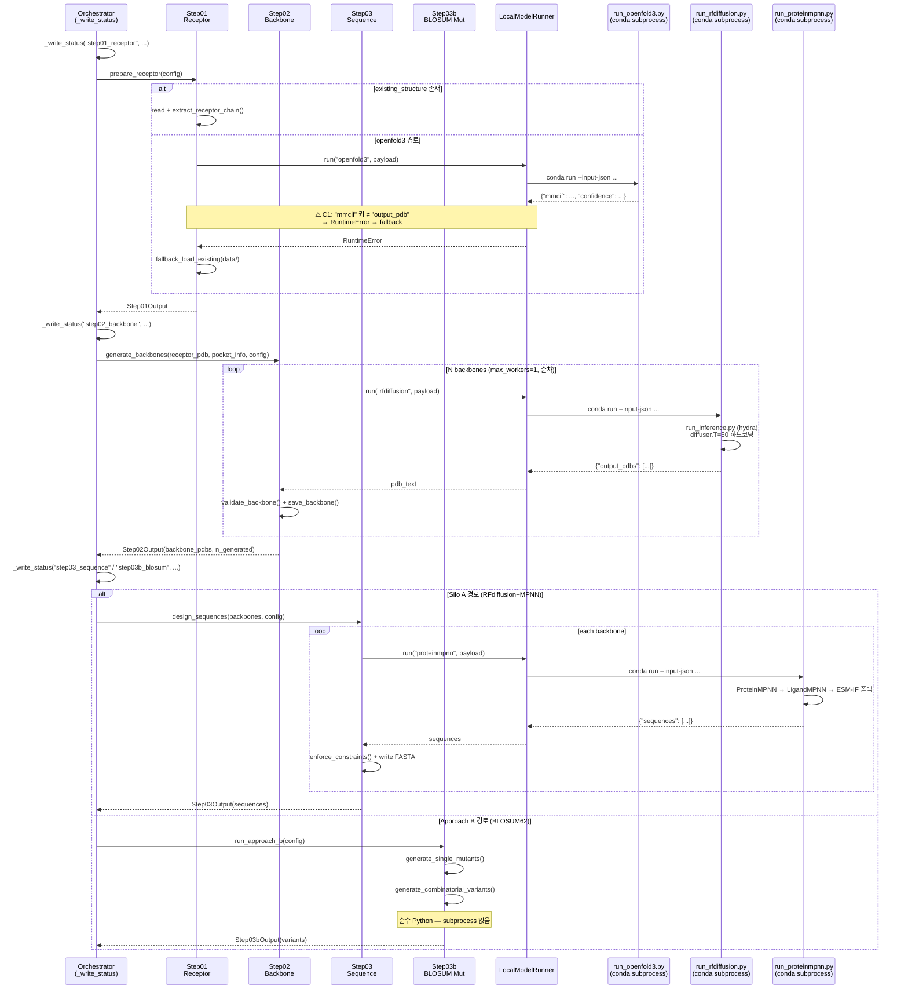

# M1 모듈 검증 보고서 — step01~03b
**작성**: engineer-backend  
**날짜**: 2026-05-13  
**대상**: `pipeline_local/steps/step01_receptor.py`, `step02_backbone.py`, `step03_sequence.py`, `step03b_blosum_mutation.py`  
**검증 방법**: 코드 정적 분석 + wrapper script 추적 + orchestrator 연결성 확인

---

## 1. 입출력 스키마 요약표

| 항목 | Step01 Receptor | Step02 Backbone | Step03 Sequence | Step03b BLOSUM |
|------|----------------|----------------|----------------|----------------|
| **입력 타입** | `Dict[str, Any]` (config) | `receptor_pdb: str` (Path), `pocket_info: Dict`, `config: Dict` | `backbones: List[str]` (Paths), `config: Dict` | `config: Dict[str, Any]` |
| **핵심 입력 키** | `receptor.existing_structure/existing_pdb`, `receptor.chain`, `receptor.pocket_residues`, `receptor.sequence` | `iteration.n_backbone`, `iteration.diffusion_steps`, `contigs`, `hotspot_res` | `iteration.k_seq_per_backbone`, `iteration.sampling_temp`, `sequence_constraints` | `approach_b.seed_sequence`, `fixed_positions`, `min_blosum_score`, `max_mutations`, `strategy` |
| **출력 타입** | `Step01Output` dataclass | `Step02Output` dataclass | `Step03Output` dataclass | `Step03bOutput` dataclass |
| **출력 필드** | `receptor_pdb_path`, `pocket_residues`, `chain_id`, `pocket_json_path` | `backbone_pdbs: List[str]`, `design_params: Dict`, `n_generated: int` | `sequences: List[SequenceEntry]` | `variants: List[VariantEntry]`, `seed_sequence`, `fixed_positions`, `total_generated` |
| **파일 산출** | `01_receptor/sstr2_receptor.pdb`, `01_receptor/binding_pocket.json` | `02_backbone/backbone_{00..N}.pdb` | `03_sequence/bb{i:02d}_sequences.fasta` | **없음** (메모리 전달만) |
| **후속 단계 전달** | `Step01Output` → orchestrator → Step02/Step03b | `Step02Output.backbone_pdbs` → Step03 | `Step03Output.sequences` → Step04 QC | `Step03bOutput.variants` → Step04 QC |

---

## 2. 모듈별 상세 분석

### 2.1 Step01 — Receptor Preparation (`step01_receptor.py`)

#### 실행 경로 (3단계 폴백 체인)

```
prepare_receptor(config)
  ├─ Path 1: existing_structure/existing_pdb 파일 존재
  │    ├─ detect_format() → .pdb/.cif 판별
  │    ├─ .pdb → extract_receptor_chain() → _finalize_output()
  │    └─ .cif → _convert_cif_to_pdb() [PyRosetta → BioPython 폴백] → _finalize_output()
  │
  ├─ Path 2: LocalModelRunner("openfold3")
  │    └─ conda run run_openfold3.py --input-json ...
  │         → OpenFold3 subprocess → ESMFold 폴백
  │         ※ 출력: {"mmcif": ..., "confidence": ...}
  │
  └─ Path 3: fallback_load_existing(data/)
       → glob("sstr2*.pdb", "receptor*.pdb", "*.pdb", "*.cif" ...)
       → extract_receptor_chain() or _convert_cif_to_pdb()
```

#### conda 환경 / wrapper
- LocalModelRunner → `run_openfold3.py` (wrapper)
- conda env: `model_paths.yaml`의 `openfold3.conda_env` 설정값
- GPU: `model_paths.yaml`의 `openfold3.gpu_device` (기본 0 → CUDA_VISIBLE_DEVICES 리매핑)

#### 에러 핸들링
| 실패 시나리오 | 처리 방식 |
|-------------|---------|
| openfold3 subprocess 실패 | WARNING 로그 + Path 3 폴백 |
| data/ PDB 없음 | `FileNotFoundError` raise (orchestrator에서 catch) |
| BioPython/numpy 미설치 | WARNING, 빈 pocket 반환 |
| CIF→PDB 변환 실패 | WARNING, 원본 CIF 텍스트 반환 (RFdiffusion 실패 가능) |

---

### 2.2 Step02 — Backbone Generation (`step02_backbone.py`)

#### 실행 경로

```
generate_backbones(receptor_pdb, pocket_info, config)
  └─ ThreadPoolExecutor(max_workers=1) → 순차 실행
       └─ for seed in range(n_backbone):
            generate_single_backbone()
              └─ LocalModelRunner("rfdiffusion").run(payload)
                   └─ conda run run_rfdiffusion.py --input-json ...
                        └─ run_inference.py (hydra) → {output_pdbs: [...]}
            validate_backbone() → ATOM count ≥ 50 + chain 존재
            save_backbone() → backbone_{seed:02d}.pdb
```

#### conda 환경 / wrapper
- LocalModelRunner → `run_rfdiffusion.py` (wrapper)
- conda env: `model_paths.yaml`의 `rfdiffusion.conda_env`
- GPU: 단일 GPU 순차 (subprocess가 매번 모델 로드)

#### 에러 핸들링
| 실패 시나리오 | 처리 방식 |
|-------------|---------|
| 개별 backbone 실패 | `failed_seeds` 목록 기록, 계속 진행 |
| 전체 백본 0개 생성 | Step03에 빈 list 전달 (중단 없음, 무결과) |
| validate_backbone 실패 | 해당 backbone 스킵 |

---

### 2.3 Step03 — Sequence Design (`step03_sequence.py`)

#### 실행 경로

```
design_sequences(backbones, config)
  └─ for backbone_path in backbones:
       design_for_backbone(backbone_pdb, num_seq, sampling_temp)
         └─ LocalModelRunner("proteinmpnn").run(payload)
              └─ conda run run_proteinmpnn.py --input-json ...
                   ├─ _run_proteinmpnn_subprocess() → ProteinMPNN CLI
                   │    └─ protein_mpnn_run.py → FASTA 파싱
                   ├─ _run_ligandmpnn_cli() [폴백 1]
                   └─ _run_esm_if_fallback() [폴백 2]
       enforce_sequence_constraints() [if enabled]
       write bb{i:02d}_sequences.fasta
```

#### conda 환경 / wrapper
- LocalModelRunner → `run_proteinmpnn.py` (wrapper)
- conda env: `model_paths.yaml`의 `proteinmpnn.conda_env`
- 원본 FASTA 헤더 필터링: `"T=0" in header or "sample" in header` 조건 (첫 서열 제외 목적)

#### 에러 핸들링
| 실패 시나리오 | 처리 방식 |
|-------------|---------|
| 개별 backbone 서열 설계 실패 | `sequences = []`, 빈 FASTA 저장 후 계속 |
| ProteinMPNN/LigandMPNN/ESM-IF 전부 실패 | wrapper exit 1 → NonZeroExitError → Step03 except로 잡힘 |
| backbone list 공 | 반복 없음, 빈 Step03Output 반환 |

---

### 2.4 Step03b — BLOSUM62 Mutation (`step03b_blosum_mutation.py`)

#### 실행 경로

```
run_approach_b(config)
  ├─ generate_single_mutants(seed, fixed_positions, min_blosum, max_hydro_delta)
  │    └─ for pos in mutable_positions:
  │         get_plausible_substitutions(aa, min_blosum)  ← BLOSUM62 룩업
  │         hydrophobicity_check(mutated, ref, max_hydro_delta)  ← KD scale
  │         validate_constraints(mutated, fixed_positions)
  │         → VariantEntry (single_mutant)
  │
  └─ generate_combinatorial_variants(seed, fixed_positions, max_mutations, strategy)
       └─ itertools.combinations(mutable_positions, n_mut)
            └─ per-position 치환 선택 (random/greedy)
            hydrophobicity_check() + validate_constraints()
            → VariantEntry (combinatorial)

반환: Step03bOutput (외부 subprocess/conda 없음, 순수 Python)
```

#### conda 환경 / wrapper
- **없음** — 완전히 순수 Python 연산 (subprocess 호출 없음)
- GPU 불필요

#### 에러 핸들링
| 실패 시나리오 | 처리 방식 |
|-------------|---------|
| 외부 의존성 없음 | 해당 없음 |
| seed 서열이 fixed_positions보다 짧음 | `validate_constraints` → False, 변이체 스킵 |
| max_variants 초과 | 반복 중단 (len(variants) ≥ max_variants 체크) |

---

## 3. Mermaid Sequence Diagram



---

## 4. STATUS_FILE 갱신 분석

### 결론
> **각 step 모듈은 STATUS_FILE을 직접 갱신하지 않는다. Orchestrator가 전담한다.**

### 상세
| 갱신 주체 | 경로 | 내용 |
|---------|------|------|
| `orchestrator._write_status()` | `/tmp/pipeline_local_status.json` | phase, iteration, progress_pct, steps[], agents[] |
| `backend/routers/status.py` | POST /api/status | 외부 상태 푸시 허용 |
| `steps/step0*.py` | ❌ 없음 | 직접 갱신 없음 |

### Orchestrator가 갱신하는 시점 (step01~03b 관련)
```python
_write_status("step01_receptor", "수용체 구조 준비 중...")    # before Step01
_write_status("silo_a", "Silo A 실행 중...")                  # before Step02+03 (dual)
_write_status("silo_b", "Silo B 실행 중...")                  # before Step03b (dual)
_write_status("step03b_blosum", "BLOSUM62 돌연변이 생성 중...") # before Step03b (single)
```

### 경로 불일치 주의
- 태스크 명세: `/tmp/ag_pipeline_status.json`
- 실제 구현: `/tmp/pipeline_local_status.json` (환경변수 `PIPELINE_STATUS_FILE`)
- AG_src 원본 파이프라인과 pipeline_local 파이프라인의 경로 불일치 — UI 연동 시 주의 필요

---

## 5. 결함 목록 (Priority 순)

### 🔴 Critical

#### C1. Step01 OpenFold3 로컬 모드 키 불일치
- **위치**: `step01_receptor.py:_call_openfold3_local()` L390-396 vs `run_openfold3.py:main()` L308
- **증상**: `run_openfold3.py`는 `{"mmcif": ..., "confidence": ...}` 출력. `_call_openfold3_local()`는 `result.get("output_pdb") or result.get("pdb") or result.get("result", {}).get("pdb")`를 찾음 → 항상 `None` → 항상 `RuntimeError` → 항상 fallback
- **영향**: openfold3 Path 2가 완전히 비활성화. 수용체 구조 예측 불가능. 반드시 `existing_structure` 또는 data/ 파일 필요.
- **수정**: `_call_openfold3_local()`에 `result.get("mmcif")` 키 추가 및 CIF→PDB 변환 호출

#### C2. Step02 백본 0개 생성 무방어 전파
- **위치**: `step02_backbone.py:generate_backbones()` L141-153
- **증상**: 모든 백본이 실패하면 `backbone_pdbs = []`, `n_generated = 0`으로 반환. Step03는 for loop 없이 빈 Step03Output 반환. 에러 없이 파이프라인 계속 진행 → 이후 step은 0개 후보로 실행.
- **영향**: 조용한 실패 (silent failure). 사용자는 결과 없음만 확인.
- **수정**: `n_generated == 0`이면 orchestrator에 명시적 에러 또는 early return 필요

---

### 🟠 High

#### H1. Step01 analyze_binding_pocket 미호출 (구조 기반 포켓 분석 없음)
- **위치**: `step01_receptor.py:_finalize_output()` L326-355
- **증상**: `analyze_binding_pocket()` 함수가 정의되어 있으나 메인 파이프라인에서 호출되지 않음. `binding_pocket.json`의 `pocket_residues`는 100% config 값(`receptor.pocket_residues`) 그대로 복사됨.
- **영향**: 입력 구조가 달라져도 포켓이 자동 재계산되지 않음. centroid/radius 같은 구조 기반 데이터 없음.
- **수정**: `_finalize_output()`에서 `analyze_binding_pocket(receptor_pdb_text, ligand_chain)` 호출 후 결과를 JSON에 병합

#### H2. Step03b 결과 파일 미저장
- **위치**: `step03b_blosum_mutation.py:run_approach_b()` L419-477
- **증상**: 수백 개 변이체가 `Step03bOutput`에만 담겨 반환됨. FASTA/JSON 아티팩트 없음.
- **영향**: orchestrator 크래시 시 변이체 전부 손실. 디버깅 및 추적 불가.
- **수정**: `runs/{run_id}/03b_variants/` 하위에 variants.json + variants.fasta 저장 추가

---

### 🟡 Medium

#### M1. Step01 PyRosetta API 경로 불확실
- **위치**: `step01_receptor.py:_convert_cif_to_pdb()` L428
- **코드**: `pyrosetta.rosetta.core.io.pose_to_pdbstring(pose)`
- **증상**: PyRosetta의 표준 PDB 덤프 API는 `pyrosetta.rosetta.core.io.pdb.dump_pdb(pose, path)` 또는 `pose.dump_pdb(path)`. `pose_to_pdbstring` 경로가 실제로 존재하는지 불확실.
- **수정**: `pyrosetta.rosetta.core.io.pdb.pose_to_pdbstring(pose)` 또는 StringIO 우회 방식으로 교체 및 단위 테스트 추가

#### M2. Step02 ThreadPoolExecutor(max_workers=1) 불필요한 복잡도
- **위치**: `step02_backbone.py:generate_backbones()` L113
- **증상**: `max_workers=1`이면 실질적으로 순차 실행. `ThreadPoolExecutor` 오버헤드만 발생.
- **수정**: 단순 for-loop으로 교체. 추후 멀티-GPU 지원 시 `max_workers` 파라미터화.

#### M3. Step02 diffusion_steps config 무시 (하드코딩 T=50)
- **위치**: `run_rfdiffusion.py:_build_hydra_overrides()` L112
- **증상**: `diffuser.T=50` 하드코딩. Step02가 payload에 `diffusion_steps`를 전달해도 wrapper가 무시함.
- **영향**: config에서 `diffusion_steps` 조정 불가.
- **수정**: `overrides`에 `f"diffuser.T={diffusion_steps}"` 추가 (payload에서 읽어 전달)

#### M4. Step03 compute_sequence_diversity 미호출
- **위치**: `step03_sequence.py:design_sequences()` (전체)
- **증상**: `compute_sequence_diversity()` 함수 정의되어 있으나 메인 흐름에서 호출 안 됨. 다양성 지표 없음.
- **영향**: ProteinMPNN 서열의 다양성 모니터링 불가.
- **수정**: `design_sequences()` 마지막에 backbone별 다양성 계산 후 `Step03Output`에 필드 추가 또는 로그 출력

#### M5. Step03 빈 backbone 시 빈 FASTA 저장
- **위치**: `step03_sequence.py:design_sequences()` L113-150
- **증상**: 서열 설계 실패 시 `sequences = []`로 빈 FASTA 파일 생성. 후속 파싱에서 빈 파일이 정상으로 오인될 수 있음.
- **수정**: 서열 0개이면 FASTA 파일 미생성 또는 WARNING 헤더 기록

#### M6. Step03b strategy="greedy" 다양성 부족
- **위치**: `step03b_blosum_mutation.py:generate_combinatorial_variants()` L361-365
- **증상**: greedy 전략은 각 위치에서 top-1 치환만 선택 → 동일 조합 패턴 반복, 낮은 다양성.
- **수정**: greedy에도 top-k 샘플링 (k=3 등) 도입 옵션 추가

---

### 🟢 Low

#### L1. Step03b 문서 오류 — 고정 위치 번호 착오
- **위치**: `step03b_blosum_mutation.py` docstring L14
- **증상**: `"Fixed: 3,13=C (disulfide)"` → 시퀀스 "AGCKNFFWKTFTSC"에서 C는 pos 3 **및 14**. pos 13은 S(Serine). 올바른 표기: `"Fixed: 3,14=C"`

#### L2. Step03b rng_seed config 미노출
- **위치**: `step03b_blosum_mutation.py:run_approach_b()` L450
- **증상**: `generate_combinatorial_variants(..., rng_seed=42)` 하드코딩. config에 `approach_b.rng_seed` 키가 있어도 전달 안 됨.
- **수정**: `ab_cfg.get("rng_seed", 42)` 추가

#### L3. Step03 save_sequences dead code
- **위치**: `step03_sequence.py:save_sequences()` L228-259
- **증상**: `design_sequences()`는 내부에서 직접 FASTA를 쓰고 `save_sequences()`를 사용하지 않음. 중복/미사용 코드.
- **수정**: 제거 또는 `design_sequences()` 리팩토링 시 통합

#### L4. Step02 design_params에 사용 seed 목록 미기록
- **위치**: `step02_backbone.py:generate_backbones()` L150-154
- **증상**: `design_params`에 `seeds_used` 필드 없음. 재현성 추적 어려움.
- **수정**: `design_params["seeds_used"] = list(range(n_backbone))` 추가

---

## 6. Pipeline Status Emission 분석

```
Orchestrator._write_status() 호출 시점:
┌────────────────────────────────────────────────────────────────────┐
│ phase                 │ progress_pct │ 설명                         │
├───────────────────────┼──────────────┼──────────────────────────────┤
│ "start"               │ 0.0          │ 파이프라인 시작               │
│ "step01_receptor"     │ 5.0          │ Step01 호출 직전              │
│ "silo_a"              │ 15.0         │ Step02+03 (dual mode)         │
│ "silo_b"              │ 30.0         │ Step03b FlexPepDock (dual)    │
│ "step03b_blosum"      │ 30.0         │ Step03b (approach_b only)     │
│ "step04_qc"           │ 50.0         │ Step04 이후                   │
│ ...                   │ ...          │ ...                           │
└───────────────────────┴──────────────┴──────────────────────────────┘

각 step 내부에서 세분화된 progress (예: backbone 7/10) 없음.
→ UI는 step 수준 granularity만 표시 가능.
```

**개선 제안**: Step02에서 각 backbone 완료 시 직접 status 파일 갱신 (또는 콜백 주입)하면 세분화된 프로그레스 바 가능.

---

## 7. UI 표시 권장 사항

| 데이터 포인트 | 현재 상태 | 권장 표시 위치 |
|------------|---------|-------------|
| Step01: 수용체 로드 방식 (existing/openfold3/fallback) | 로그만 | Step01 카드 배지 (예: "Fallback PDB") |
| Step01: 포켓 잔기 수 (`n_residues`) | JSON 파일에 저장됨 | 수용체 카드 하단 ("Pocket: 8 residues") |
| Step02: 생성/실패 백본 수 (`n_generated / n_backbone`) | 로그만 | Step02 진행 표시 (예: "7/10 generated") |
| Step02: 각 backbone의 ATOM count | 미저장 | validate_backbone 결과 표에 추가 권장 |
| Step03: 백본별 서열 다양성 (`mean_hamming`) | 함수 있으나 미호출 | Step03 결과 카드 다양성 차트 |
| Step03b: 단일/조합 변이체 수 분리 | `Step03bOutput`에 없음 | Approach B 카드 (예: "42 single + 158 combo") |
| Step03b: 소수성 필터 통과율 | 미저장 | 필터 효율 표시 (예: "58% passed hydro check") |

---

## 8. 신규 기능 제안

### F1. Backbone Novelty Score (Step02)
- 생성된 백본들 간 구조 RMSD 또는 TM-score 계산
- 유사 백본 클러스터링으로 중복 제거
- `Step02Output`에 `novelty_scores: List[float]` 필드 추가
- 구현: `foldseek easy-cluster` 또는 `mdtraj` RMSD

### F2. ProteinMPNN Logit 추출 (Step03)
- 서열 확률 (per-position logit)을 추출하여 불확실 위치 식별
- MPNN log-probability가 낮은 위치 = 백본에서 힘든 위치 → mutagenesis 가이드
- `SequenceEntry`에 `per_position_logits: Optional[List[float]]` 추가
- 구현: `protein_mpnn_run.py --score_only` 모드 활용

### F3. BLOSUM62 Coverage Matrix (Step03b)
- 씨드 대비 생성된 변이체의 BLOSUM 점수 분포 히스토그램
- min/mean/max BLOSUM distance 통계
- `Step03bOutput`에 `blosum_stats: Dict[str, float]` 추가

### F4. Backbone Progress Callback (Step02)
- orchestrator 콜백을 주입하여 backbone N/M 완료 시 STATUS_FILE 갱신
- UI 세분화된 프로그레스 바 구현 가능

---

## 9. 종합 요약

| 모듈 | Critical | High | Medium | Low | STATUS 갱신 |
|------|---------|------|--------|-----|------------|
| Step01 Receptor | C1 (openfold3 키 불일치) | H1 (pocket 미분석) | M1 (PyRosetta API) | L4 | Orchestrator |
| Step02 Backbone | C2 (0개 전파 무방어) | - | M2, M3 | L4 | Orchestrator |
| Step03 Sequence | - | - | M4, M5 | L3 | Orchestrator |
| Step03b BLOSUM | - | H2 (파일 미저장) | M6 | L1, L2 | Orchestrator |

**즉시 수정 권장 (Blocking)**:
1. **C1** — Step01 openfold3 키 불일치 → `"mmcif"` 키 수용 및 CIF→PDB 자동 연결
2. **C2** — Step02 n_generated=0 guard → orchestrator early return 추가
3. **H2** — Step03b 파일 저장 → `03b_variants/variants.json` 추가

**다음 Sprint 권장**:
- H1: 구조 기반 포켓 자동 분석 활성화
- M3: diffusion_steps config → wrapper 전달
- F1+F2: Backbone Novelty + MPNN Logits (신규 기능)
