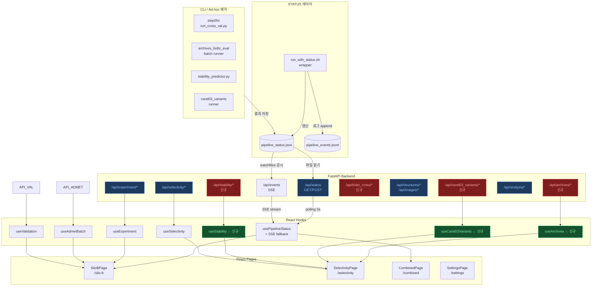

# M4 — UI 연동 분석 + 개선 + 백본 신규 기능 제안

> **작성일**: 2026-05-13  
> **작성자**: reviewer-uiux (M4 task — module-verification-2026-05-13 팀)  
> **참조**: `docs/wetlab/ui_inventory_gap_analysis.md` (U3), `ui_stability_integration_spec.md` (U3)  
> **스택**: React 19 + Vite 7 + TypeScript + Tailwind CSS v4 + Recharts + Mol*  
> **해상도 기준**: 데스크톱 1440×900 (primary), 태블릿 768px (secondary)

---

## 요약 판정

| 항목 | 판정 | 비고 |
|------|------|------|
| 전체 UI↔Backend 연동 | ⚠️ CONDITIONAL | 4개 MISSING 라우터 + CLI ad-hoc 미반영 |
| STATUS_FILE 실시간 반영 | ❌ FAIL | CLI batch 결과가 UI에 즉각 반영 안 됨 |
| 9 모듈 UI 표현 | ✅ PASS (기존) / ❌ MISSING (신규 4개) | step05c·stability·archives·variants |
| 접근성 (WCAG 2.1 AA) | ⚠️ CONDITIONAL | 탭 시맨틱·aria 보강 필요 |
| 5탭 확장 준비도 | ⏳ PENDING | backend 라우터 4개 의존 |

---

## 1. 9 모듈 UI Mockup

> 각 step의 **입력 → 진행 → 결과 → 인터랙션** 4단계 흐름으로 기술.  
> ASCII 레이아웃 기준: 1440px 데스크톱, dark theme (`bg-slate-900`).

---

### step01 — 서열 초기화 & 설정 로드

**역할**: 실험 파라미터(iteration, model, seed) 설정 + 초기 서열 확인

```
┌─────────────────────────────────────────────────────────┐
│  [SettingsPage /settings]                               │
│                                                         │
│  ┌── Experiment Config ──────────────────────────────┐  │
│  │  Iterations:   [ 3      ]  ▼                      │  │
│  │  Model:        [ llama3-70b ] ▼                   │  │
│  │  Seed:         [ 42     ]                         │  │
│  │  Strategy:     ○ greedy  ● sampling               │  │
│  │                                                   │  │
│  │  Initial Sequence:                                │  │
│  │  AGCKNFFWKTFTSC  [14aa] ✓ SS-bond(C3-C14)         │  │
│  └───────────────────────────────────────────────────┘  │
│                                                         │
│  [Save Settings]  [Reset to Default]                    │
└─────────────────────────────────────────────────────────┘
```

**상태별 UI**:
- 입력: SettingsPage 폼 — `GET /api/settings` → 현재 값 로드
- 저장: `PUT /api/settings` → Toast "설정 저장됨" (`text-green-400`)
- 오류: 400/422 → 빨간 인라인 에러 (`text-red-400`)

**인터랙션 제안**:
- sequence 입력 시 실시간 SS bond (Cys3↔Cys14) 유효성 시각화 배지 표시
- 설정 저장 후 SiloBPage로 자동 리다이렉트 옵션

---

### step02 — 변이 제안 (LLM)

**역할**: LLM이 후보 변이 목록을 제안, 진행 상황 실시간 표시

```
┌─────────────────────────────────────────────────────────┐
│  [SiloBPage] AgentMonitor                               │
│                                                         │
│  ┌── Iteration 2 / 3 ─────────────────────────────┐    │
│  │  Step 02: LLM Mutation Proposal          [●RUN] │    │
│  │                                                 │    │
│  │  Agent: llama3-70b (vLLM)                       │    │
│  │  ████████████████░░░░  80%                      │    │
│  │                                                 │    │
│  │  Proposed mutations (8):                        │    │
│  │  ┌─────────────────────────────────────────┐   │    │
│  │  │ K4R  [BLOSUM +1]  priority: high        │   │    │
│  │  │ F7Y  [BLOSUM -1]  priority: medium      │   │    │
│  │  │ W8F  [BLOSUM +1]  priority: high        │   │    │
│  │  │ ...  (5 more)                           │   │    │
│  │  └─────────────────────────────────────────┘   │    │
│  └─────────────────────────────────────────────────┘    │
└─────────────────────────────────────────────────────────┘
```

**상태별 UI**:
- 진행: `AgentMonitor` + `LoopTimeline` → 실시간 갱신 (polling 3s)
- 완료: `MutationAnalysis` 차트 갱신, 변이 빈도 히트맵 업데이트
- 실패: 에이전트 상태 `text-red-400` + 재시도 버튼

**인터랙션 제안**:
- 변이 카드 클릭 → BLOSUM62 score + rationale 팝오버
- "변이 수동 추가" 드로어 (advanced mode)

---

### step03 — 도킹 스코어링 (PyRosetta)

**역할**: PyRosetta InterfaceAnalyzer로 ΔΔG 계산

```
┌─────────────────────────────────────────────────────────┐
│  [SiloBPage] DdGDistribution + ConvergenceGraph         │
│                                                         │
│  ┌── Step 03: Docking Scoring ──────────────────────┐   │
│  │                                                  │   │
│  │  ΔΔG Distribution                                │   │
│  │  ▄▄▅▅▆▆▇▇██▇▇▆▅▄▃▃▂▂▁▁  (histogram)             │   │
│  │  -5.2  -3.1  0  +1.4  +3.2  kcal/mol            │   │
│  │                                                  │   │
│  │  Top candidates:                                 │   │
│  │  cand01 AVCKNFFWKTFTSC  ΔΔG=-4.8 ✓ (T2)         │   │
│  │  cand02 AGCKNFFWKTFNSC  ΔΔG=-3.9 ✓ (T2)         │   │
│  │  cand03 AGCKNRFWKTFTSC  ΔΔG=-3.1 ✓ (T1)         │   │
│  │                                                  │   │
│  │  [◄ Prev Iter]  Iter 2/3  [Next Iter ►]          │   │
│  └──────────────────────────────────────────────────┘   │
└─────────────────────────────────────────────────────────┘
```

**상태별 UI**:
- 진행: 스켈레톤 히스토그램 → 실제 데이터로 교체
- 완료: `ConvergenceGraph` 수렴 곡선 + `DdGDistribution` 히스토그램
- 실패: "PyRosetta 오류" 배너 + 로그 링크

**인터랙션 제안**:
- 히스토그램 구간 클릭 → 해당 범위 후보만 필터
- 이터레이션 슬라이더로 과거 결과 비교

---

### step04 — 약리학 필터 (ADMET + QC Gate)

**역할**: ADMET 예측 + QC 게이트 통과/실패 분류

```
┌─────────────────────────────────────────────────────────┐
│  [SiloBPage] PharmacologyPanel + QCGateChart            │
│                                                         │
│  ┌── ADMET Metrics ───────────┐ ┌── QC Gate ─────────┐ │
│  │  MW:    1542 Da     ✓      │ │  ██████████ 100%   │ │
│  │  GRAVY: -0.24       ✓      │ │  MW < 2000 Da  ✓   │ │
│  │  Instab: 31.2 (stable) ✓   │ │  GRAVY < 0     ✓   │ │
│  │  logP:  -1.8        ✓      │ │  Instab < 40   ✓   │ │
│  │  HBD:   6           ✓      │ │  logP < 5      ✓   │ │
│  │                            │ │                    │ │
│  │  [▼ Show All]              │ │  PASS: 7/8         │ │
│  └────────────────────────────┘ └────────────────────┘ │
│                                                         │
│  ┌── Pharmacology Panel (8 candidates) ──────────────┐  │
│  │  seq_id   MW     GRAVY  Instab  Nephrotox  Grade  │  │
│  │  cand01   1498   -0.31   28.4    Low        T3    │  │
│  │  cand03   1524   -0.24   31.2    Low        T3    │  │
│  │  ...                                              │  │
│  └───────────────────────────────────────────────────┘  │
└─────────────────────────────────────────────────────────┘
```

**상태별 UI**:
- 진행: `PharmacologyPanel` 스켈레톤 로딩
- 완료: 색상 코딩 테이블 + `QCGateChart` 도넛 차트
- 실패 후보: `text-red-400` + 실패 이유 tooltip

**인터랙션 제안**:
- QC gate 커스텀 임계값 슬라이더 (inline edit)
- 실패 후보 "exclude" 버튼 → 다음 이터레이션 제외 목록에 추가

---

### step05 — Boltz-2 구조 예측 & 검증

**역할**: Boltz-2로 complex 구조 예측, iPTM/pTM confidence 계산

```
┌─────────────────────────────────────────────────────────┐
│  [SiloBPage] VisualizationPanel + MoleculeViewer        │
│                                                         │
│  ┌── Structure Gallery ──────────────────────────────┐  │
│  │  [cand01] [cand02] [cand03] [cand04] [cand05]    │  │
│  │  ▼ selected: cand03                              │  │
│  │                                                  │  │
│  │  ┌── Mol* 3D Viewer ──────────────────────────┐  │  │
│  │  │                                            │  │  │
│  │  │     [3D interactive structure]             │  │  │
│  │  │     SSTR2 (gray) + cand03 (cyan)           │  │  │
│  │  │                                            │  │  │
│  │  │  [Rotate] [Zoom] [Reset] [Fullscreen]      │  │  │
│  │  └────────────────────────────────────────────┘  │  │
│  │                                                  │  │
│  │  iPTM: 0.9708  pTM: 0.831  Confidence: HIGH     │  │
│  └──────────────────────────────────────────────────┘  │
└─────────────────────────────────────────────────────────┘
```

**상태별 UI**:
- 진행: "Boltz-2 running..." 스피너 + 예상 완료 시간
- 완료: 이미지 갤러리 + Mol* 3D 뷰어 인터랙티브
- 실패: "구조 예측 실패" 배너 + fallback 이미지

---

### step05c — Boltz-2 Cross-Validation (수용체 교차 검증)

**역할**: 5개 SSTR 수용체 대비 iPTM 교차 행렬 계산 (selectivity 평가)

```
┌─────────────────────────────────────────────────────────┐
│  [SelectivityPage → Tab: Boltz Cross-Val]               │
│                                                         │
│  ⚠️  데이터 미완 (partial_results.json = {})            │
│     F-06 fix 재실행 후 활성화 예정                      │
│                                                         │
│  [예상 레이아웃 — 데이터 완비 후]                       │
│                                                         │
│  ┌── iPTM Cross-Validation Matrix ─────────────────┐   │
│  │          SSTR1  SSTR2  SSTR3  SSTR4  SSTR5      │   │
│  │  cand01  0.712  0.971  0.688  0.701  0.695       │   │
│  │  cand02  0.698  0.963  0.671  0.689  0.702       │   │
│  │  cand03  0.724  0.957  0.680  0.710  0.688       │   │
│  │  ...                                             │   │
│  │                                                  │   │
│  │  색상: SSTR2 최고값 → green-400                  │   │
│  │        타수용체 >> SSTR2 → amber-400 경고         │   │
│  └──────────────────────────────────────────────────┘   │
│                                                         │
│  Selectivity Index (SSTR2 / mean(others)):              │
│  cand01: 1.38×  cand03: 1.35×  ...                      │
└─────────────────────────────────────────────────────────┘
```

**상태별 UI**:
- 데이터 없음 (현재): "Cross-validation 결과 준비 중" 플레이스홀더 카드
- 데이터 완비 시: Recharts `HeatmapChart` 또는 컬러코딩 테이블
- Selectivity Index 계산: `(SSTR2_iptm) / mean(SSTR1,3,4,5_iptm)`

**인터랙션 제안**:
- 행 클릭 → 해당 후보 Mol* 구조 즉시 로드
- 열 클릭 → 해당 수용체 기준 정렬

---

### step06 — 결과 집계 & 랭킹

**역할**: 모든 스코어 통합, 최종 후보 랭킹 생성

```
┌─────────────────────────────────────────────────────────┐
│  [SiloBPage] CandidateTable + RiskMatrix                │
│                                                         │
│  ┌── Candidate Ranking ──────────────────────────────┐  │
│  │  Rank  ID      Seq            ΔΔG    iPTM  Grade  │  │
│  │   1    cand01  AVCKNFFWK...  -4.8   0.971  T3 ●  │  │
│  │   2    cand03  AGCKNRFWK...  -3.1   0.957  T3 ●  │  │
│  │   3    cand02  AGCKNFFWK...  -3.9   0.963  T3 ●  │  │
│  │   4    cand05  ALCKNFFWK...   N/A   0.921  T2 ○  │  │
│  │  ...                                              │  │
│  │  [Filter: All ▼] [Sort: Rank ▼] [Export CSV]     │  │
│  └──────────────────────────────────────────────────┘   │
│                                                         │
│  ┌── Risk Matrix ─────────────────────────────────────┐ │
│  │  HIGH│               ●cand05                      │ │
│  │      │    ●cand01 ●cand03                         │ │
│  │  LOW │         ●cand02                            │ │
│  │      └──────────────────────── iPTM               │ │
│  │         Low       Medium       High               │ │
│  └────────────────────────────────────────────────────┘ │
└─────────────────────────────────────────────────────────┘
```

**인터랙션 제안**:
- 행 체크박스 → 다중 선택 후 비교 모달 실행
- "Export Synthesis Order" PDF 버튼 (Phase 3 신규 기능)

---

### step07 — 검증 패널 & 보고서

**역할**: 선택 후보에 대한 통합 검증 실행 및 결과 표시

```
┌─────────────────────────────────────────────────────────┐
│  [SiloBPage] ValidationPanel                            │
│                                                         │
│  ┌── Validation Criteria ─────────────────────────────┐ │
│  │  ✓  ΔΔG < -2.0 kcal/mol                           │ │
│  │  ✓  iPTM ≥ 0.85 (T2+)                             │ │
│  │  ✓  Instability Index < 40                        │ │
│  │  ✓  SS bond preserved (Cys3-Cys14)                │ │
│  │  ✓  No nephrotoxicity risk (Low)                  │ │
│  │  ⚠️  In-vitro serum stability: NOT VALIDATED      │ │
│  └────────────────────────────────────────────────────┘ │
│                                                         │
│  Selected: cand01, cand03  [Run Unified Validation]     │
│                                                         │
│  ┌── HEURISTIC DISCLAIMER ───────────────────────────┐  │
│  │  ⚠️ HL score는 상대 순위용 heuristic score입니다.  │  │
│  │  임상 반감기 절대값이 아닙니다.                    │  │
│  └───────────────────────────────────────────────────┘  │
└─────────────────────────────────────────────────────────┘
```

**인터랙션 제안**:
- 검증 기준 커스텀 임계값 편집 모드 (연구자용)
- 보고서 PDF 내보내기

---

### step08 — 이터레이션 루프 타임라인

**역할**: 전체 이터레이션 진행 상황 시각화, 수렴 판단

```
┌─────────────────────────────────────────────────────────┐
│  [SiloBPage] LoopTimeline + ConvergenceGraph            │
│                                                         │
│  ┌── Iteration Timeline ──────────────────────────────┐ │
│  │                                                    │ │
│  │  Iter 1  ──●──────────────────────────  Complete  │ │
│  │  Iter 2  ──────●──────────────────────  Complete  │ │
│  │  Iter 3  ──────────────●──────────────  Running   │ │
│  │                                                    │ │
│  │  [step01]─[step02]─[step03]─[step04]─[step05]─[end]│ │
│  │                                                    │ │
│  └────────────────────────────────────────────────────┘ │
│                                                         │
│  ┌── Convergence ─────────────────────────────────────┐ │
│  │  ΔΔG best:  -3.1 → -4.2 → -4.8 kcal/mol           │ │
│  │  ●──────●────────●  (수렴 중)                      │ │
│  │                                                    │ │
│  │  Early Stop: 3회 연속 개선 없으면 자동 중단         │ │
│  └────────────────────────────────────────────────────┘ │
└─────────────────────────────────────────────────────────┘
```

**인터랙션 제안**:
- 타임라인 step 클릭 → 해당 step 상세 로그 드로어
- 수렴 판단 기준 커스텀 (patience 설정)

---

## 2. STATUS_FILE 실시간 반영 시스템 Spec

> **가장 중요한 신규 과제**: CLI ad-hoc 실험 결과가 UI에 즉각 반영되지 않는 문제 해결

### 2.1 문제 분석

현재 상태:
```
CLI batch 실행 (step05c, archives, stability, etc.)
        ↓
runs_local/*/partial_results.json 갱신
        ↓
❌ UI 갱신 없음 — STATUS_FILE 미갱신
        ↓
사용자: 새로고침해도 UI에 반영 안 됨
```

근본 원인: CLI 배치 스크립트가 `STATUS_FILE` (`pipeline_status.json`)을 갱신하지 않음.

### 2.2 아키텍처 선택지

| 방식 | 장점 | 단점 | 권장도 |
|------|------|------|--------|
| **Polling (현행)** | 구현 단순, 현재 `usePipelineStatus`에 이미 있음 | 3s 간격 → 지연 + 불필요 API 호출 | ⚠️ 유지 (단기) |
| **Server-Sent Events (SSE)** | 단방향 스트림, HTTP 표준, 구현 비교적 쉬움 | 연결 끊김 시 재연결 로직 필요 | ✅ **Phase 2 권장** |
| **WebSocket** | 양방향, 최저 레이턴시 | 복잡한 연결 관리, CORS 주의 | 🔵 Phase 3 (필요 시) |
| **jsonl tail** | 로그 기반, 구현 간단 | 백엔드 파일 감시 필요 (watchdog) | 🔵 보조 수단 |

**Phase 1 권장 (즉시)**: CLI batch 스크립트에 STATUS_FILE 갱신 wrapper 추가  
**Phase 2 권장 (1주 내)**: SSE endpoint 구현 + `useEventSource` hook 추가  

### 2.3 Phase 1 — CLI Wrapper 즉시 적용

#### 2.3.1 STATUS_FILE 갱신 유틸리티 (`status_updater.py`)

```python
# pipeline_local/scripts/status_updater.py
import json
import time
from pathlib import Path
from datetime import datetime, timezone
from typing import Optional, Any

STATUS_FILE = Path("runs_local/pipeline_status.json")

def update_status(
    step: str,
    status: str,          # "running" | "completed" | "failed"
    data: Optional[dict[str, Any]] = None,
    run_id: Optional[str] = None,
) -> None:
    """
    CLI 배치 스크립트 실행 후 STATUS_FILE을 갱신한다.
    UI polling이 이 파일을 3초마다 읽어 실시간 반영.
    """
    current = {}
    if STATUS_FILE.exists():
        try:
            current = json.loads(STATUS_FILE.read_text())
        except json.JSONDecodeError:
            pass

    now = datetime.now(timezone.utc).isoformat()
    current.update({
        "updatedAt": now,
        "lastStep": step,
        "lastStepStatus": status,
        **({"runId": run_id} if run_id else {}),
    })

    # 단계별 결과 병합
    if data:
        steps = current.setdefault("steps", {})
        steps[step] = {
            "status": status,
            "updatedAt": now,
            **data,
        }

    STATUS_FILE.write_text(json.dumps(current, indent=2, ensure_ascii=False))
    print(f"[STATUS] {step} → {status} ({now})")
```

#### 2.3.2 CLI 배치 Wrapper 예시 (`run_with_status.sh`)

```bash
#!/usr/bin/env bash
# scripts/run_with_status.sh
# Usage: ./run_with_status.sh <step_name> <command...>
#
# 모든 CLI ad-hoc 실험 실행 시 이 wrapper를 통해 STATUS_FILE 자동 갱신

STEP=$1
shift
CMD="$@"

ROOT_DIR="$(git rev-parse --show-toplevel)"
UPDATER="$ROOT_DIR/pipeline_local/scripts/status_updater.py"

# 시작 알림
python3 "$UPDATER" --step "$STEP" --status running

# 실행
eval "$CMD"
EXIT_CODE=$?

# 결과 알림
if [ $EXIT_CODE -eq 0 ]; then
    python3 "$UPDATER" --step "$STEP" --status completed
else
    python3 "$UPDATER" --step "$STEP" --status failed --exit-code "$EXIT_CODE"
fi

exit $EXIT_CODE
```

사용 예시:
```bash
# 기존 (STATUS_FILE 미갱신):
python runs_local/step05c_boltz_cross/run_cross_val.py

# 개선 후:
./scripts/run_with_status.sh step05c \
  python runs_local/step05c_boltz_cross/run_cross_val.py
```

#### 2.3.3 모듈별 STATUS 갱신 포인트

| 모듈/스크립트 | 갱신 시점 | 전달 data 예시 |
|-------------|----------|-------------|
| `stability_predictor.py` | batch 완료 후 | `{"n_candidates": 8, "stable_count": 6}` |
| `run_cross_val.py` (step05c) | 각 후보 완료 시 | `{"progress": "3/8", "current": "cand03"}` |
| `archives_boltz_eval` | 100 레코드마다 | `{"n_done": 300, "n_total": 1615}` |
| `cand03_variants` runner | 전체 완료 시 | `{"n_variants": 20}` |

### 2.4 Phase 2 — SSE Endpoint + `useEventSource` Hook

#### 2.4.1 Backend SSE Endpoint (`routers/events.py`)

```python
# backend/routers/events.py
from fastapi import APIRouter
from fastapi.responses import StreamingResponse
import asyncio
import json
from pathlib import Path
from watchfiles import awatch  # pip install watchfiles

router = APIRouter(prefix="/api")
STATUS_FILE = Path("runs_local/pipeline_status.json")

@router.get("/events")
async def event_stream():
    """
    Server-Sent Events endpoint.
    STATUS_FILE 변경 감지 시 즉시 클라이언트로 push.
    """
    async def generate():
        yield "data: {\"type\": \"connected\"}\n\n"
        async for _ in awatch(STATUS_FILE):
            try:
                payload = STATUS_FILE.read_text()
                yield f"data: {payload}\n\n"
            except Exception as e:
                yield f"data: {{\"error\": \"{str(e)}\"}}\n\n"

    return StreamingResponse(
        generate(),
        media_type="text/event-stream",
        headers={
            "Cache-Control": "no-cache",
            "X-Accel-Buffering": "no",  # Nginx proxy 버퍼링 비활성화
        },
    )
```

#### 2.4.2 Frontend Hook (`useEventSource.ts`)

```typescript
// frontend/src/hooks/useEventSource.ts
import { useEffect, useRef, useCallback, useState } from "react";

interface EventSourceOptions {
  url: string;
  onMessage: (data: unknown) => void;
  onError?: (err: Event) => void;
  retryInterval?: number;  // ms, default 3000
}

export function useEventSource({
  url,
  onMessage,
  onError,
  retryInterval = 3000,
}: EventSourceOptions) {
  const esRef = useRef<EventSource | null>(null);
  const [connected, setConnected] = useState(false);

  const connect = useCallback(() => {
    if (esRef.current) esRef.current.close();

    const es = new EventSource(url);
    esRef.current = es;

    es.onopen = () => setConnected(true);

    es.onmessage = (event) => {
      try {
        const parsed = JSON.parse(event.data);
        if (parsed.type !== "connected") onMessage(parsed);
      } catch {
        // JSON 파싱 실패 무시
      }
    };

    es.onerror = (err) => {
      setConnected(false);
      onError?.(err);
      // 자동 재연결
      setTimeout(connect, retryInterval);
    };
  }, [url, onMessage, onError, retryInterval]);

  useEffect(() => {
    connect();
    return () => esRef.current?.close();
  }, [connect]);

  return { connected };
}
```

#### 2.4.3 `usePipelineStatus` SSE 연동 예시

```typescript
// usePipelineStatus.ts — SSE fallback with polling 전략
import { useEventSource } from "./useEventSource";

export function usePipelineStatus() {
  const [status, setStatus] = useState<PipelineStatus | null>(null);
  const SSE_SUPPORTED = typeof EventSource !== "undefined";

  // Phase 2: SSE 우선 연결
  const { connected: sseConnected } = useEventSource({
    url: "/api/events",
    onMessage: (data) => setStatus(data as PipelineStatus),
    onError: () => {/* polling fallback 자동 발동 */},
  });

  // Polling fallback (SSE 미연결 시)
  useEffect(() => {
    if (sseConnected || !SSE_SUPPORTED) return;
    const id = setInterval(async () => {
      const res = await fetch("/api/status");
      if (res.ok) setStatus(await res.json());
    }, 3000);
    return () => clearInterval(id);
  }, [sseConnected]);

  return { status };
}
```

### 2.5 jsonl Tail 메커니즘 (로그 스트리밍 보조)

CLI 실행 로그를 실시간으로 UI에 표시하는 보조 수단:

```python
# 로그 기록 (CLI 스크립트 내)
import json, time
LOG_FILE = Path("runs_local/pipeline_events.jsonl")

def log_event(event_type: str, **kwargs):
    entry = {"ts": time.time(), "type": event_type, **kwargs}
    with LOG_FILE.open("a") as f:
        f.write(json.dumps(entry) + "\n")

# 사용 예:
log_event("step_start", step="step05c", n_candidates=8)
log_event("candidate_done", step="step05c", id="cand03", iptm=0.9708)
log_event("step_done", step="step05c", n_completed=8)
```

```typescript
// frontend: jsonl tail polling (Phase 2 보조)
// GET /api/logs/tail?since=<timestamp>&n=50
// 응답: { events: [{ts, type, ...}] }
```

---

## 3. 5탭 확장 — 누락 데이터 → UI 컴포넌트 Spec

### 3.1 SelectivityPage 탭 구조 재편

```
/selectivity
├── [Tab 1] Live Screening    ← 현재 기능 유지 (ReceptorUpload + 결과 테이블)
├── [Tab 2] Archive Eval      ← 신규 (1,615 페어 — 데이터 완비 ✅)
├── [Tab 3] cand03 Variants   ← 신규 (20종 — 데이터 완비 ✅)
├── [Tab 4] Stability         ← 신규 (U5 완료 후 활성화)
└── [Tab 5] Boltz Cross-Val   ← 신규 (F-06 재실행 후 활성화)
```

#### 탭 컴포넌트 시맨틱 (WCAG 2.1 AA 준수)

```tsx
// SelectivityPage.tsx 탭 구조
type TabId = "live" | "archive" | "variants" | "stability" | "boltz-cross";

<div role="tablist" aria-label="선택성 분석 탭">
  {tabs.map((tab) => (
    <button
      key={tab.id}
      role="tab"
      id={`tab-${tab.id}`}
      aria-selected={activeTab === tab.id}
      aria-controls={`panel-${tab.id}`}
      tabIndex={activeTab === tab.id ? 0 : -1}
      onClick={() => setActiveTab(tab.id)}
      onKeyDown={handleTabKeyDown}  // Left/Right 화살표 네비게이션
      className={cn(
        "px-4 py-2 text-xs font-medium border-b-2 transition-colors",
        activeTab === tab.id
          ? "border-blue-400 text-blue-400"
          : "border-transparent text-slate-400 hover:text-slate-300"
      )}
    >
      {tab.label}
      {tab.badge && (
        <span className="ml-1.5 px-1 py-0.5 rounded text-[10px] bg-slate-700">
          {tab.badge}
        </span>
      )}
    </button>
  ))}
</div>

<div
  role="tabpanel"
  id={`panel-${activeTab}`}
  aria-labelledby={`tab-${activeTab}`}
  tabIndex={0}
>
  {/* 탭 내용 */}
</div>
```

---

### 3.2 Tab 2 — Archive Eval (1,615 페어)

#### TypeScript Types

```typescript
// types/archives.ts
export interface ArchivesEntry {
  sequence: string;
  receptor: "SSTR1" | "SSTR2" | "SSTR3" | "SSTR4" | "SSTR5";
  iptm: number;
  ptm: number;
  confidence: number;
  complex_plddt: number;
  complex_iplddt: number;
  pair_chains_iptm: number;
  status: "success" | "failed";
  elapsed_sec: number;
  gpu_id: number;
  timestamp: string;
  tier: "T3" | "T2" | "T1";       // computed: T3≥0.92, T2≥0.85, T1<0.85
  selectivity_index?: number;     // SSTR2_iptm / mean(others), SSTR2만
}

export interface ArchivesResponse {
  n_total: number;
  n_by_receptor: Record<string, number>;
  entries: ArchivesEntry[];
  top_k: ArchivesEntry[];         // GET /api/archives/top-k?receptor=SSTR2&k=20
}

export interface ArchivesFilters {
  receptor: string;               // "SSTR2" | "all"
  tier: ("T3" | "T2" | "T1")[];
  minIptm: number;
  search: string;
}
```

#### 컴포넌트 Mockup

```
┌─────────────────────────────────────────────────────────────┐
│  [Tab 2] Archive Eval                                       │
│                                                             │
│  ┌── Filters ──────────────────────────────────────────┐    │
│  │  Receptor: [SSTR2 ▼]  Tier: [☑T3 ☑T2 ☐T1]         │    │
│  │  iPTM ≥:  [0.85    ]  Search: [              ]      │    │
│  │  Showing 38 / 1,615 entries                         │    │
│  └─────────────────────────────────────────────────────┘    │
│                                                             │
│  ┌── Ranking Table (virtual scroll) ──────────────────┐    │
│  │  Rank  Seq              iPTM   SI    Tier  Confidence│   │
│  │   1    AVCKNRFWKTFTSC  0.976  1.41×  T3●  HIGH      │   │
│  │   2    AGCKNFFWKTFNSR  0.975  1.39×  T3●  HIGH      │   │
│  │   3    PQCKNFFWKTFTSC  0.971  1.35×  T3●  HIGH      │   │
│  │  ...   (virtual scroll, 38 rows)                    │   │
│  └─────────────────────────────────────────────────────┘    │
│                                                             │
│  ┌── SSTR Scatter Matrix (5 receptors × N candidates) ┐    │
│  │  [Recharts ScatterChart]                            │    │
│  │  x: SSTR2 iPTM, y: mean(others) iPTM               │    │
│  │  이상적 위치: x 높고, y 낮음 (우하단)               │    │
│  └─────────────────────────────────────────────────────┘    │
└─────────────────────────────────────────────────────────────┘
```

#### useArchives Hook

```typescript
// hooks/useArchives.ts
import { useState, useEffect, useCallback } from "react";
import type { ArchivesResponse, ArchivesFilters } from "../types/archives";

export function useArchives(filters: ArchivesFilters) {
  const [data, setData] = useState<ArchivesResponse | null>(null);
  const [loading, setLoading] = useState(false);
  const [error, setError] = useState<string | null>(null);

  const fetch_ = useCallback(async () => {
    setLoading(true);
    setError(null);
    try {
      const params = new URLSearchParams({
        receptor: filters.receptor,
        min_iptm: String(filters.minIptm),
        tiers: filters.tier.join(","),
        ...(filters.search ? { search: filters.search } : {}),
      });
      const res = await fetch(`/api/archives/matrix?${params}`);
      if (!res.ok) throw new Error(`HTTP ${res.status}`);
      setData(await res.json());
    } catch (e) {
      setError(String(e));
    } finally {
      setLoading(false);
    }
  }, [filters]);

  useEffect(() => { fetch_(); }, [fetch_]);

  return { data, loading, error, refetch: fetch_ };
}
```

---

### 3.3 Tab 3 — cand03 Variants (20종)

#### TypeScript Types

```typescript
// types/variants.ts
export interface Cand03Variant {
  id: string;                     // "var01_I2L"
  sequence: string;               // "ALCKNFFWKTFTSC"
  modification: string;           // "position 2: Ile → Leu"
  rationale: string;              // 긴 한국어 텍스트 (hover tooltip용)
  synthesizability: "high" | "medium" | "low";
  spps_compatibility: "PASS" | "FAIL";
  blosum62_score: number;
  gravy: number;
  gravy_delta: number;
  net_charge_ph74: number;
  cluster_d_gravy: string;        // "PASS (...)" | "FAIL (...)"
  cluster_d_charge: string;
  dota_sites: string[];           // ["K4-ε-NH2", "N-term-Ac 대신 DOTA-Lys"]
  expected_iptm_change:
    | "neutral_to_slight_negative"
    | "neutral"
    | "slight_positive"
    | "positive"
    | "negative";
  selectivity_hypothesis: string;
  chemical_risk: "low" | "medium" | "high";
  priority: "high" | "medium" | "low";
}

export interface Cand03VariantsResponse {
  created: string;
  baseline_id: string;
  version: string;
  notes: string;
  variants: Cand03Variant[];
}
```

#### 컴포넌트 Mockup

```
┌─────────────────────────────────────────────────────────────┐
│  [Tab 3] cand03 Variants                                    │
│                                                             │
│  Baseline: cand03 (AGCKNRFWKTFTSC) → 20 variants           │
│  Filter: [All ▼] Priority: [☑High ☑Med ☐Low]              │
│                                                             │
│  ┌── Variants Table ───────────────────────────────────┐   │
│  │  ID          Seq              BLOSUM  GRAVY  Pri    │   │
│  │  var01_I2L   ALCKNFFWKTFTSC    +2    0.329   ●HIGH  │   │
│  │  var02_K4R   AGCRNFFWKTFTSC    +2    -0.150  ●HIGH  │   │
│  │  ...  (ℹ hover: rationale + DOTA sites + risk)      │   │
│  │                                                     │   │
│  │  Synthesis:  ●high  ○medium  ✕low                   │   │
│  │  SPPS:       ✓PASS  ✗FAIL                           │   │
│  └─────────────────────────────────────────────────────┘   │
│                                                             │
│  ┌── Properties Heatmap ───────────────────────────────┐   │
│  │  [Recharts RadarChart OR grouped BarChart]          │   │
│  │  axes: GRAVY delta, charge, BLOSUM, priority rank   │   │
│  └─────────────────────────────────────────────────────┘   │
│                                                             │
│  ┌── DOTA Labeling Sites ──────────────────────────────┐   │
│  │  var01: K4-ε-NH2, N-term                            │   │
│  │  var02: K4-ε-NH2 (R4로 변경 시 DOTA 불가 — 경고)    │   │
│  └─────────────────────────────────────────────────────┘   │
└─────────────────────────────────────────────────────────────┘
```

#### useCand03Variants Hook

```typescript
// hooks/useCand03Variants.ts
import { useState, useEffect } from "react";
import type { Cand03VariantsResponse } from "../types/variants";

export function useCand03Variants() {
  const [data, setData] = useState<Cand03VariantsResponse | null>(null);
  const [loading, setLoading] = useState(false);
  const [error, setError] = useState<string | null>(null);

  useEffect(() => {
    setLoading(true);
    fetch("/api/cand03_variants/list")
      .then((r) => {
        if (!r.ok) throw new Error(`HTTP ${r.status}`);
        return r.json();
      })
      .then(setData)
      .catch((e) => setError(String(e)))
      .finally(() => setLoading(false));
  }, []);

  return { data, loading, error };
}
```

---

### 3.4 Tab 4 — Stability (StabilityMatrix)

상세 spec: `docs/wetlab/ui_stability_integration_spec.md` 참조.

핵심 추가 포인트:
- `useStability` hook — `GET /api/stability/cand03` (U5 완료 후 활성화)
- `HeuristicBanner` 컴포넌트 반드시 최상단 고정 (GATE-F 준수)
- SST-14 baseline row 회색 고정 첫 번째

---

### 3.5 Tab 5 — Boltz Cross-Val

현재 `partial_results.json = {}` → 플레이스홀더 상태.

```tsx
// 데이터 없음 플레이스홀더
const BoltzCrossPlaceholder = () => (
  <div className="flex flex-col items-center justify-center py-16 text-slate-500">
    <FlaskConical className="h-12 w-12 mb-4 opacity-40" />
    <p className="text-sm font-medium">Cross-validation 결과 준비 중</p>
    <p className="text-xs mt-1">F-06 fix 재실행 후 자동 활성화됩니다</p>
  </div>
);
```

데이터 완비 시 구현 계획:
- Recharts `HeatmapChart` (커스텀) OR 컬러코딩 테이블
- 행: 후보 (cand01~cand08), 열: 수용체 (SSTR1~5)
- 셀: iPTM 값 + 배경색 (green: 높음, slate: 낮음)

---

## 4. 백본 모듈 신규 기능 제안 10+

> 우선순위: P0 (즉시), P1 (1주 내), P2 (1개월 내), P3 (로드맵)

### Feature 01 — 후보 비교 모달 (P0)

**설명**: CandidateTable에서 2~4개 후보 선택 후 나란히 비교

```
┌── Compare Candidates ──────────────────────────────────┐
│           cand01           cand03           cand05     │
│  Seq    AVCKNFFWK...    AGCKNRFWK...    ALCKNFFWK...  │
│  ΔΔG    -4.8 kcal       -3.1 kcal       N/A           │
│  iPTM   0.971            0.957           0.921         │
│  Grade  T3 ●             T3 ●            T2 ○          │
│  MW     1498 Da          1524 Da         1481 Da       │
│  GRAVY  -0.31            -0.24           -0.29         │
│  [Close]                              [Export PDF]     │
└────────────────────────────────────────────────────────┘
```

**구현**: `CompareModal.tsx` 신규 + `useSelection` hook 활용 (이미 구현됨)

---

### Feature 02 — Modification 시뮬레이션 (P1)

**설명**: UI에서 서열 직접 수정 후 즉시 biophysical 속성 계산

```
┌── Modification Simulator ──────────────────────────────┐
│  Base: AGCKNRFWKTFTSC                                  │
│  Edit: AGCK[D]RFWKTFTSC  ← D-Lys 치환                 │
│                                                        │
│  MW:    1524 → 1524 Da    (변화 없음)                  │
│  GRAVY: -0.24 → -0.31     (↓ 더 친수성)               │
│  Instab: 31.2 → 28.8      (↓ 더 안정)                 │
│                                                        │
│  [Submit to Boltz-2]  [Add to Variants]               │
└────────────────────────────────────────────────────────┘
```

**API**: `GET /api/stability/predict?seq=<modified_seq>` (즉시 계산)

---

### Feature 03 — Mol* 통합 확장 (P1)

**설명**: MoleculeViewer에 아미노산 라벨 + 결합 하이라이트 레이어 추가

```tsx
// MoleculeViewer.tsx 확장
interface MolViewerProps {
  pdbUrl: string;
  highlightResidues?: number[];  // pharmacophore 잔기 번호
  showSsBond?: boolean;          // Cys3-Cys14 SS bond 표시
  showDotaSites?: string[];      // DOTA 결합 예정 잔기
}
```

- 약리단(FWKT pos7-10) → 노란색 하이라이트
- SS bond (Cys3-Cys14) → 점선 표시
- DOTA 결합 예정 잔기 → 파란색 마커

---

### Feature 04 — SAR PSSM Heatmap 개선 (P1)

**설명**: 기존 `SARHeatmap` 컴포넌트에 클릭 드릴다운 추가

현재: 단순 히트맵 표시  
개선: 위치(pos) × 잔기(AA) 셀 클릭 → 해당 변이 후보 목록 팝오버

```
[pos3][Ala] 클릭 → "이 위치에 Ala가 있는 후보: cand01, cand05" 팝오버
              → 해당 후보 ΔΔG/iPTM 인라인 표시
```

---

### Feature 05 — 이터레이션 타임라인 뷰 개선 (P1)

**설명**: `LoopTimeline` 간트 차트 스타일로 확장

```
Iter 1  ──[step01]──[step02]──[step03]──[step04]──[step05]──●
         2m         8m        45m       3m        12m     완료

Iter 2  ──[step01]──[step02]──[step03]──[step04]──[step05]──●
         2m         7m        43m       3m        11m     완료

Iter 3  ──[step01]──[step02]──[step03]──●────────────────────
         2m         8m        ...    진행중 (예상 15m 남음)
```

각 step 박스 클릭 → 상세 로그 드로어 표시

---

### Feature 06 — 실시간 알림 시스템 (P2)

**설명**: 긴 배치 작업 완료 시 브라우저 알림 + UI 토스트

```typescript
// hooks/useNotifications.ts
export function useNotifications() {
  const notify = useCallback((title: string, body: string) => {
    // 브라우저 알림 (Notification API)
    if (Notification.permission === "granted") {
      new Notification(title, { body, icon: "/favicon.ico" });
    }
    // UI 토스트 fallback
    toast({ title, description: body });
  }, []);

  // SSE 이벤트 수신 → 자동 알림
  useEventSource({
    url: "/api/events",
    onMessage: (data) => {
      if (data.lastStepStatus === "completed") {
        notify("파이프라인 완료", `${data.lastStep} 단계 완료`);
      }
    },
  });
}
```

---

### Feature 07 — Export: 합성 발주 PDF (P2)

**설명**: 선정 후보의 합성 발주서를 PDF로 내보내기

```
[Export Synthesis Order]
→ PDF 생성 (jsPDF 또는 서버사이드 WeasyPrint)

┌────────────────────────────────────────┐
│  KAERI SSTR2 Lead Candidate           │
│  발주일: 2026-05-13                   │
│                                        │
│  후보 ID: cand03                       │
│  서열: AGCKNRFWKTFTSC (14aa)           │
│  Mod: Ac-N-term, C-term-NH2            │
│  DOTA 결합: K4-ε-NH2                  │
│                                        │
│  iPTM(SSTR2): 0.957  Grade: T3        │
│  MW: 1524 Da  합성 난이도: 보통        │
│                                        │
│  HL score: [HEURISTIC — 임상값 아님]  │
└────────────────────────────────────────┘
```

---

### Feature 08 — Archives 랭킹 Top-K 인터랙티브 슬라이더 (P0)

**설명**: Archive Eval 탭에 Top-K 슬라이더 추가

```
Top-K: [━━━━●──────────────] 20
       SSTR2 기준 상위 20개 표시

[Show T3 only ☑]  [Show all SSTR ☑]
```

API: `GET /api/archives/top-k?receptor=SSTR2&k=20`  
→ 슬라이더 값 변경 시 debounce 300ms 후 재요청

---

### Feature 09 — Candidate Diff 뷰 (P1)

**설명**: 두 후보 서열 간 차이를 인라인 하이라이트로 표시

```
cand03: A G C K N [R] F W K T F T S C
cand01: A [V] C K N [F] F W K T F T S C
                    ↑차이
```

구현: 각 AA 위치별 배경색 차등 (`bg-amber-500/30` = 변경, `bg-slate-800` = 동일)

---

### Feature 10 — 실험 이력 페이지 (P2)

**설명**: `GET /api/experiment/history` 기반 과거 실험 목록 + 비교

```
/history (또는 /silo-b 내 탭)

┌── Experiment History ──────────────────────────────┐
│  Run ID         Started        Best ΔΔG   Status   │
│  dual_final_03  2026-05-11    -4.8 kcal  ✅Complete│
│  dual_final_02  2026-05-11    -4.2 kcal  ✅Complete│
│  silo_b_demo    2026-05-11    -3.5 kcal  ✅Complete│
│  ...                                               │
│  [Compare selected runs]  [Re-run]                 │
└────────────────────────────────────────────────────┘
```

---

### Feature 11 — CombinedPage Silo A 데이터 공백 안내 (P0 — 빠른 수정)

현재 `CombinedPage`가 Silo A 데이터 없어 단독 SiloB만 표시:

```tsx
// CombinedPage.tsx 추가
{!siloAData && (
  <div className="flex items-center gap-2 rounded border border-amber-500/30
                  bg-amber-500/10 p-3 text-xs text-amber-400">
    <AlertTriangle className="h-4 w-4 flex-shrink-0" />
    <span>
      Silo A 실행 이력 없음 — 현재 SiloB 단독 데이터만 표시됩니다.
      <a href="/silo-a" className="ml-1 underline">Silo A 시작하기 →</a>
    </span>
  </div>
)}
```

---

### Feature 12 — 약리학 임계값 커스텀 슬라이더 (P2)

**설명**: PharmacologyPanel + QCGateChart의 임계값 연구자가 실시간 조정

```
QC Gate Thresholds (Advanced Mode):
MW limit:       [━━━━━━━━●──] 2000 Da
GRAVY max:      [━━━━━━●────] 0.5
Instab max:     [━━━━━━━●───] 40
```

설정값 → `PUT /api/settings` 저장 + 즉시 테이블 필터 갱신

---

## 5. UI↔Backbone 데이터 흐름 도식



**범례**:
- 🔴 빨간 박스: 신규 구현 필요 (backend 라우터 없음)
- 🟢 초록 박스: 신규 hook (frontend 구현 필요)
- 🔵 파란 박스: 기존 구현 완료

---

## 6. 접근성 + 사용성 평가

### 6.1 WCAG 2.1 AA 체크리스트

| 항목 | 현재 상태 | 권장 조치 |
|------|---------|---------|
| 탭 시맨틱 (`role="tablist/tab/tabpanel"`) | ⚠️ 일부 미적용 | §3.1 코드 스니펫 적용 |
| `aria-selected`, `aria-controls` | ⚠️ 확인 필요 | 탭 재구현 시 포함 |
| 키보드 Left/Right 탭 네비게이션 | ❌ 미구현 | `handleTabKeyDown` 추가 |
| 색상만으로 정보 전달 (tier 배지) | ⚠️ T3/T2/T1 텍스트 조합 | `TierBadge` 컴포넌트 (U3 §7.2 참조) |
| `text-slate-500` 대비율 (~3.5:1) | ⚠️ AA 미달 | 비활성 텍스트 `text-slate-400`으로 상향 |
| 테이블 `th scope="col"` | ❌ 미확인 | 신규 테이블 모두 적용 필요 |
| 정렬 컬럼 `aria-sort` | ❌ 없음 | 정렬 토글 시 갱신 |
| 로딩 상태 `aria-live="polite"` | ⚠️ 일부만 | 신규 컴포넌트 모두 적용 |
| Mol* Fullscreen 모달 `max-h-[100dvh]` | ⚠️ 모바일 미최적화 | 패딩 수정 (U3 §8.2 참조) |
| HEURISTIC 배너 (GATE-F) | ❌ Stability 탭 미구현 | StabilityMatrix 상단 필수 |

### 6.2 색맹 친화성

| 색상 조합 | 사용처 | 색맹 위험 | 대안 |
|---------|-------|---------|------|
| `text-green-400` (T3) | iPTM 등급 | ⚠️ 적녹색맹 | T3/T2/T1 텍스트 배지 병행 |
| `text-red-400` (실패) | QC gate 실패 | ⚠️ 적녹색맹 | ✗ 아이콘 + 텍스트 조합 |
| `text-amber-400` (경고) | 임계값 경계 | ✅ 안전 | — |

### 6.3 사용성 개선 권장 5개

1. **빈 상태 (Empty State) 개선**: 데이터 없는 탭에 명확한 "왜 비어있는가" 안내 + 액션 버튼
2. **로딩 타임아웃 안내**: Boltz-2 예측 등 긴 작업 (예상 시간 표시)
3. **설정 저장 확인**: `PUT /api/settings` 후 "변경 사항이 다음 실험에 적용됩니다" toast
4. **CombinedPage Silo A 공백**: Feature 11 안내 메시지 (P0 즉시 적용)
5. **HEURISTIC 배너 위치**: Stability 탭, ValidationPanel 모두 최상단 고정 (GATE-F)

### 6.4 반응형 검토

| 해상도 | 현재 | 신규 탭 권장 |
|--------|------|------------|
| 1440px (desktop) | ✅ | 탭 5개 가로 배치 |
| 1024px (laptop) | ✅ | 탭 스크롤 허용 (`overflow-x-auto`) |
| 768px (tablet) | ⚠️ | 탭 2열 grid 또는 `<select>` 드롭다운으로 전환 |
| 375px (mobile) | ⚠️ | `<select>` 드롭다운 전환 + 테이블 → 카드 뷰 |

```tsx
// 탭 반응형 전환 패턴
// 모바일: <select> 드롭다운
// 데스크톱: 가로 탭 목록
const TabSelector = ({ tabs, active, onChange }) => (
  <>
    {/* 모바일 */}
    <select
      className="md:hidden w-full bg-slate-800 text-slate-300 text-xs rounded px-3 py-2"
      value={active}
      onChange={(e) => onChange(e.target.value)}
      aria-label="탭 선택"
    >
      {tabs.map(t => <option key={t.id} value={t.id}>{t.label}</option>)}
    </select>

    {/* 데스크톱 */}
    <div role="tablist" className="hidden md:flex overflow-x-auto border-b border-slate-700">
      {tabs.map(t => <TabButton key={t.id} {...t} active={active === t.id} onClick={() => onChange(t.id)} />)}
    </div>
  </>
);
```

---

## 7. 구현 우선순위 로드맵

### Phase 1 — 즉시 (이번 세션)

| 항목 | 담당 | 소요 |
|------|------|------|
| `run_with_status.sh` wrapper + `status_updater.py` | engineer-backend | 1h |
| CombinedPage Silo A 공백 안내 배너 (Feature 11) | reviewer-uiux | 0.5h |
| `TierBadge` 컴포넌트 신규 (색맹 친화) | reviewer-uiux | 0.5h |
| archives API 라우터 (`GET /api/archives/top-k`, `/matrix`) | engineer-backend | 2h |
| cand03_variants API 라우터 (`GET /api/cand03_variants/list`) | engineer-backend | 1h |

### Phase 2 — 1주 내

| 항목 | 담당 | 소요 |
|------|------|------|
| SelectivityPage 탭 구조 재편 (5탭) | reviewer-uiux | 3h |
| `useArchives` hook + `ArchivesRankingTable` 컴포넌트 | reviewer-uiux | 3h |
| `useCand03Variants` hook + `VariantsTable` 컴포넌트 | reviewer-uiux | 2h |
| SSE endpoint `/api/events` + `useEventSource` hook | engineer-backend + reviewer-uiux | 3h |
| 탭 키보드 네비게이션 (접근성) | reviewer-uiux | 1h |
| 후보 비교 모달 (Feature 01) | reviewer-uiux | 2h |

### Phase 3 — 1개월 내 (로드맵)

| 항목 | 담당 |
|------|------|
| Stability 탭 (U5 완료 후) | reviewer-uiux |
| Boltz Cross-Val 탭 (F-06 재실행 후) | reviewer-uiux |
| Export PDF (Feature 07) | engineer-backend + reviewer-uiux |
| Mol* 통합 확장 (Feature 03) | reviewer-uiux |
| 실시간 알림 시스템 (Feature 06) | reviewer-uiux |
| 실험 이력 페이지 (Feature 10) | reviewer-uiux |

---

## 8. §검증 필요 항목

1. **`watchfiles` 라이브러리**: FastAPI SSE 구현에 `watchfiles` 의존 — conda 환경 설치 확인 필요 (engineer-infra)
2. **Archives API 파일 경로**: `runs_local/archives_boltz_eval/` → backend static 범위 밖 → 신규 라우터 필요 (engineer-backend)
3. **탭 키보드 네비게이션 테스트**: Jest/RTL + `@testing-library/user-event` v14로 Left/Right 이벤트 시뮬레이션 검증 필요
4. **Recharts HeatmapChart**: 기본 Recharts에 heatmap 미포함 → 커스텀 `Cell` 기반 구현 또는 별도 라이브러리 (`@nivo/heatmap`) 검토
5. **PDF 내보내기 (Feature 07)**: 클라이언트 jsPDF vs 서버사이드 WeasyPrint 선택 — WeasyPrint 선호 (한국어 폰트 처리 용이)
6. **SSE Nginx 프록시**: `X-Accel-Buffering: no` 헤더 설정 필요 (dev에서는 무관, prod nginx 설정 확인)

---

*reviewer-uiux 작성 — 2026-05-13 / M4 task*  
*참조: `docs/wetlab/ui_inventory_gap_analysis.md` (U3) + `ui_stability_integration_spec.md` (U3)*
