# EOD — 2026-05-12 Orchestrator Session

> **세션 유형**: Claude Code Native Agent Team API (CLAUDE_CODE_EXPERIMENTAL_AGENT_TEAMS=1)
> **세션 기간**: 2026-05-11 23:30 ~ 2026-05-12 13:30 KST (단일 ~14h)
> **작성**: team-lead orchestrator (Claude Opus 4.7 1M context)
> **별도 세션 참고**: `eod-2026-05-12-team-session.md` (tmux `cand03-tomorrow-priorities` 세션, 본 세션과 일부 commit 흐름 교차)

---

## 0. 한 줄 결론

어제 식별한 F11 결함 → **3 단계 SOD 팀 작업으로 ddG=40K→-31 REU 회복 + F-05/F-06 fix + iPTM disclaimer 안전망** → 5 PR 머지. 그 후 사용자의 routing 의심을 4-domain cross-check로 **api.colabfold.com이 호출되지 않음을 코드 read로 입증** + **iPTM이 selectivity proxy 아님을 실측으로 노출**.

---

## 1. 세션 타임라인 (4 팀 + 5 PR)

```mermaid
gantt
    title 2026-05-11 23:30 ~ 2026-05-12 13:30 (orchestrator session)
    dateFormat HH:mm
    axisFormat %H:%M

    section SOD1 (F11 recovery)
    팀 구성·분장        :a1, 23:30, 30m
    T1-T5 병렬 실행     :a2, after a1, 90m
    종합 보고           :a3, after a2, 30m

    section SOD2 (rosetta flow test)
    팀 구성·분장        :b1, 01:30, 15m
    T1 데모 실행        :b2, 02:02, 17m
    T2~T5 병렬 모니터링 :b3, after b2, 20m
    종합 보고           :b4, after b3, 15m

    section SOD3 (F-05+improvement)
    팀 구성·분장        :c1, 02:45, 15m
    T1-T4 병렬          :c2, after c1, 30m
    개선 계획 작성      :c3, after c2, 15m

    section PR 머지 (3건)
    F-05 #15            :milestone, 02:32, 0m
    UI a11y #16         :milestone, 02:32, 0m
    PR #14 dogfood      :d1, 09:10, 25m
    PR #14 머지         :milestone, 09:36, 0m

    section MSA routing
    팀 구성·분장        :e1, 11:33, 5m
    T1-T4 병렬          :e2, after e1, 7m
    iPTM disclaimer #18 :milestone, 11:29, 0m
    종합 보고           :e3, after e2, 10m

    section F-06 + 마무리
    F-06 fix PR #19     :milestone, 11:45, 0m
    stability merge audit :f1, 12:00, 60m
    EOD 정리            :milestone, 13:30, 0m
```



---

## 2. 4 팀 세션 정리

### Team 1 — `sod-2026-05-12-f11-recovery` (SOD1, 5/5 closed)

**목표**: 어제 EOD 직후 식별된 F11 (`_get_reference_complex_path` stale path) recovery + 부수 작업

| Task | 담당 | 산출 |
|------|------|------|
| T1 F11 fix | engineer-backend | `step06_rosetta.py` `_get_reference_complex_path` + `_get_reference_peptide_com` search path 정정 (REFERENCE_COMPLEX_PATH env override) + 10 회귀 테스트 |
| T2 어제 데모 분석 | reviewer-science | `scenario-silo-b-tier12-validation-2026-05-12.md` — iter01~03 ddG/clash 표 + HEURISTIC-INVALID 판정 |
| T3 FE UI live 디버깅 | reviewer-uiux | `usePipelineStatus.ts` mountedRef + `SiloBPage.tsx` SILO_B_STEPS 6 step 추가 |
| T4 Silo A 환경 준비 | engineer-infra | `silo-a-readiness-2026-05-12.md` — 4 conda env + 8 weights + ligandmpnn CLI 검증 |
| T5 회귀 + 코드 품질 리뷰 | reviewer-code | 155/155 pytest PASS, 4 minor issues 식별 |

**산출**: `sod-2026-05-12-team-consolidated.md`

---

### Team 2 — `sod-2026-05-12-rosetta-flow-test` (SOD2, 5/5 closed)

**목표**: Tier 1+2+3 fix 적용 후 Silo B Rosetta Flow 회귀 검증

| Task | 담당 | 산출 |
|------|------|------|
| T1 데모 실행 | engineer-backend | 16분 42초 / 3 iter / `rosetta-flow-test-2026-05-12.md` |
| T2 환경 점검 + 모니터링 | engineer-infra | 16분 42초 종료 + GPU 메트릭, **자가 정정 1건** (cache HIT → MISS) |
| T3 결과 분석 + 어제 비교 | reviewer-science | `rosetta-flow-test-validation-2026-05-12.md` — F11 fix CONFIRMED, HEURISTIC-VALID 복원 |
| T4 T5 4 issues 후속 PR | reviewer-code | `fix/tier3-followup-cleanup` (680f19a), 173/179 PASS |
| T5 FE UI 실시간 검증 | reviewer-uiux | `fe-ui-live-validation-2026-05-12.md` — mountedRef + SILO_B_STEPS 작동 확인 |

**핵심 결과**:
| iter | 변이체 | 어제 ddG | 오늘 ddG | clash | gate |
|------|--------|---------|---------|-------|------|
| iter01 | var_027 | 40,582.7 | +25.75 | 4.0 | ❌ ddG |
| iter02 | var_012 | 102,496.0 | **-15.83** | 11.0 | ❌ clash boundary |
| iter03 | var_027 | 42,462.2 | **-12.74** | **0.0** | ✅ **PASS** |

- ddG **99.997% 감소** / 70% 시간 단축 / Silo B 첫 게이트 통과 후보 산출
- F-05 (lDDT) + F-13 (clash boundary) + F-14 (logging) 신규 결함 등록
- **echo 가드 작동 3건** (infra/backend/science 자가 정정)

**산출**: `sod-2026-05-12-rosetta-flow-test-consolidated.md`

---

### Team 3 — `sod-2026-05-12-f05-and-improvement` (SOD3, 4/4 closed)

**목표**: F-05 visualization fix + UI 검증 + 코드 분석 → 개선 계획

| Task | 담당 | 산출 |
|------|------|------|
| T1 F-05 fix | engineer-backend | `step07_analysis.py` FoldMason n<2 skip + 6 신규 테스트 PASS → **PR #15** 머지 |
| T2 BE/FE 환경 점검 | engineer-infra | `be-fe-environment-check-2026-05-12.md` — 5 영역 전부 정상, I-2 qwen3:8b 부재 noted |
| T3 UI 검증 + 사용성 평가 | reviewer-uiux | `ui-verification-2026-05-12.md` + **3 인라인 fix** (aria-expanded + useFocusTrap + typed formatter) → **PR #16** 머지 |
| T4 코드 분석 + 개선점 식별 | reviewer-code | `code-analysis-pipeline-local-2026-05-12.md` — 25개 후보 (Critical 3 / High 8 / Medium 9 / Low 5) + 1-week/1-month/1-quarter 로드맵 |

**핵심 발견 (T4 코드 분석)**:
- **Critical**: `run_single_iteration()` **561줄 God Function**, `locals().get()` + `type('R', ...)()` anti-pattern, SST-14 서열 하드코딩
- **테스트 gap**: `orchestrator.py` (2226줄) **테스트 0개**, 추정 커버리지 25%

**산출**: `improvement-plan-2026-05-12.md` (종합 개선 계획)

---

### Team 4 — `sod-2026-05-12-msa-routing-crosscheck` (4/4 closed)

**목표**: 사용자 의심 검증 — "api.colabfold.com 으로 directing 이 옳은가?" 4-도메인 cross-check

| Task | 담당 | 산출 |
|------|------|------|
| T1 Boltz-2 공식 MSA 권장 + ColabFold/AlphaFoldDB 등가성 | researcher | `msa-routing-research-2026-05-12.md` — Mirdita 2022 HIGH 신뢰 등가성, `Correct (조건부)` 판정 |
| T2 코드 경로 추적 | engineer-backend | `msa-code-trace-2026-05-12.md` — **`--use_msa_server` 부재 → ColabFold 호출 발생 안 함**, alphafold.ebi.ac.uk 단독 source |
| T3 MSA quality 정량 | reviewer-science | `msa-quality-2026-05-12.md` — Neff~19000, TM2-7 coverage 72-84%, paralog 2.24%, **HEURISTIC HIGH** |
| T4 SSTR GPCR docking precedent | reviewer-biology | `sstr-gpcr-msa-suitability-2026-05-12.md` — **iPTM ≠ Ki proxy**, SSTR1-5 Ki↔iPTM 순위 일치 **0/5** |

**핵심 발견**:

| 레이어 | 판정 |
|--------|------|
| L1 Routing 기술 | ✅ **CORRECT** (api.colabfold.com 호출 *없음*, alphafold.ebi.ac.uk 등가) |
| L2 MSA 데이터 품질 | ✅ **HIGH** (Neff 19000+, TM core 72-84%) |
| L3 응용 정당성 (iPTM → Ki/selectivity) | ⚠️ **HEURISTIC-PARTIAL** — Ki↔iPTM 순위 0/5 |

| 수용체 | Ki(nM) | iPTM | Ki순위 | iPTM순위 |
|--------|--------|------|--------|----------|
| SSTR1 | 0.4 | 0.975 | 3 | **1** |
| SSTR2 | **0.2 (최강)** | 0.946 | **1** | 4 |
| SSTR3 | 0.8 | 0.958 | 4 | 2 |
| SSTR4 | 1.6 (최약) | 0.956 | 5 | 3 |
| SSTR5 | 0.3 | 0.913 | 2 | 5 |

**산출**: `msa-routing-crosscheck-synthesis-2026-05-12.md`

---

## 3. 머지된 PR (5건)

| PR # | 머지 시각 (KST) | 제목 | 출처 |
|------|---------------|------|------|
| #15 | 02:32 | fix(step07): F-05 FoldMason n<2 skip — success=True + skipped 플래그 | SOD3 T1 |
| #16 | 02:32 | fix(ui): UI 접근성 3건 인라인 fix (SOD3 T3 uiux) | SOD3 T3 |
| #14 | 08:53 | feat: Boltz-2 pipeline 통합 + cand03 검증 path + Tier 3 followup | 별도 세션 작업, 본 세션 dogfood 수행 + 머지 |
| #18 | 11:29 | docs(step05c): iPTM 해석 한계 disclaimer (안전망) | MSA cross-check 후속 |
| #19 | 11:45 | fix(step05c): F-06 — config.sequence_map fallback (Issue #17) + wetlab 조사 merge commit | F-06 신규 fix |

**총 변경량**: ~4,600 LOC 추가 / 600 LOC 삭제 / 18 파일 신규 + 6 파일 수정

---

## 4. 신규 등록·해결된 결함

### 해결 (PR 머지)
- **F-05** (visualization, Medium): step07 FoldMason n<2 fail-soft → PR #15 머지
- **F-06** (integration, Medium): step05c `DockingResult.sequence` 누락 → PR #19 머지, Issue #17 closed
- **F-11** (reference path stale): SOD1 T1에서 Tier 3 fix 적용 (PR #19 wetlab merge에 포함)
- **UI a11y 3건**: aria-expanded / useFocusTrap / typed formatter → PR #16

### 신규 등록 (잔존)
- **F-13** (clash gate boundary, Low): iter02 clash=11이 max=10에 걸려 탈락
- **F-14** (logging, Low): 파이프라인 stdout 버퍼링, conda run에서 로그 0 bytes
- **§검증 필요 4건** (T3 science): pre_score 동일값 모순, F1 로그 경로 개선, clash 경계 대응, selectivity 미실행
- **VB-04** (HIGH): SSTR paralog row 제거 A/B
- **VB-05** (HIGH): `msa: empty` vs deep MSA A/B (Perez-Benito 2023 inactive bias)
- **iPTM tier 재설계** (개선 계획 후보): 절대값 → Δ 상대값

---

## 5. 진행 중 (commit 또는 우선순위 미정)

### 5 commit ahead of origin/main (local에만 있음)
```
103d9bd feat(stability): U1 마무리 — is_unstable 필드 + 추가 회귀 테스트 + env 검증  ← 본 세션
04cfba9 fix(ci): CombinedPage tsc 에러 + environment-bio-tools peptides 추가     ← 별도 세션
8edad58 fix(stability): U1.5 Medium fix M-01~M-04 적용                          ← 별도 세션
474e701 refactor(stability): U1.5 — Option B Plugin 패턴 패키지 전환             ← 별도 세션
```

**상태**: stability_predictor U1 작업 (별도 세션) + 본 세션 추가 테스트가 **혼재**.
- 본 세션 commit `103d9bd`: 신규 4 파일 (test_stability_predictor.py + verify_stability_env.sh + 2 docs)
- 사용자가 push 결정 보류 (PR 분리 vs main 직접 push)

### Working tree 깨끗 (commit 후)
- 모든 미커밋 변경 정리 완료
- `_workspace/release/*.md` 다수 untracked (산출 보고서, 별도 처리)

---

## 6. 메타 관찰

### VR-cycle-08 (echo 가드) 운영 단계 실작동 **5건**
1. SOD1 T1 backend: 첫 보고 "iter01 var_012" → energy_table.json 직접 read 결과 var_027로 자가 정정
2. SOD2 T2 infra: "var_027 cache HIT" → cache MISS 110s 신규 계산으로 자가 정정
3. SOD2 T3 science: backend 보고를 echo하지 않고 모든 수치 직접 read
4. SOD3 T4 reviewer-code: tester 보고 117/119 vs 자체 측정 155/155 차이 재확인
5. **MSA team T4 biology**: backend의 "F-05 = lDDT gate 실패" 해석을 echo하지 않고 `gate_thresholds.yaml` 직접 read → "gate 아님, step07 visualization 결함"으로 정정

### VR-cycle-09 (H-06) 가드 결정적 적용 **2건**
1. SOD2 T3 science: ddG 40K~102K REU를 "HEURISTIC-INVALID"로 명시 (계산 불가능 영역 인정)
2. MSA team T4 biology: **iPTM → Ki 추론을 명시적 반증** (Ki↔iPTM 순위 0/5) — 단순 회피 아닌 *증거 기반 epistemic gap 노출*

### 4-팀 효율
- 18 task 병렬 (4 팀 × 평균 4.5 task)
- 단일 세션 직렬 대비 ~5배 시간 효율
- 모든 팀 4 closure → 0 leak

### 사용자 피드백 정합성
- "근데, api.colabfold.com 으로 디렉팅 하는게 옳은거야?" (사용자 의심) → 4 팀 cross-check가 *사실은 호출하지 않음*을 코드 read로 입증 + 한 단계 위의 *iPTM proxy 가정*에 더 큰 문제 식별

---

## 7. 핵심 산출물 인덱스

```
보고서 (orchestrator 본 세션):
  _workspace/release/sod-2026-05-12-team-consolidated.md           # SOD1
  _workspace/release/sod-2026-05-12-rosetta-flow-test-consolidated.md  # SOD2
  _workspace/release/improvement-plan-2026-05-12.md                # SOD3 종합
  _workspace/release/msa-routing-crosscheck-synthesis-2026-05-12.md   # MSA team
  _workspace/release/eod-2026-05-12-orchestrator-session.md        ← 본 EOD

부속 보고서 (팀별):
  rosetta-flow-test-2026-05-12.md                  # SOD2 T1 backend
  rosetta-flow-test-environment-2026-05-12.md      # SOD2 T2 infra
  rosetta-flow-test-validation-2026-05-12.md       # SOD2 T3 science
  fe-ui-live-validation-2026-05-12.md              # SOD2 T5 uiux
  pr-tier3-followup-2026-05-12.md                  # SOD2 T4 code (어제 작업, PR #14 머지에 포함)
  scenario-silo-b-tier12-validation-2026-05-12.md  # SOD1 T2 science
  silo-a-readiness-2026-05-12.md                   # SOD1 T4 infra
  pr-f05-step07-foldmason-2026-05-12.md            # SOD3 T1 backend
  be-fe-environment-check-2026-05-12.md            # SOD3 T2 infra
  ui-verification-2026-05-12.md                    # SOD3 T3 uiux
  code-analysis-pipeline-local-2026-05-12.md       # SOD3 T4 code
  msa-routing-research-2026-05-12.md               # MSA T1 researcher
  msa-code-trace-2026-05-12.md                     # MSA T2 backend
  msa-quality-2026-05-12.md                        # MSA T3 science
  sstr-gpcr-msa-suitability-2026-05-12.md          # MSA T4 biology

코드:
  pipeline_local/steps/step07_analysis.py          (F-05 fix, PR #15)
  pipeline_local/tests/test_step07_foldmason_n_check.py  (PR #15, 6 신규)
  frontend/src/components/{MoleculeViewer,ValidationPanel}.tsx (PR #16)
  frontend/src/pages/CombinedPage.tsx              (PR #16)
  pipeline_local/steps/step05c_boltz_cross.py      (PR #18 + PR #19)
  pipeline_local/orchestrator.py                   (PR #18 + PR #19)
  README.md                                        (PR #18 §iPTM 한계 신설)
  pipeline_local/tests/test_step05c_boltz_cross.py (PR #19, TestF06SequenceMapFallback 4 신규)
```

---

## 8. 내일 첫 작업 (2026-05-13 SOD)

### 1순위 (즉시 검토)
1. **5 commit push 결정** — local main 5 ahead of origin, 본 세션 + 별도 세션 commit 혼재. push 방향 (단일 push vs PR 분리)
2. **stability_predictor 작업 의도 확인** — 별도 세션의 U1.5 작업이 의도된 진행인지

### 2순위 (개선 계획)
- **F-06 fix 활용 dogfood** — PR #19 머지 후 `boltz_cross.enabled=true` 1-iter 실행 (이전 dogfood는 sequence 부재로 0/0이었음, 이제 정상 작동 예상)
- **DEFAULT_TIER_THRESHOLDS 재설계** — iPTM 절대값 → Δ(target − off-target) 상대값
- **VB-04, VB-05 실험** — paralog row 제거 / `msa: empty` vs deep MSA A/B (Perez-Benito inactive bias)

### 3순위 (SOD3 개선 계획 25건)
- **Critical** 3건 (orchestrator 561줄 God Function 분해, anti-pattern 제거, SST-14 하드코딩)
- **High** 8건 (sys.path 중앙화, orchestrator 0 테스트 → 통합 테스트 신설, SILO_B_STEPS step05 라벨, qwen3:8b 부재)

### 미실행 (대기)
- **F9 Silo A dogfood** — SOD1 T4 환경 준비 완료, RFdiffusion 활성화 + 실행만 남음
- **F-05 fix 후속** PR #15 사용자 측 실 환경 검증
- **cand03 wetlab Ki binding assay 발주** (별도 세션 wetlab 조사 완료)

---

## 9. 본 세션 한 줄 의의

**4 팀 18 task 병렬 + 5 PR 머지 + 1 epistemic gap (iPTM as Ki proxy) 노출**.
하네스가 운영 단계에서 *작동함을 입증* (echo 가드 5건 + H-06 가드 2건 실시간 발화).
사용자 의심이 시스템 가정의 *더 깊은 결함*을 노출한 사례.

---

**작성**: orchestrator (Claude Opus 4.7 1M context)
**최종 업데이트**: 2026-05-12 13:30 KST
