# EOD — 2026-05-12 팀 세션 통합 보고

> **세션명**: `cand03-tomorrow-priorities` (`80814a02-319f-456f-a212-0786206f2eee`)
> **기간**: 2026-05-11 SOD ~ 2026-05-12 13:00 (단일 세션 누적)
> **유형**: tmux team-mate 모드 (Agent Team API, 6 팀원 + team-lead)
> **작성**: team-lead orchestrator (Claude Opus 4.7 1M)
> **상태**: 모든 핵심 작업 완료, EOD 마감

---

## 0. 한 줄 결론

PyRosetta 4-Round 실패 → Boltz-2 오프라인 우회 성공 → cand03 발견 → ILCKKFFWKTFTSC 격상 → 6-도메인 stability 종합 → Option B Plugin 패턴 통합 → **300+ Boltz 페어 + 4,000+ LOC 산출 + 9 커밋 push**.

---

## 1. 세션 타임라인

```mermaid
gantt
    title 2026-05-11/12 단일 세션 타임라인
    dateFormat HH:mm
    axisFormat %H:%M
    section SOD/단독
    SOD + Pull 동기화         :a1, 09:00, 10m
    Selectivity 4-Round       :a2, after a1, 180m
    Boltz-2 우회 검증          :a3, after a2, 30m
    50쌍 batch (cand03 발견)   :a4, after a3, 30m
    6-Round 보고서             :a5, after a4, 30m
    README 재작성              :a6, after a5, 30m
    EOD                       :milestone, after a6, 0m
    section 팀 작업 1차
    T1-T5 (5 팀원)            :b1, 01:30, 120m
    F4/F5 archives + variants  :b2, after b1, 90m
    section 팀 작업 2차
    S1-S6 (4 팀원 + biology + researcher) :c1, after b2, 90m
    통합 메타 보고서           :c2, after c1, 30m
    section 팀 작업 3차
    U1-U5 + U1.5 (6 팀원)     :d1, after c2, 120m
    CI fix + push             :d2, after d1, 30m
```



**총 소요**: ~16시간 (자정 ~ 13:00, 일부 자동 백그라운드 도킹 포함)

---

## 2. 팀원 인벤토리

| 팀원 | 역할 | 주 산출물 |
|------|------|-----------|
| **team-lead** (자) | orchestrator | 통합 의사결정 + 보고서 + 커밋 + push |
| **pharma** | reviewer-pharma | T1 (in-vitro Ki), S2 (half-life methodology), S4 (cand stability) |
| **backend** | engineer-backend | T2 (step05c), U1 (stability), U1.5 (Plugin), U5 (API) |
| **infra** | engineer-infra | T3 (archives 인프라), U2 (peptides.py 설치) |
| **chemistry** | reviewer-chemistry | T4 (변이체 20종), S3 (modification 리뷰) |
| **code** | reviewer-code | T5 (offtarget Boltz), U4 (stability 리뷰 + Critical fix) |
| **biology** | reviewer-biology | S1 (protease 메커니즘) |
| **researcher** | researcher | S5 (literature), S6 (in-silico tools) |
| **uiux** | reviewer-uiux | U3 (UI gap analysis) |

총 **9명** (team-lead 포함). 일부 팀원은 다중 task 담당.

---

## 3. Task 진행 통계

| Phase | 갯수 | 완료 | 비고 |
|-------|------|------|------|
| F (Followup: PR/archives/variants/CI) | 6 | 6 ✅ | F1, F4, F5 + CI fix |
| T (Tomorrow priorities) | 5 | 5 ✅ | T1-T5 |
| S (Stability research) | 6 | 6 ✅ | S1-S6 |
| U (UI/Implementation) | 5 | 5 ✅ | U1-U5 |
| U1.5 (재작업) | 1 | 1 ✅ | Option B 패키지 분리 |
| **총** | **23** | **23** | **100%** |

---

## 4. 팀원별 산출물 상세

### 4-1. team-lead
**작업**: 9 커밋 작성 + push, 의사결정, 통합 보고서

**산출**:
- 6-Round 종합 보고서 + Boltz batch + 통합 메타
- `README.md` 재작성 (315 → 801 LOC)
- `docs/diagrams/architecture-2026-05-12.md` (5 mermaid 도식, 281 LOC)
- `docs/wetlab/META_stability_halflife_integrated.md` (384 LOC)
- `docs/wetlab/STABILITY_HALFLIFE_explainer.md` (255 LOC)
- `_workspace/release/status-2026-05-12-cand03-team-boltz-eval.md` (265 LOC)
- 본 EOD 보고서

### 4-2. pharma (3 task)
**T1 — in-vitro Ki binding assay 설계**:
- `docs/wetlab/cand03_binding_assay_design.md` (443 LOC)
- ¹²⁵I radioligand 경쟁 결합, KAERI 125I 인프라 활용
- Pass: Ki(SSTR2)<10nM AND log(SSTR1/SSTR2)>1.0
- 3-4주 / ₩16.9M

**S2 — Half-life methodology**:
- `docs/wetlab/halflife_methodology.md` (372 LOC)
- LC-MS/MS 80% serum 프로토콜
- Pass 기준 t½ > 30min (진단), > 60min (치료)

**S4 — cand stability 예측**:
- `docs/wetlab/cand_stability_analysis.md` (343 LOC)
- 8 후보 HL ranking: var12 (64.72) > AGCKNDFWKTLTSC (17.85) > cand03 (16.60) > ILCKKFFWKTFTSC (12.80)
- **var07_I2K 제외 권고** (Critical SS bond risk)

### 4-3. backend (4 task)
**T2 — step05c_boltz_cross**:
- `pipeline_local/steps/step05c_boltz_cross.py` (706 LOC)
- BoltzSelectivityResult + Step05cOutput dataclass
- orchestrator.py 통합 (`config.boltz_cross.enabled` flag)
- 36/36 단위 테스트 PASS

**U1 — stability_predictor (단일 파일 v1)**:
- `pipeline_local/scripts/stability_predictor.py` (500 LOC, 후 U1.5에서 패키지로 변경)
- Biopython + peptides.py + compute_admet 통합
- 62/62 테스트 PASS

**U1.5 — Option B Plugin 패턴 (커밋 474e701 + 8edad58)**:
- `pipeline_local/scripts/stability_predictor/` 패키지로 분리
  - `core.py` (StabilityCoreEvaluator, silo-agnostic)
  - `silo_a_evaluator.py` (backbone novelty + pLDDT + SPPS)
  - `silo_b_evaluator.py` (mutation count + FWKT 보존 + SAR)
  - `combined_report.py` (combine_silos)
- Medium fix M-01~M-04 적용 (warnings.warn 병행, ncaa_removed_residues, molecular_weight alias, sys.path 함수 스코프)
- **105/105 신규 테스트 PASS** + 전체 318 PASS
- cand03 검증: mut=1, FWKT 보존 True, SAR 0.8

**U5 — Stability API + UI spec**:
- `backend/routers/stability.py` (250 LOC, 4 endpoint)
- `docs/wetlab/ui_stability_integration_spec.md`
- `backend/main.py` 통합

### 4-4. infra (2 task)
**T3 — archives Boltz 평가 인프라**:
- `runs_local/archives_boltz_eval/run_full_eval.py` (615 LOC)
- 4-GPU 분산 + checkpoint + resume
- Mini-test 25/25 PASS (페어당 33초)
- **본격 1615 페어 평가 → 5h 44m 완료** (T3 6 + T2 38 후보 발견)

**U2 — peptides.py 설치 + pepADMET 검토**:
- `bio-tools` env에 peptides 0.5.0 설치
- `scripts/verify_stability_env.sh` 신규 (4/4 통과)
- `environment-bio-tools.yml` 갱신
- pepADMET 결정: 별도 env (Python 3.7 vs 3.11 충돌)
- ⚠️ Critical 발견: `peptides.gravy()` 메서드 없음 → Biopython 사용 필요

### 4-5. chemistry (2 task)
**T4 — cand03 변이체 20종**:
- `runs_local/cand03_variants/cand03_variants.json` (20 변이체 v1.1)
- `runs_local/cand03_variants/design_rationale.md` (~330 LOC)
- pos2 sweep (8), pos4/5 (3), 안정성 (4), 복합 (5)
- SPPS 호환성 100% PASS
- **var19_I2E_dT12 최우선 (Cluster D)**
- ⚠️ 초기 4건 정합성 오류 (var10/11/16/20) → fix 후 20/20 PASS
- var18 (I2Y_dT12) — Tyr2 직접 ¹²⁵I 라벨링 가능 발견

**S3 — Stability modification 리뷰**:
- `docs/wetlab/stability_modifications_review.md` (470 LOC)
- 12 modification 카테고리 (D-AA, N-Me, lactam, PEG, acyl, NCAA, Ac/NH2, cyclic, Pen)
- 비용 추정: ₩1.3M (A) ~ ₩7.7M (B w/ DOTA) ~ ₩12M (C, full)
- T3-05 Cys14 부재 발견 → 제외 권고

### 4-6. code (2 task)
**T5 — offtarget_dock.py Boltz-2 재작성**:
- PyRosetta → Boltz-2 완전 전환
- `offtarget_dock_pyrosetta_legacy.py` 백업 (425 LOC)
- `ddg = -100 * iptm` 호환성 유지
- 24 테스트 (단위 20 + slow 4)

**U4 — stability_predictor 리뷰**:
- `_workspace/09_reviewer-code_stability-predictor-review.md`
- `pipeline_local/tests/test_stability_predictor.py` (42 테스트)
- **Critical 1건 직접 fix**: `assert_in_range()` 인자 순서 역전 (TypeError 발생 직전)
- High 2건 fix: 빈 서열 ValueError + charge_ph74 누락
- Medium 4건 backend에 위임 → U1.5에서 모두 해결
- 28 PASS / 10 SKIP / 0 FAIL

### 4-7. biology (1 task, 신규 합류)
**S1 — Serum protease 메커니즘 + SST-14 분해**:
- `docs/wetlab/protease_mechanisms_sst14.md` (424 LOC)
- NEP F6↓F7 (1차) + T10↓F11 (2차) — PubMed 1972574
- Trypsin K-cleavage 위험 (K4, K9)
- 8 후보 위험도:
  - 🔴 CRITICAL: var07_I2K (K2↓C3 SS bond 붕괴)
  - 🔴 HIGH: ILCKKFFWKTFTSC (Trypsin 3 sites)
  - 🟢 BEST: AGCKNDFWKTLTSC (NEP site 제거)
  - 🟢 TARGETED: var12_T12dThr (D-Thr12 차단)
- VB-01~06 §검증 6건

### 4-8. researcher (2 task, 신규 합류)
**S5 — SST analog stability literature**:
- `docs/wetlab/sst_analog_stability_literature.md` (507 LOC)
- 15 인용 (2020-2025 + 고전)
- Octreotide D-Trp8 30× t½
- **Bicyclic AT6S (Tatsi 2024)**: 14-mer 전장에서 >96% intact @5min — 임상 가능 path 입증
- ²²⁵Ac-EBTATE (Njotu 2025): 40.27 hr (albumin binding)
- Chen 2022 cryo-EM: W8-K9-T10 SSTR2 binding pocket → **Lys9 DOTA 금지**

**S6 — in-silico stability predictor 도구**:
- `docs/wetlab/stability_predictor_tools.md` (523 LOC)
- 16 도구 인벤토리
- KAERI 즉시 가용 4종: Biopython ProtParam, compute_admet, step08_stability, pharmacology_guards
- T3 후보 7종 batch 결과 (Instability matrix)
- §G-01~G-05 검증 5건

### 4-9. uiux (1 task, 신규 합류)
**U3 — UI 기능 인벤토리 + 누락 식별**:
- `docs/wetlab/ui_inventory_gap_analysis.md` (~430 LOC)
- Backend 10 라우터 + Frontend 6 페이지 매핑
- **누락 4건**: stability, boltz_cross, archives, cand03_variants
- 권장: SelectivityPage 4→5 탭 재편
- 데이터 준비 상태:
  - ✅ archives 1615 레코드 즉시 UI 가능
  - ✅ cand03_variants 20종 즉시 가능
  - ⚠️ step05c_boltz_cross partial 비어있음 (F-06 재실행 필요)
  - 🔄 stability batch (U1 완료 후)

---

## 5. 산출물 인벤토리 (LOC)

### 코드
| 파일 | LOC | 담당 |
|------|-----|------|
| `pipeline_local/steps/step05c_boltz_cross.py` | 706 | backend (T2) |
| `pipeline_local/scripts/stability_predictor/__init__.py` | ~120 | backend (U1.5) |
| `pipeline_local/scripts/stability_predictor/core.py` | ~250 | backend (U1.5) |
| `pipeline_local/scripts/stability_predictor/silo_a_evaluator.py` | ~150 | backend (U1.5) |
| `pipeline_local/scripts/stability_predictor/silo_b_evaluator.py` | ~150 | backend (U1.5) |
| `pipeline_local/scripts/stability_predictor/combined_report.py` | ~80 | backend (U1.5) |
| `pipeline_local/scripts/offtarget_dock.py` (Boltz-2 재작성) | 759 | code (T5) |
| `pipeline_local/scripts/offtarget_dock_pyrosetta_legacy.py` | 425 | code (T5) |
| `backend/routers/stability.py` | 250 | backend (U5) |
| `runs_local/archives_boltz_eval/run_full_eval.py` | 615 | infra (T3) |
| **테스트** (62 + 42 + 105 + 24 + 36) | ~1,800 | backend, code |
| **합계 (코드)** | **~5,300+** | |

### 문서 (wetlab + diagrams)
| 파일 | LOC | 담당 |
|------|-----|------|
| `docs/wetlab/cand03_binding_assay_design.md` | 443 | pharma (T1) |
| `docs/wetlab/protease_mechanisms_sst14.md` | 424 | biology (S1) |
| `docs/wetlab/halflife_methodology.md` | 372 | pharma (S2) |
| `docs/wetlab/stability_modifications_review.md` | 480 | chemistry (S3) |
| `docs/wetlab/cand_stability_analysis.md` | 343 | pharma (S4) |
| `docs/wetlab/sst_analog_stability_literature.md` | 507 | researcher (S5) |
| `docs/wetlab/stability_predictor_tools.md` | 523 | researcher (S6) |
| `docs/wetlab/META_stability_halflife_integrated.md` | 384 | team-lead |
| `docs/wetlab/STABILITY_HALFLIFE_explainer.md` | 255 | team-lead |
| `docs/wetlab/ui_inventory_gap_analysis.md` | ~430 | uiux (U3) |
| `docs/wetlab/ui_stability_integration_spec.md` | ~250 | backend (U5) |
| `docs/diagrams/architecture-2026-05-12.md` | 281 | team-lead |
| `docs/boltz2_offline_workaround.md` (5/11) | ~250 | team-lead |
| `docs/selectivity_demo_20260511/*.html` (6 보고서) | ~3,000 | team-lead |
| `README.md` (재작성) | 801 | team-lead |
| `_workspace/release/status-...md` | 265 | team-lead |
| `_workspace/08_*` (2) + `_workspace/09_*` (3) | ~600 | 각 팀원 |
| `runs_local/cand03_variants/design_rationale.md` | ~330 | chemistry |
| `runs_local/archives_boltz_eval/README.md` | 208 | infra |
| **합계 (문서)** | **~10,000+** | |

### 데이터
| 데이터 | 크기 |
|--------|------|
| Boltz 결과 (archives 1615 + cand03 variants 40 + top10 50) | ~1,705 페어 |
| AlphaFold MSA (SSTR1-5) | ~48 MB |
| PyRosetta 도킹 결과 (4 Round + AlphaFold apo) | ~200 페어 (실패 검증용) |
| cand03 변이체 디자인 | 20 종 (v1.1) |

---

## 6. 핵심 발견

### 6-1. **Boltz-2 오프라인 가동 입증**
- `api.colabfold.com` 차단 환경에서 **AlphaFoldDB MSA + `--no_kernels --num_workers 0`** 우회 성공
- sysadmin 화이트리스트 요청 폐기됨
- 페어당 30초, 50쌍 25분 (단일 GPU)
- 가이드: `docs/boltz2_offline_workaround.md`

### 6-2. **cand03 → ILCKKFFWKTFTSC 격상**
- 5/11 발견: cand03 AICKNFFWKTFTSC (top10 중 유일 T2, margin +0.008)
- 5/12 archives 통합 평가 후: **ILCKKFFWKTFTSC** margin +0.070 (cand03의 **8.7배**)
- 그러나 stability 위험: HL 12.80 (8 후보 중 최저), trypsin site 3개
- → K5→Orn + D-Phe6 modification 필수 (chemistry + biology 합의)

### 6-3. **4-도메인 후보 합의**
| 후보 | Selectivity | Stability | Protease | 4-도메인 평가 |
|------|------------|-----------|----------|-------------|
| AGCKNDFWKTLTSC | +0.038 | 17.85 (#3) | 🟢 BEST | 🥇 균형 |
| var12_T12dThr | TBD | **64.72** (#1) | 🟢 D-Thr12 | 🥇 stability |
| ILCKKFFWKTFTSC | **+0.070** | 12.80 | 🔴 → 🟢 (modify 후) | 🥈 조건부 |
| ~~var07_I2K~~ | — | 12.78 | 🔴 SS bond 붕괴 | ❌ NO-GO |
| ~~AGCKNTFWKTFTSA~~ | — | — | 🔴 Cys14 손실 | ❌ NO-GO |

### 6-4. **PyRosetta selectivity docking 부적합 확정**
- 4 Round (R1/R2/A1/A2) + AlphaFold apo (D) 모두 실패 (250 페어)
- SST-14 wild SSTR2 결합조차 측정 못함
- → **off-target docking 모듈을 Boltz-2로 전환** (T5 code 작업)
- step06 PyRosetta (on-target SSTR2 docking)는 그대로 작동 ✅

### 6-5. **Stability predictor Option B Plugin 패턴 적용**
- Silo A (de novo) vs Silo B (mutation) 의 서로 다른 평가 항목 분리
- 공통 core + silo-specific extras
- 105 신규 테스트 PASS

### 6-6. **임상 진입 가능 path 확인**
- Bicyclic AT6S (Tatsi 2024): 14-mer 전장에서도 stability 달성 가능
- D-Phe6 (NEP 차단) + N-term DOTA-PEG3 (Lys9 보호) + var12 패턴
- 4-도메인 합의 도출

---

## 7. Git 활동 — 9 커밋 push

| 커밋 | 메시지 | 브랜치 |
|------|--------|--------|
| `d4ed0c1` | 4-Round selectivity 분석 + sysadmin 요청서 | fix/tier3-followup-cleanup |
| `2070818` | Boltz-2 우회 가동 + 6-Round 종합 보고서 | fix/tier3-followup-cleanup |
| `1d20b5c` | Boltz-2 우회 가이드 + sysadmin 요청서 폐기 | main |
| `9bf8cd5` | 팀 cand03-tomorrow-priorities 5-task + README | fix/tier3-followup-cleanup |
| `ab50b49` | 상세 아키텍처 도식 5종 + Boltz 평가 상태 보고서 | fix/tier3-followup-cleanup |
| `c7aa9a9` | Serum stability + half-life 6-도메인 종합 + 메타 | fix/f06-step05c-sequence-passing |
| `e3df5f5` | stability predictor + API 라우터 통합 | feat/stability-predictor-u1 |
| `474e701` | U1.5 Option B Plugin 패턴 패키지 전환 | feat/stability-predictor-u1 |
| `8edad58` | U1.5 Medium fix M-01~M-04 | feat/stability-predictor-u1 |
| `04cfba9` | CombinedPage tsc 에러 fix + peptides 추가 | feat/stability-predictor-u1 |

총 **10 커밋** (오늘 단일 세션 분 + 이전 main에 흡수된 작업)

### PR
- **#14**: `feat/tier3-followup-cleanup → main` (CI 6/6 PASS, mergeable)
- 새 브랜치 `feat/stability-predictor-u1`: PR 생성 가능

---

## 8. 실험 누계 (Boltz-2)

| 데이터셋 | 페어 | 산출 |
|---------|------|------|
| top10 batch (5/11 1차) | 50 | cand03 발견 (T2 #1) |
| cand03 변이체 (5/12) | 40 | var07/var12 T2 진입 |
| archives 본격 평가 (5/12) | 1,615 | T3 6 + T2 38 발견 |
| 단일 검증 시험 | ~3 | iPTM 0.95 |
| **누계** | **~1,705** | **unique 서열 338 (5 receptor 완전 평가)** |

→ **archives 가치 재발견**: T3 6종 모두 archives 출신, PyRosetta gate만으로는 식별 불가했던 후보를 Boltz-2 cross-val로 발굴

---

## 9. 시스템 통합 신규

### Pipeline 모듈
- `step05c_boltz_cross` 신규 (706 LOC, T2 backend)
- `offtarget_dock.py` Boltz-2 재작성 (T5 code)
- `stability_predictor/` 패키지 신규 (U1.5 backend, Option B Plugin)
- `pharmacology_guards.py` Ikai + HEURISTIC 등록 (backend)

### Backend API
- `/api/stability/predict` (단일 평가)
- `/api/stability/batch` + `/batch/async` (배치)
- `/api/stability/cand03` (8 후보 사전 평가)
- `/api/stability/result/{job_id}` (비동기 조회)

### 설정 통합
- `pipeline_config_local.yaml` 에 `boltz_cross.enabled` flag
- `environment-bio-tools.yml` 에 `peptides==0.5.0` 추가
- `pyproject.toml` 에 `slow` marker 등록

### CI
- 7 check 통과: Python Lint, Frontend Lint+Build, Client Import, PDB/CIF Validation, Doc Link, ai4sci-kaeri Python Lint
- 1 SKIP: NIM API Smoke (정상)

---

## 10. §검증 필요 항목 종합 (19건)

### chemistry (5건)
1. T3-05 AGCKNTFWKTFTSA Cys14→Ala 의도
2. K4-acyl + N-term-DOTA 충돌
3. D-Thr12 SS bond ring 영향
4. ILCKKFFWKTFTSC Orn ε-NH2 DOTA-NHS 효율
5. IGCWWFFWKTFTSC W5-W6 응집 임계 농도

### biology (6건)
- VB-01: cand03 NEP cleavage 위치 in-vitro 확인
- VB-02: ILCKKFFWKTFTSC trypsin site 3개 cleavage 우선순위
- VB-03: SS bond 환원 속도 (글루타티온)
- VB-04: 분해 fragment SSTR2 binding 잔류 활성
- VB-05: var07_I2K K2-C3 cleavage 실측
- VB-06: D-AA 도입 후 protease 저항성 정량

### researcher (5건)
- G-01: pepADMET D-AA 수식 SST-14 예측 정확도
- G-02: PlifePred D-Phe6 도입 후보 입력 테스트
- G-03: ²²⁵Ac-DOTATATE 2025 임상 최신 (paywall)
- G-04: pepADMET 29 endpoint vs compute_admet 일치도
- G-05: compute_admet DLscore 100/100 포화 — 규칙 재정의

### pharma (3건)
- IGCWWFFWKTFTSC 용해도 실측 (GRAVY +0.621)
- 5종 후보 Boltz 도킹 미완료 (T3-02~T3-05)
- _PROTEASE_VULNERABILITY 절대값 출처 (VR-S5-01)

---

## 11. 인프라/도구 발견

| 발견 | 영향 |
|------|------|
| Boltz-2 오프라인 우회 (AlphaFoldDB MSA) | KAERI 망 차단 환경에서도 deep learning 도킹 가능 |
| `peptides.gravy()` 없음 (0.5.0) | Biopython으로 대체, U1 코드 수정 |
| `assert_in_range()` 인자 순서 역전 (Critical) | code U4가 직접 fix, 전체 평가 정상 동작 |
| pepADMET (Python 3.7) vs bio-tools (3.11) | 별도 env 격리, 통합 안 함 |
| 4-GPU 분산 Boltz 작업 | 1615 페어 5h44m, ETA 안정 |
| step06 PyRosetta는 그대로 정상 작동 | "PyRosetta 단독으로 GPCR-펩타이드 도킹 불가" 정정 |
| pepADMET pre-trained는 toxicity만 | Stability/t½ 예측 직접 X, 휴리스틱 + Biopython으로 충분 |

---

## 12. 미해결 / 다음 세션 작업

### 즉시 가능 (1일 이내)
1. **PR `feat/stability-predictor-u1` 생성** + #14와 별도 머지 path
2. **U4 12 테스트 재실행**: bio-tools env에서 conda run으로 PASS 확인
3. **8 후보 silo_b batch 실행**: `python -m stability_predictor --batch8 --silo-b`
4. **D-Phe6 변이체 추가 Boltz 도킹**: 7 페어, 20분

### 단기 (~3일)
5. **T3 6종 chemistry 추가 검증** (var07_I2K 제외, AGCQNFFWKTFTSS/T3-05 Cys 손실 제외)
6. **합성 견적 받기** — Anaspec / Bachem / GenScript (var12 + AGCKNDFWKTLTSC + ILCKKFFWKTFTSC)
7. **UI 누락 4건 구현** (uiux 권장 SelectivityPage 5 tab 재편)
8. **잔여 미커밋 정리**: `_workspace/release/*` 20개 (다른 세션 작업)

### 중기 (~1주)
9. **cand03/var12 in-vitro 발주** (3-4종 합성 + serum stability + Ki)
10. **archives 1615 페어 보고서 UI 통합**
11. **Boltz-2 + stability_predictor pipeline 통합 사이클** (step05c.enabled=true 활성화)

### 장기 (~1개월)
12. **mouse PK** — 우선순위 3 후보
13. **D-Trp8 도입 + bicyclic 변이체 디자인** (octreotide 원리 적용)
14. **²²⁵Ac / ¹⁷⁷Lu 라벨링 + biodistribution**

---

## 13. 핵심 결론

1. **방법론**: PyRosetta 단독 → Boltz-2 cross-val 추가의 의미. step06은 그대로 작동, step05c가 새 검증 단계.
2. **후보**: cand03 → ILCKKFFWKTFTSC 격상 + 4-도메인 합의로 AGCKNDFWKTLTSC + var12 권장.
3. **시스템**: stability_predictor Option B Plugin 패턴으로 Silo A/B 모두 평가 가능.
4. **인프라**: KAERI 내부망에서도 Boltz-2 오프라인 가동 가능 (AlphaFoldDB MSA 우회).
5. **검증 path**: in-silico 휴리스틱 + 실측 (LC-MS/MS 80% serum) — 단계별 비용 최적화.
6. **품질**: code agent의 Critical fix가 결정적 — 전체 평가 정상 동작 보장.

---

## 14. 다음 사용자 결정 요청

| 결정 | 옵션 |
|------|------|
| **합성 발주** | 즉시 (var12 단독) / 3종 (var12 + AGCKNDFWKTLTSC + 보강 ILCKKFFWKTFTSC) / 보류 |
| **UI 통합 구현** | 즉시 (uiux 직접) / 다음 세션 / 다른 세션 |
| **PR 처리** | `feat/stability-predictor-u1` 머지 / 분리 / 보류 |
| **잔여 미커밋** | 일괄 chore commit / 각 세션 책임 / 무시 |
| **다음 세션 우선순위** | 합성 / 검증 / pipeline 통합 / 다른 타겟 |

---

## 15. 팀 shutdown 권장

- 모든 7 팀원 idle 상태 (오랜 시간)
- 작업 23건 완료
- 다음 세션에서 새 팀 기동 권장
- shutdown_request 절차: SendMessage(to=각, type=shutdown_request) → TeamDelete

---

## 16. 산출물 위치 인덱스

```
docs/wetlab/                        # 11 보고서 (stability + UI + 메타)
docs/diagrams/                      # 시스템 도식
docs/boltz2_offline_workaround.md   # Boltz 우회 가이드
docs/selectivity_demo_20260511/     # 6-Round 보고서 + Boltz batch
pipeline_local/scripts/             # stability_predictor 패키지 + offtarget_dock
pipeline_local/steps/               # step05c_boltz_cross
pipeline_local/tests/               # 신규 105+ 테스트
AgenticAI4SCIENCE_...../backend/    # stability router + CombinedPage fix
runs_local/                         # 1705 페어 결과 (gitignored)
_workspace/08_*, 09_*               # 팀원 작업 보고
_workspace/release/                 # SOD/EOD/status 리포트
README.md                           # 801 LOC 재작성
```

---

*Generated by team-lead orchestrator · 2026-05-12 13:00 EOD*
*세션 ID: 80814a02-319f-456f-a212-0786206f2eee*
*총 작업 시간: ~16시간 (단일 세션 누적)*
*총 산출: 코드 ~5,300 LOC + 문서 ~10,000 LOC + 데이터 ~1,705 Boltz 페어*
