# 시스템 아키텍처 — Silo A vs Silo B 상세 도식

> **작성**: 2026-05-12
> **범위**: pipeline_local + AgenticAI4SCIENCE_pyrosetta_track 의 Dual-Silo 구조 시각화
> **목적**: README의 간단 도식을 보강하는 상세 다이어그램 5종

---

## 1. Top-Level — Dual Silo + Iteration Loop

```mermaid
flowchart TD
    Input["🧬 입력<br/>SST-14: AGCKNFFWKTFTSC<br/>SSTR2: 7XNA + SSTR1/3/4/5 결정 구조"]

    Input --> Step01["📍 step01_receptor<br/>SSTR2 PDB 로드/sanitize<br/>OpenFold3 옵션"]

    Step01 --> Branch{선택}
    Branch -->|De Novo| SiloA["🟦 Silo A 진입<br/>seq_id prefix: a_"]
    Branch -->|Mutation| SiloB["🟩 Silo B 진입<br/>seq_id prefix: b_"]

    SiloA --> Merge["🔀 후보 머지<br/>DiversityManager"]
    SiloB --> Merge

    Merge --> Gates["✅ 공통 Gate Pipeline<br/>step04 QC → step05 도킹<br/>step05b/c selectivity<br/>step06 rosetta → step07 분석"]

    Gates --> Iter{수렴?<br/>iteration<br/>≤ 5회?}
    Iter -->|No| Planner["🤖 Planner (LLM)<br/>다음 iter 변이 전략"]
    Planner --> SiloA
    Planner --> SiloB

    Iter -->|Yes| Final["🏆 최종 Top-K 후보<br/>+ Tier 분류<br/>+ in-vitro 추천"]

    style SiloA fill:#1e3a5f,stroke:#58a6ff
    style SiloB fill:#1f3a1f,stroke:#3fb950
    style Gates fill:#3a2f1a,stroke:#d29922
    style Final fill:#0d3320,stroke:#3fb950
```

**핵심 포인트**:
- 두 silo는 **병렬 실행 가능** (Dual Silo Mode)
- 모든 후보는 **공통 Gate Pipeline**으로 통과
- iteration loop은 Planner agent가 관장 (5-Agent 사이클)

---

## 2. Silo A — De Novo 디자인 (백본부터 새로)

```mermaid
flowchart LR
    A0["📍 step01_out<br/>SSTR2 binding pocket 좌표"]

    A0 --> A2["🧬 step02_backbone<br/>RFdiffusion<br/>conda: rfdiffusion<br/>GPU<br/>출력: bb00.pdb ~ bbNN.pdb"]

    A2 --> A3["✏️ step03_sequence<br/>ProteinMPNN<br/>conda: proteinmpnn<br/>GPU<br/>출력: bb{NN}_sequences.fasta<br/>(backbone당 k 서열)"]

    A3 --> A4["🏷️ seq_id = 'a_bb{NN}_seq{KK}'"]

    A4 --> AA["3-ARM Virtual Screening<br/>(pipelines/silo_a/src/arms.py)"]

    AA --> Arm1["Arm 1: Small Mol<br/>MolMIM (NIM API)<br/>seed-based generation"]
    AA --> Arm2["Arm 2: Peptide<br/>ProteinMPNN refinement"]
    AA --> Arm3["Arm 3: Hybrid<br/>peptide-small mol fusion"]

    Arm1 --> Out["📊 SequenceEntry list<br/>(공통 Gate로 진입)"]
    Arm2 --> Out
    Arm3 --> Out

    style A2 fill:#1a2540,stroke:#58a6ff
    style A3 fill:#1a2540,stroke:#58a6ff
    style AA fill:#1e3a5f,stroke:#58a6ff
    style Out fill:#162c1a,stroke:#3fb950
```

**Silo A 특징**:
- **GPU 집약** (RFdiffusion + ProteinMPNN + 후속 Boltz)
- **다양성 ↑** — 새 scaffold 생성 가능
- **합성 가능성 ↓** — predicted backbone이 SPPS 호환 안 될 수도
- **3-ARM 확장 옵션** — 펩타이드 외 small molecule + hybrid 가능

**코드 위치**:
- 메인 진입: `pipeline_local/orchestrator.py:_run_silo_a` (line 1142)
- ARM 구현: `pipelines/silo_a/src/arms.py`
- Backend 라우터: `/api/v1/silo-a/*`

---

## 3. Silo B — Mutation+Dock (SST-14 변이)

```mermaid
flowchart LR
    B0["📍 SST-14 baseline<br/>AGCKNFFWKTFTSC<br/>Cys3-Cys14 SS bond"]

    B0 --> B3b["🔬 step03b_blosum_mutation<br/>BLOSUM62 + LLM Planner<br/>pharmacophore FWKT 보존 강제"]

    B3b --> B3bV1{변이 전략}
    B3bV1 -->|V1 random| V1["AA_NO_CYS uniform<br/>position-blind"]
    B3bV1 -->|V2 LLM-direct| V2["LLM full sequence gen<br/>pos5,6,11 focus"]

    V1 --> B3bOut["변이체 N개<br/>seq_id = 'b_mut{NN}'"]
    V2 --> B3bOut

    B3bOut --> Out["📊 SequenceEntry list<br/>(공통 Gate로 진입)"]

    B3bOut -.옵션.-> BFlow["pyrosetta_flow runner<br/>(AG_src/pyrosetta_flow/runner.py)"]
    BFlow --> BBO["Bayesian Optimizer<br/>(bayesian_optimizer.py)"]
    BFlow --> BBan["Bandit (Thompson)<br/>(bandit.py)"]
    BFlow --> BPar["Pareto ranking<br/>(pareto_ranking.py)"]

    BBO --> Out
    BBan --> Out
    BPar --> Out

    style B3b fill:#1a2f1a,stroke:#3fb950
    style BFlow fill:#1f3a1f,stroke:#3fb950
    style Out fill:#162c1a,stroke:#3fb950
```

**Silo B 특징**:
- **CPU 우선** (PyRosetta 기반, GPU는 LLM Planner만)
- **안정성 ↑** — SST-14 백본 보존 → 합성 가능성 높음
- **빠른 iter** — 변이만 도입, 백본 생성 단계 생략
- **본격 SAR** — `pyrosetta_flow` runner에 Bayesian Opt + Bandit + Pareto 통합

**코드 위치**:
- 메인 변이: `pipeline_local/steps/step03b_blosum_mutation.py`
- 본격 SAR: `AgenticAI4SCIENCE_pyrosetta_track/repos/ai4sci-kaeri/pyrosetta_flow/runner.py` (1,606 LOC)
- archives: `runs/pyrosetta_flow/archives/sst14_mutdock_*_dashboard.json` (539 후보, 11 seed)

---

## 4. 공통 Gate Pipeline (Silo A/B 통합)

```mermaid
flowchart TD
    In["🔀 머지된 후보 (a_* + b_*)"]

    In --> S04["✅ step04_qc<br/>ESMFold pLDDT + disulfide<br/>conda: esmfold (GPU)"]

    S04 --> G1{Gate 1<br/>pLDDT ≥ 60<br/>SS bond ≤ 2.5Å}
    G1 -->|fail| Drop1["❌ 탈락"]
    G1 -->|pass| S05["🎯 step05_docking<br/>DiffDock / Boltz-2<br/>conda: boltz (GPU)"]

    S05 --> G2{Gate 2<br/>Top 20%<br/>Boltz affinity ≤ -8}
    G2 -->|fail| Drop2["❌ 탈락"]
    G2 -->|pass| S05b["🔍 step05b_selectivity<br/>off-target docking<br/>SSTR1/3/4/5"]

    S05b --> S05c["🔬 step05c_boltz_cross<br/>Boltz-2 iPTM 매트릭스<br/>AlphaFoldDB MSA<br/>(2026-05-12 신규)"]

    S05c --> S06["⚛️ step06_rosetta<br/>PyRosetta MCP<br/>FastRelax + FlexPepDock + ddG<br/>conda: bio-tools (CPU)"]

    S06 --> G3{Gate 3<br/>ddG ≤ -1.0<br/>clash ≤ 10}
    G3 -->|fail| Drop3["❌ 탈락"]
    G3 -->|pass| S07["📊 step07_analysis<br/>FoldMason + clustering"]

    S07 --> S08["💊 step08_stability<br/>PepADMET + Boman<br/>+ protease 안정성"]

    S08 --> Final["🏆 최종 Top-K<br/>+ Tier 분류 (T0~T3)<br/>+ in-vitro 추천"]

    style S05b fill:#1a2f1a,stroke:#3fb950
    style S05c fill:#3a1f3a,stroke:#a78bfa
    style S06 fill:#2a1f3a,stroke:#a78bfa
    style Final fill:#0d3320,stroke:#3fb950
```

**Gate 임계값** (gate_thresholds.yaml):
- pLDDT ≥ 60 (interface ≥ 45)
- Disulfide SG-SG ≤ 2.5 Å
- Docking top 20% + Boltz affinity ≤ -8.0
- Rosetta ddG ≤ -1.0 kcal/mol + clash ≤ 10
- Selectivity margin ≤ -10.0 (PyRosetta) 또는 iPTM margin ≥ 0 (Boltz cross-val)

---

## 5. 5-Agent 사이클 (Iteration마다)

**Agent 책임** (LLM 3종 + Code 3종):
| Agent | Type | 입력 | 출력 |
|-------|------|------|------|
| **Planner** | LLM | 이전 iter 결과 + 게이트 통계 | 변이 전략 (focus position, 변이 타입) |
| **Builder** | Code | Planner 전략 | step01–08 subprocess 실행 → 후보 list |
| **QCRanker** | Code | Builder 후보 + 게이트 임계값 | Pass/Fail 매트릭스 + Top-K |
| **DiversityManager** | Code | QCRanker Top-K | foldmason 클러스터 + 중복 제거 |
| **Critic** | LLM | 실패 통계 + 게이트 분포 | adaptive 게이트 임계값 조정 + 다음 iter focus |
| **Reporter** | LLM | 전체 iter 결과 | 요약 보고서 + PyMOL 스크립트 |

**코드 위치**: `AgenticAI4SCIENCE_pyrosetta_track/repos/ai4sci-kaeri/AG_src/agents/`

---

## 6. 코드 매핑 (구현 위치)

| 컴포넌트 | 파일 위치 | LOC |
|---------|----------|-----|
| **Top-level orchestrator** | `pipeline_local/orchestrator.py` | 2,226 |
| **Silo A entry** | `pipeline_local/orchestrator.py:_run_silo_a` (line 1142) | — |
| **Silo A arms** | `pipelines/silo_a/src/arms.py` | — |
| **Silo A backend** | `AgenticAI4SCIENCE_pyrosetta_track/.../AG_src/pipeline/` | — |
| **Silo B entry** | `pipeline_local/steps/step03b_blosum_mutation.py` | 477 |
| **Silo B BO/bandit** | `AgenticAI4SCIENCE_pyrosetta_track/.../pyrosetta_flow/runner.py` | 1,606 |
| **5-Agent system** | `AgenticAI4SCIENCE_pyrosetta_track/.../AG_src/agents/` | — |
| **Step 01-08** | `pipeline_local/steps/step{01..08}.py` | 6,255 |

---

## 7. Silo A vs Silo B — 비교 요약

| 측면 | Silo A | Silo B |
|------|--------|--------|
| **출발점** | SSTR2 binding pocket | SST-14 wild type |
| **백본** | RFdiffusion 생성 | 고정 (SST-14) |
| **서열 설계** | ProteinMPNN | BLOSUM62 + LLM |
| **GPU 사용** | 매우 높음 (3 단계) | LLM만 |
| **다양성** | 매우 높음 | 중간 |
| **합성 가능성** | 낮음 ~ 중간 | 매우 높음 |
| **iter 속도** | 느림 (백본 생성) | 빠름 |
| **본 프로젝트 사용** | 일부 검증 | **주력** (archives 539 후보) |

---

## 8. 참고 흐름 — 본 프로젝트의 핵심 사이클 (2026-05-11/12 실제 진행)

```mermaid
flowchart TD
    Day1["2026-05-11 SOD"]
    Day1 --> R1["6-Round PyRosetta dock 평가<br/>(off-target 신뢰성 검증)"]
    R1 --> R1F["❌ 4 전략 모두 selectivity 부적합<br/>200 페어 검증"]

    R1F --> B1["Boltz-2 오프라인 우회 검증<br/>AlphaFoldDB MSA + --no_kernels"]
    B1 --> B1S["✅ SST-14 wild iPTM 0.946<br/>실측 pan-receptor 패턴 재현"]

    B1S --> B2["top10 후보 Boltz batch<br/>50 페어"]
    B2 --> B2F["🎯 cand03 AICKNFFWKTFTSC 발견<br/>유일 SSTR2-selective T2"]

    B2F --> Team["EOD 후 팀 5명 병렬"]
    Team --> T1["T1 pharma: in-vitro 설계"]
    Team --> T2["T2 backend: step05c 신규"]
    Team --> T3["T3 infra: archives 인프라"]
    Team --> T4["T4 chemistry: 변이체 20종"]
    Team --> T5["T5 code: offtarget Boltz 전환"]

    T3 --> F4["F4 archives 1615 페어<br/>4-GPU 분산"]
    T4 --> F5["F5 변이체 8종 × 5 SSTR<br/>40 페어"]

    F4 --> Final["🏆 통합 1705 페어<br/>T3 6 + T2 38 발견"]
    F5 --> Final

    Final --> Win["★ ILCKKFFWKTFTSC<br/>margin +0.070 (cand03 8.7배)"]

    style B1S fill:#1a2f1a,stroke:#3fb950
    style B2F fill:#1a2f1a,stroke:#3fb950
    style Final fill:#0d3320,stroke:#3fb950
    style Win fill:#3a2f1a,stroke:#d29922
```

---

*Generated 2026-05-12 · 5 mermaid diagram + 코드 매핑*
