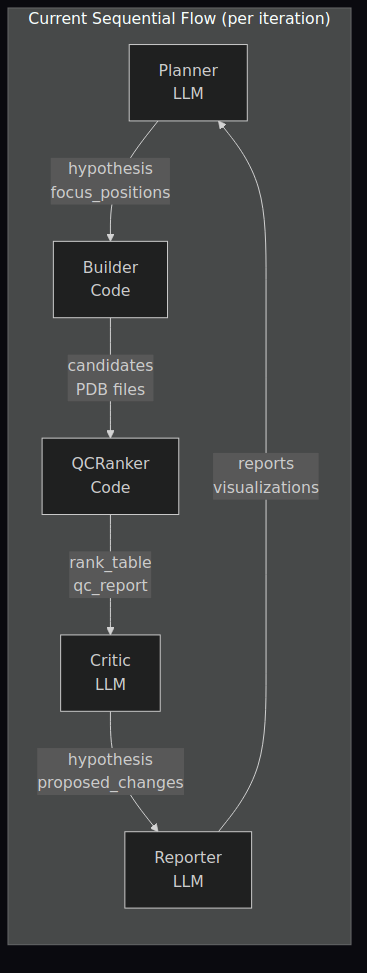
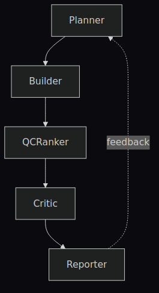
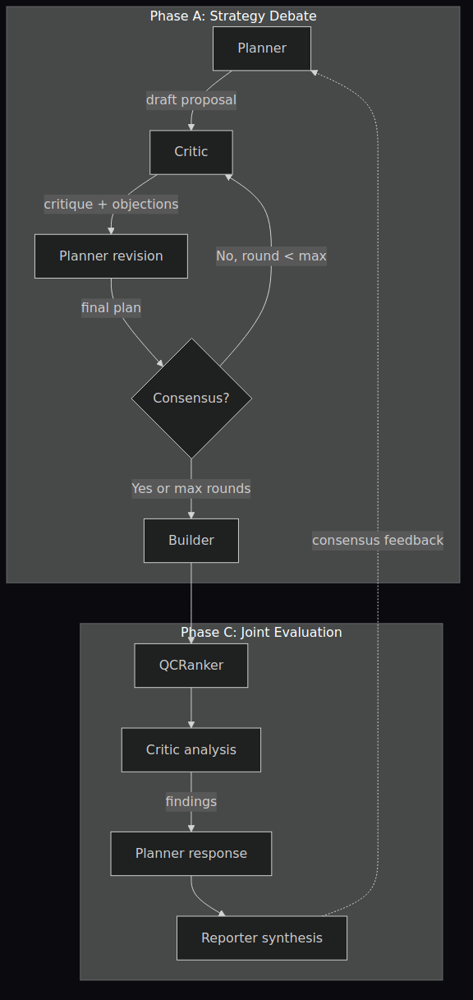
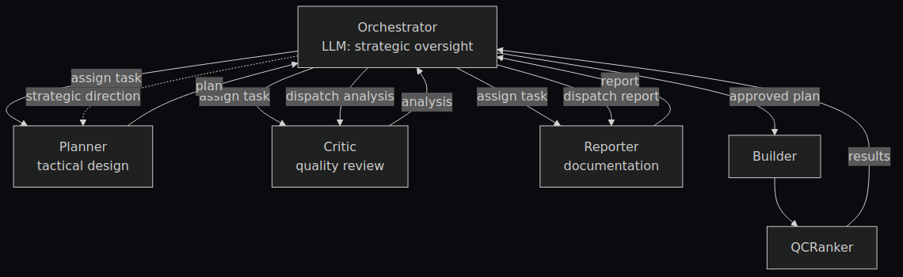
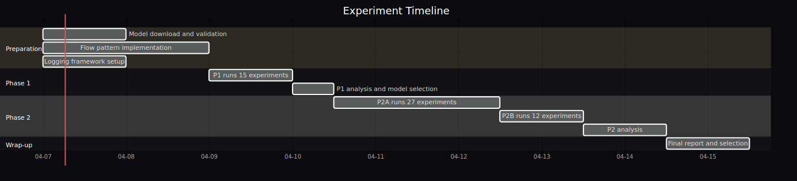
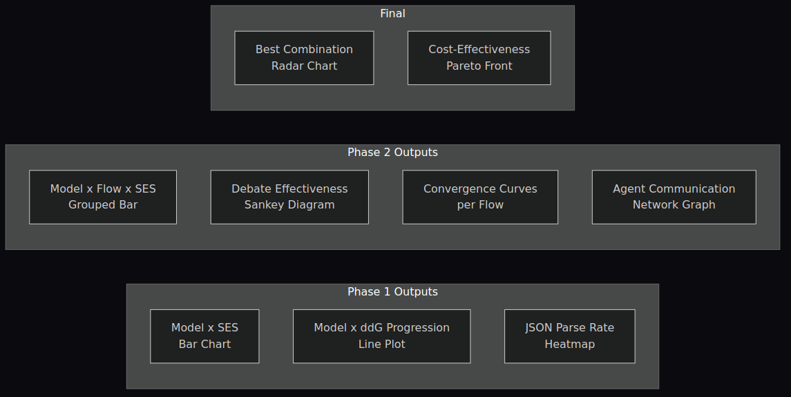

# Agent Flow Optimization for SSTR2 Peptide Binder Screening

## Experiment Proposal v1.0

**Date**: 2026-04-07  
**Authors**: DongJu Kim, AI Co-Scientist  
**Status**: Draft — Under Review

---

## 1. Executive Summary

SSTR2 타겟 방사성의약품 후보 스크리닝 AI 파이프라인에서,  
**LLM 에이전트의 모델 선택**과 **에이전트 간 상호작용 패턴**이  
스크리닝 성능에 미치는 영향을 정량적으로 비교한다.

최종 목표: **최적 모델 × 최적 플로우 조합**을 확정하여 production 파이프라인에 적용.

---

## 2. Background

### 2.1 Current System



| Agent | Type | Role |
|-------|------|------|
| Planner | LLM | Mutation strategy design, focus position selection |
| Builder | Code | PyRosetta FlexPepDock execution, PDB generation |
| QCRanker | Code | Gate filtering (ddG, clash), ranking |
| Critic | LLM | Failure analysis, parameter adjustment proposals |
| Reporter | LLM | Iteration summary, visualization generation |

### 2.2 Problem Statement

- Planner가 제안한 전략의 **사전 검증이 없음** — 실행 후에야 실패를 알 수 있음
- 에이전트 간 **단방향 정보 전달** — 다각적 관점 결여
- 모델 선택이 **경험적** — Qwen3.5-27B를 기본으로 사용하나 정량 비교 없음

---

## 3. Experiment Design

### 3.1 Independent Variables

#### Variable A: LLM Model (5 levels)

| ID | Model | Size | Key Strength | VRAM (FP16) |
|----|-------|------|-------------|-------------|
| M1 | Qwen2.5-7B-Instruct | 7B | Lightweight baseline | ~15 GB |
| M2 | Qwen3.5-27B | 27B | JSON-native, current default | ~52 GB |
| M3 | Gemma-3-27B-IT | 27B | Google, multilingual reasoning | ~54 GB |
| M4 | DeepSeek-R1-Distill-Qwen-32B | 32B | Chain-of-Thought reasoning | ~62 GB |
| M5 | GLM-Z1-32B | 32B | Reasoning, tool-use | ~61 GB |

> All models served via vLLM on GPU 3 (H100 NVL 96GB), swapped between experiments.

#### Variable B: Agent Flow Pattern (3 levels)

**B1. Sequential** (current baseline)



- LLM calls per iteration: **3** (Planner + Critic + Reporter)
- Information flow: Unidirectional

**B2. Collaborative** (debate-based)



- LLM calls per iteration: **5-7** (varies by debate rounds)
- Sub-variable: `debate_max_rounds` ∈ {2, 3}
- Key addition: **Pre-execution strategy validation**

**B3. Hierarchical** (orchestrator-managed)



- LLM calls per iteration: **4-6** (Orchestrator + delegated agents)
- Sub-variable: `orchestrator_model` ∈ {same_model, different_model}
- Key addition: **Central context management, conflict resolution**

### 3.2 Dependent Variable: Screening Effectiveness Score (SES)

```
SES = (Hit_Rate × 0.30) + (Improvement × 0.25) + (Efficiency × 0.20)
    + (Diversity × 0.15) + (Robustness × 0.10)
```

| Component | Definition | Formula | Range |
|-----------|-----------|---------|-------|
| **Hit Rate** | % candidates passing ALL gates | `n_pass / n_total` | 0.0 – 1.0 |
| **Improvement** | ddG improvement over baseline | `(baseline - best) / \|baseline\|` | 0.0 – 1.0+ |
| **Efficiency** | Speed of finding first hit | `1 - (first_hit_iter - 1) / max_iter` | 0.0 – 1.0 |
| **Diversity** | Structural diversity of hits | `n_clusters / n_hits` (capped at 1.0) | 0.0 – 1.0 |
| **Robustness** | Consistency across repeats | `1 - CV(best_ddg across repeats)` | 0.0 – 1.0 |

**Gate Criteria** (all must pass):

| Gate | Threshold | Rationale |
|------|-----------|-----------|
| ddG | ≤ -5.0 kcal/mol | Meaningful binding improvement |
| FWKT conservation | 100% (F7-W8-K9-T10) | Pharmacophore preservation |
| Clash score | ≤ 10 | Structural feasibility |

### 3.3 Controlled Variables

| Parameter | Value | Notes |
|-----------|-------|-------|
| Template PDB | `fold_test1_model_0.pdb` | SSTR2-SST14 complex |
| Baseline ddG | -48.438 kcal/mol | FlexPepDock refined wild-type |
| Original sequence | AGCKNFFWKTFTSC | SST-14 (14aa, Cys3-Cys14 SS bond) |
| LLM temperature | 0.3 | Fixed for reproducibility |
| seed_base | Per-experiment fixed | Same seed across flow comparisons |
| conda_env | bio-tools | PyRosetta + FlexPepDock |
| FlexPepDock protocol | flexpep_refine | Standard refinement |
| vLLM settings | max_model_len=4096, gpu_util=0.9 | Consistent inference |

---

## 4. Experiment Plan

### 4.1 Phase 1: Model Screening

**Goal**: Identify top-performing LLM models using the Sequential flow as baseline.

| Parameter | Value |
|-----------|-------|
| Flow pattern | Sequential (fixed) |
| n_candidates | 4 |
| max_iterations | 3 |
| repeats | 3 |
| Estimated time per run | ~15 min |

```
Phase 1 Matrix (15 runs):

           Repeat-1    Repeat-2    Repeat-3
M1 (7B)     P1-01       P1-02       P1-03
M2 (27B-Q)  P1-04       P1-05       P1-06
M3 (27B-G)  P1-07       P1-08       P1-09
M4 (32B-DS) P1-10       P1-11       P1-12
M5 (32B-GL) P1-13       P1-14       P1-15
```

**Total Phase 1**: 15 runs × 15 min = **~4 hours**

**Selection Criteria**: Top-3 models by mean SES → advance to Phase 2.

### 4.2 Phase 2: Flow Pattern Deep Comparison

**Goal**: Find optimal model × flow combination with extended experiment settings.

| Parameter | Value |
|-----------|-------|
| Models | Top-3 from Phase 1 |
| n_candidates | 8 |
| max_iterations | 5 |
| repeats | 3 |
| Estimated time per run | ~50 min |

#### Phase 2A: Core Comparison

```
Phase 2A Matrix (27 runs):

              Sequential  Collaborative  Hierarchical
Top-1 model    P2-01~03    P2-04~06       P2-07~09
Top-2 model    P2-10~12    P2-13~15       P2-16~18
Top-3 model    P2-19~21    P2-22~24       P2-25~27
```

**Total Phase 2A**: 27 runs × 50 min = **~22.5 hours**

#### Phase 2B: Sub-variable Exploration

Best-performing model from Phase 2A에 대해:

```
Phase 2B: Collaborative debate rounds (6 runs)
  debate_max_rounds=2  ×  3 repeats = P2B-01~03
  debate_max_rounds=3  ×  3 repeats = P2B-04~06

Phase 2B: Hierarchical orchestrator model (6 runs)
  same_model_orchestrator   ×  3 repeats = P2B-07~09
  cross_model_orchestrator  ×  3 repeats = P2B-10~12
```

**Total Phase 2B**: 12 runs × 50 min = **~10 hours**

### 4.3 Overall Timeline



---

## 5. Logging Specification

### 5.1 Per-Experiment Log Structure

```
experiments/
  exp_{id}/
    config.json              # Experiment configuration
    agent_logs/
      iter_{N}_planner.json  # Full prompt + response + parsed output
      iter_{N}_critic.json
      iter_{N}_reporter.json
      iter_{N}_debate.json   # Collaborative only: all rounds
      iter_{N}_orchestrator.json  # Hierarchical only
    candidates/
      iter_{N}_candidates.json   # All candidates with scores
    metrics/
      per_iteration.json     # ddG progression, hit counts
      final_summary.json     # SES components + final score
    artifacts/
      *.pdb                  # Structure files
      *.json                 # Dashboard data
```

### 5.2 Agent Log Schema

```json
{
  "experiment_id": "P1-04",
  "model": "Qwen3.5-27B",
  "flow": "sequential",
  "iteration": 2,
  "agent": "planner",
  
  "input": {
    "prompt_template": "planner_v1",
    "prompt_full": "You are an expert peptide engineer...",
    "context": {
      "prev_best_ddg": -52.3,
      "critic_feedback": "Position 5 mutations consistently fail..."
    }
  },
  
  "output": {
    "raw_response": "Based on the critic's analysis...",
    "parsed": {
      "hypothesis": "Focus on position 2,4 hydrophobic mutations",
      "focus_positions": [2, 4],
      "mutations": ["A2V", "K4L"]
    },
    "parse_success": true
  },
  
  "timing": {
    "prompt_tokens": 1240,
    "completion_tokens": 380,
    "latency_ms": 2340,
    "total_tokens": 1620
  }
}
```

### 5.3 Debate Log Schema (Collaborative only)

```json
{
  "experiment_id": "P2-05",
  "iteration": 2,
  "debate": {
    "max_rounds": 2,
    "actual_rounds": 2,
    "outcome": "revised",
    
    "rounds": [
      {
        "round": 1,
        "planner_proposal": {
          "hypothesis": "Mutate pos 1,2 to hydrophobic...",
          "focus_positions": [1, 2],
          "confidence": 0.7
        },
        "critic_rebuttal": {
          "objections": ["Pos 1 is Ala, already hydrophobic", "Pos 2 Gly→Val may clash"],
          "severity": "moderate",
          "suggested_alternative": "Consider pos 4,12 instead"
        },
        "resolution": "rejected"
      },
      {
        "round": 2,
        "planner_proposal": {
          "hypothesis": "Revised: pos 4,12 polar→hydrophobic...",
          "focus_positions": [4, 12],
          "confidence": 0.85
        },
        "critic_rebuttal": {
          "objections": [],
          "severity": "none",
          "approval": true
        },
        "resolution": "accepted"
      }
    ]
  }
}
```

---

## 6. Analysis Plan

### 6.1 Statistical Tests

| Comparison | Test | Rationale |
|-----------|------|-----------|
| Phase 1: 5 models (SES) | Kruskal-Wallis + Dunn's post-hoc | Non-parametric, small n (3 repeats) |
| Phase 2: 3 flows (SES) | Friedman test (paired across models) | Repeated measures, non-parametric |
| Sub-variables | Wilcoxon signed-rank | Paired comparison (2 vs 3 rounds) |

### 6.2 Visualization Outputs



### 6.3 Key Analysis Questions

| # | Question | How to Answer |
|---|----------|---------------|
| Q1 | Does model size correlate with SES? | Scatter: params vs mean SES |
| Q2 | Does Collaborative debate reduce bad strategies? | Compare % of iterations with ddG regression |
| Q3 | Does Hierarchical maintain better global direction? | Compare ddG variance across iterations |
| Q4 | Is the extra LLM cost justified? | Cost-effectiveness: SES / total_LLM_tokens |
| Q5 | Which agent benefits most from better models? | Per-agent metric breakdown |
| Q6 | Do debate logs reveal systematic failure patterns? | Qualitative coding of rejection reasons |

---

## 7. Implementation Requirements

### 7.1 New Code Components

| Component | Description | Effort |
|-----------|------------|--------|
| `collaborative_runner.py` | Debate loop: Planner↔Critic pre-execution | 1 day |
| `hierarchical_runner.py` | Orchestrator agent + delegation logic | 2 days |
| `experiment_harness.py` | Automated experiment runner with config matrix | 1 day |
| `agent_logger.py` | Structured logging for all agent interactions | 0.5 day |
| `ses_calculator.py` | SES metric computation from experiment results | 0.5 day |
| `analysis_notebook.ipynb` | Statistical analysis + visualization | 1 day |

### 7.2 Infrastructure

| Resource | Current | Required |
|----------|---------|----------|
| GPU 3 | vLLM Qwen3.5-27B | vLLM with model swap capability |
| GPU 2 | Available | FlexPepDock (CPU) — no GPU needed |
| Disk | ~200 GB free | ~50 GB for experiment logs + PDBs |
| RAM | Sufficient | Sufficient |

### 7.3 Model Swap Script

```bash
# vLLM model hot-swap between experiments
# GPU 3 serves one model at a time

swap_model() {
    local MODEL=$1
    pkill -f "vllm.entrypoints"
    sleep 5
    python -m vllm.entrypoints.openai.api_server \
        --model "$MODEL" --port 8002 \
        --trust-remote-code --max-model-len 4096 \
        --gpu-memory-utilization 0.9 &
    # Wait for health check
    for i in {1..30}; do
        curl -s http://localhost:8002/v1/models && break
        sleep 2
    done
}
```

---

## 8. Methodological Review Notes

> 과학 방법론 리뷰어(reviewer-science)의 사전 검토 결과:

| # | Issue | Severity | Resolution |
|---|-------|----------|------------|
| 1 | **SES 가중치가 주관적** — AHP나 민감도 분석 없이 임의 배분 | High | Phase 2 이후 SES 가중치 민감도 분석 추가. 추가로 비가중 Pareto front도 함께 보고 |
| 2 | **ddG 단위 불일치** — Rosetta Energy Units ≠ kcal/mol | High | 제안서 전체에서 ddG 단위를 REU로 명시. Hit 기준도 Rosetta REU 기준으로 재정의 |
| 3 | **Diversity 지표 미정의** — 서열/구조/화학공간 중 어떤 다양성인지 | Medium | Hamming distance 기반 서열 다양성 + FoldMason 구조 클러스터링 병행 |
| 4 | **FWKT 100% hard constraint 과도** — 탐색 공간 축소 | Medium | Phase 1에서는 hard, Phase 2에서 FW 필수 + KT soft penalty 변형도 탐색 |
| 5 | **n=3 반복 통계 검정력 부족** — 최소 n=5 이상 필요 | Medium | Phase 1은 n=3 (스크리닝), Phase 2 최종 비교는 n=5 + bootstrap CI 95% |
| 6 | **Clash score 단위 불명확** | Low | PyRosetta `fa_rep` score로 명시. threshold는 REU 10.0 |

---

## 9. Risk & Mitigation

| Risk | Impact | Mitigation |
|------|--------|-----------|
| FlexPepDock stochasticity | ddG varies across runs | 3 repeats + validation_n_trials=3 for final |
| LLM JSON parse failure | Experiment stalls | Fallback to rule-based (already implemented) |
| Model fails to load on GPU 3 | Experiment blocked | Pre-validate all models before Phase 1 |
| Gemma gated access | Model unavailable | HF login + license acceptance, or substitute |
| Collaborative deadlock | Debate never converges | max_rounds=2 hard limit |
| Experiment takes too long | Schedule overrun | Phase 1 light config (4 cand, 3 iter) |

---

## 10. Success Criteria

실험 완료 후 다음을 확정할 수 있어야 한다:

1. **최적 모델**: SES 기준 통계적으로 유의한 우위를 보이는 모델
2. **최적 플로우**: Sequential/Collaborative/Hierarchical 중 SES-cost 최적
3. **운영 파라미터**: debate rounds, orchestrator 모델 등 세부 설정
4. **근거 로그**: 모든 에이전트 대화/토론 기록으로 정성적 분석 가능

---

## Appendix A: Full Experiment Matrix

```
Phase 1 (15 runs):
  P1-{01-03}: M1(Qwen-7B)    × Sequential × R{1-3}
  P1-{04-06}: M2(Qwen-27B)   × Sequential × R{1-3}
  P1-{07-09}: M3(Gemma-27B)  × Sequential × R{1-3}
  P1-{10-12}: M4(DeepSeek-32B)× Sequential × R{1-3}
  P1-{13-15}: M5(GLM-32B)    × Sequential × R{1-3}

Phase 2A (27 runs):
  P2-{01-03}: Top1 × Sequential     × R{1-3}
  P2-{04-06}: Top1 × Collaborative  × R{1-3}
  P2-{07-09}: Top1 × Hierarchical   × R{1-3}
  P2-{10-12}: Top2 × Sequential     × R{1-3}
  P2-{13-15}: Top2 × Collaborative  × R{1-3}
  P2-{16-18}: Top2 × Hierarchical   × R{1-3}
  P2-{19-21}: Top3 × Sequential     × R{1-3}
  P2-{22-24}: Top3 × Collaborative  × R{1-3}
  P2-{25-27}: Top3 × Hierarchical   × R{1-3}

Phase 2B (12 runs):
  P2B-{01-03}: Best × Collaborative(rounds=2) × R{1-3}
  P2B-{04-06}: Best × Collaborative(rounds=3) × R{1-3}
  P2B-{07-09}: Best × Hierarchical(same_model) × R{1-3}
  P2B-{10-12}: Best × Hierarchical(cross_model) × R{1-3}

TOTAL: 54 experiments
```

## Appendix B: Estimated Compute Budget

| Phase | Runs | Time/Run | Total Time | LLM Calls | FlexPepDock Runs |
|-------|------|----------|-----------|-----------|-----------------|
| Phase 1 | 15 | ~15 min | ~4 hr | ~135 | ~180 |
| Phase 2A | 27 | ~50 min | ~22.5 hr | ~405+ | ~1,080 |
| Phase 2B | 12 | ~50 min | ~10 hr | ~180+ | ~480 |
| **Total** | **54** | — | **~36.5 hr** | **~720+** | **~1,740** |

> Wall-clock time can be reduced by running FlexPepDock-heavy Phase 2
> experiments overnight (CPU-bound, no GPU 3 conflict during model swap).
