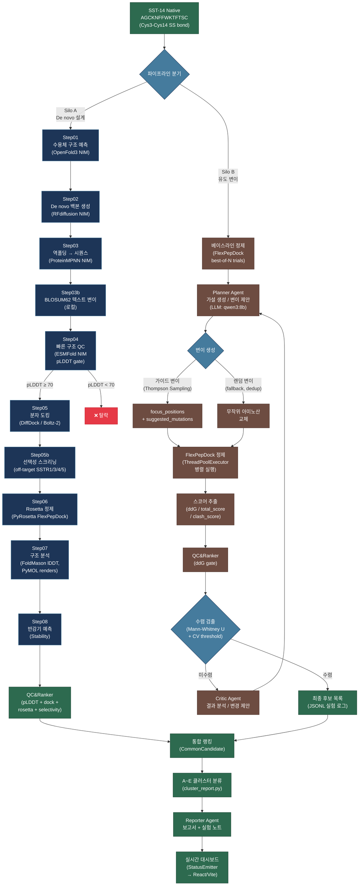

```mermaid
graph TD
    REF["SST-14 Native\nAGCKNFFWKTFTSC\n(Cys3-Cys14 SS bond)"]
    REF --> SPLIT{파이프라인 분기}

    %% ── Silo A ──────────────────────────────────────────────
    SPLIT -->|"Silo A\nDe novo 설계"| A01["Step01\n수용체 구조 예측\n(OpenFold3 NIM)"]
    A01 --> A02["Step02\nDe novo 백본 생성\n(RFdiffusion NIM)"]
    A02 --> A03["Step03\n역폴딩 → 시퀀스\n(ProteinMPNN NIM)"]
    A03 --> A03B["Step03b\nBLOSUM62 텍스트 변이\n(로컬)"]
    A03B --> A04["Step04\n빠른 구조 QC\n(ESMFold NIM\npLDDT gate)"]
    A04 -->|"pLDDT ≥ 70"| A05["Step05\n분자 도킹\n(DiffDock / Boltz-2)"]
    A04 -->|"pLDDT < 70"| DROP_A["❌ 탈락"]
    A05 --> A05B["Step05b\n선택성 스크리닝\n(off-target SSTR1/3/4/5)"]
    A05B --> A06["Step06\nRosetta 정제\n(PyRosetta FlexPepDock)"]
    A06 --> A07["Step07\n구조 분석\n(FoldMason lDDT,\nPyMOL renders)"]
    A07 --> A08["Step08\n반감기 예측\n(Stability)"]
    A08 --> RANK_A["QC&Ranker\n(pLDDT + dock +\nrosetta + selectivity)"]

    %% ── Silo B ──────────────────────────────────────────────
    SPLIT -->|"Silo B\n유도 변이"| B_BASE["베이스라인 정제\n(FlexPepDock\nbest-of-N trials)"]
    B_BASE --> B_PLAN["Planner Agent\n가설 생성 / 변이 제안\n(LLM: qwen3:8b)"]
    B_PLAN --> B_MUT{"변이 생성"}
    B_MUT -->|"가이드 변이\n(Thompson Sampling)"| B_GUIDED["focus_positions\n+ suggested_mutations"]
    B_MUT -->|"랜덤 변이\n(fallback, dedup)"| B_RAND["무작위 아미노산\n교체"]
    B_GUIDED --> B_DOCK["FlexPepDock 정제\n(ThreadPoolExecutor\n병렬 실행)"]
    B_RAND --> B_DOCK
    B_DOCK --> B_SCORE["스코어 추출\n(ddG / total_score\n/ clash_score)"]
    B_SCORE --> B_QC["QC&Ranker\n(ddG gate)"]
    B_QC --> B_CONV{"수렴 검출\n(Mann-Whitney U\n+ CV threshold)"}
    B_CONV -->|"미수렴"| B_CRIT["Critic Agent\n결과 분석 / 변경 제안"]
    B_CRIT --> B_PLAN
    B_CONV -->|"수렴"| RANK_B["최종 후보 목록\n(JSONL 실험 로그)"]

    %% ── 공유 컴포넌트 ──────────────────────────────────────
    RANK_A --> MERGE["통합 랭킹\n(CommonCandidate)"]
    RANK_B --> MERGE
    MERGE --> CLUSTER["A~E 클러스터 분류\n(cluster_report.py)"]
    CLUSTER --> REPORT["Reporter Agent\n보고서 + 실험 노트"]
    REPORT --> DASH["실시간 대시보드\n(StatusEmitter\n→ React/Vite)"]

    %% ── 스타일 ──────────────────────────────────────────────
    style REF fill:#2d6a4f,color:#fff,stroke:#1b4332
    style SPLIT fill:#457b9d,color:#fff,stroke:#1d3557
    style A01 fill:#1d3557,color:#fff,stroke:#457b9d
    style A02 fill:#1d3557,color:#fff,stroke:#457b9d
    style A03 fill:#1d3557,color:#fff,stroke:#457b9d
    style A03B fill:#1d3557,color:#fff,stroke:#457b9d
    style A04 fill:#1d3557,color:#fff,stroke:#457b9d
    style A05 fill:#1d3557,color:#fff,stroke:#457b9d
    style A05B fill:#1d3557,color:#fff,stroke:#457b9d
    style A06 fill:#1d3557,color:#fff,stroke:#457b9d
    style A07 fill:#1d3557,color:#fff,stroke:#457b9d
    style A08 fill:#1d3557,color:#fff,stroke:#457b9d
    style DROP_A fill:#e63946,color:#fff,stroke:#c1121f
    style B_BASE fill:#6d4c41,color:#fff,stroke:#4e342e
    style B_PLAN fill:#6d4c41,color:#fff,stroke:#4e342e
    style B_MUT fill:#457b9d,color:#fff,stroke:#1d3557
    style B_GUIDED fill:#6d4c41,color:#fff,stroke:#4e342e
    style B_RAND fill:#6d4c41,color:#fff,stroke:#4e342e
    style B_DOCK fill:#6d4c41,color:#fff,stroke:#4e342e
    style B_SCORE fill:#6d4c41,color:#fff,stroke:#4e342e
    style B_QC fill:#6d4c41,color:#fff,stroke:#4e342e
    style B_CONV fill:#457b9d,color:#fff,stroke:#1d3557
    style B_CRIT fill:#6d4c41,color:#fff,stroke:#4e342e
    style RANK_A fill:#2d6a4f,color:#fff,stroke:#1b4332
    style RANK_B fill:#2d6a4f,color:#fff,stroke:#1b4332
    style MERGE fill:#2d6a4f,color:#fff,stroke:#1b4332
    style CLUSTER fill:#2d6a4f,color:#fff,stroke:#1b4332
    style REPORT fill:#2d6a4f,color:#fff,stroke:#1b4332
    style DASH fill:#2d6a4f,color:#fff,stroke:#1b4332
```
