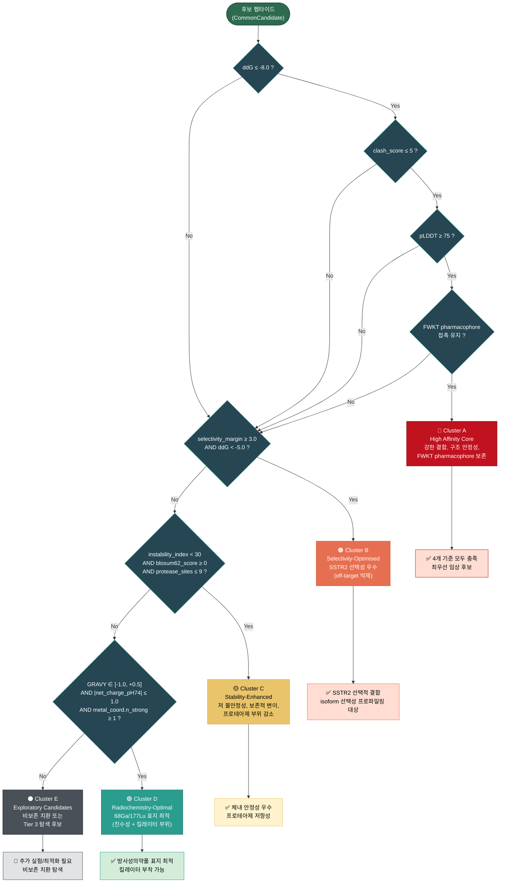

```mermaid
graph TD
    START(["후보 펩타이드\n(CommonCandidate)"])

    %% ── Cluster A ──────────────────────────────────────────
    START --> A1{"ddG ≤ -8.0 ?"}
    A1 -->|No| B1{"selectivity_margin ≥ 3.0\nAND ddG < -5.0 ?"}
    A1 -->|Yes| A2{"clash_score ≤ 5 ?"}
    A2 -->|No| B1
    A2 -->|Yes| A3{"pLDDT ≥ 75 ?"}
    A3 -->|No| B1
    A3 -->|Yes| A4{"FWKT pharmacophore\n접촉 유지 ?"}
    A4 -->|No| B1
    A4 -->|Yes| CLUS_A["🔴 Cluster A\nHigh Affinity Core\n강한 결합, 구조 안정성,\nFWKT pharmacophore 보존"]

    %% ── Cluster B ──────────────────────────────────────────
    B1 -->|No| C1{"instability_index < 30\nAND blosum62_score ≥ 0\nAND protease_sites ≤ 9 ?"}
    B1 -->|Yes| CLUS_B["🟠 Cluster B\nSelectivity-Optimised\nSSTR2 선택성 우수\n(off-target 억제)"]

    %% ── Cluster C ──────────────────────────────────────────
    C1 -->|No| D1{"GRAVY ∈ [-1.0, +0.5]\nAND |net_charge_pH74| ≤ 1.0\nAND metal_coord.n_strong ≥ 1 ?"}
    C1 -->|Yes| CLUS_C["🟡 Cluster C\nStability-Enhanced\n저 불안정성, 보존적 변이,\n프로테아제 부위 감소"]

    %% ── Cluster D ──────────────────────────────────────────
    D1 -->|No| CLUS_E["⚫ Cluster E\nExploratory Candidates\n비보존 치환 또는\nTier 3 탐색 후보"]
    D1 -->|Yes| CLUS_D["🟢 Cluster D\nRadiochemistry-Optimal\n68Ga/177Lu 표지 최적\n(친수성 + 킬레이터 부위)"]

    %% ── 클러스터 설명 박스 ──────────────────────────────────
    CLUS_A --> NOTE_A["✅ 4개 기준 모두 충족\n최우선 임상 후보"]
    CLUS_B --> NOTE_B["✅ SSTR2 선택적 결합\nisoform 선택성 프로파일링 대상"]
    CLUS_C --> NOTE_C["✅ 체내 안정성 우수\n프로테아제 저항성"]
    CLUS_D --> NOTE_D["✅ 방사성의약품 표지 최적\n킬레이터 부착 가능"]
    CLUS_E --> NOTE_E["🔄 추가 실험/최적화 필요\n비보존 치환 탐색"]

    %% ── 스타일 ──────────────────────────────────────────────
    style START fill:#2d6a4f,color:#fff,stroke:#1b4332
    style A1 fill:#264653,color:#fff,stroke:#2a9d8f
    style A2 fill:#264653,color:#fff,stroke:#2a9d8f
    style A3 fill:#264653,color:#fff,stroke:#2a9d8f
    style A4 fill:#264653,color:#fff,stroke:#2a9d8f
    style B1 fill:#264653,color:#fff,stroke:#2a9d8f
    style C1 fill:#264653,color:#fff,stroke:#2a9d8f
    style D1 fill:#264653,color:#fff,stroke:#2a9d8f
    style CLUS_A fill:#c1121f,color:#fff,stroke:#780000
    style CLUS_B fill:#e76f51,color:#fff,stroke:#c04c2e
    style CLUS_C fill:#e9c46a,color:#000,stroke:#c9a227
    style CLUS_D fill:#2a9d8f,color:#fff,stroke:#1b6b64
    style CLUS_E fill:#495057,color:#fff,stroke:#212529
    style NOTE_A fill:#ffddd2,color:#000,stroke:#c1121f
    style NOTE_B fill:#ffddd2,color:#000,stroke:#e76f51
    style NOTE_C fill:#fff3cd,color:#000,stroke:#e9c46a
    style NOTE_D fill:#d4edda,color:#000,stroke:#2a9d8f
    style NOTE_E fill:#e2e3e5,color:#000,stroke:#495057
```
