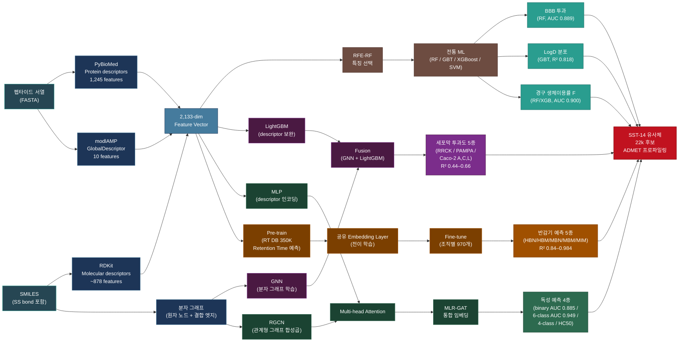

```mermaid
graph LR
    %% ── 입력 ─────────────────────────────────────────────────
    INPUT_SEQ["펩타이드 서열\n(FASTA)"]
    INPUT_SMILES["SMILES\n(SS bond 포함)"]

    %% ── 피처 추출 ─────────────────────────────────────────────
    INPUT_SEQ --> PBIOMD["PyBioMed\nProtein descriptors\n1,245 features"]
    INPUT_SEQ --> MODLAMP["modlAMP\nGlobalDescriptor\n10 features"]
    INPUT_SMILES --> RDKIT["RDKit\nMolecular descriptors\n~878 features"]
    INPUT_SMILES --> GRAPH["분자 그래프\n(원자 노드 + 결합 엣지)"]

    %% ── Feature 통합 ──────────────────────────────────────────
    PBIOMD --> FEAT["2,133-dim\nFeature Vector"]
    MODLAMP --> FEAT
    RDKIT --> FEAT

    %% ── 전통 ML 경로 ──────────────────────────────────────────
    FEAT --> RFE["RFE-RF\n특징 선택"]
    RFE --> TRAD_ML["전통 ML\n(RF / GBT / XGBoost / SVM)"]

    %% ── GNN 경로 ──────────────────────────────────────────────
    GRAPH --> GNN["GNN\n(분자 그래프 학습)"]
    FEAT --> LGBM["LightGBM\n(descriptor 보완)"]
    GNN --> PERM_FUSION["Fusion\n(GNN + LightGBM)"]
    LGBM --> PERM_FUSION

    %% ── MLR-GAT 경로 ─────────────────────────────────────────
    GRAPH --> RGCN["RGCN\n(관계형 그래프 합성곱)"]
    FEAT --> MLP["MLP\n(descriptor 인코딩)"]
    RGCN --> ATTN["Multi-head Attention"]
    MLP --> ATTN
    ATTN --> MLRGAT["MLR-GAT\n통합 임베딩"]

    %% ── Transfer Learning 경로 ────────────────────────────────
    FEAT --> PRETRAIN["Pre-train\n(RT DB 350K\nRetention Time 예측)"]
    PRETRAIN --> EMBED["공유 Embedding Layer\n(전이 학습)"]
    EMBED --> FINETUNE["Fine-tune\n(조직별 970개)"]

    %% ── 예측 출력 ─────────────────────────────────────────────
    TRAD_ML --> OUT_BBB["BBB 투과\n(RF, AUC 0.889)"]
    TRAD_ML --> OUT_LOGD["LogD 분포\n(GBT, R² 0.818)"]
    TRAD_ML --> OUT_F["경구 생체이용률 F\n(RF/XGB, AUC 0.900)"]

    PERM_FUSION --> OUT_PERM["세포막 투과도 5종\n(RRCK / PAMPA /\nCaco-2 A,C,L)\nR² 0.44–0.66"]

    MLRGAT --> OUT_TOX["독성 예측 4종\n(binary AUC 0.885 /\n6-class AUC 0.949 /\n4-class / HC50)"]

    FINETUNE --> OUT_HL["반감기 예측 5종\n(HBN/HBM/MBN/MBM/MIM)\nR² 0.84–0.984"]

    %% ── SST-14 적용 ───────────────────────────────────────────
    OUT_BBB --> APPLY["SST-14 유사체\n22k 후보\nADMET 프로파일링"]
    OUT_LOGD --> APPLY
    OUT_F --> APPLY
    OUT_PERM --> APPLY
    OUT_TOX --> APPLY
    OUT_HL --> APPLY

    %% ── 스타일 ──────────────────────────────────────────────
    style INPUT_SEQ fill:#264653,color:#fff,stroke:#2a9d8f
    style INPUT_SMILES fill:#264653,color:#fff,stroke:#2a9d8f
    style PBIOMD fill:#1d3557,color:#fff,stroke:#457b9d
    style MODLAMP fill:#1d3557,color:#fff,stroke:#457b9d
    style RDKIT fill:#1d3557,color:#fff,stroke:#457b9d
    style GRAPH fill:#1d3557,color:#fff,stroke:#457b9d
    style FEAT fill:#457b9d,color:#fff,stroke:#1d3557
    style RFE fill:#6d4c41,color:#fff,stroke:#4e342e
    style TRAD_ML fill:#6d4c41,color:#fff,stroke:#4e342e
    style GNN fill:#4a1942,color:#fff,stroke:#7b2d8b
    style LGBM fill:#4a1942,color:#fff,stroke:#7b2d8b
    style PERM_FUSION fill:#4a1942,color:#fff,stroke:#7b2d8b
    style RGCN fill:#1b4332,color:#fff,stroke:#2d6a4f
    style MLP fill:#1b4332,color:#fff,stroke:#2d6a4f
    style ATTN fill:#1b4332,color:#fff,stroke:#2d6a4f
    style MLRGAT fill:#1b4332,color:#fff,stroke:#2d6a4f
    style PRETRAIN fill:#7b3f00,color:#fff,stroke:#a05000
    style EMBED fill:#7b3f00,color:#fff,stroke:#a05000
    style FINETUNE fill:#7b3f00,color:#fff,stroke:#a05000
    style OUT_BBB fill:#2a9d8f,color:#fff,stroke:#1b6b64
    style OUT_LOGD fill:#2a9d8f,color:#fff,stroke:#1b6b64
    style OUT_F fill:#2a9d8f,color:#fff,stroke:#1b6b64
    style OUT_PERM fill:#7b2d8b,color:#fff,stroke:#4a1942
    style OUT_TOX fill:#2d6a4f,color:#fff,stroke:#1b4332
    style OUT_HL fill:#a05000,color:#fff,stroke:#7b3f00
    style APPLY fill:#c1121f,color:#fff,stroke:#780000
```
