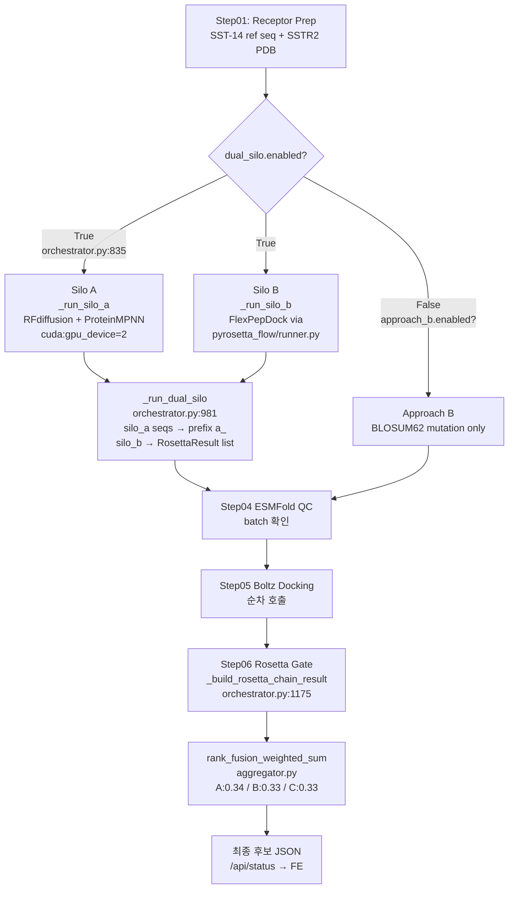

# Dual-silo + Action List — 2026-06-01

> 작성: researcher | 근거 파일: 코드 직접 grep + EOD/보고서 파일 직접 확인  
> 추측·단정 없음. 확인 불가 항목은 명시

---

## 1. Dual-silo 핸드오프 분석

### 식별 결과

- **분기 지점**: `pipeline_local/orchestrator.py:835` — `self.config.get("dual_silo", {}).get("enabled", False)` 가 `True`일 때 `_run_silo_a()` + `_run_silo_b()` 순차 호출
- **합류 지점**: `pipeline_local/orchestrator.py:853` — `self._run_dual_silo(silo_a_seqs, silo_b_rosetta_results)` → `BranchOutputs(dual_mode=True)`; 이후 Step04(ESMFold QC) → Step05(Boltz Docking) → Step06(Rosetta gate) 에서 두 silo 결과 병합
- **집계(fan-in)**: `pipeline_local/orchestrator.py:1175~1254` `_build_rosetta_chain_result()` — Silo A 후보는 `source="silo_a"`, Silo B 후보는 `step06_rosetta.apply_rosetta_gate(silo_b_rosetta_results)` 후 합산
- **최종 랭킹**: `pipelines/orchestration/aggregator.py:rank_fusion_weighted_sum()` — `UnifiedCandidate.raw_scores["unified_score"]` 기준 per-silo weight 적용 후 정렬 (policy.py weights: A=0.34, B=0.33, C=0.33)

### 통합 흐름 다이어그램 (Mermaid)



### Silo A vs Silo B 비교표

| 항목 | Silo A | Silo B |
|------|--------|--------|
| **역할** | de novo 백본 설계 + 서열 설계 | PyRosetta mutation + FlexPepDock |
| **도구** | RFdiffusion (Step02) + ProteinMPNN (Step03) | `pyrosetta_flow/runner.py` `run_pyrosetta_agentic_mutdock_flow()` |
| **진입 코드** | `orchestrator.py:1395 _run_silo_a()` | `orchestrator.py:1456 _run_silo_b()` |
| **산출물** | `List[SequenceEntry]` (seq_id 접두어 `a_`) | `List[RosettaResult-compatible dict]` (seq_id 접두어 `b_`) |
| **GPU 할당** | `cuda:{gpu_device}` 기본 GPU 2 (`silo_a.gpu_device` 설정) | CPU 기반 PyRosetta (conda_env=bio-tools 기본) |
| **LLM 사용** | Planner/Critic → vLLM `:8002` (Connection refused 시 rule-based fallback) | FlowConfig `llm_model_override` 전달 (`orchestrator.py:1514`) |
| **실행 방식** | 순차 (step02→step03 동기) | 자체 루프 내부 처리 (max_iterations=1, orchestrator가 루프 관리) |
| **평가 지표** | ESMFold pLDDT + Boltz ipTM + Rosetta gate | FlexPepDock ddG + clashScore + totalScore (자체 계산 완료 후 gate만 적용) |
| **현재 실행 상태** | RFdiffusion conda env 존재 확인; Dual 활성화(`--dual` 플래그 필요) 시 정상 실행 | pyrosetta_flow 독립 실행 검증됨 (5/27 phase2 smoke §4.B) |
| **FE 연동** | `SiloAPage.tsx` → `POST /api/v1/silo-a/run` | `pipeline_local` UI 공유 |

### 점검 항목 (D-01~D-05)

**D-01 분기 지점**

`pipeline_local/orchestrator.py:835`

```python
dual_mode = bool(self.config.get("dual_silo", {}).get("enabled", False))
if dual_mode:
    silo_a_seqs = self._run_silo_a(step01_out, iteration)
    silo_b_rosetta_results = self._run_silo_b(step01_out, iteration)
    branch_outputs = self._run_dual_silo(silo_a_seqs, silo_b_rosetta_results)
```

분기 트리거: CLI `--dual` 플래그 또는 YAML `dual_silo.enabled: true`. 기본값 `false`.

**D-02 합류 지점**

`pipeline_local/orchestrator.py:981 _run_dual_silo()` — Silo A seq_id에 `a_` 접두어를 붙이고 `BranchOutputs(dual_mode=True)` 반환. 이후 Step04~Step06 공통 경로 진입. Rosetta gate에서 `_build_rosetta_chain_result(orchestrator.py:1174)` 가 `silo_a_passed` / `silo_b_passed` 를 각각 집계. 최종 통합 랭킹은 `pipelines/orchestration/aggregator.py:rank_fusion_weighted_sum()`.

**D-03 공유 자원**

| 자원 | 공유 여부 | 근거 |
|------|---------|------|
| SSTR2 receptor PDB | 공유 (step01_out.receptor_pdb_path 동일 인자로 양쪽 전달) | `orchestrator.py:846,852` |
| GPU pool | 분리 (Silo A = `cuda:{silo_a.gpu_device}`, Silo B = bio-tools CPU 기본) | `orchestrator.py:1416,1426` |
| vLLM :8002 | 공유 (Silo A Planner + Silo B FlowConfig llm_model_override 동일 서버) | `orchestrator.py:1514`, phase2 smoke §2.1 |
| BE :8787 | 공유 (단일 FastAPI 인스턴스) | `pipeline_local/backend/state.py:110` |
| 디스크 출력 | 분리 (`output_base/run_id/silo_b/` vs 루트 런 디렉토리) | `orchestrator.py:1495~1496` |

**D-04 데이터 핸드오프**

양쪽 silo는 step01_out (receptor PDB + pocket 정보)을 **공통 입력**으로 받아 **병렬 후 병합** 구조. Silo A 출력(SequenceEntry list)과 Silo B 출력(RosettaResult dict list)은 서로 입력이 아님. `_run_dual_silo()`에서 단순 합산 후 공통 Step04~06 적용.

**D-05 충돌·경합 리스크**

| 리스크 | 심각도 | 근거 |
|--------|--------|------|
| GPU 시간 경합 | 낮음 (현 설정 기준) | Silo A GPU 2, Silo B CPU 기본; GPU 0/1은 타인 점유 금지 (MEMORY.md) |
| vLLM rate limit | 중간 | vLLM :8002 단일 인스턴스 — Silo A Planner + Silo B Critic 동시 요청 시 큐 경합 가능. 현재 Silo A → B 순차 실행이므로 실제 동시성 없음 (orchestrator.py:846→852 순차) |
| 디스크 IO | 낮음 | 출력 경로 분리됨 |
| seq_id 충돌 | 없음 (설계 완료) | `a_` / `b_` 접두어로 방지 (`orchestrator.py:988`) |
| Step05 Boltz 타임아웃 | **높음** | phase2 smoke: 55 후보 × 30~40s = 1500s 초과로 중단 확인. dual 모드면 A+B 합산 후보가 더 많아 위험 증가 |

### 공유 자원·경합 리스크 요약

Step05 Boltz 순차 호출 타임아웃이 현재 가장 큰 실제 리스크. Dual 모드 활성화 시 Silo A + Silo B 후보가 합산되어 Step05 부하가 단일 silo 대비 증가한다. FlexPepDock 워커풀(기본 4개, PR #104) 은 Manual Selectivity 전용이며 pipeline_local Silo B 내부 루프와는 별도.

---

## 2. Action List (전수)

### 통계

| 상태 | 건수 |
|------|------|
| 완료 | 49건 (회의 액션 18 + 리팩토링 21 + 근래 PR merge 10) |
| 진행 중 | 3건 |
| 금일 대응 필요 (P0) | 8건 |
| 차주 대응 (P1) | 7건 |
| 보류/미착수 | 6건 |
| 확인 필요 | 4건 |
| **합계** | **약 77건** |

### 상세 표

#### P0 — 금일~6/4 대응 필요

| ID | 항목 | owner | 상태 | blocker | 다음 액션 | 근거 |
|----|------|-------|------|---------|-----------|------|
| P0-01 | pharmacology_guards.py 중복 키 2개 제거 | engineer-backend | 미착수 | 없음 | grep 후 제거 PR | `phase4-integration-and-refactor-plan.md §3` |
| P0-02 | `/api/archives/top-k` BE stub 등록 | engineer-backend | 미착수 | 없음 | FastAPI router stub 추가 | `eod-2026-05-27-system-audit §2-2`, `ArchivesTopKSlider.tsx:96` |
| P0-03 | Report 버튼 비활성 처리 (FE) | engineer-backend / uiux | 미착수 | 없음 | disabled 조건 추가 | `phase4-integration-and-refactor-plan.md §2-2` |
| P0-04 | Mol* reference fallback 레이블 추가 (FE) | reviewer-uiux | 미착수 | 없음 | "Reference only" 텍스트 삽입 | `phase4-uiux-integration.md §4` |
| P0-05 | FE smoke test 1건 수정 (nav More 테스트) | reviewer-code | 미착수 | 없음 | 테스트 기대값 갱신 | `phase4-code-audit-refactor.md §3 후속-7` |
| P0-06 | PR #117 (ADMET divergence guard) main 머지 결정 | orchestrator | 미착수 | 팀 합의 | 5/29 기준 머지 또는 명시 폐기 | `phase4-integration-and-refactor-plan.md §1.2` |
| P0-07 | K-1/K-2 selectivity 결함 수정 (`_build_pdb_index` 정렬 + `candidate_pdb` 미전달) | engineer-backend | 미착수 | 없음 | flexpep_dock.py 수정 | `eod-2026-05-21-master-integrated.md §2.3` |
| P0-08 | ensemble_router.py 주석 정합 (`enrich_candidates_from_wrappers` ↔ 3-Layer 연결 여부) | engineer-backend | 미착수 | 팀 합의(Option A/B) | 회의 후 결정, P0 내 착수 | `phase4-integration-and-refactor-plan.md §3.2(c)` |

#### 진행 중

| ID | 항목 | owner | 상태 | blocker | 다음 액션 | 근거 |
|----|------|-------|------|---------|-----------|------|
| WIP-01 | PR #123 (세션 통합 보고 스크립트 + /report) | orchestrator | OPEN | 5/28 회의 후 머지 권장 | 회의 후 머지 결정 | `eod-2026-05-27-final.md §2` |
| WIP-02 | vLLM deepseek-r1-distill-32b GPU 3 운영 | engineer-infra | 가동 중 | 없음 | 장기 운영 시 GPU 회수 명령 문서화 | `eod-2026-05-27-final.md §4` |
| WIP-03 | Dual Silo 최종 E2E 검증 (--dual 플래그 활성화) | engineer-backend | Silo B 개별 OK, 통합 미완 | Step05 타임아웃 (Boltz 순차 처리) | Boltz 병렬화 또는 배치 모드 검토 | `phase2-dual-silo-smoke-2026-05-27.md §2.2~2.4` |

#### P1 — 6/4~7/1 차주 대응

| ID | 항목 | owner | 상태 | blocker | 다음 액션 | 근거 |
|----|------|-------|------|---------|-----------|------|
| P1-01 | enrichment ↔ 3-Layer 연결 합의 (Option A/B) | orchestrator | 보류 (6월 회의 전 결정 필요) | 팀 합의 | 6월 회의 §7.5 의제화 | `phase4-integration-and-refactor-plan.md §1.2 충돌C` |
| P1-02 | orchestrator.py 1차 함수 분리 (2,479 LOC → 분리 착수) | engineer-backend | 미착수 | P0 완료 후 | PR 단위 3~5개 기능별 분리 | `phase4-integration-and-refactor-plan.md §3` |
| P1-03 | PRST-001 합성 발주 결정 | orchestrator / 사용자 | 5/28 회의 §7.1 의제 | 회의 결정 | Ki assay + serum stability assay 의뢰서 작성 | `phase4-pharma-tech-limits-goals.md M+1` |
| P1-04 | pepADMET 법무 검토 결과 반영 | researcher | 미착수 | 법무 답변 | 법무 접수 → 결과 수령 | `eod-2026-05-21-master-integrated §2.2 A.A5` |
| P1-05 | A-07 GPU 견적 확보 (Schrödinger/Desmond 도입 검토) | engineer-infra | 미착수 | 5/28 회의 승인 | KAERI 라이센스 신청 또는 견적 요청 | `eod-2026-05-26-d2-schrodinger.md §3` |
| P1-06 | `/api/candidate/{id}/report` 구현 또는 FE 버튼 제거 결정 | engineer-backend | 미착수 | P0 stub 후 결정 | P0-02 완료 후 방향 결정 | `phase4-integration-and-refactor-plan.md §3.2(e)` |
| P1-07 | Boltz Step05 순차→병렬 또는 배치 모드 전환 (Dual 완주 위해) | engineer-backend | 미착수 | 설계 결정 | Boltz API 배치 지원 여부 확인 후 전략 수립 | `phase2-dual-silo-smoke-2026-05-27.md §2.3` |

#### 보류 / 장기 미착수 (P2~P3 또는 데이터 의존)

| ID | 항목 | owner | 상태 | blocker | 근거 |
|----|------|-------|------|---------|------|
| BH-01 | D-AA + cyclic + DOTA 혈청 반감기 예측 (Layer 2 R²=0.022 → 재학습) | researcher + engineer-backend | 보류 | 실측 t½ 데이터 확보 | `phase4-pharma-tech-limits-goals.md §1-3` |
| BH-02 | OpenMM rigidity MD (M2-8) | engineer-infra | 미착수 | GPU env 구축 | `action_items_tracker.md M2-8` |
| BH-03 | D-AA PEGylation lipidation modification (M2-9/M2-21) | researcher | 미착수 | Phase 4 (화학 최적화) | `action_items_tracker.md §0` |
| BH-04 | UnifiedCandidate ↔ pipeline_local 스키마 필드 감사 + adapter.py | engineer-backend | 미착수 | P2 일정 | `phase4-integration-and-refactor-plan.md §1.3 누락D` |
| BH-05 | Pydantic v2 마이그레이션 (silo_b 경고 82건) | engineer-backend | 미착수 | P2, 경고 실영향 확인 후 | `eod-2026-05-27-final.md §3 Pydantic 경고 82건` |
| BH-06 | CycPeptPPB / CleaveNet / RPG 전용 DL 도구 도입 (M2-27/28) | researcher | 미착수 | 자체 surrogate로 우선 대응 중 | `action_items_tracker.md §0` |

### Top 5 금일 대응 액션

1. **P0-07 K-1/K-2 수정** — `_build_pdb_index` sorted 역순 버그 + `_run_offtarget_pyrosetta` candidate_pdb 미전달. 현재 모든 후보가 동일 off-target 결과를 받아 selectivity 평가 무효화 상태. (근거: `eod-2026-05-21-master-integrated §2.3`)
2. **P0-02 `/api/archives/top-k` stub** — FE `ArchivesTopKSlider.tsx:96` 에서 즉시 에러 반환. 시연 시 첫 화면에서 에러 노출. (근거: `phase4-integration-and-refactor-plan.md §2-2`)
3. **P0-06 PR #117 머지 결정** — ADMET divergence guard가 main에 없어 OOD 후보 보호 누락. 코드 변경 소규모, 머지 비용 낮음. (근거: `phase4-integration-and-refactor-plan.md §1.2 ②`)
4. **P0-01 pharmacology_guards 중복 키 제거** — 중복 키가 있으면 나중 키가 앞 키를 무언 overwrite — 가드 로직 오작동 가능. (근거: `phase4-integration-and-refactor-plan.md §3`)
5. **P0-03/04 FE UX 수정 (Report 버튼 비활성 + Mol* 레이블)** — 5/28 회의 이후 첫 시연 시 사용자 혼란 방지. 합산 1~2시간 작업 예상. (근거: `phase4-integration-and-refactor-plan.md §2-4 신규목표4`)

---

## 청중용 설명 (생명공학자)

두 파이프라인은 같은 시작점(SSTR2 수용체 구조 + SST-14 참조 서열)에서 출발하여 서로 다른 방법으로 펩타이드 후보를 만든다. Silo A는 RFdiffusion으로 단백질 백본을 새로 설계한 뒤 ProteinMPNN으로 서열을 결정하는 de novo 접근이고, Silo B는 기존 SST-14 서열에 BLOSUM62 기반 점돌연변이를 넣고 PyRosetta FlexPepDock으로 SSTR2에 도킹 에너지(ddG)를 직접 계산한다. 두 경로는 독립적으로 실행된 뒤 ESMFold 구조 품질 검사와 Boltz-2 도킹 단계에서 하나의 후보 풀로 합쳐지고, 최종적으로 ddG / pLDDT / 약리 필터를 통과한 후보들이 통합 랭킹으로 정렬되어 나온다. 현재 Silo A는 NVIDIA NIM API 키 없이도 로컬 conda 환경으로 실행 가능하며, Silo B는 독립 실행 검증이 완료되었다. 단, 두 silo를 동시에 켜는 "--dual" 모드는 Step05 Boltz 순차 처리 속도(후보 1개당 30~40초) 문제로 아직 완주 검증이 필요한 상태다.

---

## 확인 필요

| # | 항목 | 사유 |
|----|------|------|
| CFN-01 | `.worktrees/` 31개 브랜치별 활성/완료 상태 | `phase4-integration-and-refactor-plan.md §1.3 누락B` — 삭제 전 목록 확인 필요 |
| CFN-02 | PR #11 (proposal/postmortem-r2r3-3path) 머지 vs 폐기 결정 | `phase4-integration-and-refactor-plan.md §1.3 누락A` — 16일째 방치, 영향 범위 불명 |
| CFN-03 | Silo A NGC API 키 확보 또는 보류 결정 일정 | `phase4-integration-and-refactor-plan.md §1.3 누락C` — 5/28 회의 의제 미포함 |
| CFN-04 | `pipelines/orchestration/policy.py` 의 3-silo (A/B/C) 정의 — "C" silo의 실체 | `policy.py: required_silos=["A","B","C"]` — C silo가 코드로 구현되어 있는지 확인 필요. `_workspace/release/` 어느 보고서에도 C silo 구현 언급 없음 |
