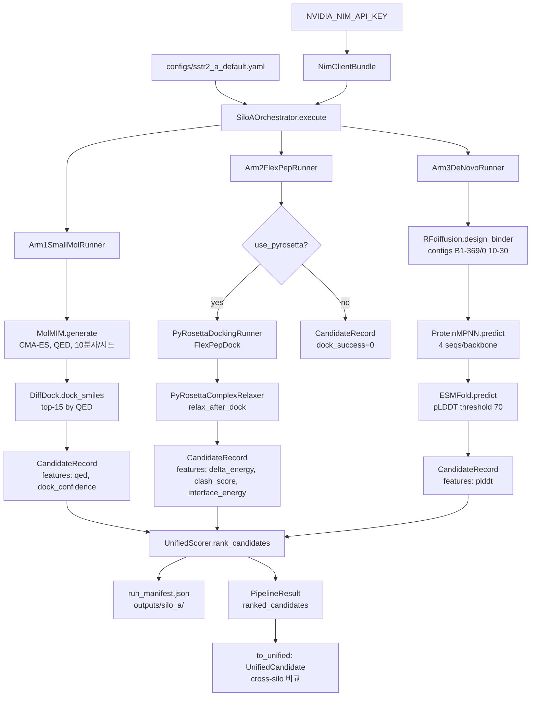

# Silo A (3-Arm NIM) 점검 — 2026-06-01

## 식별 결과 (먼저 답)

- **엔트리포인트 (구현 레이어)**: `pipelines/silo_a/src/orchestrator.py:46` — `SiloAOrchestrator.execute()`
- **엔트리포인트 (HTTP API 레이어)**: `AgenticAI4SCIENCE_pyrosetta_track/repos/ai4sci-kaeri/backend/routers/silo_a.py:119` — `POST /api/v1/silo-a/run`
- **엔트리포인트 (데모 실행)**: `docs/run_demo.sh:65` — `uvicorn backend.main:app --port 8787`
- **엔트리포인트 (pipeline_local 듀얼 모드)**: `pipeline_local/orchestrator.py:1395` — `_run_silo_a()` (Step02+03만 실행하는 별도 구현, NIM 클라이언트 미사용)
- **3-Arm 실제 존재**: **예** — `arms.py:24,100,200`에 `Arm1SmallMolRunner`, `Arm2FlexPepRunner`, `Arm3DeNovoRunner` 세 클래스가 명시적으로 구현됨

---

## 요약 (보고용 1문장 × 5개)

1. Silo A 코어 파이프라인은 `pipelines/silo_a/src/` 아래 6개 모듈(orchestrator/arms/clients/config/models/scoring)로 완성되어 있으며 단위 테스트 9개가 모두 통과한다.
2. 3-Arm은 Arm1(소분자: MolMIM→DiffDock), Arm2(펩타이드 변이체: FlexPepDock via PyRosetta), Arm3(de novo: RFdiffusion→ProteinMPNN→ESMFold)로 코드에 명시적으로 구현되어 있다.
3. HTTP API 라우터(`backend/routers/silo_a.py`)는 Phase 1 스텁 상태이며, `NVIDIA_NIM_API_KEY` 부재 시 자동으로 dry-run 응답을 반환하고 실제 추론은 Phase 2로 미뤄진다.
4. `bionemo/` 패키지의 5개 NIM 클라이언트는 `https://health.api.nvidia.com/v1/biology/...` 엔드포인트를 대상으로 하며, `NGC_CLI_API_KEY` 또는 `NVIDIA_API_KEY` 환경변수가 필수이다 — 현재 환경에 키 없음이 확인됨.
5. `pipeline_local/orchestrator.py`의 `_run_silo_a()`는 독립된 구현으로 NIM API 없이 Step02(RFdiffusion 로컬)+Step03(ProteinMPNN 로컬)만 실행하는 듀얼-사일로 모드 경로이며, 소분자 Arm1과 FlexPepDock Arm2는 해당 경로에 없다.

---

## Silo A 파이프라인 다이어그램 (Mermaid)



---

## 점검 항목 (9-필드)

### A-01: 엔트리포인트

| 레이어 | 위치 | 비고 |
|--------|------|------|
| Python 코어 | `pipelines/silo_a/src/orchestrator.py:46` | `SiloAOrchestrator.execute()` |
| HTTP API | `backend/routers/silo_a.py:119` | `POST /api/v1/silo-a/run` Phase 1 스텁 |
| 데모 실행 | `docs/run_demo.sh:65` | uvicorn, port 8787 |
| 듀얼 모드 | `pipeline_local/orchestrator.py:1395` | NIM 미사용, 로컬 툴만 |

독립 CLI 스크립트(`run_silo_a.py` 등)는 존재하지 않음 — `SiloAOrchestrator`를 직접 인스턴스화하는 외부 스크립트 없음.

### A-02: 3-Arm 구성 (코드 라인 인용)

`pipelines/silo_a/src/arms.py`

- **Arm1 (소분자)**: `class Arm1SmallMolRunner(ArmRunner):` — line 24
  - `clients.molmim.generate(smi=seed.smiles, ...)` — line 44
  - `clients.diffdock.dock_smiles(protein_pdb_path=..., smiles=c.value, ...)` — line 72
  - 시드 3종 (Paltusotine, L054522, Pasireotide)

- **Arm2 (펩타이드 FlexPepDock)**: `class Arm2FlexPepRunner(ArmRunner):` — line 100
  - wildtype `AGCKNFFWKTFTSC` 대비 11개 변이체 (Ala scanning + conservative)
  - `PyRosettaDockingRunner` + `PyRosettaComplexRelaxer` 조건부 임포트 — line 123, 134
  - `use_pyrosetta=True`이고 `complex_pdb`가 지정된 경우에만 도킹 실행

- **Arm3 (de novo)**: `class Arm3DeNovoRunner(ArmRunner):` — line 200
  - `clients.rfdiffusion.design_binder(contigs="B1-369/0 10-30", ...)` — line 222
  - `clients.proteinmpnn.predict(...)` — line 237
  - `clients.esmfold.predict(seq)` — line 258
  - `plddt >= cfg.plddt_threshold(70.0)` 필터 — line 266

### A-03: 사용 도구 / 외부 서비스

| 도구 | 용도 | 엔드포인트 |
|------|------|-----------|
| MolMIM (NIM) | 소분자 생성 | `https://health.api.nvidia.com/v1/biology/nvidia/molmim` |
| DiffDock (NIM) | 소분자 도킹 | `https://health.api.nvidia.com/v1/biology/mit/diffdock` |
| RFdiffusion (NIM) | de novo 백본 설계 | `https://health.api.nvidia.com/v1/biology/ipd/rfdiffusion` |
| ProteinMPNN (NIM) | 서열 설계 | `https://health.api.nvidia.com/v1/biology/ipd/proteinmpnn` |
| ESMFold (NIM) | 구조 예측/pLDDT 필터 | `https://health.api.nvidia.com/v1/biology/nvidia/esmfold` |
| PyRosetta | Arm2 FlexPepDock+Relax | 로컬 (조건부, Silo B 모듈 공유) |

인증 키: `NGC_CLI_API_KEY` 또는 `NVIDIA_API_KEY` (bionemo `api_base.py:52`)
HTTP 라우터는 `NVIDIA_NIM_API_KEY` 사용 (별도 변수)

### A-04: 입력 → 처리 → 산출물 → 저장

```
입력:
  - configs/sstr2_a_default.yaml (Pydantic SiloAConfig)
  - data/fold_test1/fold_test1_model_0.pdb (pocket PDB)

처리:
  1. Arm1: MolMIM(시드→10분자) → QED top-15 → DiffDock(5 poses)
  2. Arm2: 11개 변이체 시퀀스 → FlexPepDock → Relax → ddG/clash 피처
  3. Arm3: RFdiffusion(5 백본) → ProteinMPNN(4 서열/백본) → ESMFold(pLDDT≥70 필터)

산출물:
  - CandidateRecord 목록 (arm별)
  - UnifiedScorer 통합 점수 (qed 0.15, dock_confidence 0.35, delta_energy 0.25, plddt 0.15, diversity 0.10)
  - PipelineResult + run_manifest.json

저장:
  - outputs/silo_a/run_manifest.json (config 기본값)
```

### A-05: 실행 방법

현재 독립 CLI 없음. 가능한 실행 경로:

1. **FastAPI 서버 경유 (데모)**:
   ```bash
   bash docs/run_demo.sh
   # → uvicorn backend.main:app --port 8787
   # POST http://localhost:8787/api/v1/silo-a/run
   # {"sequences": [], "use_nim": true, "arms": []}
   ```
   키 없으면 Phase 1 dry-run만 반환 (실제 추론 없음).

2. **Python 직접 인스턴스화** (CLI 없음, 코드로만 가능):
   ```python
   from pipelines.silo_a.src.orchestrator import SiloAOrchestrator
   from pipelines.silo_a.src.clients import create_nim_bundle
   orch = SiloAOrchestrator("pipelines/silo_a/configs/sstr2_a_default.yaml", create_nim_bundle())
   result = orch.execute()
   ```
   `create_nim_bundle()`은 `bionemo.*_client.get_client()`를 호출하며 NIM API 키 필수.

3. **pipeline_local 듀얼 모드** (NIM 불필요, Arm2·Arm1 없음):
   ```bash
   # pipeline_local 설정에서 dual_silo.enabled: true 시 자동 실행
   ```

### A-06: 스코어링

`pipelines/silo_a/src/scoring.py` — `UnifiedScorer`

- Arm별 개별 정규화(minmax) 후 가중 합산:
  - SMALL_MOL: `0.15×norm(qed) + 0.35×norm(dock_confidence)` / 0.50 → normalized_arm
  - FLEXPEP: `0.25×norm(-delta_energy, 0~50)` / 0.25
  - DENOVO: `0.15×norm(plddt, 0~100)` / 0.15
- 최종: `score = 0.90×normalized_arm + 0.10×norm(diversity)`
- `diversity` 피처는 어떤 Arm도 현재 계산하지 않음 → 항상 0.0 → diversity 기여 0

---

## 라이브 / 최근 실행 흔적

- `outputs/silo_a/` 디렉토리: **존재하지 않음** (한 번도 실행된 흔적 없음)
- `runs_local/`, `AgenticAI4SCIENCE.../runs_local/`: silo_a 관련 파일 없음
- `pipelines/silo_a/src/__pycache__/`: Python 3.11 + 3.13 캐시 존재 — import는 됐으나 실행(`execute()`) 흔적 아님
- 단위 테스트 `pytest pipelines/silo_a/tests/ -q`: **9 passed** (mock 기반, 실제 NIM 호출 없음)
- 통합 테스트 디렉토리(`tests/integration/`): `__init__.py`만 존재, 테스트 없음

**결론**: Silo A 코어 파이프라인이 실제로 end-to-end 실행된 흔적 없음.

---

## 청중용 설명 (생명공학자)

Silo A는 SSTR2 수용체를 타겟으로 하는 **3가지 다른 유형의 약물 후보**를 동시에 탐색합니다.

- **Arm 1 (소분자)**: 이미 FDA에서 승인된 SSTR2 작용제(Paltusotine, Pasireotide 등)를 씨앗으로 삼아 AI 생성 모델(MolMIM)이 유사체를 생성하고, DiffDock이 수용체 구조에 도킹합니다.
- **Arm 2 (펩타이드 변이체)**: SST-14 천연 펩타이드(AGCKNFFWKTFTSC)의 핵심 약효단(FWKT)에 점변이를 도입한 11개 변이체를 PyRosetta FlexPepDock으로 구조 최적화하고 결합 에너지 변화(ΔΔG)를 계산합니다.
- **Arm 3 (de novo 설계)**: SSTR2 결합 포켓에 완전 새로운 단백질 결합자를 RFdiffusion으로 설계하고 ProteinMPNN으로 서열을 부여한 뒤, ESMFold로 구조적 안정성(pLDDT ≥ 70)을 검증합니다.

3가지 경로의 후보를 QED(약물다움), 도킹 신뢰도, 결합 에너지, pLDDT를 통합한 단일 점수로 교차 랭킹합니다.

---

## 확인 필요

1. **NIM API 키 부재**: `NGC_CLI_API_KEY`/`NVIDIA_API_KEY`가 현재 환경에 없음 → Arm1·Arm3는 실제 실행 불가. Arm2도 `create_nim_bundle()` 호출 시 실패. 별도 키 발급 또는 로컬 NIM 서버 설치 필요.
2. **`diversity` 피처 미계산**: `UnifiedScorer`는 `diversity` 가중치 0.10을 설정하나 어떤 Arm도 이 피처를 계산하지 않음 → 실질적으로 diversity 기여가 0 (의도된 것인지 미구현인지 확인 필요).
3. **`bionemo.` 임포트 경로**: `clients.py:44`의 `from bionemo.molmim_client import get_client`는 `bionemo/` 디렉토리가 Python path에 있어야 함 — `setup.py`/`pyproject.toml` 없음, 실행 시 경로 설정 방법 확인 필요.
4. **통합 테스트 미작성**: `tests/integration/` 폴더가 비어있음 — NIM API 키 있을 때 end-to-end를 검증할 수단 없음.
5. **HTTP 라우터와 코어의 연결 미완**: `backend/routers/silo_a.py`는 `SiloAOrchestrator`를 호출하지 않음 (Phase 1 스텁, Phase 2 미구현). 실제 추론 트리거 경로 없음.
6. **pipeline_local `_run_silo_a()`와 코어 `SiloAOrchestrator`의 관계**: 두 구현이 별도로 존재하며 공유 코드 없음 — 소분자(Arm1)·FlexPepDock(Arm2)가 pipeline_local 듀얼 모드에서 누락됨.
