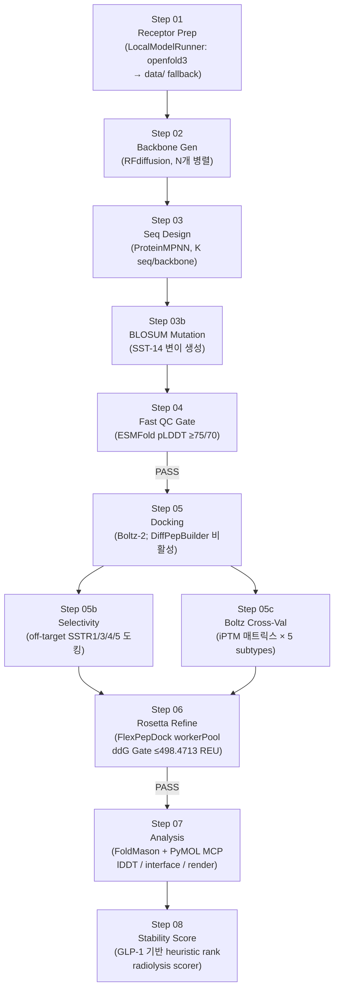

# Silo B (PyRosetta) + Docking 점검 — 2026-06-01

## 요약 (보고용 1문장 × 5개)

1. Silo B 8-Step 파이프라인(step01~step08 + 05b/05c 보조)은 코드베이스에 모두 존재하며, 각 step의 Public API가 명세되어 있다.
2. FlexPepDock 워커풀 4개(worker-1~4, PID 3362310/3362349/3362433/3362573)는 2026-05-26 재기동 이후 현재 모두 `S`(Sleep/대기) 상태로 살아 있다.
3. 3-Layer 스코어링은 Layer1=혈중 반감기 L-AA 앙상블(PlifePred/HLE 회귀/pepADMET), Layer2=로컬 PEPlife2-GAT(D-AA·cyclic용), Layer3=DOTA용 ADMET-AI MD proxy(현재 스텁)로 구성된다.
4. Step05 도킹 엔진은 DiffPepBuilder(비활성화)와 Boltz-2만 실제 사용되며, FlexPepDock은 Step06에서 FastRelax→FlexPepDock refinement→ddG 계산으로 정밀 정제에 투입된다.
5. 큐(flexpepdock_jobs/) 내 18개 job 중 완료(done) 9개, 대기(queued) 0개로 워커풀은 현재 유휴(idle) 상태다.

---

## Silo B 8-Step 다이어그램 (Mermaid)



---

## FlexPepDock 워커풀 다이어그램 + 현재 상태

```
runs_local/flexpepdock_jobs/
  <uuid>/
    status.json  ← state: queued | running | done | failed
    result.json  ← completed 후 생성
    *.pdb        ← ensemble PDB

워커 폴링 루프 (각 worker):
  └─ find_queued_jobs() → fcntl.flock(LOCK_FILE) → job claim → run FlexPepDock → status.json 업데이트
```

| 워커 | PID (conductor) | PID (python) | /tmp/*.pid | 상태 | 가동 경과 |
|------|-----------------|------------|-----------|------|----------|
| worker-1 | 3362210 | 3362310 | 3362210 | S (Sleep/idle) | 5일 20h |
| worker-2 | 3362325 | 3362349 | 3362325 | S (Sleep/idle) | 5일 20h |
| worker-3 | 3362356 | 3362433 | 3362356 | S (Sleep/idle) | 5일 20h |
| worker-4 | 3362456 | 3362573 | 3362456 | S (Sleep/idle) | 5일 20h |

로그 위치: `/tmp/flexpepdock_worker_{1..4}.log`
PID 파일: `/tmp/flexpepdock_worker_{1..4}.pid`
마지막 로그 활동: 2026-05-26 09:05:17 (worker-1 재기동)
큐 상태: done=9, failed=9(취소/미설정 포함), queued=0 → **현재 전체 유휴**

---

## 점검 항목 (9-필드) S-01~S-09

| ID | 항목 | 파일 존재 | 주요 함수 | 엔진/의존 | 게이트 | 입력 | 출력 | 비고 |
|----|------|----------|---------|---------|-------|------|------|------|
| S-01 | Receptor Prep | `step01_receptor.py` ✓ | `prepare_receptor`, `analyze_binding_pocket` | LocalModelRunner(openfold3), data/ fallback | - | SSTR2 FASTA | `01_receptor/sstr2_receptor.pdb`, `binding_pocket.json` | |
| S-02 | Backbone Gen | `step02_backbone.py` ✓ | `generate_backbones`, `generate_single_backbone` | LocalModelRunner(rfdiffusion) | - | receptor PDB, pocket | `02_backbone/backbone_*.pdb` | 병렬 N개 |
| S-03 | Seq Design | `step03_sequence.py` ✓ | `design_sequences`, `design_for_backbone` | LocalModelRunner(proteinmpnn) | - | backbone PDB × N | `03_sequence/bb*_sequences.fasta` | K seq/backbone |
| S-03b | BLOSUM Mutation | `step03b_blosum_mutation.py` ✓ | 확인 필요 | BLOSUM 행렬 | - | SST-14 서열 | 변이체 목록 | SST-14 specific |
| S-04 | Fast QC | `step04_qc.py` ✓ | `run_qc`, `apply_plddt_gate` | LocalModelRunner(esmfold) | mean pLDDT≥75, iface pLDDT≥70 | sequences | `04_qc/qc_summary.json` | |
| S-05 | Docking | `step05_docking.py` ✓ | `predict_with_boltz2`, `dock_with_diffdock`(미사용) | Boltz-2(active), DiffPepBuilder(비활성화) | docking_top_pct=20% | QC-passed candidates | `05_docking/` | DiffPepBuilder 항상 실패로 비활성 |
| S-05b | Selectivity | `step05b_selectivity.py` ✓ | 확인 필요 | Boltz-2 / DiffDock | selectivity_margin_min | SSTR2 top 후보 | off-target dock scores | SSTR1/3/4/5 |
| S-05c | Boltz Cross-Val | `step05c_boltz_cross.py` ✓ | 확인 필요 | Boltz-2 CLI (--no_kernels) | iPTM 매트릭스 | 5 subtype | Tier 분류 | SST14×SSTR2 iPTM=0.975 기준 |
| S-06 | Rosetta Refine | `step06_rosetta.py` ✓ | `run_rosetta_refinement`, `apply_rosetta_gate` | PyRosetta FlexPepDock(workerPool) | ddG≤498.4713 REU, clash=0 | Top-M dock 후보 | `06_rosetta/refined_*.pdb`, `energy_table.json` | |
| S-07 | Analysis | `step07_analysis.py` ✓ | `run_analysis`, `run_foldmason_alignment`, `generate_pymol_renders` | FoldMason MCP, PyMOL MCP | - | Rosetta-passed 후보 | `07_viz/*.png`, `rank_table.csv` | |
| S-08 | Stability Score | `step08_stability.py` ✓ | 확인 필요 | radiolysis_scorer, GLP-1 heuristic | - | 후보 서열 | ranking score (heuristic) | 절대 반감기 아님 — HEURISTIC 표기 의무 |
| S-09 | FlexPepDock 워커풀 | `flexpepdock_worker.py` ✓ | `find_queued_jobs`, `cleanup_stale_worker_pid_files` | fcntl.flock, PyRosetta | - | `flexpepdock_jobs/<uuid>/` | `result.json`, ensemble PDB | 4개 동시 가동, 큐 폴링 |

---

## 최근 실행 흔적

최신 run 디렉토리(ai4sci-kaeri/runs_local/):
- `dual_test_01/local_20260331_0930_iter01/silo_b/sst14_agentic_mutdock/iter_01/`
  - 산출물: `08_reports/` 디렉토리만 확인됨 (단일 디렉토리)
  - `08_reports/critic_report.json` 구조: `{type, iteration, run_id, timestamp, ...}`

최신 run 디렉토리(pipeline_local/runs_local/):
- `dual_verify_04`, `silob_direct_test`, `stability` 포함
- flexpepdock_jobs/: 총 18개 uuid 디렉토리, done=9개, failed/취소=9개, queued=0개

dashboard.json 구조 예시:
```json
{
  "run_id": "sst14_mutdock_2026",
  "started_at": "...",
  "updated_at": "...",
  "iteration": 5,
  "phase": "...",
  "total_iterations": N
}
```

비고: runs_local 내 step별 `01_receptor/`, `05_docking/`, `06_rosetta/` 산출물 서브디렉토리는 dual_test_01 실행 기록에서 `08_reports/`만 남아 있음 (다른 step 산출물은 압축·이동 또는 run 구성 차이 가능성). 확인 필요.

---

## Docking 엔진 매트릭스

| 엔진 | step | conda env / 위치 | 현재 상태 | 산출물 형식 |
|------|------|-----------------|---------|-----------|
| DiffPepBuilder (DiffDock 계열) | Step05 (비활성) | `local_models/DiffPepBuilder/` | 비활성화 (항상 실패 → 타임아웃) | PDB 예정이나 실제 산출 없음 |
| Boltz-2 | Step05, 05b, 05c | LocalModelRunner("boltz"), `--no_kernels --num_workers 0` | 활성 (primary 엔진) | affinity (kcal/mol), iPTM 매트릭스 |
| PyRosetta FlexPepDock | Step06 | `bio-tools` conda env, worker pool 4개 | 활성 (idle 대기 중) | `refined_{seq_id}.pdb`, ddG (REU), energy_table.json |

DiffDock 원본 클라이언트: `bionemo/diffdock_client.py` (NIM API 래퍼, 현재 미사용)
DiffPepDock POC 스크립트: `pipeline_local/scripts/run_diffpepdock_poc.py`, `run_diffpepdock_inference.py`

---

## 청중용 설명 (생명공학자)

"Silo B는 SST-14(AGCKNFFWKTFTSC, Cys3-Cys14 이황화결합 고리형 14개 아미노산 펩타이드)에서 출발하여, RFdiffusion으로 새 백본을 생성하고 ProteinMPNN으로 서열을 설계한 뒤, BLOSUM 치환 변이체도 함께 생성합니다. ESMFold pLDDT 게이트로 구조 품질이 낮은 후보를 걸러낸 후, Boltz-2로 SSTR2와의 결합을 예측하고, SSTR1/3/4/5 off-target 도킹으로 선택성을 검증합니다. 최상위 후보는 PyRosetta FlexPepDock으로 원자 수준 정밀 정제를 거쳐 결합 자유 에너지(ddG)를 계산하고, GLP-1 agonist 기반 heuristic 점수와 방사선 분해 민감도를 추가 평가하여 최종 순위를 부여합니다."

"FlexPepDock = PyRosetta 기반 수용체-펩타이드 유연 도킹 정제 알고리즘. 수용체는 고정, 펩타이드는 유연하게 sampling하여 결합 포켓 내 최적 자세(pose)를 찾습니다. 산출되는 ddG(REU)는 Rosetta 에너지 단위의 결합 자유 에너지 변화로, 낮을수록 결합이 유리합니다. 임상 Ki/Kd와 직접 비교는 불가하며, 후보 상대 순위 부여에 사용합니다."

---

## 확인 필요

1. `step03b_blosum_mutation.py` Public API 내용 — 함수 시그니처 미확인
2. `step05b_selectivity.py`, `step05c_boltz_cross.py` 내부 함수 시그니처 미확인 (header만 확인)
3. `step08_stability.py` radiolysis_scorer 연동 방식 — `radiolysis_scorer.py`와의 호출 관계 미확인
4. dual_test_01 run에서 `01_receptor/`, `05_docking/`, `06_rosetta/` 서브디렉토리 부재 이유 — 정상 run이 아니거나 step01~07 산출물이 다른 경로에 저장될 가능성
5. Layer3(ADMET-AI MD proxy)이 `layer3_dota_admet_ai_md_proxy_stub` 상태인지 실 구현인지 — `ensemble_router.py` route 결과가 stub 반환으로 확인되나 실 구현 파일 별도 존재 여부 미확인
6. DiffPepBuilder 비활성화가 코드 변경(주석 처리)인지 설정 플래그인지 — step05_docking.py 144행 주석 확인 필요
