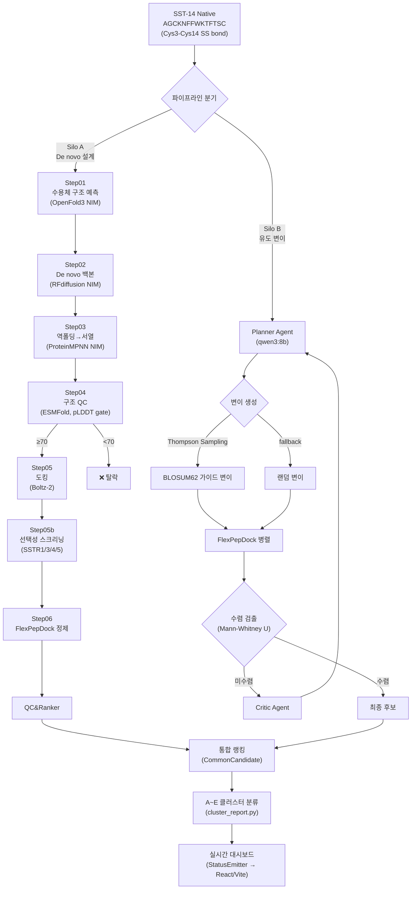
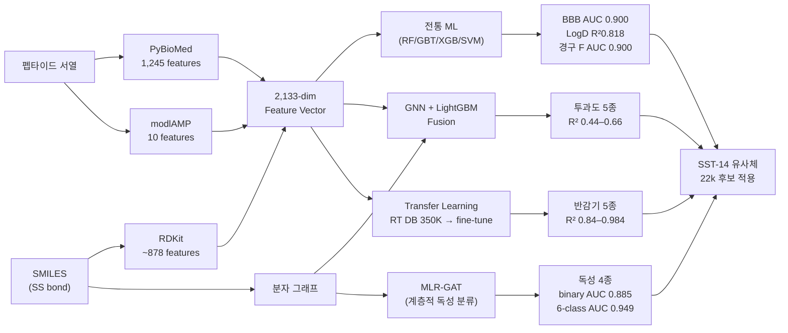
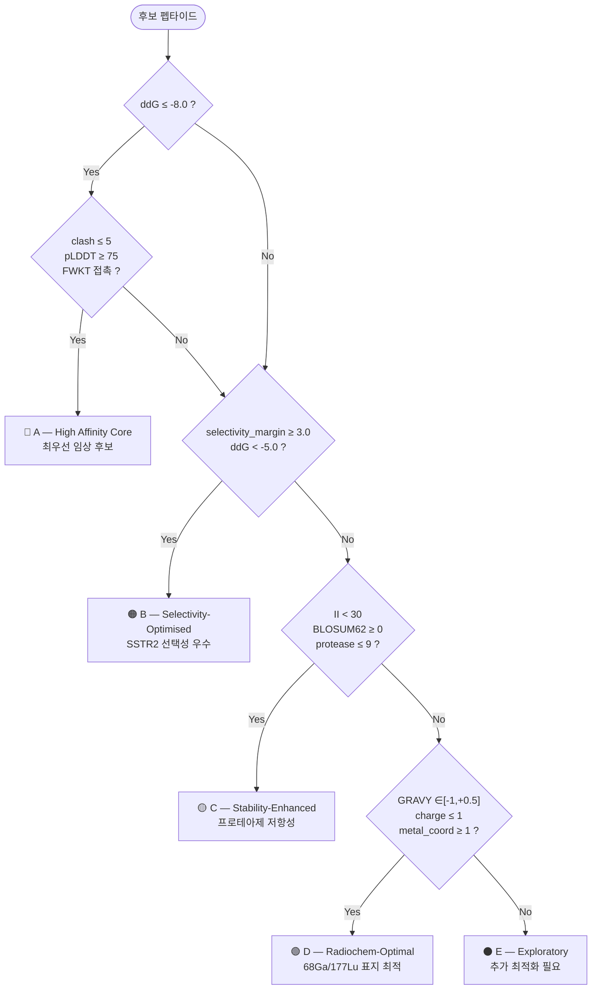
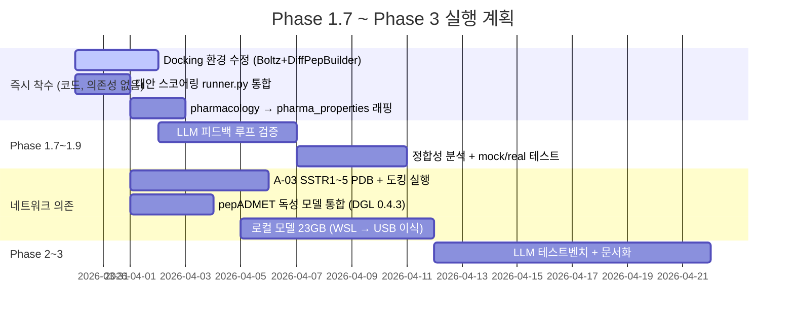

# SSTR2 방사성의약품 AI Co-Scientist
## 내부 미팅 — 진행 현황 보고

**날짜**: 2026-03-30
**보고**: AI팀

---

# 파이프라인 아키텍처 — Silo A / Silo B 듀얼

---

# 액션 아이템 대응 현황 (A-01 ~ A-10)

| ID | 내용 (요약) | 담당 | 상태 |
|----|------------|------|:----:|
| A-01 | PepCalc → pharma_properties.py 13 메서드 대체 | AI팀 | ✅ |
| A-02 | ADMETlab 3.0 → pepADMET Tier 1.5 재정의 | AI팀 | ❌→재정의 |
| A-03 | SSTR1/3/4/5 코드 완료, PDB 다운로드·도킹 미실행 | AI팀 | ⚠️ |
| A-04 | cluster_report.py A~E 분류, 57 tests | AI팀 | ✅ |
| A-05 | BLOSUM62 Tier 1 / BO Tier 3 병렬 설계 완료 | AI팀 | ✅ |
| A-06 | DOTA-펩타이드 합성 견적 (Peptron/HLB/Anygen) | RI팀 | ⏸️ |
| A-07 | Top-3 후보 C18 변형 설계 → 구조 검토 미팅 | RI팀 | ⏸️ |
| A-08 | Selectivity / Radiolysis / Chelator 메트릭 3/3 | AI팀 | ✅ |
| A-09 | pepADMET 논문 전문 분석 (JCIM 2026) | AI+RI팀 | ✅ |
| A-10 | Radiolysis Susceptibility 모듈 구현 완료 | AI팀 | ✅ |

**✅ 6건** · **⚠️ 2건** · **⏸️ RI팀 2건**

**전체 65건 통합 완료율**: REFACTORING 100% · RCSB 100% · CI/CD 80% · 대안 스코어링 67% · 로컬 모델 38% · ADMET Tier 13% → **전체 68%**

---

# pharma 검증 — 16건 버그 수정

## 수정 결과 (커밋 `eb213c9`)

| 항목 | 수정 전 | 수정 후 |
|------|--------|--------|
| DIWV 오류 | **16건** (pharma 12 + backend 4) | **0건** |
| RW 테이블 오류 | 7건 | **0건** |
| Boman 부호 | 반전 (SST-14: −0.55) | **+0.69** |
| peptides GT 일치 | 미검증 | **8/8 완벽 일치** |
| 테스트 수 | 35개 | **62개** (+27 교차 검증) |

## 신규 구현 — SS bond pI 보정 + MW (커밋 `e5bcb51`)

| 항목 | 기존 | 보정 후 |
|------|------|---------|
| SS bond Cys pI | 9.04 | **10.62** (+1.58 pH) |
| net charge pH 7.4 | +1.709 | **+1.993** (+0.284) |
| MW 메서드 신규 | 미구현 | **1639.91 Da** (peptides 일치) |
| 신규 테스트 | — | **+57개** |

**산출물**: `pharma_properties_verification_report.md`

---

# pepADMET — 펩타이드 전용 ADMET 플랫폼

**논문**: Tan et al. *J. Chem. Inf. Model.* 2026, **66**, 936–946 · 36,643 데이터 · **19 endpoints**

**Case Study**: Desmopressin (9aa, SS bond) T½ 예측 **2.46h** vs 실험 3.00h ✅
**재현 계획**: Phase A~E 5단계 · **6주 타임라인** · 독성 모델 즉시 활용 (`toxicity_early_stop.pth`)

---

# 서버 실행 결과 — Phase 0 ~ 1.6

## Phase 완료 현황 (2026-03-27, `git show 25cc809`)

| Phase | 내용 | 상태 |
|-------|------|:----:|
| 0 | SSTR1~5 CIF 등록 + Selectivity API 5종 + Radar/Heatmap UI | ✅ |
| 1.0 | LocalModelRunner 환경변수 + subprocess Popen + 절대경로 제거 | ✅ |
| 1.0.3 | ESMFold 배치: 개별 ~20분 → 배치 **~2분** (10× 가속) | ✅ |
| 1.0.6~7 | `_try_form_disulfide()` + pLDDT 0→100 스케일 + gate 통일 | ✅ |
| 1.1~1.5 | Backend 17/17 · ESMFold · RFdiffusion · CIF 5/5 · DL wrapper 8/8 | ✅ |
| 1.6 | **Silo B 3-iter 벤치마크** (아래 수치) | ✅ |
| 1.7~1.9 | LLM 피드백 루프 · 정합성 분석 · mock/real 테스트 | ❌ |
| 2~3 | LLM 테스트벤치 · 문서화 | ❌ |

## 3-Iteration 벤치마크 (`f5333a0`, qwen3:8b)

| 지표 | 결과 |
|------|------|
| ESMFold 배치 | **128seq / 70s** (0.55s/seq) |
| GPU 메모리 peak | **14.3 GB** / H100 NVL 96GB |
| QC 통과율 | **29/128 (22.7%)** — pLDDT ≥ 60 |
| 총 소요 | **19.8분 / 3 iter** |
| Docking | **전부 실패** — Boltz MSA + DiffPepBuilder 환경 문제 (수정 예정) |

---

# FWKT Pharmacophore Gate + A~E 클러스터

## 5대 구조 규칙 (Pharmacophore Gate)

| 규칙 | 내용 | 의의 |
|------|------|------|
| ①FWKT | Phe7-Trp8-Lys9-Thr10 보존 강제 | SSTR2 결합 핵심 약리단 |
| ②K9-D122 | 염교(salt bridge) 유지 | 결합 안정성 |
| ③Cys3-Cys14 | 이황화결합 유지 | 사이클릭 구조 + SS bond |
| ④Phe6-Phe11 | π-π stacking | 구조적 강직성 |
| ⑤N-term | 킬레이터 공간 확보 | 68Ga/177Lu DOTA 접합 |

**W8(Trp) radiolysis 위험**: FWKT 내 critical 잔기, 방사선 분해 취약 (가중치 3.0, total 6.5 → risk: **high**)

---

# 인프라 현황

## 서버 하드웨어

| 항목 | 스펙 |
|------|------|
| GPU | **4 × H100 NVL 96GB** (CUDA_VISIBLE_DEVICES=2 운용 중) |
| Conda 환경 | **9개** — bio-tools, rfdiffusion, diffpepbuilder, pepadmet, openfold3, boltz, esmfold, genmol, base |
| Ollama LLM | **8개** (포트 11435) — qwen3:8b/30b/32b/235b, deepseek-r1:70b, llama4:scout, bge-m3, nomic-embed-text |
| Backend | pipeline_local (port **8787**) |
| Frontend | Vite (port **5173**) |

## 개발 툴체인 — MCP 3도구 동기화

| 도구 | 역할 | 상태 |
|------|------|:----:|
| **Linear** | A-01~A-10 ↔ CHA-xx 이슈 매핑 | ⚠️ 401 시 수동 동기화 |
| **GitHub** | CI/CD 7 jobs, feat/* 브랜치 전략 | ✅ |
| **Obsidian** | meet_log / progress_report 단일 진실 허브 | ✅ |

## CI/CD 상태

| Job | 상태 |
|-----|:----:|
| Job 1~4, 6~7 | ✅ PASS |
| Job 5 (NIM Smoke Test) | ⚠️ continue-on-error (로컬 전환 후 업데이트 예정) |

---

# 향후 계획

## Phase 1.6~ 타임라인

## 즉시 착수 가능 (P1 — 네트워크 불필요)

| 항목 | 예상 소요 |
|------|---------|
| Docking 환경 수정 (Boltz MSA + DiffPepBuilder key 불일치) | 1~2h |
| 대안 스코어링 runner.py 통합 (GNINA→ECR→Pareto→BO 체인) | 2~3h |
| pepADMET 독성 모델 로컬 추론 환경 구축 | 1일 |
| pharmacology.py → pharma_properties.py 래핑 통합 | 2~3h |

---

# Q & A

## 핵심 수치 요약

| 지표 | 수치 |
|------|------|
| 액션 아이템 대응 | **✅ 6 / ⚠️ 2 / ⏸️ 2** (A-01~A-10) |
| 전체 65건 완료율 | **68%** (44/65) |
| pharma 버그 수정 | **16건 → 0건** · GT 8/8 일치 |
| SST-14 pI 보정 | 9.04 → **10.62** (+1.58) |
| ESMFold 처리 속도 | **128seq / 70s** (0.55s/seq) |
| GPU 메모리 peak | **14.3 GB** / H100 NVL 96GB |
| QC 통과율 | **22.7%** (29/128) |
| 누적 테스트 수 | **510+개** |
| pepADMET endpoints | **19개** (JCIM 2026) |

## 논의 안건

1. Docking 환경 수정 — Boltz vs DiffPepBuilder 중 빠른 경로?
2. A-03 SSTR1/3/4/5 — AlphaFold EBI vs 실험 CIF (9IK8 등) 선택?
3. pepADMET 독성 모델 통합 일정 — Tier 1.5 바로 착수?
4. RI팀 A-06/A-07 진행 여부 확인?
