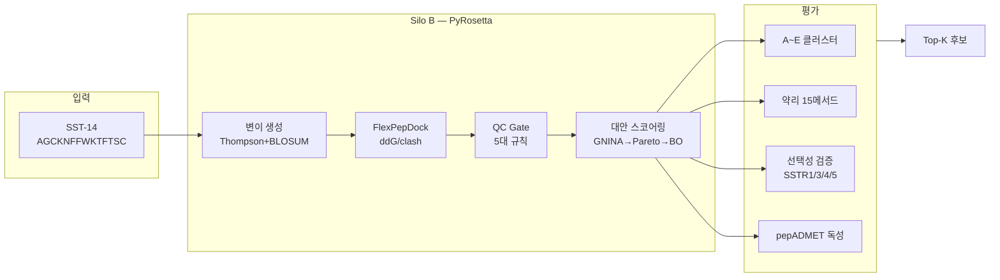
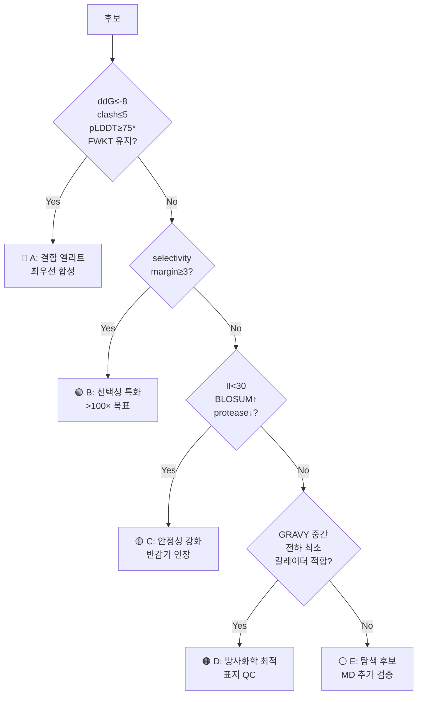

# SSTR2 방사성의약품 AI Co-Scientist
## 액션 리스트 대응 현황 + 시스템 가이드

2026-04-03 내부 보고

전체 보고서: 00_main/01_ACTION_ITEMS_RESPONSE_REPORT.md

---

# 전체 현황 — 한눈에

### 액션 아이템 (A-01~A-10)

| 상태 | 건수 | 항목 |
|:----:|:----:|------|
| ✅ | **7** | A-01,03,04,05,08,09,10 |
| ⚠️ | **1** | A-02 (pepADMET descriptor) |
| ⏸️ | **2** | A-06,07 (RI팀) |

### 핵심 수치

| 지표 | 값 |
|------|------|
| 테스트 | **265 passed** |
| pharma 메서드 | **15개** (GT 8/8 일치) |
| SSTR selectivity | **CIF 5종 + FlexPepDock** |
| pepADMET | **env+MGA ✅ / descriptor ⚠️** |
| UI 패널 | **8개 정상** |

상세: 00_main/01_ACTION_ITEMS_RESPONSE_REPORT.md §요약

---

# 파이프라인 아키텍처

상세: system_architecture_guide.md §2-3

---

# A-01~A-10 대응 요약

| ID | 요구사항 | 대응 | 상태 |
|----|---------|------|:----:|
| A-01 | PepCalc/혈청 t½ | pharma_properties 15메서드 자체 구현 | ✅ |
| A-02 | ADMETlab 3.0 | **pepADMET** 대안 (env+MGA ✅, descriptor 2133 ⚠️ 진행중) | ⚠️ |
| A-03 | SSTR 선택성 | CIF 5종 등록 + FlexPepDock 실제 연결 | ✅ |
| A-04 | ClusterReport | A~E 5등급 분류 (57 tests) | ✅ |
| A-05 | Tier 병렬 생성 | Thompson + BO + Pareto 체인 | ✅ |
| A-06 | 합성 견적 | RI팀 담당 | ⏸️ |
| A-07 | C18 변형체 | RI팀 담당 | ⏸️ |
| A-08 | 3종 메트릭 | Selectivity + Radiolysis + Chelator | ✅ |
| A-09 | JCIM 논문 | pepADMET 전문 분석 완료 | ✅ |
| A-10 | Radiolysis | calculate_radiolysis_susceptibility() | ✅ |

상세: action_response_report.md §A-01~A-10

---

# pharma 검증 — 16건 버그 수정

### 수정 전 → 후

| 항목 | Before | After |
|------|--------|-------|
| DIWV 오류 | 16건 | **0건** |
| Boman 부호 | 반전 | **정상** |
| pI (SS보정) | 9.04 | **10.62** |
| MW | 미구현 | **1639.91 Da** |
| 테스트 | 35개 | **62개** |

### Ground Truth 검증

peptides PyPI v0.5.0 대비
**8/8 메서드 완벽 일치**

6서열 × 13메서드 = 78 케이스
오차 0.00%

상세: pharma_properties_verification_report.md

---

# A~E 클러스터 분류

*pLDDT: ESMFold 미실행 시 조건 skip (나머지 3개 기준으로 판정)

상세: system_overview_for_biologists.md §4, Appendix D

---

# pepADMET 대안 (A-02)

### ADMETlab 3.0 부적합 사유
- SSL 인증서 만료 (2026-01-13)
- API 엔드포인트 전부 404
- MW<500 소분자 전용
- SST-14 MW~1600 → AD 밖

### pepADMET (JCIM 2026)
- **36,643** 펩타이드 데이터
- **19** ADMET endpoint
- SS bond / 사이클릭 지원
- 독성 모델 GitHub 공개

### 현재 진행

| 항목 | 상태 |
|------|:----:|
| pepadmet env | ✅ |
| MGA 모델 로드 | ✅ |
| forward pass | ✅ |
| SMILES 변환 | ✅ |
| **descriptor 2133** | ⚠️ 진행중 |

†현재 파이프라인 ADMET 값은 **in-house surrogate** (pharma_properties 기반 규칙); pepADMET descriptor 통합 완료 시 대체 예정

상세: admet_alternative_plan_20260402.md, Appendix B

---

# Selectivity — SSTR1/3/4/5

### 수용체 구조 (실험 CIF)

| 수용체 | PDB ID | 상태 |
|--------|--------|:----:|
| SSTR1 | 9IK8 | ✅ |
| SSTR2 | 7XNA | ✅ |
| SSTR3 | 8XIR | ✅ |
| SSTR4 | 7XMT | ✅ |
| SSTR5 | 8ZBJ | ✅ |

### 파이프라인

1. CIF → PDB 변환 (BioPython)
2. FlexPepDock 도킹 (실제)
3. `selectivity_margin` 계산
4. Gate: margin ≤ -2.0

**API**: `/api/selectivity/run`
production mode 연결 완료

상세: action_response_report.md §A-03, Appendix C

---

# UI 대시보드

패널: CandidateTable → Cluster A~E → ADMET → Pharmacology → RCSB Match → SAR → Convergence

라이브: http://localhost:5173

---

# Selectivity 페이지

5/5 receptor loaded · FlexPepDock production mode · selectivity_margin 자동 계산

라이브: http://localhost:5173/selectivity

---

# 시스템 감사 — 수정된 이슈

| # | 이슈 | 수정 | 상태 |
|---|------|------|:----:|
| 7.1 | pLDDT=0 → Cluster A 불가 | pLDDT 없으면 skip | ✅ |
| 7.3 | validation_n_trials=1 | 1→3 (통계 최소) | ✅ |
| 7.4 | clash_max planner=0 | 0→10 (통일) | ✅ |
| 7.2 | ADMET surrogate† 정확도 | pepADMET 통합 시 해결 | ⏸️ |
| 7.5 | ddG threshold | adaptive 전환 예정 | ⏸️ |

†in-house surrogate: pharma_properties 기반 규칙 ADMET; pepADMET descriptor 2133 통합 후 대체

상세: system_architecture_guide.md §7

---

# 향후 계획

| 우선순위 | 항목 | 의존성 |
|---------|------|--------|
| **즉시** | pepADMET descriptor 2133 통합 | 없음 |
| **즉시** | selectivity 비동기 전환 | 없음 |
| **즉시** | ddG adaptive threshold | 없음 |
| **중기** | pepADMET 전 모델 재현 (6주) | 데이터 수집 |
| **중기** | Silo B 이론적 처리 용량(22K) 대규모 실행 | 서버 |

### 논의 안건
1. RI팀 A-06/A-07 진행 여부?
2. pepADMET descriptor 우선순위?
3. 대규모 실행 일정?

상세: pepadmet_reproduction_plan.md

