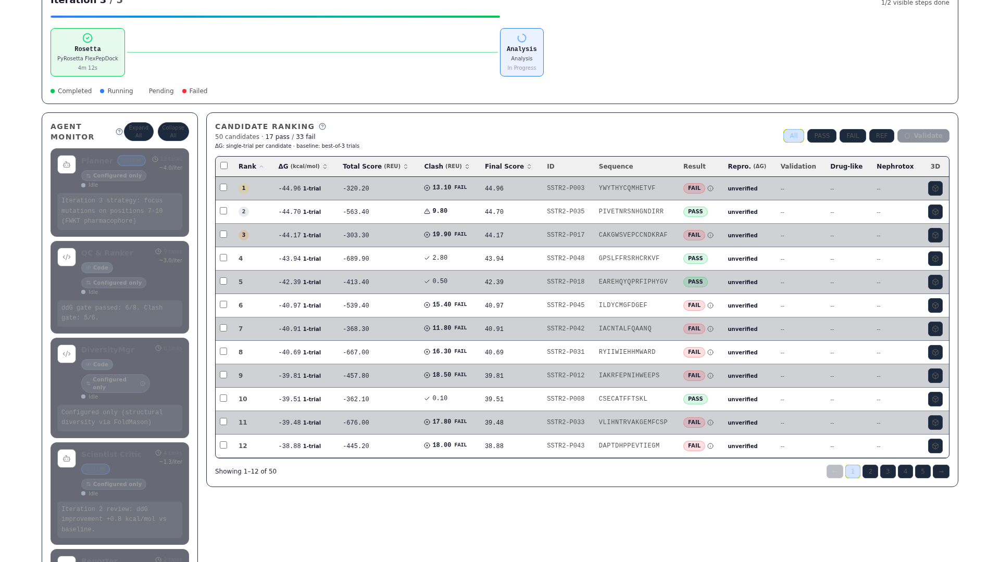
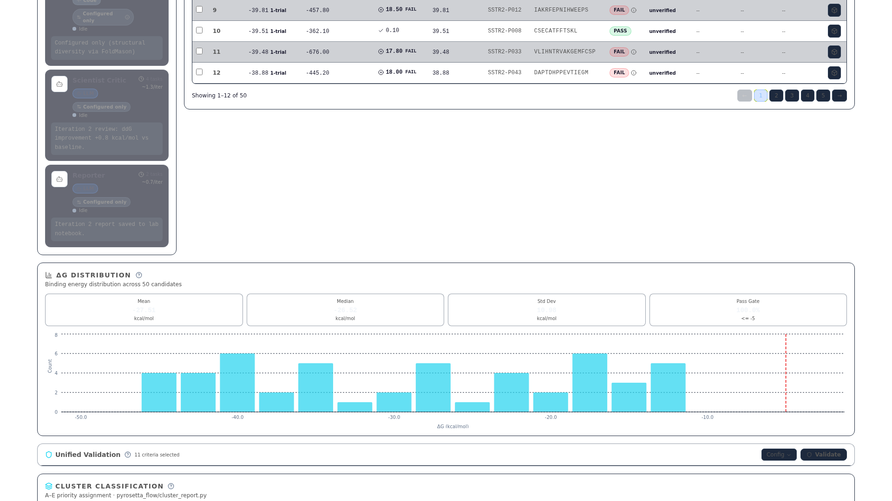
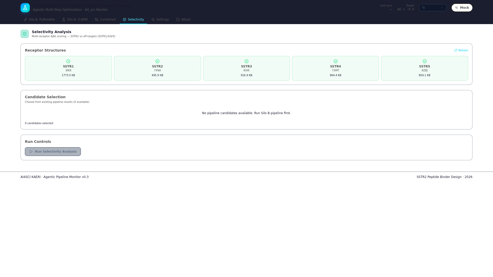
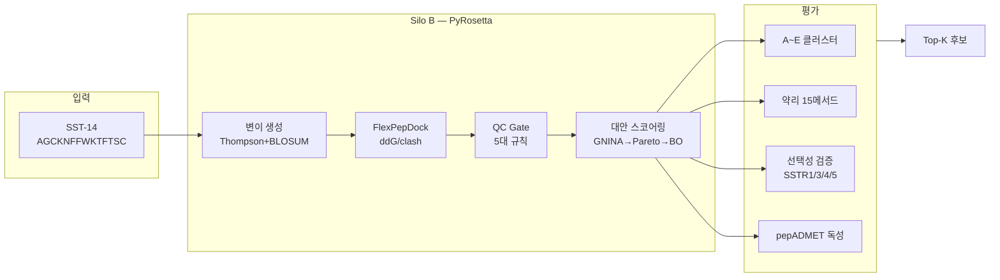

<!-- S01 -->
# SSTR2 방사성의약품 AI Co-Scientist
## Version A — 데모 퍼스트

2026-04-05 내부 보고

**오늘 보실 3가지:**

1. **검증** — pharma 16건 버그 수정, GT 8/8 완벽 일치
2. **체계** — 듀얼 파이프라인 + A~E 클러스터 + Selectivity 시스템
3. **로드맵** — pepADMET 통합, 대규모 실행

전체 보고서: 00_main/01_ACTION_ITEMS_RESPONSE_REPORT.md

---

<!-- S02 -->
# 현황 대시보드

### 액션 현황

- ✅ **완료 7건** — A-01,03,04,05,08,09,10
- ⚠️ **진행 1건** — A-02 (pepADMET descriptor 2133)

### 핵심 수치

| 지표 | 값 |
|------|------|
| 테스트 | **265 passed** |
| pharma 메서드 | **15개** (GT 8/8 일치) |
| SSTR selectivity | **CIF 5종 + FlexPepDock** |
| pepADMET | **env+MGA ✅ / descriptor ⚠️** |
| UI 패널 | **8개 정상** |

상세: 00_main/01_ACTION_ITEMS_RESPONSE_REPORT.md §요약

---

<!-- S03 : 라이브 데모 fallback -->
# 라이브 데모 — UI 대시보드

상단: 후보 테이블 (A~E 클러스터, ddG, clash 등) / 하단좌: 수렴 차트 / 하단우: Selectivity (5종 수용체 ddG 비교)

라이브: http://localhost:5173 — 네트워크 불가 시 위 스크린샷 사용

---

<!-- S04 -->
# 파이프라인 아키텍처

SST-14: 14aa 소마토스타틴 (Cys3-Cys14 이황화 결합, FWKT 약리활성 모티프) / ddG: 결합 자유에너지 변화량 (REU, Rosetta Energy Unit)

상세: system_architecture_guide.md §2-3 (→ 부록 §A)

---

<!-- S05 -->
# A-01 도구 조사 + 액션 대응

### 검토 도구

| 도구 | 핵심 기능 | 한계 → 우리 대응 |
|------|----------|-----------------|
| PepCalc | pI, MW, 전하 | 서열 전용; **자체 15메서드**로 확장 |
| ADMETlab 3.0 | ADMET 예측 | SSL 만료+소분자 전용; **pepADMET** 전환 |
| GROMACS | MD 시뮬레이션 | 계산 비용; FlexPepDock으로 **경량 도킹** |
| AlphaFold/ESMFold | 구조 예측 | pLDDT 미실행 시 조건 skip 처리 |

### 나머지 액션 요약

- **A-04/05** — A~E 클러스터 분류(57 tests) + Thompson/BO/Pareto 체인 ✅
- **A-08/10** — Selectivity + Radiolysis + Chelator 3종 메트릭 ✅

상세: action_response_report.md §A-01~A-10 (→ 부록 §A)

---

<!-- S06 -->
# pharma 검증 — 16건 버그 수정, 8/8 일치

### 수정 전 → 후

| 항목 | Before | After |
|------|--------|-------|
| DIWV 오류 | 16건 | **0건** |
| Boman 부호 | 반전 | **정상** |
| pI (SS보정) | 9.04 | **10.62** |
| MW | 미구현 | **1639.91 Da** |
| 테스트 | 35개 | **62개** |

### Ground Truth 검증

peptides PyPI v0.5.0 대비
**8/8 메서드 완벽 일치**

6서열 x 13메서드 = 78 케이스
오차 0.00%

pI: 등전점 (isoelectric point) — 단백질 순전하가 0이 되는 pH SS보정: 이황화결합 시 Cys 유리 thiol 제거 보정

상세: pharma_properties_verification_report.md (→ 부록 §A)

---

<!-- S07 -->
# A~E 클러스터 분류

<strong>A: 결합 엘리트</strong>  
ddG ≤ -8 REU 
clash ≤ 5 
pLDDT ≥ 75* 
FWKT 유지  
<em>최우선 합성</em>

<strong>B: 선택성 특화</strong>  
selectivity 
margin ≥ 3.0 REU  
>100x 목표  
<em>off-target 최소</em>

<strong>C: 안정성 강화</strong>  
II < 30 
BLOSUM ↑ 
protease ↓  
<em>반감기 연장</em>

<strong>D: 방사화학 최적</strong>  
GRAVY 중간 
전하 최소 
킬레이터 적합  
<em>표지 QC</em>

<strong>E: 탐색 후보</strong>  
상위 등급 
미충족  
MD 추가 검증  
<em>파이프라인 재진입</em>

*pLDDT: ESMFold 미실행 시 조건 skip (나머지 3개 기준으로 판정) 
II (Instability Index): 단백질 불안정성 지수. II < 30 = 매우 안정 *(논문 기준 40 이하 안정; 방사성의약품은 보수적으로 30 적용)* 
ddG 단위: REU (Rosetta Energy Unit) — 음수일수록 결합이 강함

상세: system_overview_for_biologists.md §4, Appendix D (→ 부록 §A)

---

<!-- S08 -->
# pepADMET 대안 (A-02)

### ADMETlab 3.0 부적합 3사유

1. **SSL 인증서 만료** (2026-01-13) + API 404
2. **소분자 전용** — MW < 500 Da 설계
3. **SST-14 MW ~1600 Da** → AD(적용 가능 도메인) 밖

### pepADMET 현재 상태

| 항목 | 상태 |
|------|:----:|
| pepadmet env | ✅ |
| MGA 모델 로드 | ✅ |
| forward pass | ✅ |
| SMILES 변환 | ✅ |
| **descriptor 2133** | ⚠️ 진행중 |

### pepADMET 핵심 정보

- **MGA (Multi-Graph Attention) 아키텍처** + 학습 코드 = **GitHub 공개** (재학습 가능)
- **Toxicity 모델** = 공개 → **추론 성공** ✅
- **descriptor 2133** = **진행중** (iFeature + RDKit 기반, 통합 작업 중)

†현재 파이프라인 ADMET 값은 <strong>in-house surrogate</strong> (pharma_properties 기반 규칙); pepADMET descriptor 통합 완료 시 대체 예정

상세: admet_alternative_plan_20260402.md (→ 부록 §B)

---

<!-- S09 -->
# Selectivity — SSTR1/3/4/5 선택성 검증

### 수용체 구조 (실험 CIF 5종)

| 수용체 | PDB ID | 상태 |
|--------|--------|:----:|
| SSTR1 | 9IK8 | ✅ |
| SSTR2 | 7XNA | ✅ |
| SSTR3 | 8XIR | ✅ |
| SSTR4 | 7XMT | ✅ |
| SSTR5 | 8ZBJ | ✅ |

### FlexPepDock 기반 판정

1. CIF → PDB 변환 (BioPython)
2. **FlexPepDock** 도킹 (Rosetta 기반 유연 펩타이드 도킹)
3. selectivity margin 계산:
   `margin = ddG(off-target) − ddG(SSTR2)`
4. **Gate: margin >= 3.0 REU → B등급**

### 현재 상태: **시스템 구축완료, 시뮬레이션 진행가능**

ddG: 결합 자유에너지 변화량 (REU, Rosetta Energy Unit). off-target ddG가 SSTR2보다 3 REU 이상 높으면(결합이 약하면) 선택성 인정

상세: action_response_report.md §A-03 (→ 부록 §C)

---

<!-- S10 -->
# 시스템 감사 — 수정된 이슈

| # | 이슈 | 수정 | 상태 |
|---|------|------|:----:|
| 7.1 | pLDDT=0 → Cluster A 불가 | pLDDT 없으면 skip | ✅ |
| 7.3 | validation_n_trials=1 | 1→3 (통계 최소) | ✅ |
| 7.4 | clash_max planner=0 | 0→10 (통일) | ✅ |
| 7.2 | ADMET surrogate† 정확도 | pepADMET 통합 시 해결 | ⏸️ |
| 7.5 | ddG threshold (결합에너지 문턱값) | adaptive 전환 예정 | ⏸️ |

†in-house surrogate: pharma_properties 기반 규칙 ADMET; pepADMET descriptor 2133 통합 후 대체 pLDDT: ESMFold 예측 구조 신뢰도 점수 (0~100)

상세: system_architecture_guide.md §7 (→ 부록 §A)

---

<!-- S11 -->
# HC50 한계 — 투명 공개

### 모델 성능

| 지표 | 값 | 해석 |
|------|------|------|
| R² | **0.474** | 설명력 부족 |
| AUC | **0.885** | 분류는 양호 |

### 운용 방침

HC50(용혈 독성 농도)은 **보조 신호로만 사용**

단독 의사결정 금지 —
**다중 지표 종합 판단** 원칙:
- ddG (결합력)
- selectivity margin (선택성)
- cluster 등급 (종합)
- pepADMET (통합 예정)

HC50: 적혈구 50% 용혈 농도 — 값이 높을수록 안전. R²가 낮아 정량 예측은 부정확하나, AUC 0.885로 "독성 高/低" 이진 분류는 유효

상세: pharma_properties_verification_report.md §HC50 (→ 부록 §A)

---

<!-- S12 -->
# 향후 계획

| 우선순위 | 항목 | 의존성 |
|---------|------|--------|
| **즉시** | pepADMET descriptor 2133 통합 | 없음 |
| **즉시** | selectivity 비동기 전환 | 없음 |
| **즉시** | ddG adaptive threshold | 없음 |
| **중기** | pepADMET 전 모델 재현 (6주) | 데이터 수집 |
| **중기** | Silo B 이론적 처리 용량(22K) 대규모 실행 | 서버 |

### 다시 한번 — 오늘의 3 메시지

1. **검증** — pharma 16건 수정 완료, GT 8/8 일치, 신뢰할 수 있는 파이프라인
2. **체계** — 듀얼 파이프라인 + A~E 클러스터 + Selectivity 시스템 구축완료
3. **로드맵** — pepADMET 통합 → 대규모 실행 → 후보 도출

상세: pepadmet_reproduction_plan.md (→ 부록 §B)

---

<!-- S13 -->
# 논의 안건

### 1. pepADMET 우선순위
- descriptor 2133 통합 → 즉시 가능 (1~2주)
- 전 모델 재현 → 6주 (데이터 수집 포함)
- **요청**: descriptor 우선 vs 전체 재현 동시 진행?

### 2. 대규모 실행
- Silo B 이론적 처리 용량: **22,000 후보**
- 현재 GPU 서버 확보 상태 확인 필요
- **요청**: 서버 일정 + 실행 규모 협의

상세: 00_main/01_ACTION_ITEMS_RESPONSE_REPORT.md §논의

