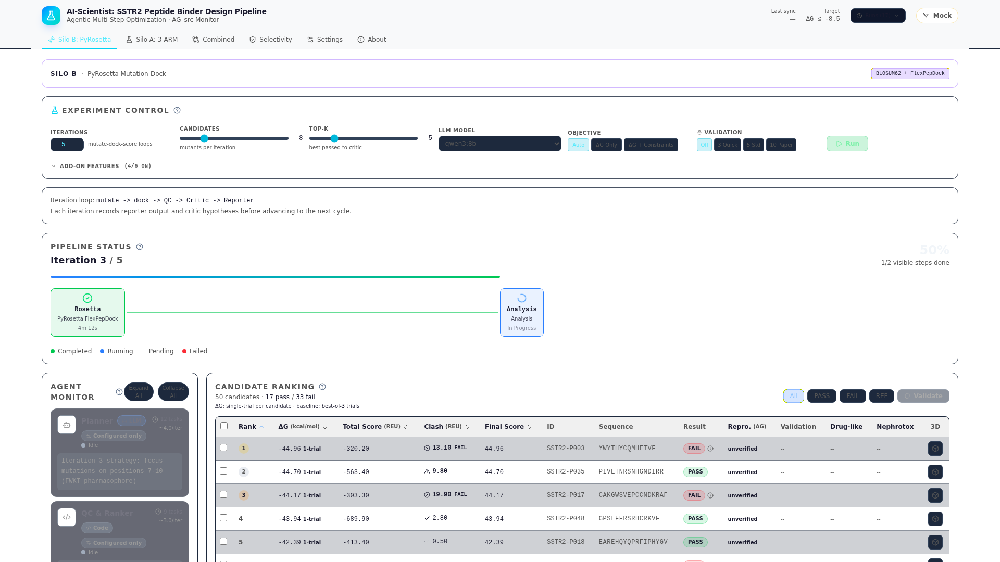

# SSTR2 방사성의약품 AI Co-Scientist
## Version B — 액션 리스트 순서 보고

2026-04-05 내부 보고 | 2026-03-09 회의 액션 아이템 대응 결과

<div class="ref">전체 보고서: 00_main/01_ACTION_ITEMS_RESPONSE_REPORT.md</div>

---

# 전체 현황 (1/2) — 액션 아이템

### A-01 ~ A-10

| 상태 | 건수 | 항목 |
|:----:|:----:|------|
| ✅ 완료 | **7** | A-01, 03, 04, 05, 08, 09, 10 |
| ⚠️ 진행 | **1** | A-02 (pepADMET descriptor) |

<div class="ref">상세: 00_main/01_ACTION_ITEMS_RESPONSE_REPORT.md §요약</div>

---

# 전체 현황 (2/2) — 핵심 수치

### 지표

| 지표 | 값 |
|------|------|
| 테스트 | **265 passed** |
| pharma 메서드 | **15개** (GT 8/8 일치) |
| SSTR selectivity | **CIF 5종 + FlexPepDock** |
| pepADMET | **env+MGA ✅ / descriptor ⚠️** |
| UI 패널 | **8개 정상** |

<div class="small">GT = Ground Truth (peptides PyPI v0.5.0 대비 검증)</div>

<div class="ref">상세: 00_main/01_ACTION_ITEMS_RESPONSE_REPORT.md §요약</div>

---

# A-01: 도구 조사 → 자체 구현 결정

### 기존 도구 검토 결과

| 도구 | 결과 | 사유 |
|------|:----:|------|
| PepCalc | ❌ | API 비공개, 웹 전용 |
| Biopython | ❌ | 펩타이드 약리 미지원 |
| peptides (PyPI) | ⚠️ | 일부만 지원, SS bond 미처리 |
| **자체 구현** | ✅ | **15개 메서드 완전 커버** |

→ **15메서드 자체 구현, 8/8 GT 일치** (6서열 × 13메서드 = 78 케이스, 오차 0.00%)

<div class="small">GT = peptides PyPI v0.5.0 대비 검증 (→ 부록 §A 조사·§B 15메서드 검증)</div>

<div class="ref">상세: pharma_properties_verification_report.md</div>

---

# A-01: 검증 결과 — 16건 버그 수정

### 주요 수정 사항

| 항목 | Before | After |
|------|--------|-------|
| DIWV 오류 | 16건 | **0건** |
| Boman 부호 | 반전 | **정상** |
| pI (SS 보정) | 9.04 | **10.62** |
| MW | 미구현 | **1639.91 Da** |
| 테스트 | 35개 | **62개** |

### pI 9.04 → **10.62** (등전점)

<div class="pi-explain">

**무엇이 바뀌었나**  
SST-14는 Cys3–Cys14 **이황화 결합(SS)** 이 잡힌 상태가 화학적으로 정답에 가깝다. 이 경우 해당 Cys의 **자유 티온(-SH)** 은 더 이상 “일반 Cys처럼” pH에 따라 이온화한다고 보지 않는 것이 맞다.

**왜 수치가 올라갔나**  
이전 구현은 SS가 있어도 Cys를 **이온화 가능 잔기로 그대로 넣어** pI를 계산했다. 그 결과 전하 균형이 과도하게 산성 쪽으로 잡혀 **pI가 지나치게 낮게(9.04)** 나왔다. SS를 반영해 해당 부분의 이온화 기여를 **보정**하면, 실제와 맞게 **더 알칼리 쪽(10.62)** 으로 교정된다.

</div>

<div class="pi-foot">한 줄 요약: SS로 묶인 Cys는 pI 계산에서 이온화 모델이 달라져야 하며, 그 보정이 9.04→10.62의 이유 (→ 부록 §A, §C)</div>

<div class="ref">상세: pharma_properties_verification_report.md</div>

---

# A-02: ADMETlab 부적합 → pepADMET 전환

### ADMETlab 3.0 부적합

- SSL 인증서 만료 + API 전부 404
- MW < 500 소분자 전용 → SST-14 (MW ~1600 Da) 적용 불가

### pepADMET (JCIM 2026) 선택 이유

- **36,643** 펩타이드 학습 데이터, **19** ADMET endpoint
- SS bond / 사이클릭 펩타이드 지원
- MGA 아키텍처 + 학습코드 **GitHub 공개** (재학습 가능)

<div class="small">(→ 부록 §E)</div>

<div class="ref">상세: admet_alternative_plan_20260402.md</div>

---

# A-02: pepADMET 통합 현황

### 진행 상태

| 항목 | 상태 |
|------|:----:|
| pepadmet env 구축 | ✅ |
| MGA 모델 로드 | ✅ |
| forward pass(추론) | ✅ |
| SMILES 변환 | ✅ |
| **descriptor 2133** | ⚠️ 진행중 |

#### Descriptor(2133)

<div class="descriptor-mini">

**Descriptor**: 구조를 **2133차원 숫자 벡터**로 만든 특성(feature·부분구조·통계 지표 등). **MGA** = 그래프 **RGCN** + 이 벡터 **동시 입력**. **`calculate_descriptors()`** 파이프라인 연동 후 논문과 동일 **full** 추론.

</div>

### 참고 사항

<div class="a02-notes">

- Toxicity 모델 공개 → **추론 성공** 확인
- HC50 R²=0.474 — descriptor 통합 후 개선 기대
- 현재 ADMET = in-house surrogate; descriptor 통합 시 대체 예정

</div>

<div class="small">(→ 부록 §E)</div>

<div class="ref">상세: admet_alternative_plan_20260402.md</div>

---

# A-03: Selectivity — SSTR 아형 선택성 검증

<div class="two-col">
<div>

### 수용체 구조

<div class="a03-tight">

| 역할 | 수용체 | PDB·파일 | 방법 |
|:----:|--------|----------|------|
| **표적** | SSTR2 | 예측 PDB | AF3 등 — SSTR2 ddG 기준 |
| Off | SSTR1 | **9IK8** | cryo-EM ~2.82 Å |
| Off | SSTR3 | **8XIR** | cryo-EM ~2.52 Å |
| Off | SSTR4 | **7XMT** | cryo-EM (Gi·소분자) |
| Off | SSTR5 | **8ZBJ** | cryo-EM ~2.94 Å |

</div>

<div class="a03-merge-note">

**7XNA** — RCSB **X-ray** SSTR2 펩타이드 co-crystal (~2.65 Å), cryo-EM 아님. 주 도킹은 `existing_pdb` 예측 구조; 7XNA는 참조·보조.

</div>

</div>
<div class="a03-merge-right">

### FlexPepDock · margin

<div class="a03b-steps">

1. CIF → PDB (BioPython)
2. FlexPepDock
3. `selectivity_margin` 계산
4. Gate **≥ 3.0 REU**

</div>

<div class="a03b-box">

<div class="a03b-eq">margin = ddG(off-target) − ddG(SSTR2)</div>
<div class="a03b-reu">단위: <b>REU</b></div>

</div>

<div class="a03b-foot">비표적 대비 SSTR2 결합 차이. 클수록 선택적 (→ 부록 §G)</div>

<div class="a03b-ok">구축완료 · 시뮬 가능</div>

</div>
</div>

<div class="ref">상세: action_response_report.md §A-03 · `pipeline_config_local.yaml`</div>

---

# A-04: Critic → ClusterReport (1/3)

## Before / After

### 원본 요구: "ClusterReport A~E 추가, 기존 실패 유형 분석은 로그 전용 전환"

| 변경 | Before | After |
|------|--------|-------|
| Critic 분석 방식 | 실패 유형 6종 분석 (주력) | **성공 후보 A~E 분류** (주력) |
| 실패 유형 분석 | 주력 기능 | **로그 전용** (No-Go 근거 문서화용) |
| 우선순위 결정 | 없음 | A→B→C→D→E 순서로 합성 배치 |

<div class="ref">상세: system_overview_for_biologists.md §4, Appendix D</div>

---

# A-04: Critic → ClusterReport (2/3)

## 운영·데이터 흐름 (`pyrosetta_flow/runner.py`)

- **실패·탈락** 사유는 로그·QC 리포트에 남기고, UI·의사결정의 **주력 표시는 A~E 클러스터**.
- 반복 끝에서 후보 `manifest`에 **A~E 분류를 붙여** 대시보드로 보내고, **합성·실험 우선순위**에 반영.
- **다음 반복** 계획: **ScientistCritic**의 가설·파라미터 제안이 `critic_feedback`으로 **Planner** 입력에 들어감. **Reporter**는 산출물·요약(md/json) **기록**(클러스터는 manifest 보강 단계에서 합류).

<div class="ref">상세: system_overview_for_biologists.md §4, Appendix D</div>

---

# A-04: Critic → ClusterReport (3/3)

## A~E 5등급 기준

| 등급 | 핵심 기준 |
|:----:|---------|
| A 결합 엘리트 | ddG ≤ -8 REU, clash ≤ 5, FWKT 유지 |
| B 선택성 특화 | selectivity margin ≥ 3.0 REU |
| C 안정성 강화 | II < 30*(보수적)*, BLOSUM 보존 |
| D 방사화학 최적 | GRAVY 중간, 전하 최소, 킬레이터 적합 |
| E 탐색 후보 | 상위 미충족 → MD 추가 검증 |

<div class="small">57 tests 통과. pLDDT 미실행 시 skip. II < 30: 논문 기준 40, 보수적 운용 (→ 부록 §F)</div>

<div class="ref">상세: system_overview_for_biologists.md §4, Appendix D</div>

---

# A-05: Step 3B — Tier 1/2/3 (1/3)

## 병렬 후보 생성

### 원본 요구: "BLOSUM62 Tier 1 / 물리화학 필터 Tier 2 / 비제한 Tier 3 병렬 구조로 재설계"

| Tier | 전략 | 허용 범위 | 후보 규모 |
|:----:|------|----------|:---------:|
| **Tier 1** | BLOSUM62 ≥ 0 보존 치환 | FWKT 고정, 안전 후보 | ≤ 1,000 |
| **Tier 2** | 물리화학 유사도 필터 | 소수성 \|Δ\| ≤ 3.0, 전하 ±1 | ≤ 10,000 |
| **Tier 3** | 비제한 자유 탐색 | D-AA, Aib, β-AA 포함 가능 | 탐색적 |

<div class="ref">상세: 02_SILO_B_TECHNICAL_REPORT.md §Tier</div>

---

# A-05: Step 3B — Tier 1/2/3 (2/3)

## 자원 배분 · 파이프라인 흐름

### Thompson Sampling → ddG 기반 Tier 자동 집중

```
Tier 1 (보존) ──┐
Tier 2 (확장) ──┼── Thompson Sampling (자동 배분)
Tier 3 (탐색) ──┘         ↓
              FlexPepDock (ddG 계산)
                    ↓
              Bayesian Optimization (유망 영역 집중)
                    ↓
              Pareto Front (ddG × selectivity × stability)
                    ↓
              Top-K → A~E 클러스터 분류
```

<div class="ref">상세: 02_SILO_B_TECHNICAL_REPORT.md §Tier</div>

---

# A-05: Step 3B — Tier 1/2/3 (3/3)

## Thompson · BO · 파레토 (요약)

<div class="a05-foot">

**Thompson Sampling** — ddG 성과가 좋은 Tier에 시도 횟수를 자동으로 몰아줌. **BO** — 서열·파라미터 공간에서 유망 구간을 효율적으로 더 탐색.

**파레토(Pareto)란?** 지표가 **둘 이상**(ddG·선택성·안정성 등)일 때, 어떤 후보도 **모든 지표를 동시에 더 좋게** 만들 수 없는 상태. **파레토 프론트**는 그런 “서로 깔 수 없는” 후보만 모은 경계(비지배 해). 가중합으로 한 점수로 합치기 **전에** 트레이드오프를 남긴 채 후보를 추리기 위해 쓴다 (→ 부록 §F-0).

</div>

<div class="ref">상세: 02_SILO_B_TECHNICAL_REPORT.md §Tier</div>

---

# A-08: 3종 메트릭 추가

| 메트릭 | 설명 | 상태 |
|--------|------|:----:|
| Selectivity Score | ddG margin 기반 SSTR2 선택성 | ✅ |
| Radiolysis Susceptibility | 방사선분해 감수성 점수 | ✅ |
| Chelator Compatibility | DOTA/NOTA 접합 적합성 | ✅ |

3종 메트릭 모두 스코어링 파이프라인에 통합 완료

<div class="ref">상세: action_response_report.md §A-08</div>

---

# A-09: JCIM 논문 분석 (pepADMET)

- pepADMET (JCIM 2026) 전문 분석 완료
- MGA 아키텍처, 학습 데이터 구성, 한계점(HC50 R²=0.474) 정리
- 재학습 가능성 및 in-house 데이터 확장 전략 수립

<div class="small">(→ 부록 §E)</div>

<div class="ref">상세: action_response_report.md §A-09</div>

---

# A-10: Radiolysis 구현

- `calculate_radiolysis_susceptibility()` 함수 구현
- Trp, Met, Cys 잔기 기반 방사선분해 감수성 점수 산출

<div class="small">(→ 부록 §B 수식·§I 메트릭)</div>

<div class="ref">상세: action_response_report.md §A-10</div>

---

# 파이프라인 아키텍처

<!-- mermaid 원본: docs/presentation/_build/mermaid/pipeline_arch_vb.mmd — PNG 재생성 시 mmdc로 빌드 -->


<div class="small">Silo B: PyRosetta 기반 구조적 도킹 파이프라인. GNINA = CNN 기반 도킹 스코어링. BO = Bayesian Optimization (→ 부록 §F-0 Tier·파레토, §F 클러스터; 전체 도는 system_architecture_guide.md)</div>

<div class="ref">상세: system_architecture_guide.md §2-3</div>

---

# UI 데모 — 멀티패널 대시보드 (1/2)

## 스크린샷



<div class="ref">라이브: http://localhost:5173</div>

---

# UI 데모 — 멀티패널 대시보드 (2/2)

## 패널 구성 (좌→우 흐름)

| 순서 | 패널 | 역할 |
|:----:|------|------|
| 1 | CandidateTable | 후보 목록, ddG·clash·클러스터 등 |
| 2 | Cluster A~E | 성공 후보 등급 분류 |
| 3 | ADMET | 독성·성질 예측 |
| 4 | Pharmacology | 약리 15메서드 |
| 5 | RCSB Match | 구조 매칭 |
| 6 | SAR | 구조–활성 관계 |
| 7 | Convergence | 탐색 수렴 |
| 8 | Selectivity | SSTR 아형별 ddG 비교 |

<div class="ref">라이브: http://localhost:5173</div>

---

# 시스템 감사 (1/2) — 수정 완료

| # | 이슈 | 수정 내용 | 상태 |
|---|------|---------|:----:|
| 7.1 | pLDDT = 0 → Cluster A 불가 | pLDDT 없으면 조건 skip | ✅ |
| 7.3 | validation_n_trials = 1 | 1 → 3 (통계 최소치) | ✅ |
| 7.4 | clash_max planner = 0 | 0 → 10 (기본값 통일) | ✅ |

<div class="ref">상세: system_architecture_guide.md §7</div>

---

# 시스템 감사 (2/2) — 진행 중

| # | 이슈 | 계획 | 상태 |
|---|------|------|:----:|
| 7.2 | ADMET surrogate 정확도 한계 | pepADMET descriptor 통합 시 해결 | ⏸️ |
| 7.5 | ddG threshold 고정값 | adaptive threshold 전환 예정 | ⏸️ |

<div class="small">†in-house surrogate: pharma_properties 기반 규칙 ADMET; pepADMET descriptor 2133 통합 후 대체</div>

<div class="ref">상세: system_architecture_guide.md §7</div>

---

# 향후 계획 (1/2) — 로드맵

| 우선순위 | 항목 | 의존성 |
|:-------:|------|--------|
| **즉시** | pepADMET descriptor 2133 통합 | 없음 |
| **즉시** | selectivity 비동기(async) 전환 | 없음 |
| **즉시** | ddG adaptive threshold 적용 | 없음 |
| **중기** | pepADMET 전 모델 재현 (6주 예상) | 학습 데이터 수집 |
| **중기** | Silo B 대규모 실행 (이론 처리량 22K) | GPU 서버 확보 |

<div class="ref">상세: pepadmet_reproduction_plan.md</div>

---

# 향후 계획 (2/2) — 논의 안건

1. pepADMET descriptor 2133 통합 **우선순위?**
2. 대규모 실행(22K 후보) **일정 및 서버 확보?**

<div class="ref">상세: pepadmet_reproduction_plan.md</div>

---

# 논의 안건 + Q&A (1/3)

## 의사결정 필요 사항

| # | 안건 | 선택지 |
|---|------|--------|
| 1 | pepADMET descriptor | 즉시(1주) / 전 모델 재현(6주)과 병행 |
| 2 | 대규모 실행 서버 | 내부 GPU / 클라우드 |

<div class="small">질의 시: pepADMET 재학습·HC50 활용·도킹 방식(블라인드 vs 위치 지정)·Selectivity 전체 실행 등은 부록·보충 자료와 함께 논의</div>

<div class="ref">전체 보고서: 00_main/01_ACTION_ITEMS_RESPONSE_REPORT.md</div>

---

# 논의 안건 + Q&A (2/3)

## 통합 부록 참조 (§A ~ §F) · `05_unified_appendix.md`

| § | 내용 |
|:---:|------|
| **§A** | 도구 전수 조사 (A-01) |
| **§B** | pharma 15메서드·검증·수식 (Radiolysis·Metal 등 포함) |
| **§C** | SS bond Cys 보정·pI |
| **§D** | DIWV Lookup 16건 버그 |
| **§E** · **§E-2** | pepADMET + Toxicity 모델 |
| **§F-0** | Tier 1/2/3 병렬·파레토·BO 맥락 |
| **§F** | A~E 클러스터·57 tests·II&lt;30 등 |

<div class="ref">부록은 Marp 슬라이드가 아닌 일반 마크다운 — 표지 `§별 목차` 또는 `## 부록 §X` 헤딩으로 바로 찾기</div>

---

# 논의 안건 + Q&A (3/3)

## 통합 부록 참조 (§G ~ §J)

| § | 내용 |
|:---:|------|
| **§G** | Selectivity·margin·CIF |
| **§H** | 반감기·PeptideCutter |
| **§I** | 13-메트릭 우선순위 |
| **§J** | Q&A 예상 질문 |
| 참고 문헌 | 참고 문헌 |

<div class="ref">전체 보고서: 00_main/01_ACTION_ITEMS_RESPONSE_REPORT.md · 상세 아키텍처: system_architecture_guide.md</div>
