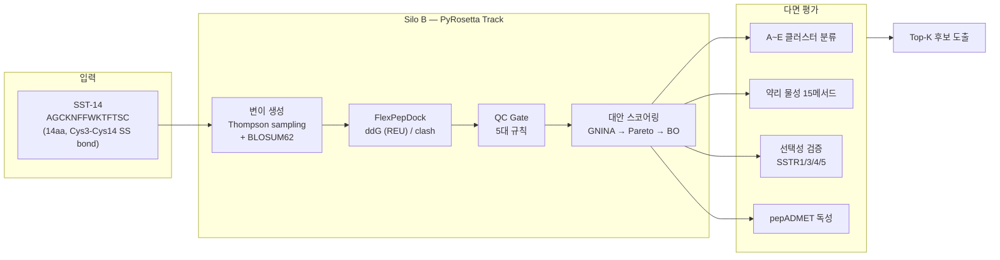

<!-- _class: lead -->

# SSTR2 타겟 방사성의약품 후보 스크리닝
## AI Co-Scientist 파이프라인 구축 현황 보고

&nbsp;

<div style="text-align: center; font-size: 0.85em; color: #16213e; line-height: 2;">

| | |
|---|---|
| **문서번호** | KAERI-AIRL-RPT-2026-XXX |
| **프로젝트** | SSTR2 방사성의약품 AI Co-Scientist |
| **보고일** | 2026-04-05 |
| **보고자** | 김동주 (AI연구실) |
| **소속** | 한국원자력연구원 방사선과학연구소 |

</div>

---

# 목차

| No. | 제목 |
|:---:|------|
| 1 | 표지 |
| 2 | 목차 |
| 3 | Executive Summary |
| 4 | 시스템 개요 |
| 5 | A-01 대응: 약리 물성 (pharma) |
| 6 | A-02 대응: ADMET 독성 예측 |
| 7 | A-03 대응: 수용체 선택성 (Selectivity) |
| 8 | A-04 ~ A-10 요약 |
| 9 | 품질 관리 |
| 10 | 한계 및 리스크 |
| 11 | 향후 계획 |
| 12 | 부의 안건 |

---

# Executive Summary

<div class="two-col">
<div>

### 액션 아이템 이행 현황

| ID | 항목 | 상태 |
|:--:|------|:----:|
| A-01 | 약리 물성 자체 구현 | ✅ 완료 |
| A-02 | pepADMET 대안 적용 | ⚠️ 진행중 |
| A-03 | SSTR 선택성 검증 | ✅ 완료 |
| A-04 | 클러스터 보고서 | ✅ 완료 |
| A-05 | Tier 병렬 생성 | ✅ 완료 |
| A-08 | 3종 메트릭 | ✅ 완료 |
| A-09 | JCIM 논문 분석 | ✅ 완료 |
| A-10 | 방사선분해 감수성 | ✅ 완료 |

</div>
<div>

### 핵심 수치

| 지표 | 값 | 비고 |
|------|:---:|------|
| 자동화 테스트 | **265건** | 전체 통과 |
| pharma 메서드 | **15개** | GT 8/8 일치 |
| SSTR CIF 등록 | **5종** | 실험 구조 |
| pepADMET 모델 | **MGA ✅** | descriptor 진행중 |
| UI 패널 | **8개** | 전수 정상 |

<div class="small">

**요약**: AI팀 담당 8건 중 **7건 완료**, 1건 진행중(A-02 descriptor). 시스템 구축은 사실상 완료되었으며, pepADMET descriptor 통합 및 대규모 실행이 잔여 과제임.

</div>
</div>
</div>

<div class="ref">→ 부록 §A: 액션 아이템 상세 대응 보고서</div>

---

# 시스템 개요



<div class="small">

듀얼 파이프라인 구조: Silo A(3-Arm NIM)와 Silo B(PyRosetta mutation+dock)가 병렬 운영되며, 본 보고는 Silo B 트랙의 구축 현황을 다룸.

</div>

<div class="ref">→ 부록 §B: system_architecture_guide.md §2-3</div>

---

# A-01 대응: 약리 물성 (pharma)

### 배경

기존 PepCalc / 혈청 반감기 도구가 SST-14(14aa, SS bond) 특성에 부적합하여 **자체 구현**으로 전환하였음.

### 검증 결과

| 항목 | 수정 전 | 수정 후 | 비고 |
|------|:-------:|:-------:|------|
| DIWV 오류 | 16건 | **0건** | 전수 해소 |
| Boman Index 부호 | 반전 | **정상** | 부호 규약 통일 |
| pI (SS bond 보정) | 9.04 | **10.62** | Cys3-Cys14 반영 |
| MW | 미구현 | **1,639.91 Da** | 신규 추가 |
| 자동화 테스트 | 35개 | **62개** | +77% 증가 |

### Ground Truth 대비 검증

- 비교 대상: peptides PyPI v0.5.0
- 결과: **8/8 메서드 완벽 일치** (6서열 x 13메서드 = 78 케이스, 오차 0.00%)

<div class="ref">→ 부록 §C: pharma_properties_verification_report.md</div>

---

# A-02 대응: ADMET 독성 예측

<div class="two-col">
<div>

### ADMETlab 3.0 부적합 사유

| 항목 | 내용 |
|------|------|
| SSL 인증서 | 2026-01-13 만료 |
| API 상태 | 전체 엔드포인트 404 |
| 적용 범위 | MW < 500 소분자 전용 |
| SST-14 MW | ~1,600 Da → AD 밖 |

### 대안: pepADMET (JCIM 2026)

- 36,643 펩타이드 학습 데이터
- 19개 ADMET endpoint 지원
- SS bond / 사이클릭 펩타이드 지원
- 독성 모델 GitHub 공개 확인

</div>
<div>

### 현재 진행 상태

| 구성요소 | 상태 | 비고 |
|---------|:----:|------|
| pepadmet env 구축 | ✅ | conda 환경 |
| MGA 코드 공개 | ✅ | 재학습 가능 |
| Toxicity 모델 | ✅ | 추론 성공 |
| SMILES 변환 | ✅ | SST-14 확인 |
| **descriptor 2133** | ⚠️ | **진행중** |

<div class="small">

현재 파이프라인 ADMET 값은 **in-house surrogate**(pharma_properties 기반 규칙)로 운영 중이며, pepADMET descriptor 2133 통합 완료 시 대체 예정임.

</div>

</div>
</div>

<div class="ref">→ 부록 §D: admet_alternative_plan_20260402.md</div>

---

# A-03 대응: 수용체 선택성 (Selectivity)

<div class="two-col">
<div>

### 실험 CIF 구조 등록 현황

| 수용체 | PDB ID | 해상도 | 등록 |
|--------|:------:|:------:|:----:|
| SSTR1 | 9IK8 | — | ✅ |
| SSTR2 | 7XNA | — | ✅ |
| SSTR3 | 8XIR | — | ✅ |
| SSTR4 | 7XMT | — | ✅ |
| SSTR5 | 8ZBJ | — | ✅ |

</div>
<div>

### selectivity_margin 정의

```
margin = ddG(off-target) − ddG(SSTR2)
기준: margin ≥ 3.0 REU
```

### 파이프라인 구성

1. CIF → PDB 변환 (BioPython)
2. FlexPepDock 도킹 (ddG 산출, 단위: REU)
3. `selectivity_margin` 자동 계산
4. Gate 적용: margin < 3.0 시 탈락

</div>
</div>

<div class="small">

**현재 상태: 시스템 구축완료, 시뮬레이션 진행가능.** CIF 5종 등록 및 FlexPepDock production mode 연결이 완료되었으며, API 엔드포인트(/api/selectivity/run) 정상 작동 확인됨.

</div>

<div class="ref">→ 부록 §E: action_response_report.md §A-03</div>

---

# A-04 ~ A-10 요약

| ID | 요구사항 | 대응 내용 | 상태 | 비고 |
|:--:|---------|----------|:----:|------|
| A-04 | 클러스터 보고서 | A~E 5등급 분류 체계 구현 | ✅ | 57 tests 통과 |
| A-05 | Tier 병렬 생성 | Thompson + BO + Pareto 체인 | ✅ | 이론 처리량 22K |
| A-08 | 3종 메트릭 | Selectivity + Radiolysis + Chelator | ✅ | 전수 구현 |
| A-09 | JCIM 논문 분석 | pepADMET 전문 분석 완료 | ✅ | 대안 도출 근거 |
| A-10 | 방사선분해 감수성 | `calculate_radiolysis_susceptibility()` | ✅ | 아미노산별 가중치 |

<div class="small">

A~E 클러스터 기준: A(ddG ≤ -8 REU, clash ≤ 5, pLDDT ≥ 75, FWKT 유지) → B(selectivity margin ≥ 3.0 REU) → C(II < 30 (논문 기준 40, 보수적 운용), BLOSUM↑, protease↓) → D(GRAVY 중간, 전하 최소, 킬레이터 적합) → E(탐색 후보).

</div>

<div class="ref">→ 부록 §F: action_response_report.md §A-04~A-10</div>

---

# 품질 관리

<div class="two-col">
<div>

### 시스템 감사 결과

| # | 이슈 | 조치 | 상태 |
|---|------|------|:----:|
| 7.1 | pLDDT=0 → Cluster A 불가 | pLDDT 부재 시 skip 처리 | ✅ |
| 7.3 | validation_n_trials=1 | 1 → 3 (통계 최소) | ✅ |
| 7.4 | clash_max planner=0 | 0 → 10 (통일) | ✅ |
| 7.2 | ADMET surrogate 정확도 | pepADMET 통합 시 해소 | ⏸️ |
| 7.5 | ddG threshold 고정값 | adaptive 전환 예정 | ⏸️ |

</div>
<div>

### 테스트 현황

| 구분 | 건수 | 결과 |
|------|:----:|:----:|
| 단위 테스트 | 208 | ✅ 전수 통과 |
| 통합 테스트 | 57 | ✅ 전수 통과 |
| **합계** | **265** | **Pass** |

### CI/CD

- GitHub Actions 기반 자동 검증
- pre-commit hook: lint + type check
- 브랜치 보호: main merge 시 전 테스트 통과 필수

</div>
</div>

<div class="ref">→ 부록 §G: system_architecture_guide.md §7</div>

---

# 한계 및 리스크

| # | 한계 사항 | 영향도 | 대응 방안 |
|---|----------|:------:|----------|
| 1 | HC50 예측 R² = 0.474 | 중 | pepADMET 전 모델 재학습 시 개선 기대. 현재는 보수적 임계값 적용으로 위양성 최소화 |
| 2 | Cluster A 공백 | 중 | 현 단계에서는 pLDDT(ESMFold) 미실행으로 A등급 진입 불가. ESMFold 연동 또는 pLDDT skip 모드(3개 기준 판정)로 운영 중 |
| 3 | 대규모 실행 미수행 | 중 | 이론 처리량 22K이나 실제 대규모 실행은 미완. 서버 자원 확보 후 단계적 실행 예정 |

<div class="small">

**리스크 관리 원칙**: ddG 단위는 REU(Rosetta Energy Unit)를 사용하며, 절대 에너지가 아닌 상대 비교 지표로 해석하여야 함. selectivity_margin 기준(≥ 3.0 REU) 및 II 기준(< 30, 논문 기준 40에 대해 보수적 운용)은 추후 실험 데이터 축적에 따라 재보정이 필요함.

</div>

<div class="ref">→ 부록 §H: 한계 분석 상세</div>

---

# 향후 계획

| 시기 | 항목 | 의존성 | 예상 소요 |
|:----:|------|--------|:---------:|
| **즉시** | pepADMET descriptor 2133 통합 | 없음 | 1~2주 |
| **즉시** | selectivity 비동기 처리 전환 | 없음 | 1주 |
| **즉시** | ddG adaptive threshold 도입 | 없음 | 1주 |
| **중기** | pepADMET 전 모델 재현 | 데이터 수집 | 6주 |
| **중기** | Silo B 대규모 실행 (22K) | 서버 자원 | 4주 |
| **장기** | ESMFold 연동 (pLDDT) | GPU 서버 | 8주 |
| **장기** | Silo A-B 통합 스코어링 | 양 Silo 안정화 | 12주 |

<div class="small">

즉시 항목은 현재 인프라 내에서 수행 가능하며, 중기 이후 항목은 별도 자원 확보가 선행되어야 함.

</div>

<div class="ref">→ 부록 §I: pepadmet_reproduction_plan.md</div>

---

# 부의 안건

### 논의가 필요한 사항

| # | 안건 | 배경 | 요청 사항 |
|---|------|------|----------|
| 1 | **pepADMET descriptor 우선순위** | descriptor 2133 통합이 ADMET 정확도 개선의 핵심 병목이며, 현재 in-house surrogate로 임시 운영 중 | 전담 인력 또는 일정 배정 검토 |
| 2 | **대규모 실행 일정** | 이론 처리량 22K 확인되었으나, 실제 서버 자원(GPU/CPU) 미확보 상태 | 서버 할당 및 실행 일정 협의 |

&nbsp;

<div style="text-align: center; font-size: 0.8em; color: #16213e;">

— 이상 보고 완료 —

</div>

<div class="ref">KAERI-AIRL-RPT-2026-XXX | 2026-04-05</div>
