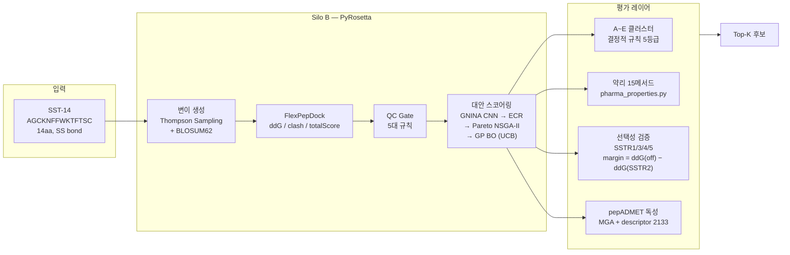
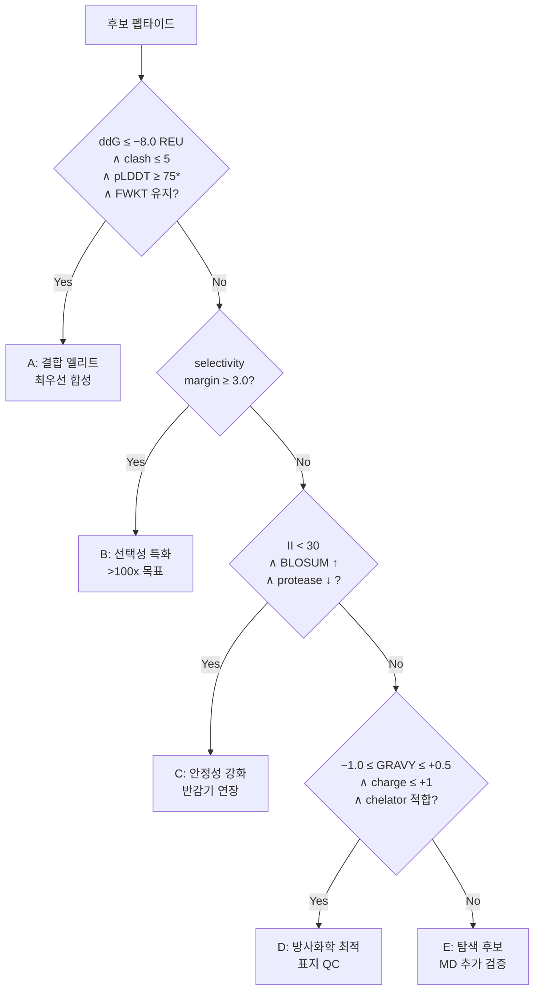

# SSTR2 방사성의약품 AI Co-Scientist
## Version E — 기술 심층 보고

2026-04-05 내부 보고 (30분 발표 / 인쇄물 배포용)
SST-14: `AGCKNFFWKTFTSC` (14aa, Cys3-Cys14 SS bond, FWKT pharmacophore)

<div class="ref">전체 보고서: 03_SILO_B_MASTER_PRESENTATION_REPORT.md</div>

---

# 목차

| # | 슬라이드 | 핵심 내용 |
|---|---------|---------|
| 3 | 전체 현황 | 10개 액션 상태 + 수치 + 커밋 요약 |
| 4 | 파이프라인 아키텍처 | Mermaid + 각 단계 설명 |
| 5–6 | A-01 도구 조사 / 자체 구현 | 18개 도구 전수 조사 + 15메서드 78케이스 검증 |
| 7 | A-01 SS bond 보정 | pI 수식, Henderson-Hasselbalch, 9.04→10.62 |
| 8–9 | A-02 ADMETlab / pepADMET | 6개 도구 탈락 + JCIM 2026 논문 상세 |
| 10 | A-03 Selectivity | CIF 5종 + FlexPepDock + margin 수식 |
| 11 | A-04 ClusterReport | A~E 분류 기준 상세 수식 |
| 12 | A-05 Tier 구조 | Thompson + GP BO + Pareto NSGA-II |
| 13 | A-08~A-10 | 3종 메트릭 수식 |
| 14 | 13-메트릭 우선순위 | 5단계 등급표 |
| 15 | 반감기 예측 | step08 알고리즘 상세 |
| 16 | UI 대시보드 | 멀티패널 스크린샷 |
| 17 | 시스템 감사 | 5건 상세 |
| 18 | 향후 계획 | 즉시/중기/장기 + 의존성 |
| 19 | 논의 안건 + Q&A | |

---

# 전체 현황 — 10개 액션 + 수치 + 커밋

<div class="two-col">
<div>

### 액션 아이템 (A-01~A-10)

| 상태 | 건수 | 항목 |
|:----:|:----:|------|
| ✅ | **7** | A-01,03,04,05,08,09,10 |
| ⚠️ | **1** | A-02 (pepADMET descriptor 2133) |

### 핵심 수치

| 지표 | 값 |
|------|------|
| 테스트 전체 | **265 passed** |
| pharma 메서드 | **15개** (GT 78케이스 0오차) |
| SSTR selectivity | **CIF 5종 + FlexPepDock production** |
| pepADMET | **env ✅ / MGA ✅ / descriptor ⚠️** |
| UI 패널 | **8개 정상** |

</div>
<div>

### 주요 커밋 이력

| 커밋 | 내용 |
|------|------|
| `eb213c9` | DIWV 16건 수정, GT 0-error |
| `e5bcb51` | SS bond pI 보정, MW 추가 |
| `e5790dd` | cluster_report A~E, 57 tests |
| `ec4982f` | SSTR1/3/4/5 CIF 등록 |
| `b54f2d9` | selectivity production mode |
| `488bc71` | selectivity API 3 endpoints |
| `a5bc5fc` | SelectivityPage 4 components |

</div>
</div>

<div class="ref">상세: 01_ACTION_ITEMS_RESPONSE_REPORT.md §요약</div>

---

# 파이프라인 아키텍처



<div class="small">

**데이터 흐름**: `flexpep_dock.py` → `qc_ranker.py` (ddG primary) → `StatusEmitter` → JSON → `/api/status` → Dashboard.
ADMET/Pharma는 서열 기반 별도 호출 (`/api/admet/batch`, `/api/pharmacology/batch`) — 파이프라인 JSON과 독립.
ddG 단위: REU (Rosetta Energy Unit). 물리적 kcal/mol과 비례하나 1:1 대응 아님 (→ 부록 §C).

</div>

<div class="ref">상세: 02_SILO_B_TECHNICAL_REPORT.md §3</div>

---

# A-01 도구 조사 — 18개 전수 조사 결과

### 회의록 추천 도구 11개 + Gemini 추가 7개

| # | 도구 | 회의록 설명 | 실제 결과 | 접속 | SST-14 적용 |
|---|------|-----------|---------|:----:|:-----------:|
| 1 | **PepCalc** (Innovagen) | "혈장 반감기 예측 특화" | **설명 과장**. MW/pI 계산기. 반감기 기능 없음 | ✅ | 물성만 |
| 2 | **Peptide2.0** | "Novo Nordisk 기반" | **합성 회사**. 계산 도구 아님 | ✅ | 해당없음 |
| 3 | **PEPlife 2.0** (IIITD) | "반감기 예측" | 비교적 신뢰. r=0.743, 163 데이터 | ✅ | 참고용 |
| 4 | **PlifePred** (IIITD) | "혈액/혈청 반감기 전용" | 비교적 신뢰. cyclic 학습 부재 | ✅ | screening용 |
| 5 | **ExPASy PeptideCutter** | "프로테아제 절단 hotspot" | **신뢰.** 웹 전용 (API 없음) | ✅ | 가능 |
| 6 | **ProteinSol** | "protease liability" | **오해**: solubility 도구 (맨체스터대) | ✅ | 간접 |
| 7 | **DPPred** | "ExPASy 연동" | 공식 서비스 확인 불가 | ❓ | 불명 |
| 8 | **PepAnalyzer** | "반감기 포함 15종" | 논문 존재, 서버 타임아웃 | ❌ | 불가 |
| 9 | **Stability** (BiRNN) | "비특이 상호작용" | 실체 불확실 | ❓ | 불명 |
| 10 | **ADMETlab 3.0** | "HLM/RLM 안정성" | SSL 만료, MW<500 학습 | ⚠️ | **부적합** |
| 11 | **SwissADME** | "logP, solubility" | 소분자 전용, 펩타이드 불가 | ✅ | **부적합** |

<div class="small">

**Gemini 추가 7개**: ProtParam(✅ 자체구현), HSPred(대체), juliomarcopineda/peptide-serum-stability(SS bond 직접 구현), FrankWanger/ML_Peptide(위장관 한정), CamSolPTM(불확실), Deep-SStable(불확실), ProtLifePred(미존재).
**총평**: 18개 중 신뢰 가능 4~5개. SST-14 cyclic 변형체 특화 도구 = **0개**. → 자체 구현 결정.

</div>

<div class="ref">상세: 01_ACTION_ITEMS_RESPONSE_REPORT.md §A-01 전수 조사 (→ 부록 §A)</div>

---

# A-01 자체 구현 — 15메서드 + 검증 78케이스

<div class="two-col">
<div>

### 구현 메서드 (15개)

| # | 메서드 | 출처/근거 |
|---|--------|---------|
| 1 | GRAVY | Kyte-Doolittle 1982 |
| 2 | Boman Index | Boman 2003 |
| 3 | Instability Index | Guruprasad 1990 |
| 4 | Aliphatic Index | Ikai 1980 |
| 5 | pI (SS 보정) | Henderson-Hasselbalch |
| 6 | MW (SS 보정) | 모노이소토픽 합산 |
| 7 | Extinction Coeff. | Gill-von Hippel |
| 8 | N-end Rule t½ | Bachmair 1986 |
| 9 | Hydrophobic Moment (μH) | Eisenberg 1982 |
| 10 | Wimley-White | Wimley-White 1996 |
| 11 | Net Charge | pKa 합산 |
| 12 | Protease Sites (6종) | Chymo/Tryp/NEP/Pep/Elas/DPP-IV |
| 13 | BLOSUM62 Score | Henikoff-Henikoff 1992 |
| 14 | Metal Coordination | Ga3+ D/E 배위 |
| 15 | Radiolysis Susceptibility | 잔기별 가중치 합산 |

</div>
<div>

### 구조 규칙 (5개)

1. **FWKT 보존** (7-10번 위치)
2. **K9-D122 salt bridge**
3. **Cys3-Cys14 SS bond**
4. **Phe6-Phe11 aromatic stacking**
5. **N-term chelator 부착 적합성**

### Ground Truth 검증

**`peptides` PyPI v0.5.0** (독립 오픈소스) 대비

| 항목 | 결과 |
|------|------|
| 대조 메서드 | **8/8** 완벽 일치 |
| 서열 수 | **6** (SST-14 포함) |
| 총 케이스 | **6 x 13 = 78** |
| 오차 | **0.00%** |

**수정 이력**: DIWV lookup 16건, RW 테이블 3건, Boman 부호 반전, N-end Rule P 통일 → 커밋 `eb213c9`

</div>
</div>

<div class="ref">상세: pharma_properties_verification_report.md (→ 부록 §A)</div>

---

# A-01 SS bond 보정 — pI 수식 상세

### Henderson-Hasselbalch 기반 등전점 계산

<div class="formula">

**pI 알고리즘** — 이분법(bisection) 탐색:
1. pH를 0~14 범위에서 이분법으로 탐색
2. 각 pH에서 전체 잔기의 전하 합산 (net charge → 0에 수렴하는 pH = pI)

**각 잔기의 전하 계산** (Henderson-Hasselbalch):
- 양전하 잔기 (N-term, K, R, H): `charge = +1 / (1 + 10^(pH − pKa))`
- 음전하 잔기 (C-term, D, E, C, Y): `charge = −1 / (1 + 10^(pKa − pH))`

</div>

### SS bond Cys 제외 로직

<div class="formula">

**핵심**: Cys의 pKa = 8.18 (thiol). 이황화 결합(SS bond)을 형성한 Cys는 thiol이 산화됨 → **이온화 불가** → pI 계산에서 제외해야 함.

`calculate_pi(sequence, ss_bond_cysteines=[3, 14])`
- SST-14의 Cys3, Cys14는 SS bond → pI 음전하 항에서 제외
- 나머지 잔기만으로 전하 합산

</div>

### 결과 비교

| 조건 | pI | 의미 |
|------|:----:|------|
| SS bond 무시 (기존) | **9.04** | Cys2개의 thiol(pKa 8.18)이 음전하에 기여 → pI 낮아짐 |
| SS bond 보정 (수정) | **10.62** | Cys 제외 → 양전하(K, R) 우세 → pI 상승 |

<div class="small">

**임상적 의미**: pI 10.62 → 생리 pH(7.4)에서 강한 양전하. 신장 사구체 음전하 막과 정전기 상호작용 → **신장 클리어런스에 직접 영향**. 방사성의약품의 신장 축적/배설 예측에 필수 보정 (→ 부록 §A).

</div>

<div class="ref">상세: pharma_properties.py `calculate_pi()`, 커밋 e5bcb51</div>

---

# A-02 ADMETlab 부적합 — 6개 도구 탈락 상세

### ADMETlab 3.0 구체 사유

| 사유 | 상세 |
|------|------|
| **SSL 인증서 만료** | `notAfter=2026-01-13` — 3개월째 미갱신. HTTPS 접속 불가 |
| **API 전부 404** | 모든 REST endpoint 응답 없음 |
| **소분자 전용 학습** | NAR 2024 논문에 "peptide" 언급 0회. 400K+ entries 전부 drug-like 소분자 |
| **AD(Applicability Domain) 이탈** | 학습 MW 분포 150–500 Da. SST-14 MW ~1,640 Da → 외삽 = 무의미 |
| **온프레미스 불가** | 소스/모델 비공개. 웹서비스 전용. GitHub 없음 |

### 기타 5개 도구 탈락 사유

| 도구 | 탈락 사유 |
|------|---------|
| **pkCSM** | 소분자 전용, SMILES 입력 only, 펩타이드 MW 한계 |
| **admetSAR** | 소분자 전용, Lipinski Rule of Five 기반 |
| **ProTox** | 독성 예측만, 소분자 fingerprint 기반 |
| **SwissADME** | 소분자 전용 (MW<500 학습) |
| **Deep-PK** | 서버 다운 / 소분자 전용 |

<div class="small">

**근본 문제**: 시장 ADMET 도구 대부분 = FDA 신약 개발용 소분자(Lipinski, MW<500) 학습. 펩타이드(MW 200–5,000, 프로테아제 분해 경로, 신장 배설)는 완전히 다른 약동학 → 소분자 모델 예측 불가 (→ 부록 §B).

</div>

<div class="ref">상세: admet_alternative_plan_20260402.md §1, serum_stability_admet_tools_report.md</div>

---

# A-02 pepADMET 도입 — JCIM 2026 논문 상세

<div class="two-col">
<div>

### 논문 스펙 (JCIM 2026, 66, 936-946)

| 항목 | 내용 |
|------|------|
| 학습 데이터 | **36,643**개 실험 데이터 |
| ADMET endpoint | **19**개 통합 평가 |
| 지원 유형 | 선형/사이클릭/변형(200종) |
| SS bond 검증 | Desmopressin (Cys1-Cys6) case study |
| Toxicity 모델 | MLR-GAT, binary AUC **0.885** |
| HC50 (용혈) | R² = **0.474** (보조 지표) |
| 코드 | GitHub 공개 (MGA + Toxicity .pth) |

### 4-Layer 통합 아키텍처

```
Layer 1: pharma_properties (15메서드, 즉시)
Layer 2: pepADMET Toxicity (.pth, 즉시)
Layer 3: Half-life/BBB/LogD (재학습, 6주)
Layer 4: PharmPapp 투과도 (중기)
─────────────────────────────
총 32 endpoint (vs ADMETlab 34)
단, 전부 펩타이드 AD 안
```

</div>
<div>

### 현재 진행 상태

| 항목 | 상태 | 비고 |
|------|:----:|------|
| `pepadmet` conda env | ✅ | Python 3.7 + DGL 0.4.3 |
| MGA 모델 로드 | ✅ | `toxicity_early_stop.pth` |
| forward pass (추론) | ✅ | binary + 6-class OK |
| SMILES 변환 | ✅ | SS bond 포함 |
| Toxicity AUC | ✅ | 0.885 (논문 재현) |
| **descriptor 2133** | ⚠️ | PyBioMed+modlAMP+RDKit 진행중 |
| HC50 R² | — | 0.474 → 보조 지표로만 사용 |
| Half-life 재학습 | ❌ | 데이터 수집 필요 (6주 계획) |

### Toxicity 모델 상세

<div class="formula">

**MLR-GAT** (Multi-Level Readout Graph Attention):
- 입력: SMILES → DGL 분자 그래프
- 3-level readout: atom/bond/global
- Binary: toxic/non-toxic (AUC 0.885)
- 6-class: hemostasis/hepato/neuro/nephro/cardio/cytotox (AUC 0.949)
- 가중치: GitHub 공개 → 재학습 가능

</div>

</div>
</div>

<div class="ref">상세: pepadmet_reproduction_plan.md, admet_alternative_plan_20260402.md (→ 부록 §B)</div>

---

# A-03 Selectivity — CIF 5종 + FlexPepDock 프로토콜

<div class="two-col">
<div>

### 수용체 구조 (실험 CIF)

| 수용체 | PDB ID | 해상도 | 상태 |
|--------|--------|:------:|:----:|
| SSTR1 | **9IK8** | cryo-EM | ✅ |
| SSTR2 | **7XNA** | cryo-EM | ✅ |
| SSTR3 | **8XIR** | cryo-EM | ✅ |
| SSTR4 | **7XMT** | cryo-EM | ✅ |
| SSTR5 | **8ZBJ** | cryo-EM | ✅ |

**참고**: 원본 요구사항은 AlphaFold 구조 사용. 실제로는 **실험 구조(cryo-EM CIF)** 가 5종 모두 존재하므로 실험 구조를 우선 채택 → 예측 구조보다 신뢰도 높음.

</div>
<div>

### FlexPepDock 프로토콜

<div class="formula">

**입력**: CIF → PDB 변환 (BioPython)
**도킹**: Rosetta FlexPepDock (low-res → high-res)
**출력**: ddG (REU), clash_score, total_score

**Selectivity Margin 계산**:
`margin = min(ddG(SSTR1), ddG(SSTR3), ddG(SSTR4), ddG(SSTR5)) − ddG(SSTR2)`

**해석**: margin > 0 → off-target 결합이 더 약함 = 좋음
**Gate**: margin ≥ 3.0 REU → Cluster B 자격

</div>

### API 엔드포인트

| API | 기능 |
|-----|------|
| `/api/selectivity/run` | 도킹 실행 |
| `/api/selectivity/status` | 진행 상태 |
| `/api/selectivity/results` | margin 결과 |

**"시스템 구축 완료, 시뮬레이션 진행 가능"**

</div>
</div>

<div class="small">

ddG 단위: REU (Rosetta Energy Unit). 물리적 kcal/mol과 비례하나 1:1 대응 아님. Rosetta 에너지 함수 ref2015 기준 (→ 부록 §C).

</div>

<div class="ref">상세: action_response_report.md §A-03, step05b_selectivity.py</div>

---

# A-04 ClusterReport — A~E 분류 기준 상세



### 각 등급 상세 조건

| 등급 | 조건 수식 | 의미 |
|:----:|---------|------|
| **A** | `ddG ≤ −8.0 ∧ clash ≤ 5 ∧ pLDDT ≥ 75 ∧ FWKT intact` | 결합 엘리트. 4조건 AND |
| **B** | `margin ≥ 3.0` (= ddG(off) − ddG(SSTR2)) | SSTR2 전용. off-target 배제 |
| **C** | `II < 30 ∧ BLOSUM62 ≥ median ∧ protease_sites ≤ 2` | 안정성. **II<30**: 논문 40, 보수적 운용 |
| **D** | `−1.0 ≤ GRAVY ≤ +0.5 ∧ net_charge ≤ +1 ∧ metal_coord ≥ 1` | 방사화학. 킬레이터 부착 최적 |
| **E** | 상위 A~D 미충족 | 탐색. 비보존 치환, 새 접촉 패턴 |

<div class="small">

*pLDDT: ESMFold 미실행 시 조건 skip (나머지 3개 기준으로 판정). 테스트: **57/57** 통과 (경계값, 복합조건, 우선순위 충돌 포함).
**II<30 근거**: Guruprasad(1990)은 II≥40을 불안정으로 분류. 본 파이프라인은 **안정성 강화** 후보 선별 목적이므로 40보다 보수적인 30을 채택 (→ 부록 §D).

</div>

<div class="ref">상세: cluster_report.py, test_cluster_report.py (커밋 e5790dd)</div>

---

# A-05 Tier 구조 — Thompson + GP BO + Pareto NSGA-II

<div class="two-col">
<div>

### 원안 vs 구현

| 원안 (회의록) | 실제 구현 | 대응 |
|------------|---------|------|
| Tier 1: BLOSUM62 | `step03b_blosum_mutation.py` + Thompson Sampling | 진화적 허용 치환 |
| Tier 2: 물리화학 필터 | `pharma_properties.py` QC (pI/GRAVY/II/protease) | 물성 기반 필터 |
| Tier 3: 비제한 탐색 | `bayesian_optimizer.py` GP + UCB | 능동 탐색 |

### Thompson Sampling

<div class="formula">

각 mutation 위치 i의 성공률 `θᵢ ~ Beta(αᵢ, βᵢ)`
1. 각 위치에서 θ 샘플링
2. θ 최대 위치 선택 → 변이 적용
3. FlexPepDock 결과로 α (성공) 또는 β (실패) 업데이트
**탐색-활용 균형 자동 달성** (비율 수동 설정 불필요)

</div>

</div>
<div>

### Bayesian Optimization (GP + UCB)

<div class="formula">

**Gaussian Process 서로게이트**:
`f(x) ~ GP(μ(x), k(x, x'))`
- 입력 x: 서열 인코딩 (BLOSUM62 행렬 기반)
- 출력: ddG 예측 분포

**UCB (Upper Confidence Bound)**:
`a(x) = μ(x) − κ·σ(x)`
- κ: 탐색-활용 계수 (기본 2.0)
- 높은 σ = 미탐색 영역 → 탐색
- 낮은 μ = 좋은 ddG → 활용

</div>

### Pareto NSGA-II

<div class="formula">

**다목적 최적화** (2+ 목적 함수 동시):
- 목적 1: ddG 최소화 (결합력)
- 목적 2: II 최소화 (안정성)
- 목적 3: protease_sites 최소화
→ **Pareto front**: 어떤 목적도 다른 것을 희생하지 않는 비지배 해 집합

</div>

**테스트**: GNINA 24 + Pareto 9 + BO 27 = **60 tests** 통과

</div>
</div>

<div class="ref">상세: runner.py, bayesian_optimizer.py, pareto_ranking.py (→ 부록 §E)</div>

---

# A-08~A-10 — 3종 메트릭 수식

### 1. Selectivity Margin Index (A-08)

<div class="formula">

`SMI = min{ ddG(SSTR1), ddG(SSTR3), ddG(SSTR4), ddG(SSTR5) } − ddG(SSTR2)`
- SMI > 0: SSTR2에 더 강하게 결합 = 좋음
- Gate: SMI ≥ 3.0 REU → Cluster B 자격
- ddG: REU (Rosetta Energy Unit). 물리적 kcal/mol과 비례하나 1:1 대응 아님.
- 구현: `step05b_selectivity.py` → `compute_selectivity_margin()`

</div>

### 2. Radiolysis Susceptibility (A-10)

<div class="formula">

`RS = Σ (residue_weight × count)`

| 잔기 | 가중치 | 근거 |
|------|:------:|------|
| Met (M) | 3.0 | 황 라디칼, 산화 최취약 |
| Trp (W) | 3.0 | 인돌 고리, 방사선 최취약 |
| Cys (C) | 2.0 | SS bond 파괴 위험 |
| His (H) | 2.0 | 이미다졸 고리 |
| Tyr (Y) | 1.0 | 페놀 고리 |
| Phe (F) | 0.5 | 방향족 (상대적 안정) |

SST-14 예시: W8(3.0) + C3(2.0) + C14(2.0) + F7(0.5) + F11(0.5) = **총 8.0**, risk = **high**
FWKT 약물단 내 W8 = **critical** (약효 필수 잔기가 방사선 취약)

</div>

### 3. Chelator Binding Compatibility (A-08)

<div class="formula">

`CBC = count(D or E with carboxylate free) + N-term_chelator_score`
- `analyze_metal_coordination(seq)`: Asp(D)/Glu(E)의 카르복실레이트가 Ga3+(또는 Lu3+) 배위 가능 여부
- N-term: DOTA/NOTA 킬레이터 부착 위치 (구조 규칙 #5)
- 테스트: 6 tests (Ga3+ D/E 배위) + 31 tests (radiolysis) 통과

</div>

<div class="ref">상세: pharma_properties.py, step05b_selectivity.py (→ 부록 §C, §E)</div>

---

# 13-메트릭 우선순위 — 5단계 등급

| # | 메트릭 | 등급 | 근거 | 구현 |
|---|--------|:----:|------|------|
| 1 | **ddG (binding)** | ★★★★★ | 결합력 직접 측정. 모든 Cluster의 1차 기준 | `flexpep_dock.py` |
| 2 | **Selectivity Margin** | ★★★★★ | SSTR2 전용 결합 = 부작용 차단. Cluster B 게이트 | `step05b_selectivity.py` |
| 3 | **FWKT Conservation** | ★★★★★ | 약물단 손실 = 약효 소멸. 절대 보존 | 구조 규칙 #1 |
| 4 | **Instability Index** | ★★★★☆ | 혈청 안정성 surrogate. <30 = 안정 | `calculate_instability_index()` |
| 5 | **Protease Sites** | ★★★★☆ | 6종 효소 절단 = 반감기 감소. 최소화 목표 | `count_protease_sites()` |
| 6 | **Clash Score** | ★★★★☆ | 구조적 충돌 = 도킹 아티팩트. ≤5 필수 | `flexpep_dock.py` |
| 7 | **pI (SS 보정)** | ★★★☆☆ | 신장 클리어런스 예측. 양전하 → 재흡수 | `calculate_pi(ss_bond=True)` |
| 8 | **GRAVY** | ★★★☆☆ | 소수성 균형. 극단값 = 용해도/투과성 문제 | `calculate_gravy()` |
| 9 | **Radiolysis** | ★★★☆☆ | 방사선 자기분해 위험. 방사성의약품 특유 | `calculate_radiolysis_susceptibility()` |
| 10 | **Chelator Compat.** | ★★★☆☆ | Ga3+/Lu3+ 표지 가능성. 없으면 합성 무의미 | `analyze_metal_coordination()` |
| 11 | **BLOSUM62** | ★★☆☆☆ | 진화적 보존 = 안전한 치환. 탐색 가이드 | `calculate_blosum62_score()` |
| 12 | **MW** | ★★☆☆☆ | 신장 여과 한계 (~40kDa). SST-14 범위는 OK | `calculate_mw()` |
| 13 | **Boman Index** | ★☆☆☆☆ | 단백질-단백질 상호작용 잠재력. 보조 참고 | `calculate_boman()` |

<div class="ref">상세: system_overview_for_biologists.md, pharma_properties.py (→ 부록 §D)</div>

---

# 반감기 예측 — step08_stability 알고리즘

### 알고리즘 개요

<div class="formula">

**기본 반감기** = 3.0 시간 (SST-14 문헌 기반: 1-3분이나, 변형체는 시간 단위)

**Step 1 — 5종 수정(modification) 보너스**:

| 수정 | 보너스 | 근거 |
|------|:------:|------|
| D-amino acid 치환 | +2.0h | 프로테아제 인식 방해 |
| N-methylation | +1.5h | 백본 아미드 보호 |
| PEGylation | +3.0h | 스텔스 효과 (신장 여과 회피) |
| Cyclization (SS) | +1.0h | 엑소펩티다제 저항 (SST-14 기본 포함) |
| Lipidation (C18) | +4.0h | 알부민 결합 → 순환 시간 연장 |

</div>

<div class="formula">

**Step 2 — 20AA 취약성 스코어 (감점)**:

취약 잔기 존재 시 감점: `penalty = Σ (vulnerability_weight × count)`
- Met → -0.3h/개 (산화)
- Trp → -0.2h/개 (광분해)
- Asn-Gly 모티프 → -0.5h/개 (탈아미드화)
- Asp-Pro 모티프 → -0.4h/개 (산 가수분해)

**최종**: `predicted_t½ = base + Σ(mod_bonus) − Σ(vulnerability_penalty)`

</div>

### SST-14 예시 (SS bond만 적용)

<div class="formula">

base(3.0) + cyclization(1.0) − W8(0.2) = **3.8h 예상**
※ surrogate 추정치. 실측값은 pepADMET Half-life 모델 재현(6주) 후 대체 예정.

</div>

<div class="small">

이 알고리즘은 문헌 기반 규칙 엔진이며, ML 모델이 아님. 순위 비교용(상대 평가) 목적. 절대값 해석 주의 (→ 부록 §A).

</div>

<div class="ref">상세: step08_stability.py, pharma_properties.py</div>

---

# UI 대시보드 — 멀티패널 스크린샷

<div class="two-col">
<div>

### Silo B 메인 대시보드


**패널 순서** (SiloBPage.tsx):
1. PipelineStatus
2. LoopTimeline
3. AgentMonitor + CandidateTable
4. DdGDistribution
5. ValidationPanel
6. ClusterPanel
7. ADMETPanel
8. PharmacologyPanel

</div>
<div>

### Selectivity 페이지


**구성**:
- 5/5 receptor loaded
- FlexPepDock production mode
- selectivity_margin 자동 계산
- 컴포넌트 4개 (커밋 `a5bc5fc`)

### 데이터 모드

| 모드 | 조건 |
|------|------|
| **Live** | `/api/status` 정상 응답 |
| **Mock** | API 미응답 시 `mockData.ts` |

</div>
</div>

<div class="small">

추가 패널: RCSB Match / SAR Heatmap / AgentFlow / SequenceLogo / MutationAnalysis / PositionEnrichment / QC-Convergence / RunComparison / RiskMatrix (→ 부록 §D).

</div>

<div class="ref">라이브: http://localhost:5173 (Backend 8787 + Frontend 5173)</div>

---

# 시스템 감사 — 5건 상세

### 수정 완료 (3건)

| # | 이슈 | 원인 | 수정 | 커밋 | 영향 |
|---|------|------|------|------|------|
| 7.1 | pLDDT=0 → Cluster A 불가 | SST-14(14aa) ESMFold pLDDT=49.6. 짧은 서열 한계 | pLDDT 없으면 **skip** (나머지 3조건으로 판정) | `b54f2d9` | Cluster A 진입 가능성 회복 |
| 7.3 | `validation_n_trials=1` | 단일 trial → 수렴 불안정, 통계 무의미 | 1 → **3** (통계 최소 요건) | `b54f2d9` | 검증 신뢰도 향상 |
| 7.4 | `clash_max` planner=0 | 0이면 모든 후보 탈락 (QC Gate 전부 실패) | 0 → **10** (통일) | `b54f2d9` | QC 정상 동작 |

### 진행 중 (2건)

| # | 이슈 | 현재 상태 | 해결 방향 | 의존성 |
|---|------|---------|---------|--------|
| 7.2 | ADMET surrogate 정확도 | 규칙 기반 휴리스틱 = screening용 | pepADMET descriptor 2133 통합 시 **ML 모델로 대체** | A-02 진행 |
| 7.5 | ddG threshold 고정 | `-8.0` 하드코딩 | **adaptive threshold** 전환 (분포 기반 동적 조정) | 대규모 실행 데이터 |

<div class="small">

†ADMET surrogate: `compute_admet()` 규칙 4개 x 25점 = 100점 만점. Druglikeness/Solubility/MetabolicStability/ClearanceRisk.
pepADMET 통합 완료 시 ML 예측값으로 대체하되, 규칙 기반 값은 fallback으로 유지 (→ 부록 §C).

</div>

<div class="ref">상세: system_architecture_guide.md §7</div>

---

# 향후 계획 — 즉시/중기/장기 + 의존성

### 우선순위별 로드맵

| 시점 | 항목 | 의존성 | 예상 기간 |
|------|------|--------|---------|
| **즉시** | pepADMET descriptor 2133 통합 | 없음 | 1주 |
| **즉시** | selectivity 비동기 전환 (배치 도킹) | 없음 | 3일 |
| **즉시** | ddG adaptive threshold | 없음 | 3일 |
| **중기** | pepADMET 전 모델 재현 (Half-life/BBB/LogD) | 데이터 수집 + 학습 | **6주** |
| **중기** | Silo B 22K 후보 대규모 실행 | GPU 서버 env | 2주 |
| **중기** | ESM-2 pseudo-perplexity 통합 | bio-tools env + 4GB 모델 | 1주 |
| **장기** | PharmPapp 투과도 (Caco-2/RRCK/PAMPA) | 모델 재학습 | 8주 |
| **장기** | C18/PEG 변형체 도킹 영향 평가 | Top-3 확정 | 미정 |

### 의존성 매트릭스

```
descriptor_2133 ──→ pepADMET 전 모델 재현
                         │
GPU_서버_env ──→ 22K_대규모_실행 ──→ Top-3_확정
                         │
                         └──→ ddG_adaptive
                         │
                         └──→ selectivity_배치 ──→ Cluster_B_확정
```

<div class="ref">상세: pepadmet_reproduction_plan.md, action_response_report.md §후속 큐</div>

---

# 논의 안건 + Q&A

### 의사결정 필요 사항

| # | 안건 | 선택지 | 권장 |
|---|------|--------|------|
| 1 | **pepADMET descriptor 우선순위** | (a) P1 즉시 (b) 다른 작업 우선 | **(a)** ADMET 정확도 병목 |
| 2 | **대규모 실행 일정** | (a) 로컬 (b) 서버 대기 | 후보 수에 따라 판단 |
| 3 | **ddG threshold** | (a) -8.0 유지 (b) adaptive 전환 | **(b)** 분포 기반 동적 |
| 4 | **HC50 R²=0.474 활용 범위** | (a) 보조 지표 (b) 미사용 | **(a)** 보조만 |

### 리스크 요약

| 리스크 | 영향도 | 완화 방안 |
|--------|:------:|---------|
| pepADMET descriptor 통합 지연 | 높음 | 규칙 기반 ADMET fallback 유지 |
| GPU 서버 미확보 | 중간 | 로컬 소규모 실행으로 검증 |

### 참고 문서 인덱스

| 문서 | 위치 |
|------|------|
| 액션 대응 전문 | `01_ACTION_ITEMS_RESPONSE_REPORT.md` |
| 기술 보고서 | `02_SILO_B_TECHNICAL_REPORT.md` |
| 통합 보고서 | `03_SILO_B_MASTER_PRESENTATION_REPORT.md` |
| pepADMET 재현 계획 | `pepadmet_reproduction_plan.md` |
| ADMET 대안 계획 | `admet_alternative_plan_20260402.md` |

<div class="ref">Q&A 시간</div>
