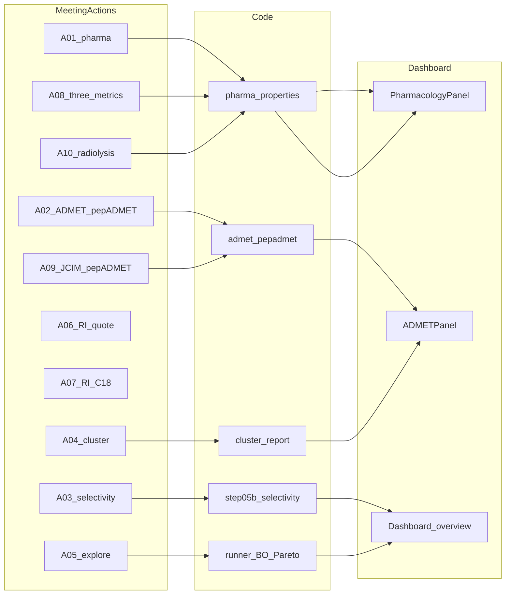

# 액션 ↔ 구현·UI 매핑 (개요)

**목적**: `meet_log_backup.md`의 A-01~A-10 각 항목이 코드베이스·대시보드 **어느 부분**에 대응하는지 한눈에 보기 위한 표와 다이어그램이다. 상세 서술은 본 보고서 본문(A-01~A-10 절)에 있다.

## 매핑 표

| 액션 | 주요 모듈·경로 | UI·페이지(가능 시) | 증빙 이미지(저장소 상대 경로) |
|:----:|----------------|-------------------|-------------------------------|
| A-01 | `pyrosetta_flow/pharma_properties.py`, `backend/pharmacology.py` | Silo B → Pharmacology 패널 | `docs/screenshots/08_pharmacology.png` |
| A-02 | `backend/admet.py`, `pepadmet_*.py`, `admet_alternative_plan_*.md` | Silo B → ADMET 패널·pepADMET 블록 | `docs/reports/silo_b_ui_walkthrough/assets/scroll_08_y6560.png` |
| A-03 | `AG_src/pipeline/step05b_selectivity.py`, `backend/selectivity_endpoints.py` | Selectivity 페이지 / 파이프라인 선택성 | `docs/screenshots/01_silo_b_full.jpg` |
| A-04 | `pyrosetta_flow/cluster_report.py` | Silo B → Cluster 패널 | `docs/reports/silo_b_ui_walkthrough/assets/scroll_06_y4920.png` |
| A-05 | `pyrosetta_flow/runner.py`, `bayesian_optimizer.py`, `pareto_ranking.py` | Agent Monitor·후보 테이블·랭킹 | `docs/screenshots/04_agent_and_candidates.png` |
| A-06 | (RI) 합성 견적 — AI팀은 데이터 지원 | 별도 웹·메일 (UI 없음) | 다이어그램만 (본문) |
| A-07 | (RI) C18 설계 — AI팀은 Top-K·PDB 지원 | 미팅·문서 | 다이어그램만 (본문) |
| A-08 | `pharma_properties.py` (selectivity/radiolysis/metal) | Pharmacology·관련 지표 | `docs/screenshots/09_pharmacology.png` |
| A-09 | `admet_alternative_plan_*.md`, pepADMET 문서 | pepADMET·문헌 근거 설명 구간 | `docs/reports/silo_b_ui_walkthrough/assets/scroll_09_y7380.png` |
| A-10 | `calculate_radiolysis_susceptibility()` | Pharmacology → Radiolysis | `docs/screenshots/08_pharmacology.png` |

*이미지는 보고서 루트 기준이 아니라 **파일 위치 기준 상대경로**로 본문에서 링크한다 (`docs/reports/`에서 `../screenshots/...` 또는 `silo_b_ui_walkthrough/...`).*

## 관계 다이어그램 (Mermaid)

(A-06, A-07은 코드 노드 대신 RI 프로세스로 본문에서 기술.)
