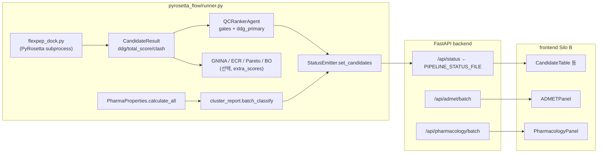
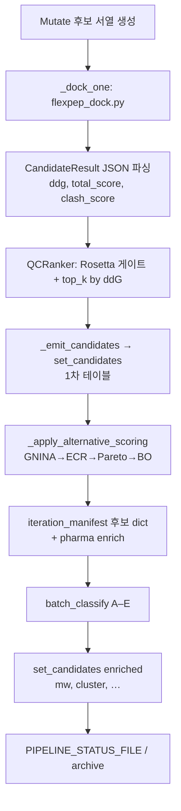
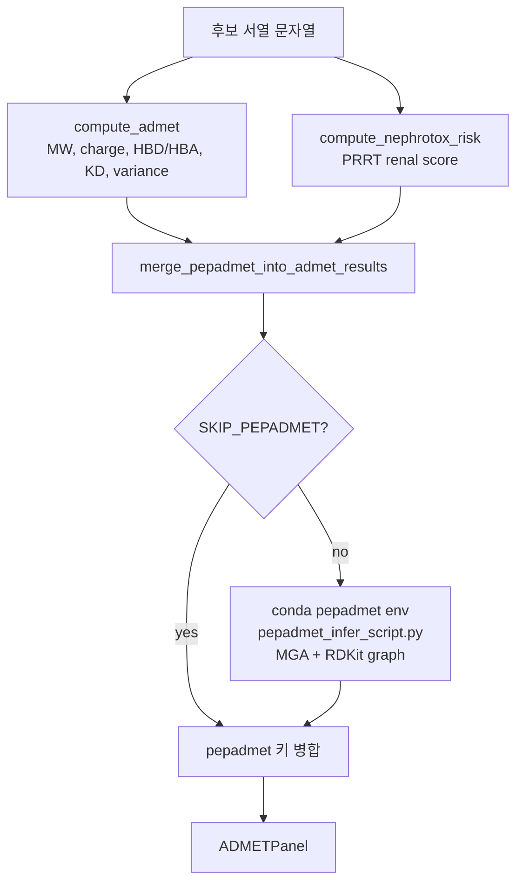
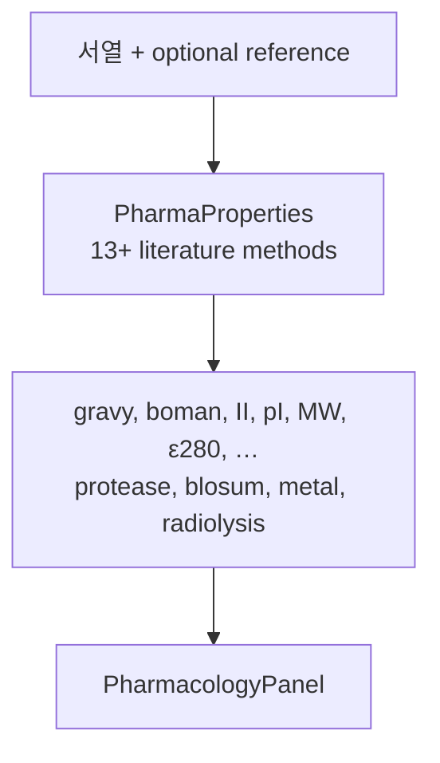
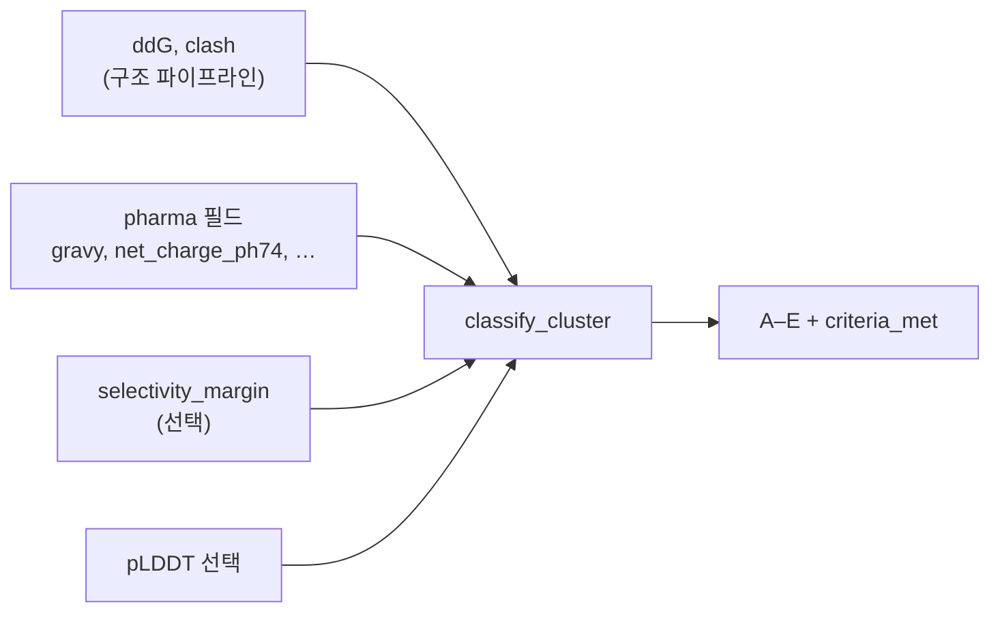

# Silo B: 코드 연산 경로 → 대시보드 집계 (추적성)

**목적**: 실제 소스에서 **어떤 연산·모델·서브프로세스**가 돌고, 그 결과가 **어디에 기록되며**, **UI에 어떻게 반영**되는지 한 흐름으로 설명한다.  
**필드별 수식·임계값·ML 헤드 정의**는 [`silo_b_computational_definitions.md`](silo_b_computational_definitions.md)를 본문으로 삼는다. 패널 개요·스크린 참고는 [`silo_b_dashboard_panels_methodology.md`](./silo_b_dashboard_panels_methodology.md).

**코드 루트(이 문서 기준)**: `AgenticAI4SCIENCE_pyrosetta_track/repos/ai4sci-kaeri/`

---

## 1. 다이어그램 (세분화)

### 1.1 한 장 요약 (런너 vs REST vs UI)

### 1.2 단일 iteration — PyRosetta 후보가 상태 JSON까지 가는 순서

### 1.3 ADMET 패널 데이터 계층 (서열 → 휴리스틱 → 선택 ML)

### 1.4 Pharmacology 패널 (단일 코드 경로)

### 1.5 Cluster 판정 입력 (API 또는 파이프라인)

---

## 2. 구조·도킹 파이프라인 (PyRosetta agentic mutdock)

### 2.1 진입점

- **`pyrosetta_flow/runner.py`** — `run_pyrosetta_agentic_mutdock_flow(config)`
- Baseline·각 iteration에서 **`AG_src/scripts/flexpep_dock.py`** 를 `conda` 서브프로세스로 호출 (`_run_script`).
- 변이 후보당 도킹은 내부 함수 **`_dock_one`** 에서 동일 스크립트를 호출해 PDB와 JSON 마지막 줄을 파싱한다.

### 2.2 FlexPepDock 스크립트가 내는 값 (물리 연산의 핵심)

- **스크립트**: `AG_src/scripts/flexpep_dock.py`
- **역할**: PyRosetta 초기화 후 FlexPepDock 계열 refinement, InterfaceAnalyzer 등으로 **인터페이스 ΔΔG·에너지·클래시**를 계산하고 **stdout 마지막 줄만 JSON**으로 낸다.
- **`CandidateResult`에 매핑되는 필드** (`runner._dock_one`):
  - `ddg` ← `result["ddg"]`
  - `total_score` ← `result["total_score"]`
  - `clash_score` ← `result["clash_score"]`

이 세 값이 이후 QC·표시의 **1차 물리 스코어**이다.

### 2.3 QC & Ranker (게이트 + 상위 후보 선정)

- **`AG_src/agents/qc_ranker.py`** — `QCRankerAgent`
- PyRosetta 전용 가중치: **`PYROSETTA_ONLY_WEIGHTS`** (`plddt`/`dock` 등은 0에 가깝게 두는 용도)이나, 실제 **상위 k개 선정**은 `thresholds["ranking_mode"] == "ddg_primary"`일 때 **`get_top_by_ddg`** — 즉 **`ddg` 오름차순(더 음수일수록 우선)** 이다 (`runner.py`에서 해당 모드로 호출).
- **`runner._candidate_to_qc`**: PyRosetta-only 모드에서는 `plddt`·`dock_score`·`lddt`를 **0으로 고정**하고, `ddg`·`clash_count`(정수화된 clash)만 실값으로 넘긴다.
- **게이트** (`runner` 내 `thresholds`): `plddt` / `docking` / `selectivity` 게이트는 **OFF**, **`rosetta` 게이트만 ON** (`ddg` 상한, clash 상한 등은 `FlowConfig`와 연동).

### 2.4 첫 번째 후보 테이블 푸시 (iteration 중)

- **`runner._emit_candidates`** → **`StatusEmitter.set_candidates`**
- 각 행 예: `ddG`, `totalScore`, `clashScore`, **`finalScore` = `-ddg` (표시용 단순 변환), `result` PASS/FAIL, `failReason` 등.
- **상태 파일**: `backend/status_emitter.py` — 기본 `PIPELINE_STATUS_FILE`(환경변수로 변경 가능)에 JSON 기록 → **`GET /api/status`** 가 프론트에 제공.

### 2.5 대안 스코어링 체인 (같은 run 내, 후처리·부가 지표)

**함수**: `runner._apply_alternative_scoring` (iteration reporter 단계 직전에 `candidates`에 in-place 반영)

| 순서 | 내용 | 모델/라이브러리 | 산출물 |
|------|------|-----------------|--------|
| 1 | GNINA rescoring | `pyrosetta_flow/gnina_rescoring.py` (바이너리 없으면 dry-run) | `extra_scores`에 CNN/Vina 유사 필드 |
| 2 | ECR consensus | `exponential_rank_consensus` — `ddg`와 GNINA 스코어들의 순위 합성 | `ecr_score` |
| 3 | Pareto | `pyrosetta_flow/pareto_ranking.py` — pymoo NSGA-II, 목표 최소화: ddG, −stability, −druggability, −diversity 등 | `pareto_rank`, `crowding_distance` |
| 4 | BO | `BayesianPeptideOptimizer` (선택) | 다음 iteration 힌트(부수 효과 위주) |

**주의**: 위 항목은 **`CandidateResult.extra_scores`** 및 로그·매니페스트에 남고, **기본 QC top-k 선정은 여전히 ddG 기준**이다. Pareto/ECR은 **다목적·보조 분석**에 가깝다.

### 2.6 Pharmacology·클러스터·“대시보드 enrich” 재푸시

같은 iteration의 **reporter/manifest** 구간에서:

1. **`PharmaProperties.calculate_all(seq)`** (`AG_src/pipeline/pharma_properties.py`)  
   - 서열 기반 물리·화학 휴리스틱(GRAVY, 불안정성, 전하, BLOSUM62, 방사선 분해 경향 등). 이황화 Cys 짝은 코드에 명시된 규칙으로 추정.
2. **`cluster_report.batch_classify`** (`pyrosetta_flow/cluster_report.py`)  
   - `ddG`, `clash`, pharma 필드, FWKT 규칙 등으로 **A–E 단일 클러스터** 부여.
3. **`emitter.set_candidates(enriched_entries)`**  
   - 후보 행에 `mw`, `instability_index`, `radiolysis_score`, `cluster` 등을 **추가**해 다시 기록 (`runner.py` “dashboard-enrich” 블록).

따라서 **같은 Silo B 후보 테이블**이 iteration 후반에는 **PyRosetta 스코어 + pharma + cluster**가 합쳐진 형태로 갱신될 수 있다.

### 2.7 RCSB 유사도 (선택)

- **`_rcsb_check_candidates`**: 선택된 서열에 대해 PDB 검색(네트워크·설정 의존).  
- **`iteration_manifest.json`** 의 `rcsb_hits` 등으로 남고, UI **`RCSBMatchPanel`** 과 연결.

---

## 3. ADMET·Pharmacology API 패널 (서열 기반, 상태 파일과 독립 호출)

프론트는 후보 **서열 문자열**을 알면 **파이프라인 JSON과 별도로** API를 호출한다.

| 엔드포인트 | 백엔드 | 핵심 연산 |
|------------|--------|-----------|
| `POST /api/admet/batch` | `backend/routers/admet.py` | `compute_admet_full` → 규칙 기반 ADMET + nephrotox (`backend/admet.py`) 후 **`merge_pepadmet_into_admet_results`** |
| pepADMET | `pyrosetta_flow/pepadmet_runner.py` | 서브프로세스로 `pepadmet_infer_script.py` — RDKit 그래프 + 학습된 독성 헤드(`toxicity_early_stop.pth` 등). `SKIP_PEPADMET=1` 이면 생략 |
| `POST /api/pharmacology/batch` | `backend/pharmacology.py` | **`PharmaProperties`** 위임(동일 물리·화학 계산군) |

UI **`ADMETPanel`**, **`PharmacologyPanel`** 은 이 응답을 그대로 표시한다.  
→ **파이프라인의 `pharma` enrich과 숫자 체계가 같도록** 설계되어 있으나, ADMET 블록의 단순 전하 규칙은 `compute_admet` 주석대로 **PharmaProperties의 HH 기반 전하와 완전히 동일하지 않을 수 있음**(방법론 문서 참고).

---

## 4. 클러스터 패널 (HTTP 경로)

- **`POST /api/cluster/classify`** — `backend/routers/cluster.py` → `pyrosetta_flow/cluster_report.batch_classify`
- 입력은 후보별 dict( `ddG`, `clash_score`, pharma 서브필드 등).  
- **런타임 파이프라인**이 이미 클러스터를 후보에 붙인 경우와, **UI가 따로 분류 API를 부르는 경우**를 구분해 보면, 둘 다 **동일 `batch_classify` 로직**을 사용한다.

---

## 5. UI에서 “데모/정적”에 가까운 부분

- **`RiskMatrix`**: `frontend/src/data/mockData.ts`의 **`RISK_ITEMS`** 등 정적/설정 데이터에 의존하는 영역이 있어 **실시간 파이프라인 수치와 직접 연동되지 않을 수 있음** (`RiskMatrix.tsx` 참고).

---

## 6. 한 페이지 질의응답 (무엇이 무엇인가)

| 질문 | 답 (코드 기준) |
|------|----------------|
| ΔG / totalScore / clash는 어디서 오나? | `flexpep_dock.py` PyRosetta subprocess → `CandidateResult` → `StatusEmitter` 후보 목록 |
| 순위는 무엇으로 정해지나? | QC 단계에서 **`ranking_mode: ddg_primary`** 이면 **`ddg` 오름차순** top-k |
| `finalScore` 컬럼은? | 표시상 **`-ddg`** 로 많이 세팅 (`_emit_candidates` / dashboard-enrich) |
| GNINA/Pareto는 순위를 바꾸나? | 기본 top-k 경로의 **직접 대체가 아니라** `extra_scores`·분석용; 최종 테이블 enrich는 ddG·pharma·cluster 중심 |
| ADMET 숫자는 도킹과 같은가? | **아니오** — 별도 `compute_admet` + 선택적 pepADMET ML |
| Pharmacology 패널과 파이프라인 pharma는? | 같은 **`PharmaProperties`** 계열을 쓰도록 맞춤 (`backend/pharmacology.py`) |

---

## 7. 주요 파일 인덱스

| 역할 | 경로 |
|------|------|
| 러너·도킹·QC·enrich | `pyrosetta_flow/runner.py` |
| FlexPepDock CLI | `AG_src/scripts/flexpep_dock.py` |
| QC 게이트·(가중)랭킹 | `AG_src/agents/qc_ranker.py` |
| GNINA/ECR | `pyrosetta_flow/gnina_rescoring.py`, `runner._apply_alternative_scoring` |
| Pareto | `pyrosetta_flow/pareto_ranking.py` |
| Pharma 계산 | `AG_src/pipeline/pharma_properties.py`, `backend/pharmacology.py` |
| 클러스터 | `pyrosetta_flow/cluster_report.py` |
| 상태 JSON | `backend/status_emitter.py` |
| ADMET·pepADMET 병합 | `backend/admet.py`, `backend/routers/admet.py` |
| pepADMET 추론 | `pyrosetta_flow/pepadmet_runner.py`, `pepadmet_infer_script.py` |
| Silo B 페이지 | `frontend/src/pages/SiloBPage.tsx` |

---

*본 문서는 소스 트레이스 기준이며, 설정(`FlowConfig`, 환경변수, conda 가용성)에 따라 일부 분기(GNINA dry-run, pepADMET skip 등)가 달라질 수 있다.*
