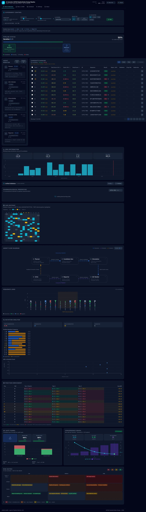
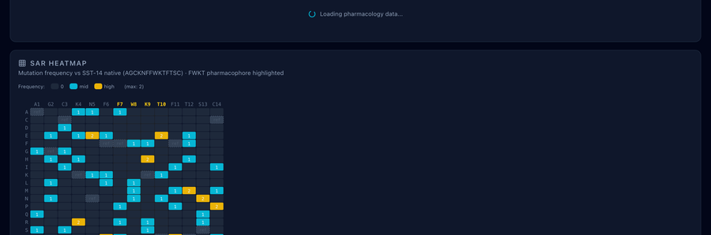

# Silo B 대시보드 패널별 계산·데이터 출처 상세

**대상**: `AgenticAI4SCIENCE_pyrosetta_track/repos/ai4sci-kaeri/frontend` — Silo B (`/silo-b`) 페이지에 배치된 시각화·패널  
**작성 목적**: 데모·보고 시 각 UI 블록이 **무엇을**, **어디서**, **어떤 식으로** 계산·표시하는지 한 문서에서 추적 가능하도록 정리함.

**연관 문서**:
- 파이프라인 코드에서 **연산·모델·상태 파일·API**까지 한 줄로 잇는 추적 → [`silo_b_code_to_ui_pipeline_trace.md`](./silo_b_code_to_ui_pipeline_trace.md).
- **Druglikeness·ADMET·pepADMET·Pharmacology·Cluster** 필드별 **수식·임계값·구현 주의** 상세 → [`silo_b_computational_definitions.md`](silo_b_computational_definitions.md).
- **저장 HTML 기준 UI 스크롤 캡처 + 패널 설명** 보고 → [`silo_b_ui_walkthrough/README.md`](../03_ui_walkthrough/README.md) 및 `silo_b_ui_walkthrough/assets/scroll_*.png`.

---

## 1. 스크린샷·정적 캡처 자료

라이브 브라우저 캡처 대신, 동일 UI를 저장해 둔 자료를 활용한다.

| 구분 | 경로·설명 |
|------|-----------|
| 단일 HTML 덤프 | [`docs/screenshots/AI-Scientist_SSTR2_Pipeline_Dashboard.html`](../screenshots/AI-Scientist_SSTR2_Pipeline_Dashboard.html) — Vite Silo B 페이지 전체를 저장한 파일(로컬 에셋 링크는 환경에 따라 깨질 수 있음). |
| PNG 모음 | [`docs/screenshots/`](../screenshots/) — 대표 파일명 아래 표 참고. |

본 문서 삽입 이미지(상대 경로는 **이 MD 파일 기준** `../screenshots/`):

| 패널 영역 | 참고 이미지 파일 |
|-----------|------------------|
| Silo B 전체 레이아웃 | `01_silo_b_full.jpg` |
| 실험 제어 | `02_experiment_control.png`, `03_experiment_control.png` |
| 후보 테이블 | `03_candidate_table.png`, `05_candidate_table.png` |
| 에이전트·후보 요약 | `04_agent_and_candidates.png` |
| ΔG 분포 | `05_ddg_distribution.png`, `06_ddg_distribution.png` |
| Pharmacology | `08_pharmacology.png`, `09_pharmacology.png` |
| SAR 히트맵 | `06_sar_heatmap.png`, `09_sar_heatmap.png` |
| 시퀀스 로고 | `07_sequence_logo.png`, `10_sequence_logo.png` |
| 변이 분석 | `08_mutation_analysis.png`, `11_mutation_analysis.png` |
| Validation | `07_validation.png`, `10_validation.png` |
| QC / 수렴 | `11_qc_gate.png`, `13_qc_convergence.png` |
| Risk matrix | `12_risk_matrix.png`, `14_risk_matrix.png` |
| 수렴 그래프(별도) | `04_convergence.png` |

### 1.1 대표 화면 (이미지)

*그림 1. Silo B 대시보드 전체 예시 (`01_silo_b_full.jpg`).*

*그림 2. Pharmacology 패널 영역 예시 (`08_pharmacology.png`).*

---

## 2. 페이지 구성 순서 (코드 기준)

`SiloBPage.tsx`에서 렌더 순서는 다음과 같다.

1. `PipelineStatus` — 파이프라인 스텝·Rosetta 서브스텝
2. (조건부) `LoopTimeline`
3. (조건부) `VisualizationPanel` — PyMOL 등 이미지
4. `AgentMonitor` + `CandidateTable`
5. `DdGDistribution`
6. `ValidationPanel`
7. `ClusterPanel`
8. **`ADMETPanel`**
9. **`PharmacologyPanel`**
10. `RCSBMatchPanel`
11. `SARHeatmap`
12. `AgentFlowDiagram`
13. `SequenceLogo`
14. `MutationAnalysis`
15. `PositionEnrichment`
16. `QCGateChart` + `ConvergenceGraph`
17. `RunComparisonPanel`
18. `RiskMatrix`
19. (조건부) `MoleculeViewer`

---

## 3. 데이터 공급: Live vs Mock

| 모드 | 조건 | 후보·스텝 출처 |
|------|------|----------------|
| **Live / Archive** | `usePipelineStatus`가 `/api/status`로 읽은 JSON에 `error`가 없고, 스텝이 있거나 아카이브 런을 선택한 경우 | `runs/.../experiment` 상태 또는 `/api/runs/{id}` 아카이브 |
| **Mock** | 위 조건 미충족 | `frontend/src/data/mockData.ts` |

ADMET·Pharmacology는 후보 **서열**이 있으면 각각 `/api/admet/batch`, `/api/pharmacology/batch`를 호출한다(프록시 → FastAPI).

---

## 4. ADMET & Nephrotoxicity 패널

**컴포넌트**: `ADMETPanel.tsx`  
**API**: `POST /api/admet/batch` → `backend/routers/admet.py` → `backend/admet.py`

### 4.1 서열 휴리스틱 ADMET (`compute_admet`)

입력: 한 글자 아미노산 서열(대문자 정규화). **외부 API 없음**, 순수 파이썬.

| 출력 필드 | 계산 요약 |
|-----------|-----------|
| **mw** | 잔기 단위 **모노아이소토픽 질량** 합 + N/C 말단을 위한 물 1분자(`18.01056 Da`). 잔기 테이블은 `backend/admet.py` 상단 `_AA_RESIDUE_WEIGHTS`. |
| **net_charge_ph74** | K/R: +1, D/E: −1, H: +0.1 누적 후, **N말단 +1**, **C말단 −1** 명시 반영(코드 주석상 생리학적 pH에서 상쇄될 수 있으나 스펙대로 항목 포함). |
| **n_hbd** | 측쇄 HBD 개수(`_SIDECHAIN_HBD`) + **잔기 수**(백본 NH 단순화, Pro 예외 미반영). |
| **n_hba** | 측쇄 HBA(`_SIDECHAIN_HBA`) + **잔기 수**(백본 C=O). |
| **hydrophobicity** | **Kyte–Doolittle** 평균. |
| **amphipathicity_index** | 동일 스케일 값들의 **분산**(평균 대비). |
| **druglikeness_score (0–100)** | 펩타이드용 4규칙 각 25점: (1) MW 1200–2000 Da, (2) \|net charge\| ≤ 3, (3) hydrophobicity ∈ [−2, 1], (4) 동일 잔기 3연속 없음. |
| **druglikeness_breakdown** | 규칙별 `passed`, `value`, `range`, `points`. |

### 4.2 PRRT 신장 보유 위험 (`compute_nephrotox_risk`)

| 출력 | 계산 |
|------|------|
| **n_lys, n_arg, n_his** | 서열 내 개수. |
| **cationic_residues** | 위 세 합. |
| **net_charge** | ADMET과 동일한 단순 전하 규칙(단, N/C 말단 ±1 미포함 — ADMET 블록과 숫자가 다를 수 있음). |
| **renal_risk_score** | `min(100, (n_lys + n_arg) × 20 + max(0, net_charge) × 15)` (소수 반올림). |
| **risk_level** | &lt;30 Low, 30–60 Moderate, &gt;60 High. |
| **warning** | Moderate/High일 때 문구 생성. |

### 4.3 pepADMET 독성 (ML, 선택)

`merge_pepadmet_into_admet_results`가 `pyrosetta_flow.pepadmet_runner.predict_toxicity_batch` 결과를 **`pepadmet`** 키로 병합.

- **환경**: `conda` 환경 `pepadmet`, 로컬 클론 `local_models/pepadmet/repo`(또는 `PEPADMET_REPO`).
- **추론**: `pepadmet_infer_script.py` — RDKit 그래프 + `calculate_descriptors` + `MGA` 모델(`toxicity_early_stop.pth`).
- **1차 SMILES**: `smiles_converter.sequence_to_smiles`가 선형 `MolFromSequence` 후 **Cys 쌍 SG–SG 이황화**를 붙여 SMILES를 만들도록 설계됨(SST-14 유사체 전제).
- **폴백 (`graph_note: linear_sequence_fallback`)**: 1차 SMILES가 `MolFromSmiles`/그래프 단계에서 실패할 때만 **`MolFromSequence` 선형 그래프**로 재시도. 이 경로에서는 **코드상 이황화 결합이 그래프에 명시되지 않음** → 수치는 나오나(모델 forward는 실행) **브릿지 포함 구조와 달라 해석에 주의**. 상세 표·오해 방지 문단은 [`silo_b_computational_definitions.md`](silo_b_computational_definitions.md) **§C.1** 참고.
- **비활성**: 환경변수 `SKIP_PEPADMET=1`이면 병합 생략.

---

## 5. Pharmacology 패널

**컴포넌트**: `PharmacologyPanel.tsx`  
**API**: `POST /api/pharmacology/batch` → `backend/pharmacology.py` → 주로 `AG_src.pipeline.pharma_properties.PharmaProperties`

### 5.1 이황화 결합 가정

짝수 개 Cys가 있으면 **순차 짝지음**(첫↔끝 …)으로 이황화에 참여하는 Cys 인덱스를 잡고, **등전점·pH 전하 프로파일**에서 해당 Cys는 이온화에서 제외.

### 5.2 필드별 요약 (정상 시 `PharmaProperties` 사용)

| 필드 | 의미·출처 |
|------|-----------|
| **gravy** | Grand Average of Hydropathy (Kyte–Doolittle 평균). |
| **boman_index** | Boman — 단백질 결합 경향(잔기별 Radzicka–Wolfenden 유사 기여 평균). |
| **instability_index** | Guruprasad et al. 불안정성 지수; &lt;40 은 `stable` 분류. |
| **aliphatic_index** | Aliphatic index (A,V,I,L 비율 기반 경험식). |
| **isoelectric_point** | Bjellqvist 등 pKa 기반 이분 탐색. |
| **extinction_coefficient** | ε₂₈₀; Trp/Tyr 개수 및 이황화 수에 따른 보정(`PharmaProperties` 또는 단순식 폴백). |
| **n_end_rule** | N-end rule 반감기 추정. |
| **hydrophobic_moment** | 소수성 모멘트(윈도우). |
| **wimley_white** | Wimley–White 합성 막 친화도. |
| **charge_ph_profile** | 여러 pH에서 순전하(Henderson–Hasselbalch, SS 제외 반영). |
| **molecular_weight** | 평균/모노아이소토픽 MW, SS 개수만큼 H₂ 제거 보정. |
| **protease_sites** | 효소 절단 위치 후보 집계. |
| **blosum62** | 참조 서열(기본 SST-14) 대비 BLOSUM62 합산·위치별. |
| **metal_coordination** | 방사성 금속 킬레이션에 유리한 잔기(예: D/E/H 등) 평가. |
| **radiolysis_susceptibility** | 방사선 분해에 민감한 잔기 경향. |

`PharmaProperties` import 실패 시 일부는 0 또는 `error` 반환(폴백 테이블 경로).

---

## 6. Cluster 패널 (A–E)

**컴포넌트**: `ClusterPanel.tsx`  
**API**: `POST /api/cluster/classify` → `pyrosetta_flow/cluster_report.py::batch_classify`

각 후보는 **하나의 클러스터**만 부여(우선순위 A &gt; B &gt; C &gt; D &gt; E).

| 클러스터 | 조건(모두 만족 시) |
|----------|---------------------|
| **A** High Affinity Core | ΔG ≤ −8, clash ≤ 5, (pLDDT 있으면 ≥75, 없으면 해당 조건 생략), FWKT pharmacophore pass |
| **B** Selectivity | selectivity_margin ≥ 3, ΔG &lt; −5 |
| **C** Stability | instability_index &lt; 30, BLOSUM 합 ≥ 0, protease 총 ≤ SST-14 기준(9) 이하 |
| **D** Radiochemistry | GRAVY ∈ [−1, 0.5], \|net_charge_ph74\| ≤ 1, metal `n_strong` ≥ 1 |
| **E** | 위 어느 것도 미충족 |

후보 dict에 `instability_index`, `gravy`, `net_charge_ph74` 등은 파이프라인이 **pharmacology·구조 규칙**과 함께 채운 필드를 기대한다. UI만으로는 숫자를 다시 계산하지 않는다.

---

## 7. 기타 Silo B 패널 (요약)

| 패널 | 데이터 소스 / 계산 |
|------|---------------------|
| **PipelineStatus** | 상태 JSON의 `steps`, `rosetta_substeps` |
| **CandidateTable** | 후보 `ddG`, `clash`, rank 등 상태 파일 |
| **DdGDistribution** | 후보 ΔG 히스토그램 |
| **ValidationPanel** | 선택 후보에 대해 `/api/validate/selected` 등(백엔드 검증 라우터) |
| **RCSBMatchPanel** | `/api/rcsb` 계열 — 유사 펩타이드 검색 |
| **SARHeatmap** | 후보별 잔기·위치 스코어 매트릭스 |
| **SequenceLogo** | 정렬된 서열 로고 |
| **MutationAnalysis** | 기준 대비 돌연변이 요약 |
| **PositionEnrichment** | 위치별 잔기 빈도 |
| **QCGateChart** | QC 게이트 통과/실패 집계 |
| **ConvergenceGraph** | 반복별 수렴 지표 |
| **RunComparisonPanel** | 아카이브 런 메타 비교 |
| **RiskMatrix** | 정적/설정 기반 리스크 표시(코드 확인 필요 시 `RiskMatrix.tsx` 참고) |
| **MoleculeViewer** | `/api/structures/...` PDB 로드 |

---

## 8. 버전·추적성 참고

| 항목 | 위치 |
|------|------|
| ADMET 휴리스틱 | `repos/ai4sci-kaeri/backend/admet.py` |
| ADMET API + pepADMET 병합 | `repos/ai4sci-kaeri/backend/routers/admet.py` |
| Pharmacology | `repos/ai4sci-kaeri/backend/pharmacology.py`, `AG_src/pipeline/pharma_properties.py` |
| 클러스터 | `repos/ai4sci-kaeri/pyrosetta_flow/cluster_report.py` |
| pepADMET subprocess | `repos/ai4sci-kaeri/pyrosetta_flow/pepadmet_runner.py`, `pepadmet_infer_script.py` |
| 프론트 Silo B | `repos/ai4sci-kaeri/frontend/src/pages/SiloBPage.tsx` |

---

## 9. 보고서 활용 시 권장 문구

- 본 대시보드의 **ADMET 휴리스틱**은 **빠른 스크리닝용 규칙 기반 추정**이며, **IND 수준 ADMET 예측을 대체하지 않는다.**
- **pepADMET** 독성은 **공개 모델·로컬 추론**이며, 선형 그래프 폴백 시 `graph_note`로 표시된다.
- **Pharmacology** 수치는 `PharmaProperties` 구현·문헌과 일치하도록 유지하며, 환경 미설치 시 폴백·제한이 있을 수 있다.

---

*문서 생성: Silo B UI·백엔드 소스 트레이스 기준. 스크린은 `docs/screenshots/*.png` 및 저장 HTML을 캡처 대체 자료로 사용. 배포·PDF용으로 PNG는 **최대 폭 900 px**로 리사이즈할 수 있음 (`docs/reports/resize_report_images.py`).*
