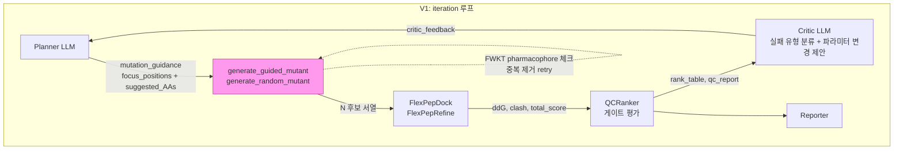
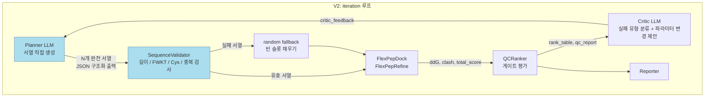
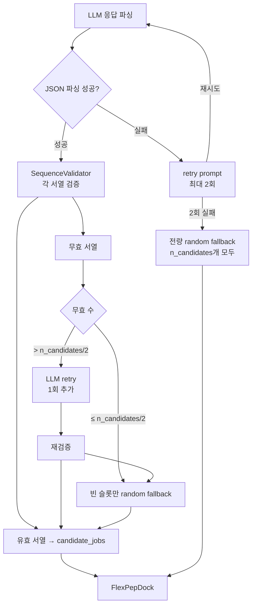

# V2 파이프라인 설계 문서

> 작성일: 2026-04-09  
> 최종 수정: 2026-04-09 (science-reviewer 검증 반영)  
> 작성자: engineer-backend (agent)  
> 대상: orchestrator, reviewer-science, reviewer-code

---

## 1. 배경 및 동기

### V1 정확한 동작 (science-reviewer 검증 결과 반영)

| 항목 | V1 실제 구현 |
|------|------------|
| LLM 역할 | `mutation_guidance` 딕셔너리 출력 (`focus_positions` + `suggested_mutations` AA 목록) |
| `generate_guided_mutant()` | LLM `suggested_mutations`를 **참조**해 무작위 선택 — LLM 영향 있으나 확률적 |
| `generate_random_mutant()` | `AA_NO_CYS` 18종(Cys 제외) 중 **균등 랜덤** 선택 ← BLOSUM62 미사용 |
| BLOSUM62 위치 | `AG_src/pipeline/step03b` (Silo A 전용) — pyrosetta_flow에서는 사용 안 함 |
| LLM 실험 시간 점유 | ~7.5% |
| 핵심 문제 | LLM이 추천한 AA도 최종 선택은 `rng.choice(candidates)`가 수행 → LLM 의도 희석 |

> **수정 사항**: 초안에서 "BLOSUM62+random"으로 잘못 기술한 부분 정정.  
> V1의 실제 샘플링은 **균등 랜덤(uniform random)** from `AA_NO_CYS`.

### V2 목표

> **LLM이 후보 서열을 직접 결정한다. (V1의 `generate_guided_mutant` 강화 방향)**

- V2는 `generate_guided_mutant`를 완전히 대체하는 것이 아니라, LLM이 **확률적 선택 없이** 정확한 서열을 명시하도록 강화
- Planner가 N개의 완전한 14-aa 서열을 JSON으로 직접 출력
- 안전장치(BLOSUM62 필터, n_guided 상한, clash gate)로 탐색 편향 방지
- 나머지 파이프라인(FlexPepDock, QCRanker, Critic, Reporter, SES)은 그대로 유지

---

## 2. V1 vs V2 흐름도

### V1 흐름



### V2 흐름



**변경 포인트 (녹색/파란색 박스)**:
- Planner 출력 형식 변경: `mutation_guidance` dict (포지션+AA 힌트) → `sequences` list (완전 서열)
- LLM 역할 강화: 확률적 `rng.choice(candidates)` → LLM이 직접 서열 명시
- `generate_guided_mutant` 주 경로 제거 → `SequenceValidator` + BLOSUM62 필터 + uniform random fallback
- **n_guided ≤ 50% 상한**: LLM 제안 서열은 전체의 최대 50%, 나머지는 균등 랜덤 유지 (exploration 보존)

---

## 3. LLM Prompt 설계

### 3.1 System Prompt (Planner V2)

```text
당신은 SSTR2 결합 펩타이드 최적화 전문가입니다.
SST-14 (AGCKNFFWKTFTSC, 14aa) 변이체를 설계합니다.

## 핵심 제약
- 서열 길이: 정확히 14개 아미노산
- FWKT 약물단 보존: 7번(F), 8번(W), 9번(K), 10번(T) 고정
- Cys 위치: 1번(A→C는 금지), 14번(C 유지) - 중간에 Cys 추가 금지
- 중복 없음: 아래 이미 시도된 서열 목록에 없는 서열만 제안

## 변이 가능 포지션 (1-indexed)
{mutable_positions}

## 출력 형식 (JSON only, 다른 텍스트 없이)
{{
  "sequences": [
    "AGCKNFFWKTFTSC",   // 예시: 완전한 14aa 서열
    ...                  // N개 총 {n_candidates}개
  ],
  "rationale": "변이 전략 설명 (한국어, 2-3문장)",
  "focus_positions": [5, 6, 11],   // 이번 iteration 집중 포지션
  "strategy": "exploit | explore | diversify"
}}
```

### 3.2 User Prompt Template (Planner V2)

```text
## Iteration {iteration} / {max_iterations}

### 기준 서열
{original_sequence}  →  ddG_baseline = {baseline_ddg:.2f} kcal/mol

### 이전 iteration 결과 (상위 5개)
{top_candidates_table}
* candidate_id | sequence | ddG | clash | selected

### Critic 피드백
{critic_feedback_summary}

### 역대 최고 후보
{historical_top_hits}

### 이미 시도된 서열 ({n_seen}개, 중복 제안 금지)
{seen_sequences_sample}   // 최근 20개만 표시

### 태스크
위 정보를 바탕으로 {n_candidates}개의 신규 14aa 서열을 제안하세요.
FWKT(7-10번) 보존, Cys 제약, 중복 금지를 반드시 지키세요.
출력은 JSON만 (코드블록 없이).
```

### 3.3 출력 예시

```json
{
  "sequences": [
    "AGCENFFWKTFTSC",
    "AGCKNFFWKTYTYC",
    "AGCKNFFWKTHTNC",
    "AGCRNFFWKTFTSC",
    "AGCKNFFWKTFYSC"
  ],
  "rationale": "5번 위치(K→E/R)로 전하 조절을 시도하고, 12번(F→Y)으로 극성 도입. Critic이 지적한 clash 감소를 위해 11번 대형 잔기를 회피.",
  "focus_positions": [5, 12, 13],
  "strategy": "exploit"
}
```

---

## 3.4 V2 안전장치 3가지 (science-reviewer 필수 요구사항)

### (A) BLOSUM62 필터 레이어

LLM이 제안한 각 AA가 원본 위치 대비 BLOSUM62 점수 ≥ -1이어야 통과.  
과도하게 불안정한 치환(점수 ≤ -2)을 사전 차단.

```python
import Bio.Align.substitution_matrices as sm
BLOSUM62 = sm.load("BLOSUM62")
BLOSUM62_MIN_SCORE = -1  # 조정 가능

def blosum62_filter(original_aa: str, proposed_aa: str) -> bool:
    """BLOSUM62 점수가 MIN_SCORE 이상이면 허용."""
    if original_aa == proposed_aa:
        return True  # 동일 AA는 항상 통과
    try:
        score = BLOSUM62[original_aa][proposed_aa]
        return score >= BLOSUM62_MIN_SCORE
    except KeyError:
        return False  # 비표준 AA → 거부

def apply_blosum62_filter(seq: str, original: str, mutable_positions: list[int]) -> tuple[bool, list[str]]:
    """서열 전체에 BLOSUM62 필터 적용. 실패한 포지션 목록 반환."""
    failures = []
    for pos in mutable_positions:
        idx = pos - 1
        if idx >= len(seq) or idx >= len(original):
            continue
        if not blosum62_filter(original[idx], seq[idx]):
            failures.append(f"pos{pos}: {original[idx]}→{seq[idx]} (BLOSUM62 score < {BLOSUM62_MIN_SCORE})")
    return len(failures) == 0, failures
```

### (B) n_guided ≤ 50% 상한

```python
# runner.py V2 candidate_jobs 빌드 시
n_llm_slots = min(n_candidates // 2, len(valid_llm_sequences))  # 최대 50%
n_random_slots = n_candidates - n_llm_slots                      # 나머지 균등 랜덤

# LLM 슬롯: validator + BLOSUM62 통과 서열
candidate_jobs[:n_llm_slots] = [{"mutant": seq, "source": "llm"} for seq in valid_llm_sequences[:n_llm_slots]]
# Random 슬롯: generate_random_mutant() (기존 V1 그대로)
candidate_jobs[n_llm_slots:] = [{"mutant": generate_random_mutant(...), "source": "random"} ...]
```

**근거**: LLM이 편향된 서열 공간만 탐색할 경우 exploration이 사라짐.  
50% 상한으로 exploitation(LLM) + exploration(random) 균형 유지.

### (C) Clash gate 강화 검토

| 옵션 | V1 기본값 | V2 제안 | 근거 |
|------|----------|--------|------|
| `rosetta_clash_max` | 10 | 0 (검토) | LLM 제안 서열은 구조 검증 안 된 상태 → 엄격 gate로 안전성 확보 |

> **결정 보류**: clash_max=0은 통과율을 급격히 낮출 수 있음.  
> Phase 2 실험에서 V1 baseline clash 분포 확인 후 최종 결정.  
> 초기값은 V1과 동일(10)로 시작하고 adaptive gate 모드 활용.

---

## 4. SequenceValidator — 에러 핸들링

### 4.1 검증 규칙

```python
@dataclass
class ValidationResult:
    sequence: str
    valid: bool
    errors: list[str]

FWKT_REF = {7: "F", 8: "W", 9: "K", 10: "T"}  # 1-indexed

def validate_sequence(
    seq: str,
    original: str,
    seen: set[str],
    mutable_positions: list[int],
) -> ValidationResult:
    errors = []
    # 1. 길이 체크
    if len(seq) != len(original):
        errors.append(f"length {len(seq)} != {len(original)}")
    # 2. 유효 AA 체크 (20종 표준 AA만 허용)
    invalid_aa = [c for c in seq if c not in "ACDEFGHIKLMNPQRSTVWY"]
    if invalid_aa:
        errors.append(f"invalid AA: {invalid_aa}")
    # 3. FWKT 약물단 보존
    for pos, aa in FWKT_REF.items():
        if len(seq) >= pos and seq[pos - 1] != aa:
            errors.append(f"pharmacophore violated at pos{pos}: {seq[pos-1]} != {aa}")
    # 4. 중간 Cys 금지 (Cys3-Cys14 disulfide 보존, 중간 추가 금지)
    for i, aa in enumerate(seq[1:-1], start=2):  # pos 2~13
        if aa == "C":
            errors.append(f"unexpected Cys at pos{i}")
    # 5. 중복 체크
    if seq in seen:
        errors.append("duplicate sequence")
    # 6. 원본과 동일 체크
    if seq == original:
        errors.append("identical to original sequence")
    # 7. 고정 포지션 변이 여부 (mutable_positions 외 변경 금지)
    fixed = [i + 1 for i in range(len(original))
             if (i + 1) not in mutable_positions and i + 1 not in FWKT_REF]
    for pos in fixed:
        if len(seq) >= pos and seq[pos - 1] != original[pos - 1]:
            errors.append(f"non-mutable pos{pos} changed: {original[pos-1]}→{seq[pos-1]}")
    return ValidationResult(sequence=seq, valid=not errors, errors=errors)
```

### 4.2 에러 핸들링 흐름



### 4.3 Fallback 정책

| 상황 | 처리 |
|------|------|
| JSON 파싱 실패 | retry 2회 → 전량 random fallback |
| 유효 서열 < n_candidates/2 | LLM retry 1회 후 빈 슬롯 random 채우기 |
| 개별 서열 검증 실패 | 해당 슬롯만 random fallback |
| LLM 응답 없음 (timeout) | 즉시 전량 random fallback |

**원칙**: 어떤 경우에도 FlexPepDock이 실행될 N개의 서열을 보장한다.

### 4.4 Mode Collapse 방지 — Hamming Distance 모니터링

LLM이 반복적으로 유사한 서열만 제안하는 mode collapse 감지.

```python
def mean_pairwise_hamming(sequences: list[str]) -> float:
    """서열 집합의 평균 쌍별 Hamming distance."""
    if len(sequences) < 2:
        return 0.0
    total, count = 0, 0
    for i in range(len(sequences)):
        for j in range(i + 1, len(sequences)):
            total += sum(a != b for a, b in zip(sequences[i], sequences[j]))
            count += 1
    return total / count if count else 0.0

HAMMING_COLLAPSE_THRESHOLD = 1.5  # 평균 1.5 미만이면 mode collapse 경고

def check_mode_collapse(sequences: list[str], iteration: int) -> bool:
    hamming = mean_pairwise_hamming(sequences)
    if hamming < HAMMING_COLLAPSE_THRESHOLD:
        print(f"  [v2-warn] Iteration {iteration}: mode collapse detected "
              f"(mean Hamming={hamming:.2f} < {HAMMING_COLLAPSE_THRESHOLD})", file=sys.stderr)
        return True
    return False
```

**Mode collapse 감지 시 대응**:
- `strategy` 파라미터를 다음 iteration Planner 컨텍스트에 `"diversify"` 강제 설정
- n_guided를 일시적으로 25%로 낮추고 random 비중 75%로 증가
- `planner_report.json`에 `hamming_diversity` 필드 기록

---

## 5. FlexPepDock 연동 변경점

### V1 vs V2 인터페이스 비교

| 항목 | V1 | V2 |
|------|----|----|
| `candidate_jobs` 생성 | `generate_guided_mutant()` / `generate_random_mutant()` | `SequenceValidator` 통과 서열 + random fallback |
| `candidate_jobs` 구조 | `{idx, mutant, out_pdb, fail_reason}` | **동일** (변경 없음) |
| FlexPepDock 스크립트 | `flexpep_dock.py` | **동일** (변경 없음) |
| 병렬 실행 | `ThreadPoolExecutor` | **동일** (변경 없음) |

→ **FlexPepDock 이하 코드는 일절 수정 없음.** `candidate_jobs` 생성 부분만 교체.

### 변경 대상 코드 위치

- `pyrosetta_flow/runner.py:743-833` — mutation 생성 루프 (candidate_jobs 빌드)
- `AG_src/agents/planner.py` — `_create_plan_via_llm()` 출력 스키마 확장

---

## 6. V1 호환성 유지 계획

### 6.1 FlowConfig 확장

```python
@dataclass
class FlowConfig:
    # ... 기존 필드 ...
    mutation_mode: str = "v1_guided"  # NEW: "v1_guided" | "v2_llm_direct"
```

- `mutation_mode="v1_guided"` (기본값): 기존 V1 동작 완전 보존
- `mutation_mode="v2_llm_direct"`: V2 LLM 직접 서열 생성

### 6.2 기존 컴포넌트 재사용

| 컴포넌트 | V2 사용 여부 | 비고 |
|---------|------------|------|
| `FlexPepDock` (`flexpep_dock.py`) | ✅ 그대로 | 변경 없음 |
| `QCRankerAgent` | ✅ 그대로 | 변경 없음 |
| `ScientistCriticAgent` | ✅ 그대로 | 변경 없음 |
| `ReporterAgent` | ✅ 그대로 | 변경 없음 |
| `SES` 스코어링 | ✅ 그대로 | 변경 없음 |
| `StatusEmitter` | ✅ 그대로 | 변경 없음 |
| `BayesianPeptideOptimizer` | ✅ 선택적 유지 | BO 제안 서열을 LLM 컨텍스트로 제공 |
| `ConvergenceDetector` | ✅ 그대로 | 변경 없음 |
| `generate_random_mutant` | ✅ **50% 슬롯에서 계속 사용** | n_guided ≤ 50% 정책으로 exploration 보존 |
| `generate_guided_mutant` | ❌ LLM 직접 서열로 대체 | V2 주 경로에서 미사용 |
| `PlannerAgent.mutation_guidance` | ⚠️ 폐기 예정 | V2에서 `sequences` 출력으로 대체 |
| `BLOSUM62 filter` | ✅ **신규 추가** | LLM 제안 AA의 substitution 안전성 검증 |
| `mean_pairwise_hamming()` | ✅ **신규 추가** | mode collapse 감지용 diversity 지표 |

### 6.3 실험 로그 호환성

- `iteration_manifest.json` 구조 변경 없음
- `planner_report.json`에 `mutation_mode`, `llm_sequences_proposed`, `validation_results` 필드 추가
- 기존 SES 계산, dashboard 로드 그대로 동작

---

## 7. 구현 계획

### 구현 대상 파일

| 파일 | 작업 |
|------|------|
| `pyrosetta_flow/schema.py` | `FlowConfig.mutation_mode` 필드 추가 |
| `pyrosetta_flow/runner.py` | candidate_jobs 빌드 블록 분기 처리 |
| `pyrosetta_flow/sequence_validator.py` | **신규**: `SequenceValidator`, `validate_sequence()` |
| `AG_src/agents/planner.py` | `format_planner_v2_prompt()` 추가, `_create_plan_via_llm_v2()` |
| `AG_src/llm/prompts.py` | V2 system/user prompt 상수 추가 |
| `llm_benchmark/runners/v2_sequential.py` | **신규**: V2 benchmark runner |
| `llm_benchmark/configs/v2_experiments.yaml` | **신규**: 실험 config |

### 구현 우선순위

```
Phase 1 (핵심):
  1. SequenceValidator 구현 + 단위 테스트
  2. format_planner_v2_prompt() 구현
  3. runner.py candidate_jobs 분기 처리

Phase 2 (실험):
  4. v2_sequential.py benchmark runner
  5. v2_experiments.yaml config

Phase 3 (검증):
  6. llm_benchmark 비교 실험 실행
  7. V1 vs V2 SES 비교
```

---

## 8. 성공 지표 (V1 vs V2 비교 메트릭)

### 8.1 주요 비교 지표

| 지표 | 설명 | V2 목표 |
|------|------|--------|
| **LLM 서열 유효율** | validator + BLOSUM62 통과율 | ≥ 80% |
| **Best-of-run ddG** | 전체 run 최저 ddG (kcal/mol) | ≤ V1 best ddG |
| **상위 K 평균 ddG** | 상위 5개 후보 평균 ddG | ≤ V1 top-5 평균 |
| **first_hit_iter** | ddG ≤ -5 kcal/mol 첫 달성 iteration | ≤ V1 first_hit_iter |
| **SES** | Search Efficiency Score | ≥ V1 SES × 0.9 (최소 동등) |
| **이상치율** | ddG > 0 (완전 실패) 후보 비율 | ≤ V1 이상치율 |
| **Hamming diversity** | iteration당 평균 pairwise Hamming | ≥ 1.5 (mode collapse 기준) |
| **FWKT 보존율** | FWKT 약물단 유지율 | 100% (validator hard gate) |

### 8.2 V1 vs V2 비교 실험 설계

```
동일 조건:
  - seed: [42, 100, 200] (3-seed 평균으로 통계적 안정성)
  - n_candidates: 10 per iteration
  - max_iterations: 10
  - template_pdb: 동일 PDB

측정 항목:
  - 위 8가지 지표를 iteration별로 기록
  - planner_report.json에 llm_valid_count, llm_blosum_fail_count, hamming_diversity 추가
  - 최종 비교: ses_score.json + iteration_manifest.json
```

> **핵심 가설**: LLM이 구조-활성 관계를 이해하고 서열을 직접 결정하면,  
> 균등 랜덤 대비 더 빠르게 저 ddG 후보를 발견할 수 있다 (first_hit_iter 감소).  
> BLOSUM62 필터와 n_guided ≤ 50% 상한으로 과탐색 방지.

---

## 9. 리스크 및 완화 방안

| 리스크 | 가능성 | 완화 방안 |
|-------|--------|---------|
| LLM이 일관되게 잘못된 서열 생성 | 중간 | retry + 전량 fallback → V1 균등랜덤과 동일 결과 보장 |
| JSON 파싱 실패율 높음 | 낮음 (구조화 출력) | structured output API 또는 JSON repair 라이브러리 |
| Mode collapse (LLM 편향된 서열 반복) | **중간** | **Hamming diversity 모니터링** + collapse 시 strategy="diversify" 강제 |
| BLOSUM62 필터로 유효 서열 수 감소 | 낮음 | min_score=-1 (관대한 기준) + 실패 슬롯은 random 채우기 |
| 컨텍스트 길이 초과 (seen_sequences 누적) | 낮음 | 최근 20개만 프롬프트에 포함, 전체는 validator에서 검사 |
| V1 대비 실험 시간 증가 | 낮음 | LLM 호출은 mutation 생성 단계만, FlexPepDock 병렬 실행 동일 |
| clash_max=0 설정 시 통과율 급감 | 중간 | **Phase 2 실험 후 결정** (초기값 V1 기본값 유지) |
