# Serum Stability + Half-life Time — 한눈에 보기

> **목적**: 본 프로젝트에서 펩타이드의 serum stability(혈청 안정성)와 half-life(혈중 반감기)를 **어떻게 추정하고 검증할지** 정리
> **작성**: 2026-05-12 · 비전공자도 이해할 수 있게 작성
> **상세 자료**: [`META_stability_halflife_integrated.md`](META_stability_halflife_integrated.md) 외 6 문서 참조

---

## 🎯 핵심 한 줄 답

**휴리스틱(in-silico)으로 빠르게 추정 → 상위 후보만 wet-lab 실측으로 검증**.
즉, **실험 없이도 score 계산 가능**하며, 합성 발주할 후보는 그 score로 선별합니다.

---

## 1. Serum Stability / Half-life 가 왜 중요한가?

| 약물 | 인체 혈장 반감기 t½ | 임상 가능 여부 |
|------|---------------------|---------------|
| **SST-14 (출발점)** | **1-3분** ⚠️ | ❌ 너무 빨라 약 못 됨 |
| Octreotide | 90-120분 | ✅ FDA 승인 (Sandostatin) |
| Lanreotide LAR | 30-50 시간 | ✅ FDA 승인 (서방형) |
| ¹⁷⁷Lu-DOTATATE (Lutathera) | 70 시간 | ✅ NET 치료제 |

**핵심**: SST-14는 너무 빨리 분해돼 약물 못 됨. 우리 후보들이 octreotide 수준 (≥30분) 달성해야 합니다.

---

## 2. 두 가지 측정 방식 비교

### 2-A. In-silico 휴리스틱 (서열만으로 즉시 계산)

```
서열 "AICKNFFWKTFTSC" 입력
        ↓
  Biopython + peptides.py
        ↓
  [GRAVY 0.38, Instability 30.65, Boman 0.41, ...]
        ↓
  HL score (상대 점수)
```

| 지표 | 출처 | 계산 시간 |
|------|------|----------|
| Instability Index | Guruprasad 1990 lookup | <1초 |
| GRAVY (hydrophobicity) | Kyte-Doolittle 1982 | <1초 |
| Boman Index | Boman 2003 | <1초 |
| Protease cleavage 예측 | rule-based | <1초 |
| HL composite score | 위 지표 가중합 | <1초 |

- ✅ **장점**: 즉시 계산, 비용 0, 수천 후보 batch 가능
- ❌ **단점**: 절대값(분 단위) 아님, 상대 순위만 의미

### 2-B. Wet-lab 실측 (실제 실험)

```
펩타이드 합성 (10-14일, ₩100만~500만 원)
        ↓
  Human serum + 펩타이드 → 37°C 배양
        ↓
  시간별 LC-MS/MS 측정 (0, 5, 15, 30, 60, 120분)
        ↓
  1st-order fit → t½ = ln(2)/k
```

- ✅ **장점**: 절대값 (실제 몇 분), 임상 결정 가능
- ❌ **단점**: 후보당 ~₩수백만, 1-2주, 합성 선행 필요

---

## 3. 본 프로젝트 8 후보 비교 (in-silico 휴리스틱 결과)

| 후보 | Boltz Selectivity Margin | **HL score (휴리스틱)** | Protease 위험 | 평가 |
|------|--------------------------|-------------------------|--------------|------|
| SST-14 (reference) | (baseline) | 16.60 | 🔴 NEP 1차 site | 출발점 |
| cand03 (G2I) | +0.008 | 16.60 | 🟡 | baseline 대조 |
| **ILCKKFFWKTFTSC** | **+0.070 #1** ★★★ | **12.80 (최저)** ⚠️ | 🔴 Trypsin 3 sites | selectivity ↑ but stability ↓ |
| IGCWWFFWKTFTSC | +0.056 | 19.34 | 🟡 (WW 응집) | 용해도 위험 |
| **AGCKNDFWKTLTSC** | +0.038 | **17.85 (3위)** | 🟢 NEP site 제거 | **균형 우수** ✅ |
| QTCKNFFWKTFTSC | +0.037 | TBD | 🟡 | 추가 평가 |
| AGCKWEFWKTLTSC | +0.037 | 17.24 | 🟢 | charge 균형 |
| **var12_T12dThr** | TBD | **64.72 (1위)** 🥇 | 🟢 D-Thr12 차단 | stability 최강 |
| ~~var07_I2K~~ | TBD | 12.78 | 🔴 SS bond 붕괴 | **제외** |

### 핵심 발견
1. **var12_T12dThr** (D-Thr 도입) — HL score 64.72로 압도적 1위
2. **ILCKKFFWKTFTSC** — selectivity 최강이지만 stability 최약 (trade-off)
3. **AGCKNDFWKTLTSC** — selectivity + stability + protease 모두 균형 우수
4. ~~var07_I2K~~ — Lys 추가로 SS bond 붕괴 위험 → 제외

---

## 4. 본 시스템에서 활용 가능한 도구

### 즉시 사용 가능 (KAERI 환경에 설치됨)
| 도구 | 위치 | 출력 |
|------|------|------|
| **Biopython ProtParam** | `bio-tools` env | MW, GRAVY, Instability Index, pI |
| **peptides.py 0.5.0** | `bio-tools` env (방금 설치) | Boman, aliphatic, charge |
| **compute_admet** | `backend/admet.py` | ADMET 종합 + 신독성 |
| **step08_stability** | `pipeline_local/steps/` | 휴리스틱 HL score (Approach B) |
| **pharmacology_guards** | `pipeline_local/scripts/` | 결과값 검증 (93 tests) |
| **stability_predictor** (구현 중) | `pipeline_local/scripts/` | 위 모든 도구 통합 |

### 사용 안 함 (한계)
| 도구 | 이유 |
|------|------|
| pepADMET | repo에 toxicity 모델만, stability 직접 예측 X |
| Boltz-2 | 결합 친화도용, stability 와 무관 |
| ¹⁷⁷Lu 라벨링 | 본 단계 아님 (후속 검증용) |

### 웹 접근 시 보조 (선택)
| 도구 | 기능 |
|------|------|
| ExPASy PeptideCutter | NEP 절단 위치 시각화 |
| PlifePred | t½ 예측 (D-AA 지원) |
| ADMETLab 3.0 | full ADMET (SMILES 변환 필요) |

---

## 5. 단계별 결정 흐름

```mermaid
flowchart TD
    A[수천 후보 디자인<br/>Silo A + Silo B] --> B[in-silico 휴리스틱<br/>stability_predictor]
    B --> C{HL score<br/>≥ baseline?}
    C -->|fail| Drop[탈락]
    C -->|pass| D[Top-K 선별<br/>~10-20 후보]
    D --> E[합성 발주<br/>1-2주, ₩수백만/후보]
    E --> F[in-vitro 실측<br/>serum stability assay]
    F --> G{t½ ≥ 30분?<br/>진단용 기준}
    G -->|fail| Drop2[탈락]
    G -->|pass| H[3-5 후보 선별]
    H --> I[mouse PK / SSTR2 Ki]
    I --> J[임상 진입 결정]

    style B fill:#1a2540,stroke:#58a6ff
    style F fill:#1a2f1a,stroke:#3fb950
    style J fill:#0d3320,stroke:#3fb950
```



| 단계 | 데이터 | 소요 | 비용/후보 | 산출 |
|------|--------|------|----------|------|
| 1. **in-silico 휴리스틱** | sequence | <1초 | 0 | 상대 순위 + Top-K 선별 |
| 2. **합성** | 펩타이드 | 1-2주 | ₩100-500만 | 물질 |
| 3. **in-vitro serum t½** | LC-MS/MS | 1-2주 | ₩수백만 | **진짜 t½ (분)** |
| 4. **in-vitro Ki** | binding assay | 2-3주 | ₩수천만 | 친화도 (nM) |
| 5. **mouse PK** | in-vivo | 1-2개월 | ₩수억 | 약물성 |

---

## 6. "휴리스틱이 정확하지 않다" 는 뜻은?

### 의미
- **절대값 보장 ❌**: HL score 64.72가 "약 64.72 분"이라는 뜻이 **아님**
- **상대 순위 보장 ✅ (정도)**: var12 (64.72) > AGCKNDFWKTLTSC (17.85) > ILCKKFFWKTFTSC (12.80) 순서는 **의미 있음**
- **calibration 필요**: 실측 데이터로 회귀식 학습 시 절대값 추정 가능

### 본 시스템의 disclaimer 자동 부착
모든 휴리스틱 함수는 다음 경고를 함께 출력:
```
⚠️ HEURISTIC_FUNCTION_DISCLAIMERS:
- 본 score는 in-silico 추정값이며 실제 t½(시간 단위) 아님
- 상대 순위 비교용으로만 사용
- 임상/합성 발주 결정 시 in-vitro stability assay 실측 필수
```

---

## 7. 실측 데이터를 쌓아야 하는가?

### 단기 (지금)
❌ **필수 아님** — 휴리스틱으로 합성 발주 우선순위 결정 가능

### 중기 (3-5종 합성 후)
✅ **권장** — Top-K 후보의 실측 t½ 측정 → **휴리스틱 calibration**
- 실측 t½ vs HL score 회귀 fit
- 이후 신규 후보의 HL score → **추정 t½ (분 단위)** 변환 가능

### 장기 (>100 페어 실측 후)
✅ **ML predictor 학습 가능**
- XGBoost / Random Forest / 신경망
- 휴리스틱보다 정확한 예측
- 본 분기 작업 X (다음 분기)

---

## 8. 본 후보 권장 검증 순서 (4-도메인 합의)

### 🥇 1순위 합성
**`Ac-AICKNFFWKTF[dT]SC-NH2`** (var12_T12dThr)
- 휴리스틱 HL score 64.72 (1위, var12)
- D-Thr12 도입으로 chymotrypsin/carboxypeptidase 차단
- Boltz Selectivity 검증 완료
- 합성 비용: ~₩1.5-3M

### 🥈 2순위 합성
**`Ac-AGCKNDFWKT[Cha]TSC-NH2 + N-term DOTA-PEG3`** (AGCKNDFWKTLTSC + modification)
- 휴리스틱 HL score 17.85 (3위)
- F6→D 치환으로 NEP 1차 cleavage 차단
- Boltz Selectivity T3 (+0.038)
- DOTA-PEG3 추가 → ¹⁷⁷Lu 라벨 가능
- 합성 비용: ~₩2-5M

### 🥉 3순위 합성 (조건부)
**`Ac-ILCKKFFWKTFTSC-NH2 + K5→Orn + D-Phe6`** (T3 #1, 보강 후)
- Boltz Selectivity 최강 (+0.070)
- 그러나 휴리스틱 HL 12.80 (취약) → **K5→Orn + D-Phe6 modification 필수**
- modification 후 예상 HL 35+
- 합성 비용: ~₩5-8M (modification 많음)

### 첫 라운드 권장 총 예산
**3 후보 × ₩2-3M = ₩6-9M** (합성 + in-vitro stability assay)

---

## 9. 한계 / 주의사항

| 항목 | 한계 |
|------|------|
| 휴리스틱 절대값 | 시간 단위 아님 (상대 비교만) |
| NCAA 평가 | `[dT]`, `[Cha]`, `[2Nal]` 등은 canonical AA로 치환 후 평가 |
| Modification 효과 | Ac, NH2, DOTA 등 modification의 정확한 t½ 영향은 실측으로만 확인 가능 |
| pepADMET | 본 repo는 toxicity 모델만 (stability X) |
| 외부 망 차단 | PlifePred, ADMETLab 등 웹 도구 직접 사용 불가 |

---

## 10. 다음 사용자 결정

| 결정 항목 | 옵션 |
|----------|------|
| **합성 발주 시점** | 즉시 / 1주 후 / 추가 시뮬레이션 후 |
| **합성 후보 수** | 1종(var12만) / 3종(권장) / 5종(보수적) |
| **D-Phe6 추가 도킹** | YES (7 페어, 20분) / NO |
| **칩 합성 회사** | Anaspec / Bachem / GenScript / 국내 |
| **¹²⁵I 라벨링 시점** | 합성과 동시 / 별도 / 후속 |

---

## 11. 참고 문서 (자세한 내용)

| 문서 | 분량 | 주제 |
|------|------|------|
| [`META_stability_halflife_integrated.md`](META_stability_halflife_integrated.md) | 384줄 | 6-도메인 통합 메타 보고서 |
| [`protease_mechanisms_sst14.md`](protease_mechanisms_sst14.md) | 424줄 | NEP/Trypsin/Chymotrypsin 분해 메커니즘 |
| [`halflife_methodology.md`](halflife_methodology.md) | 372줄 | in-vitro assay 프로토콜 |
| [`cand_stability_analysis.md`](cand_stability_analysis.md) | 343줄 | 8 후보 HL ranking |
| [`stability_modifications_review.md`](stability_modifications_review.md) | 480줄 | 12 modification 카테고리 |
| [`sst_analog_stability_literature.md`](sst_analog_stability_literature.md) | 507줄 | 임상 약물 (Octreotide 외) 비교 |
| [`stability_predictor_tools.md`](stability_predictor_tools.md) | 523줄 | 16 in-silico 도구 인벤토리 |

---

*Generated by team-lead orchestrator · 2026-05-12 · explainer for non-specialist*
